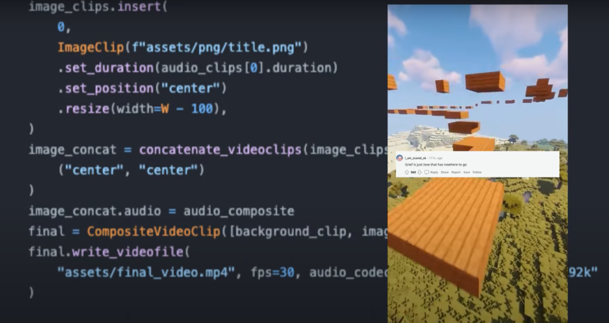
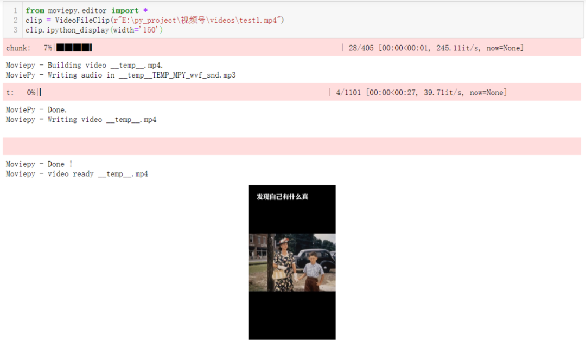
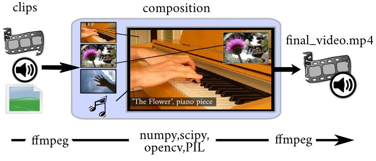
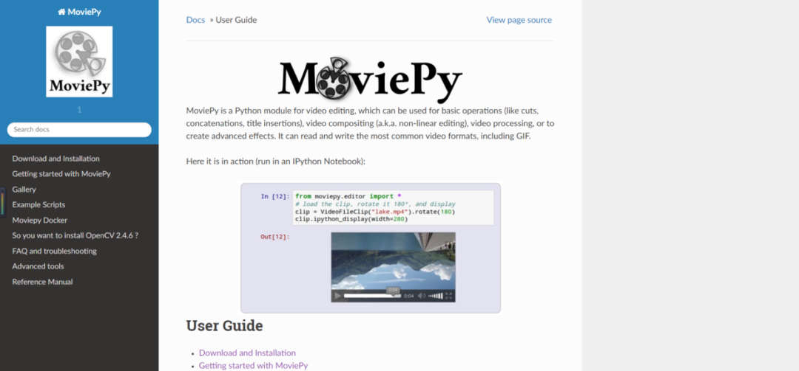
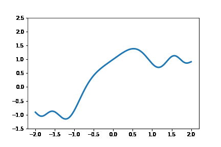

Python<br />最近看到一个Github项目，作者利用Python写了一个自动生成tiktok视频的脚本，受到热捧。<br /><br />现在像抖音、tiktok上有很多流水线生产的视频，不少视频博主靠这个赚了很多，这里分享给大家。<br />仔细看了下该项目，作者主要从游戏视频网站中爬取视频素材，然后从reddit论坛中截取有意思的问答，最后利用Python的MoviePy库剪辑视频，把收集来的素材拼接到一起。<br />这种视频生产方式几乎不需要人工参与，一天可以剪辑上百个视频，可以先看看作者给出的案例视频效果。<br />其实国内的抖音、快手平台也适合这种自动化视频的模式，靠量取胜，有兴趣的小伙伴可以试试。<br />下面来讲讲作者用到的视频编辑库-MoviePy，一个非常经典的视频工具。<br /><br />MoviePy是一个用于视频编辑的Python模块，它可被用于一些基本操作（如剪切、拼接、插入标题）、视频合成（即非线性编辑）、视频处理和创建高级特效。它可对大多数常见视频格式进行读写，包括MP4、GIF等。<br />比如说打开一个视频：<br />安装MoviePy可以通过PIP来实现，当然会需要一些依赖库，比如Numpy, imageio, Decorator, tqdm等，还有FFMPEG 软件。
```bash
pip install moviepy
```
MoviePy的使用也非常简单，它的核心对象是剪辑，提供了多种函数实现对视频的复杂操作。<br /><br />具体的编辑功能可以去MoviePy官网去查阅，非常的详细。<br />[https://zulko.github.io/moviepy/](https://zulko.github.io/moviepy/)<br /><br />有趣的是MoviePy可以结合Matplotlib，制作动态的图表。
```python
import matplotlib.pyplot as plt
import numpy as np
from moviepy.editor import VideoClip
from moviepy.video.io.bindings import mplfig_to_npimage

x = np.linspace(-2, 2, 200)

duration = 2

fig, ax = plt.subplots()
def make_frame(t):
	ax.clear()
	ax.plot(x, np.sinc(x**2) + np.sin(x + 2*np.pi/duration * t), lw=3)
	ax.set_ylim(-1.5, 2.5)
	return mplfig_to_npimage(fig)

animation = VideoClip(make_frame, duration=duration)
animation.write_gif('matplotlib.gif', fps=20)
```
<br />最后，可以去研究下Github上自动化视频的代码，自己配合有趣的素材，就可以批量生产视频，说不定有很大的商机。<br />[https://github.com/elebumm/RedditVideoMakerBot](https://github.com/elebumm/RedditVideoMakerBot)
