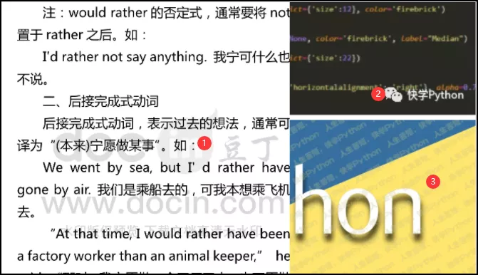
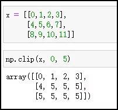
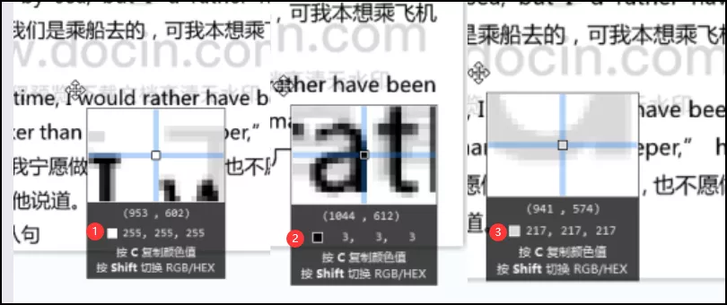
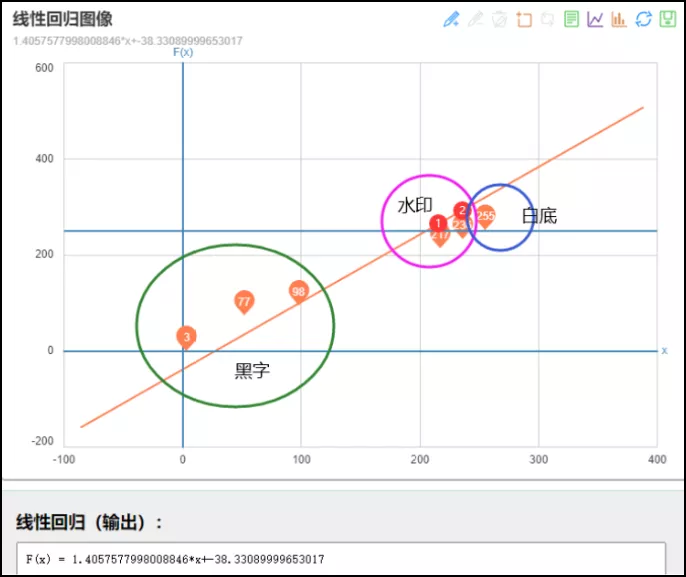
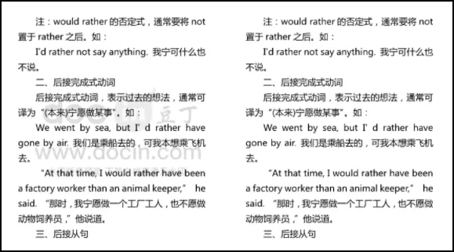
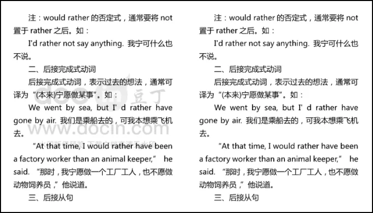

Python<br />由于图片水印的种类有很多，先看最简单的一种。<br /><br />即上图中的①类水印，这种水印存在白色背景上的文档里，水印是灰色，需要保留的文字是黑色。<br />这种通常可以进行简单的亮度/对比度转换，直到水印消失并降低亮度以进行补偿。参考别人的方法，可以用多种方法去除水印。大致原理比较相似，下面先讲OpenCV的方法。
<a name="xo1p7"></a>
## OpenCV + Numpy
本方法需要使用的库：cv2、numpy。cv2是基于OpenCV的图像处理库，可以对图像进行腐蚀，膨胀等操作；Numpy这是一个强大的处理矩阵和维度运算的库。
<a name="AWjAK"></a>
### 函数简介
介绍一下cv2的三个基本函数：使用`cv2.imread()`，`cv2.imshow()`，`cv2.imwrite()`分别可以读取、显示和保存图像。
```python
img = cv2.imread('test.png')

cv2.imshow('test.png',img)
cv2.waitKey(0)

cv2.imwrite('test_2.png', img)
```
对于Numpy呢，则要用到`np.clip()`，它是一个截取函数，用于截取数组中小于或者大于某值的部分，并使得被截取部分等于固定值。
```python
np.clip(a, a_min, a_max, out=None):
```
具体用法：<br /><br />可以看到，数组x中的所有数限定到范围0和5之间。为啥要介绍这些函数呢，接着往下看。
<a name="C9jDL"></a>
### 色彩转换
回到本文一开始，去除文档图片中的水印。<br /><br />上图中选取了三个点，这三个像素点分别对应背景白色、黑色字体以及灰色的水印。<br />现在要做的事，就是想办法把水印转换成白色背景。换言之，就是把图片中[217,217,217]的像素点转换成[255,255,255]。<br />当然这个[217,217,217]也不是固定的，只是一个范围。为了方便调整，选取了一些像素点，做了一个线性回归。<br />希望把图片整体的像素颜色做一个改变，原有黑色字体尽量跟原来一致，而水印部分则一定要≥255，然后就可以通过`np.clip()`限定区间，使之都变成[255,255,255]。<br />
```python
import cv2
import numpy as np

img = cv2.imread('test.png')

new = np.clip(1.4057577998008846*img-38.33089999653017, 0, 255).astype(np.uint8)

cv2.imwrite('removed.png', new)
```
下面看看调整后的效果（左侧是转换前，右侧是转换后）。<br /><br />左：转换前 右：转换后<br />处理效果还是不错的，说明对于这类文档图片水印，通过几行Python代码就可以轻松去除水印。<br />不过通过线性回归改变整体图片颜色，也会影响原有的黑色文本，导致其颜色发生了微微变化。<br />那能不能简单粗暴一点！只改变水印的颜色呢？<br />也可以试试。
<a name="zCpZi"></a>
## PIL  + itertools
PIL也是一个Python 图像处理库，其中Image模块是在Python PIL图像处理中常见的模块，对图像进行基础操作的功能基本都包含于此模块内。<br />还是跟之前一个原理，希望将图片中[217,217,217]的像素点转换成[255,255,255]。<br />那就简单粗暴一点，也就是像素值相加大概600（217+217+217）以上的像素点，都改成[255,255,255]就好了。
```python
from itertools import product
from PIL import Image

img = Image.open('test.png')
width, height = img.size
for pos in product(range(width), range(height)):
    if sum(img.getpixel(pos)[:3]) > 600:
        img.putpixel(pos, (255,255,255))
img.save('removed_1.png')
```
运行结果，对比一下。<br /><br />左：转换前 右：转换后<br />与第一种方法对比，肉眼也没看出来太明显差别。
