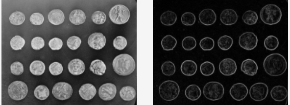
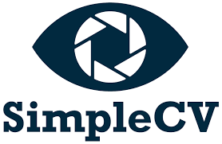

Python
<a name="x0CzR"></a>
## Pillow
Pillow是一个通用且用户友好的Python库，提供了丰富的函数集和对各种图像格式的支持，使其成为开发人员在其项目中处理图像的必要工具。<br />它支持打开、操作和保存许多不同的图像文件格式，用户还可以对图像执行基本操作，如裁剪、调整大小、旋转和更改图像颜色。<br />Pillow还可以让你在图像上添加文字和形状，提供一种简单的方式来注释你的视觉效果。<br />这个库也是torchvison使用的图像处理库，它功能强大并且使用很简单推荐使用。
<a name="nCO1E"></a>
## OpenCV
OpenCV无疑是最流行的图像处理库之一。它最初由英特尔公司开发，已被广泛应用于计算机视觉领域。它支持无数与计算机视觉和机器学习相关的算法，这有助于理解视觉数据并做出有见地的决策。OpenCV还针对实时应用进行了高度优化，使其成为视频监控，自动驾驶汽车和先进机器人的绝佳选择。<br />OpenCV 功能最多，并且在处理速度方面要比Pillow快，所以在对于速度有要求的情况下推荐使用它。<br />另外一点就是OpenCV 读取的通道是BGR ，而其他的库都是RGB 的，所以如果混用的话需要转换，还记得这个代码吧：
```python
cv2.cvtColor(image, cv2.COLOR_BGR2RGB)
```
<a name="cS2DV"></a>
## Mahotas
Mahotas包括一组用于图像处理和计算机视觉的函数，这些函数主要是在高性能的c++中完成的，并且使用多线程，使其速度非常快。<br />它还包括各种形态操作，如侵蚀，扩张和连接成分分析。这些操作是图像二值化、去噪和形状分析等任务的基础。这些功能OpenCV 都有，但是Mahotas更专注于图像的图像处理，而并不像OpenCV那样什么都有，所以，Mahotas的API更简单、也更友好。并且学习起来也比OpenCV简单，但是速度方面却差不多。<br />
<a name="OEexB"></a>
### 例子
这是一个简单的示例（使用 mahotas 附带的示例文件），使用上述阈值区域作为种子调用分水岭（使用 Otsu 定义阈值）。
```python
# import using ``mh`` abbreviation which is common:
import mahotas as mh

# Load one of the demo images
im = mh.demos.load('nuclear')

# Automatically compute a threshold
T_otsu = mh.thresholding.otsu(im)

# Label the thresholded image (thresholding is done with numpy operations
seeds,nr_regions = mh.label(im > T_otsu)

# Call seeded watershed to expand the threshold
labeled = mh.cwatershed(im.max() - im, seeds)
```
这是一个非常简单的使用示例`mahotas.distance`（计算距离图）：
```python
import pylab as p
import numpy as np
import mahotas as mh

f = np.ones((256,256), bool)
f[200:,240:] = False
f[128:144,32:48] = False
# f is basically True with the exception of two islands: one in the lower-right
# corner, another, middle-left

dmap = mh.distance(f)
p.imshow(dmap)
p.show()
```
<a name="yq8BC"></a>
## Scikit-Image
Scikit-Image建立在Scikit-Learn机器学习库的基础上的扩展功能，包括更高级的图像处理能力。所以如果已经在使用Scikit进行ML，那么可以考虑使用这个库。<br />它提供了一套完整的图像处理算法。它支持图像分割、几何变换、色彩空间操作和过滤。<br />与许多其他库不同，Scikit-Image支持多维图像，这对于涉及视频或医学成像的任务是很有帮助的。Scikit-Image与其他Python科学库(如NumPy和SciPy)无缝集成。<br />
```python
from skimage import data, io, filters

image = data.coins()
# ... or any other NumPy array!
edges = filters.sobel(image)
io.imshow(edges)
io.show()
```

<a name="YWl4E"></a>
## TensorFlow Image
TensorFlow Image是TensorFlow的一个模块，它支持图像解码、编码、裁剪、调整大小和转换。还可以利用TensorFlow的GPU支持，为更大的数据集提供更快的图像处理。<br />也就是说如果你使用TF，那么可以使用它来作为训练Pipline的一部分。<br /><br />使用 Keras 效用函数加载数据：`tf.keras.utils.image_dataset_from_directory` 效用函数从磁盘加载图像。<br />创建数据集，为加载器定义一些参数：
```python
batch_size = 32
img_height = 180
img_width = 180
```
开发模型时，最好使用验证拆分。将使用 80% 的图像进行训练，20% 的图像进行验证。
```python
train_ds = tf.keras.utils.image_dataset_from_directory(
  data_dir,
  validation_split=0.2,
  subset="training",
  seed=123,
  image_size=(img_height, img_width),
  batch_size=batch_size)
```
<a name="rrWPM"></a>
## PyTorch Vision
与TensorFlow Image类似，PyTorch Vision是PyTorch生态系统的一部分，主要用于与图像处理相关的机器学习任务。
```python
import torchvision
video_path = "path to a test video"
reader = torchvision.io.VideoReader(video_path, "video")
reader_md = reader.get_metadata()
print(reader_md["video"]["fps"])
video.set_current_stream("video:0")
```
<a name="RZnhT"></a>
## SimpleCV
SimpleCV建立在OpenCV、PIL（Python Imaging Library）和NumPy之上，为用户提供了一组简单而强大的函数和工具，用于加载、处理和分析图像。<br />SimpleCV的设计目标是使计算机视觉技术对于初学者和非专业人士也能更加可靠和易于使用。它提供了一个简单的API，隐藏了底层的复杂性，使用户能够快速实现常见的计算机视觉任务。<br />但是目前官方维护也较少，所以这个项目很有可能会夭折。<br />
```python
import SimpleCV
camera = SimpleCV.Camera()
image = camera.getImage()
image.show()
```
<a name="qkLWO"></a>
## Imageio
Imageio是一个用于读取和写入多种图像格式的Python库。它提供了一个简单而强大的API，使用户能够轻松地处理图像和视频数据。Imageio提供了一个通用的数据模型，使用户能够以多种方式存储图像数据。它可以使用NumPy数组、PIL图像对象或简单的Python字节字符串来表示图像数据。并且它提供了逐帧读取和写入视频文件的功能，这对于处理视频流或从视频中提取帧非常有用。<br />
```python
import imageio.v3 as iio
im = iio.imread('imageio:chelsea.png')  # read a standard image
im.shape  # im is a NumPy array of shape (300, 451, 3)
iio.imwrite('chelsea.jpg', im)  # convert to jpg
```
<a name="oyz0V"></a>
## albumentations
Albumentations是一个用于图像增强和数据增强的Python库。它专注于在机器学习和计算机视觉任务中提供高效、灵活和易于使用的数据增强方法。<br />一直把这个库当成torchvision的替代，因为它不仅有很多数据增强方法，还能够直接处理掩码bbox的增强。<br />
```python
import albumentations as A
import cv2

# Declare an augmentation pipeline
transform = A.Compose([
    A.RandomCrop(width=256, height=256),
    A.HorizontalFlip(p=0.5),
    A.RandomBrightnessContrast(p=0.2),
])

# Read an image with OpenCV and convert it to the RGB colorspace
image = cv2.imread("image.jpg")
image = cv2.cvtColor(image, cv2.COLOR_BGR2RGB)

# Augment an image
transformed = transform(image=image)
transformed_image = transformed["image"]
```
<a name="lp4dJ"></a>
## timm
timm是一个PyTorch模型库，虽然可能和图像处理没有关系，但是它提供了广泛的预训练模型和计算机视觉模型的集合，这对进行深度学习的时候是非常有帮助的。现在它已经是huggingface的子项目了，这意味着这个项目有了资金的支持，所以不会担心发展的问题。
```python
import timm 
import torch

model = timm.create_model('resnet34')
x     = torch.randn(1, 3, 224, 224)
model(x).shape
```
