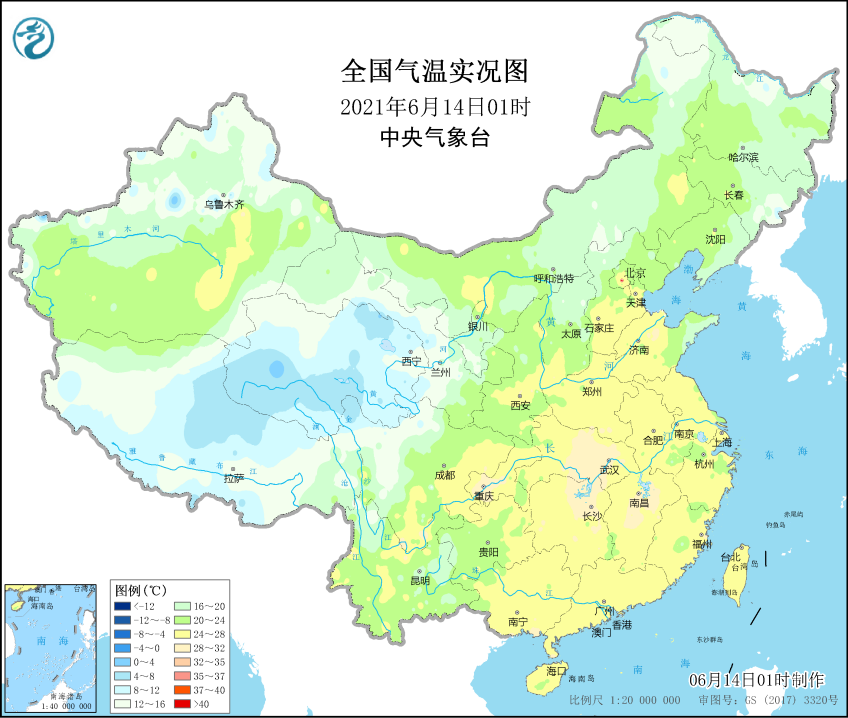
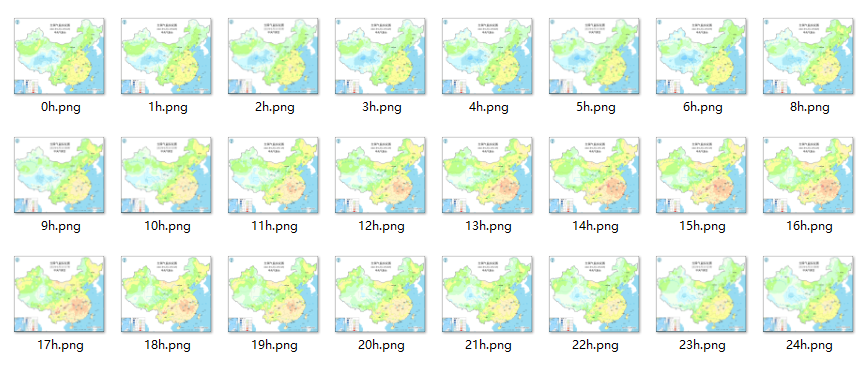
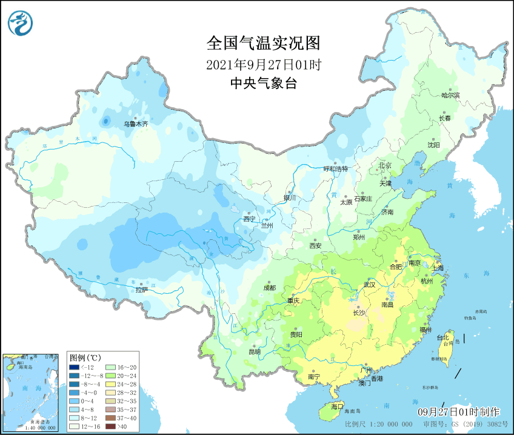

Python <br />介绍两个图片转GIF/视频的Python库--imageio/cv2。
<a name="PHX4t"></a>
## 1. 图片获取
<a name="O6HJU"></a>
### 1.1 导入模块 
```python
import os
import time
import requests
import imageio
import cv2
from PIL import Image
```
如果没有相应的包直接pip install xxx即可（推荐使用国内镜像安装）。
<a name="htjlS"></a>
### 1.2 爬取每日气温图片 
来源：中央气象台<br />链接：[http://www.nmc.cn/](http://www.nmc.cn/)<br />以端午节(2021-06-14)全国逐时气温为例：<br />
<a name="cT91Z"></a>
#### 代码：
```python
# 抓取图片
def get_pics(date, path):
    year = date.split('-')[0]
    mon = date.split('-')[1]
    day = int(date.split('-')[2])
    for i in range(24):
        time.sleep(3)
        # 08:00-24:00
        if i < 17:
            url = 'http://image.nmc.cn/product/{0}/{1}/{2:0>2d}/STFC/medium/SEVP_NMC_STFC_SFER_ET0_ACHN_L88_PB_{0}{1}{2:0>2d}{3:0>2d}0000000.jpg'.format(
                year, mon, day, i)
            img = requests.get(url)
            fiename = '{}{}h.png'.format(path, i + 8)
            with open(fiename, 'ab') as f:
                f.write(img.content)
        # 01:00-07:00
        else:
            url = 'http://image.nmc.cn/product/{0}/{1}/{2:0>2d}/STFC/medium/SEVP_NMC_STFC_SFER_ET0_ACHN_L88_PB_{0}{1}{2:0>2d}{3}0000000.jpg'.format(
                year, mon, day - 1, i)
            img = requests.get(url)
            fiename = '{}{}h.png'.format(path, i - 17)
            with open(fiename, 'ab') as f:
                f.write(img.content)
```
<a name="E4qHF"></a>
#### 效果：

<a name="MnjKV"></a>
## 2. 图片转GIF
<a name="oxb93"></a>
### 2.1 读取本地图片 
<a name="GtV1p"></a>
#### 代码：
```python
# 读取本地图片
def find_pics(date, path):
    # 读取文件夹
    imagelist = os.listdir(path)
    gifname = '{}.gif'.format(date)
    videoname = '{}.avi'.format(date)
    # 排序
    imagelist.sort(key=lambda x: int(x[:-5]))
    imagelist = [path + ff for ff in imagelist]
    #帧间隔
    duration = 0.6
    create_gif(imagelist, gifname, duration)
    create_video(imagelist, videoname)
```
注意文件排序。
<a name="TdW1i"></a>
### 2.2 生成.gif 
<a name="RXMnP"></a>
#### 代码：
```python
# 生成gif
def create_gif(imagelist, gifname, duration = 1.0):
    frames = []
    for image_name in imagelist:
        frames.append(imageio.imread(image_name))
    # 保存gif
    imageio.mimsave(gifname, frames, 'GIF', duration=duration)
```
<a name="UmBgU"></a>
#### 效果：

<a name="oHgmM"></a>
## 3. 图片转视频
<a name="ttQrb"></a>
### 3.1 `VideoWriter()` 
`VideoWriter()`的参数有`filename`, `fourcc`, `fps`, `frameSize`, `isColor`。

- `filename`：需要生成的视频的名字
- `fourcc`：用于压缩框架的解码器的4位编码
- `fps`：每秒的视频帧数
- `frameSize`：视频画面的尺寸（这里需要与用于合成视频的图片尺寸一致）
- `isColor`：如果该位值为Ture，解码器会进行颜色框架的解码，否则会使用灰度进行颜色架构（该功能仅支持在Windows系统中使用）
<a name="vLz3Q"></a>
### 3.2 生成.avi 
<a name="uvlz8"></a>
#### 代码：
```python
# 生成video
def create_video(imagelist,videoname):
    image = Image.open(imagelist[0])
    fourcc = cv2.VideoWriter_fourcc(*"MJPG")
    cap_fps = 1
    video = cv2.VideoWriter(videoname, fourcc, cap_fps, image.size)
    for filename in imagelist:
        img = cv2.imread(filename)
        video.write(img)
    video.release()
```
<a name="XFRWH"></a>
#### 效果：
[](https://www.yuque.com/fcant/python/fr9vdt?_lake_card=%7B%22status%22%3A%22done%22%2C%22name%22%3A%222021-09-27.avi%22%2C%22size%22%3A%222591580%22%2C%22taskId%22%3A%22u4482e3f6-3880-42c4-93e1-bbbedad7567%22%2C%22taskType%22%3A%22upload%22%2C%22url%22%3Anull%2C%22cover%22%3Anull%2C%22videoId%22%3A%22inputs%2Fprod%2Fyuque%2F2021%2F396745%2Favi%2F1632842816300-cee7912e-fba9-4997-accf-5f7537043b2b.avi%22%2C%22download%22%3Afalse%2C%22__spacing%22%3A%22both%22%2C%22id%22%3A%22P9RxH%22%2C%22margin%22%3A%7B%22top%22%3Atrue%2C%22bottom%22%3Atrue%7D%2C%22card%22%3A%22video%22%7D#P9RxH)也可自定义图片转换。
