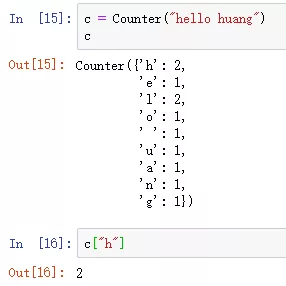

Python<br />`**collections**`**是python的标准库**，它提供了一些解决特定问题的容器，也就是说有些问题虽然可以用`list`,`tuple`,`dict`解决，但解决起来太麻烦，而这些问题又经常遇到，所以他们就把这些问题的通用方法整理了出来，放到`collections`库中让人使用。<br />`**collections**`**中一共有9种容器**，其中`counter`、`defaultdict`、`deque`、`namedtuple`、`orderdict`比较常用。<br /><br />`Counter`目的是用来跟踪值出现的次数。它是一个无序的容器类型，以字典的键值对形式存储，其中元素作为key，其计数作为value。因此，可以通过字典的取数方式，进行取数。<br />在使用之前，需要先导入这个库，导入方法如下：
```python
from collections import Counter
```
使用`Counter`类，需要先实例化一个`Counter`类，先实例化一个空的`Counter`类。
```python
c1 = Counter()
c1
```
结果如下：<br /><br />可以往括号中传入参数，来实现不同情况下的 "值计数"。
<a name="L4q1t"></a>
## `Counter`类的创建
可以往`Counter`类中，分别传入字符串、列表、元组、字典等，创建一个`Counter`类。
<a name="pRPWV"></a>
### 1、传入一个字符串
```python
c2 = Counter("hello huang")
c2
```
结果如下：<br />
<a name="z4P6L"></a>
### 2、传入一个列表
```python
lis = [i for i in "chinese"]
c3 = Counter(lis)
c3
```
结果如下：<br />
<a name="WGXT8"></a>
### 3、传入一个字典
```python
import random
dic = {k: random.randint(1,4) for k in "abcdefg"}
c4 = Counter(dic)
c4
```
结果如下：<br />
<a name="mMPYf"></a>
### 4、关键字参数
```python
c5 = Counter(a=7,b=8)
c5
```
结果如下：<br />
<a name="Z2MIY"></a>
## `Counter`类中计数元素值的访问
和访问字典类似，但是和字典唯一不同的是，如果所访问的键不存在时，返回0，而不是KeyError。
```python
c = Counter("hello huang")
c["h"]
```
结果如下：<br />
<a name="Lvkgz"></a>
## `Counter`类中计数元素的修改
关于`Counter`类中的计数元素，既可以做加减法、还可以做集合运算、也可以删除。
<a name="ADyuW"></a>
### 1、加减法
<a name="cn0oO"></a>
#### ① 加法
既可以使用`update`函数，完成这个操作。还可以使用`+`号，完成这个操作。<br />
<a name="zfTGB"></a>
#### ② 减法
既可以使用`subtract`函数，完成这个操作。但是-号用法就不同了，它应该属于集合运算，只统计在集合a中，而不在集合b中的值。<br />
<a name="PSS1q"></a>
### 2、集合运算
上面的`-`号就是一个集合运算，再介绍一下与`&`、`|`或操作。
<a name="nUfuG"></a>
#### ① 与`&`
`&`操作，是找两个`collection`中都有的键最小的键值。
```python
c1 = Counter("chinese")
c2 = Counter("where")

c1 & c2
```
结果如下：<br />
<a name="xXJWW"></a>
#### ② `|`或
`|`操作，是找两个`collection`中的键最大的键值（可以只有一个`collection`有这个键，但是结果中的键值必须大于零，小于零的被舍弃）。
```python
c1 = Counter("chinese")
c2 = Counter("where")

c1 | c2
```
结果如下：<br />
<a name="pMlAB"></a>
### 3、删除操作
删除元素使用的是`del`函数。
```python
c = Counter("where")

del c["r"]
c
```
结果如下：<br />
<a name="FeNsd"></a>
## `Counter`类中其它常用函数
<a name="niGzJ"></a>
### 1、`most_common(n)`找出重复次数最多的前n个。
```python
c = Counter("aabbbcccddddeeeee")
c.most_common(2)
```
结果如下：<br />
<a name="Vddyk"></a>
### 2、key和value用于获取Collections键和键值的集合。
```python
c = Counter("chinese")
c.keys()
c.values()
```
结果如下：<br /><br />当然，也可以使用`dict()`函数将`collection`中的内容转化为字典，也可以使用`list()`函数将`collection`中的键转化为list。
