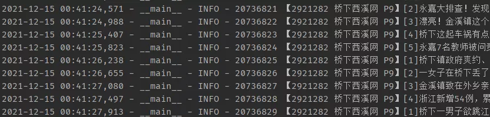
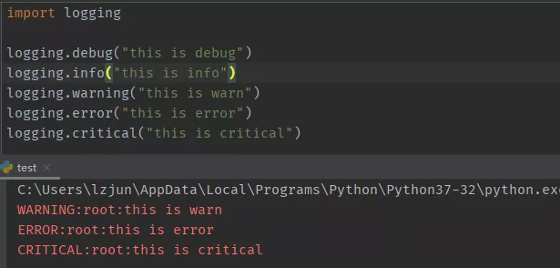
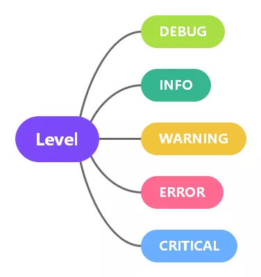
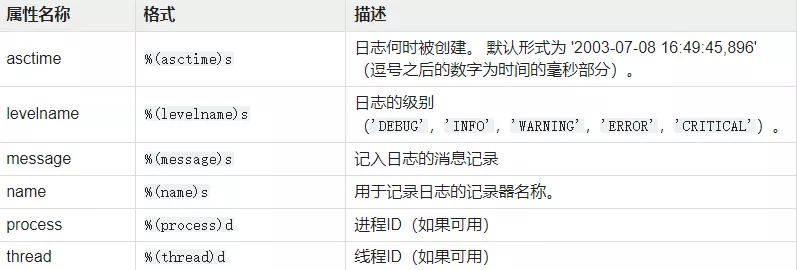
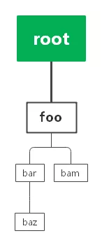
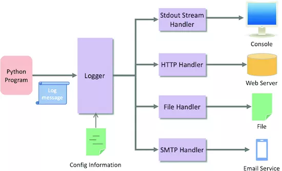
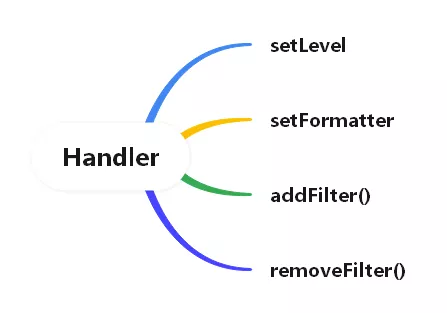
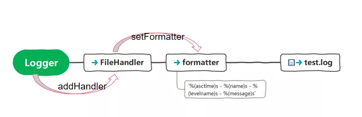

Python 日志<br />记录日志最简单的方法就是在想要记录的地方加上一句 print ， 无论是新手还是老鸟都经常这么干。在简单的代码中或者小型项目中这么干一点问题都没有。但是在一些稍大一点的项目，有时候定位一个问题，需要查看历史日志定位问题，用print就不合时宜了。<br />print 打印出来的日志没有时间，不知道日志记录的位置，也没有可读的日志格式， 还不能把日志输出到指定文件。除非这些都全部自己重复造一遍轮子。<br />最佳的做法是使用内置的logging模块， 因为 logging 模块给开发者提供了非常丰富的功能。<br /><br />比如上图就是用标准库logging模块记录生成的日志，有日志的具体时间、日志发生的模块、有日志级别和日志的具体内容等等<br />怎么用呢，来看个例子<br /><br />导入logging模块，然后直接使用logging提供的日志消息记录方法就可以。
<a name="J2LNP"></a>
### 日志级别
日志级别分为以下5个级别<br />

| 日志级别 | 使用场景 |
| --- | --- |
| DEBUG | debug级别用来记录详细的信息，方便定位问题进行调试，在生产环境一般不开启DEBUG |
| INFO | 用来记录关键代码点的信息，以便代码是否按照预期的执行，生产环境通常会设置INFO级别 |
| WARNING | 记录某些不预期发生的情况，如磁盘不足 |
| ERROR | 由于一个更严重的问题导致某些功能不能正常运行时记录的信息 |
| CRITICAL | 当发生严重错误，导致应用程序不能继续运行时记录的信息 |

日志级别重要程度逐次提高，python提供了5个对应级别的方法。默认情况下日志的级别是WARGING, 低于WARING的日志信息都不会输出。<br />从上面代码中可以看到`loging.warging`以后的日志内容都打印在标准输出流，也就是命令行窗口，但是logging.debug和info记录的日志不会打印出来。
<a name="EASUH"></a>
#### 修改日志级别
如何让debug级别的信息也输出？<br />当然是修改默认的日志级别，在开始记录日志前可以使用`logging.basicConfig`方法来设定日志级别
```python
import logging
logging.basicConfig( level=logging.DEBUG)
logging.debug("this is debug")
logging.info("this is info")
logging.error("this is error")
```
设置为debug级别后，所有的日志信息都会输出
```
DEBUG:root:this is debug
INFO:root:this is info
ERROR:root:this is error
```
<a name="TYZ8B"></a>
#### 日志记录到文件
前面的日志默认会把日志输出到标准输出流，就是只在命令行窗口输出，程序重启后历史日志没地方找，所以把日志内容永久记录是一个很常见的需求。同样通过配置函数logging.basicConfig可以指定日志输出到什么地方
```python
import logging
logging.basicConfig(filename="test.log", level=logging.INFO)
logging.debug("this is debug")
logging.info("this is info")
logging.error("this is error")
```
这里指定日志输出到文件test.log中，日志级别指定为了 INFO，最后文件中记录的内容如下：
```
INFO:root:this is info
ERROR:root:this is error
```
每次重新运行时，日志会以追加的方式在后面， 如果每次运行前要覆盖之前的日志，则需指定 `filemode='w'`， 这个和 `open` 函数写数据到文件用的参数是一样的。
<a name="hBlsz"></a>
#### 指定日志格式
默认输出的格式包含3部分，日志级别，日志记录器的名字，以及日志内容，中间用“:”连接。如果想改变日志格式，例如想加入日期时间、显示日志器名字，是可以指定format参数来设置日志的格式
```python
import logging
logging.basicConfig(format='%(asctime)s %(levelname)s %(name)s %(message)s')
logging.error("this is error")
```
输出
```
2021-12-15 07:44:16,547 ERROR root this is error
```
日志格式化输出提供了非常多的参数，除了时间、日志级别、日志消息内容、日志记录器的名字外，还可以指定线程名，进程名等等<br /><br />到这里为止，日志模块的基本用法就这些了，也能满足大部分应用场景，更高级的方法接着往下看，可以更好的处理日志。
<a name="gH49B"></a>
### 记录器（logger）
前面介绍的日志记录，其实都是通过一个叫做日志记录器（Logger）的实例对象创建的，每个记录器都有一个名称，直接使用logging来记录日志时，系统会默认创建 名为 root 的记录器，这个记录器是根记录器。记录器支持层级结构，子记录器通常不需要单独设置日志级别以及Handler（后面会介绍），如果子记录器没有单独设置，则它的行为会委托给父级。<br />记录器名称可以是任意名称，不过最佳实践是直接用模块的名称当作记录器的名字。命名如下
```python
logger = logging.getLogger(__name__)
```
默认情况下，记录器采用层级结构，上句点作为分隔符排列在命名空间的层次结构中。层次结构列表中位于下方的记录器是列表中较高位置的记录器的子级。例如，有个名叫 foo 的记录器，而名字是 foo.bar，foo.bar.baz，和 foo.bam 的记录器都是 foo 的子级。
```
├─foo
│  │  main.py
│  │  __init__.py
│  │  
│  ├─bam
│  │  │  __init__.py
│  │  │  
│  │          
│  ├─bar
│  │  │  __init__.py
│  │  │  
│  │  ├─baz
│  │  │  │  __init__.py
│  │  │  │  
```
<br />main.py
```python
import foo
from foo import bar
from foo import bam
from foo.bar import baz

if __name__ == '__main__':
    pass
```
foo.py
```python
import logging

logging.basicConfig()
logger = logging.getLogger(__name__)
logger.setLevel(logging.INFO)

logger.info("this is foo")
```
这里只设置foo这个记录器的级别为INFO<br />bar.py
```python
import logging

logger = logging.getLogger(__name__)
logger.info("this is bar")
```
其它子模块都是像bar.py一样类似的代码，都没有设置日志级别，最后的输出结果是
```
INFO:foo:this is foo
INFO:foo.bar:this is bar
INFO:foo.bam:this is bam
INFO:foo.bar.baz:this is baz
```
这是因为 foo.bar 这个记录器没有设置日志级别，就会向上找到已经设置了日日志级别的祖先，这里刚好找到父记录器foo的级别为INFO，如果foo也没设置的话，就会找到根记录器root，root默认的级别为WARGING。
<a name="Of0YC"></a>
### 处理器（Handler）
记录器负责日志的记录，但是日志最终记录在哪里记录器并不关心，而是交给了另一个家伙--处理器（Handler）去处理。<br />例如一个Flask项目，可能会将INFO级别的日志记录到文件，将ERROR级别的日志记录到标准输出，将某些关键日志（例如有订单或者严重错误）发送到某个邮件地址通知老板。这时候记录器添加多个不同的处理器来处理不同的消息日志，以此根据消息的重要性发送的特定的位置。<br />Python内置了很多实用的处理器，常用的有：<br />1、`StreamHandler` 标准流处理器，将消息发送到标准输出流、错误流<br />2、`FileHandler` 文件处理器，将消息发送到文件<br />3、`RotatingFileHandler`  文件处理器，文件达到指定大小后，启用新文件存储日志<br />4、`TimedRotatingFileHandler` 文件处理器，日志以特定的时间间隔轮换日志文件
<a name="GJkNm"></a>
#### 处理器操作
<br />Handler 提供了4个方法给开发者使用，logger可以设置level，Handler也可以设置Level。通过`setLevel`可以将记录器记录的不同级别的消息发送到不同的地方去。
```python
import logging
from logging import StreamHandler
from logging import FileHandler

logger = logging.getLogger(__name__)

# 设置为DEBUG级别
logger.setLevel(logging.DEBUG)

# 标准流处理器，设置的级别为WARAING
stream_handler = StreamHandler()
stream_handler.setLevel(logging.WARNING)
logger.addHandler(stream_handler)

# 文件处理器，设置的级别为INFO
file_handler = FileHandler(filename="test.log")
file_handler.setLevel(logging.INFO)
logger.addHandler(file_handler)

logger.debug("this is debug")
logger.info("this is info")
logger.error("this is error")
logger.warning("this is warning")
```
运行后，在命令行窗口输出的日志内容是：
```
this is error
this is warning
```
输出在文件的日志内容是：
```
this is info
this is error
this is warning
```
尽管将`logger`的级别设置为了DEBUG，但是debug记录的消息并没有输出，因为给两个Handler设置的级别都比DEBUG要高，所以这条消息被过滤掉了。
<a name="r2k2m"></a>
### 格式器（formatter）
格式器在前面部分其实已经有所介绍，不过那是通过`logging.basicConfig`来指定的，其实格式器还可以以对象的形式来设置在Handler上。格式器可以指定日志的输出格式，要不要展示时间，时间格式什么，要不要展示日志的级别，要不要展示记录器的名字等等，都可以通过一个格式器对消息进行格式化输出。
```python
import logging
from logging import StreamHandler

logger = logging.getLogger(__name__)

# 标准流处理器
stream_handler = StreamHandler()
stream_handler.setLevel(logging.WARNING)

# 创建一个格式器
formatter = logging.Formatter('%(asctime)s - %(name)s - %(levelname)s - %(message)s')
# 作用在handler上
stream_handler.setFormatter(formatter)
# 添加处理器
logger.addHandler(stream_handler)

logger.info("this is info")
logger.error("this is error")
logger.warning("this is warning")
```
注意，格式器只能作用在处理器上，通过处理器的`setFromatter`方法设置格式器。而且一个Handler只能设置一个格式器。是一对一的关系。而 logger 与 handler 是一对多的关系，一个logger可以添加多个handler。handler 和 logger 都可以设置日志的等级。<br />
<a name="bdJJy"></a>
### `logging.basicConfig`
回到最开始的地方，`logging.basicConfig()` 方法做了什么？现在大概能猜出来了。来看python源码中是怎么说的
> Do basic configuration for the logging system.
> This function does nothing if the root logger already has handlers configured. It is a convenience method intended for use by simple scripts to do one-shot configuration of the logging package.
> The default behaviour is to create a StreamHandler which writes to sys.stderr, set a formatter using the BASIC_FORMAT format string, and add the handler to the root logger.
> A number of optional keyword arguments may be specified, which can alter the default behaviour.

1、创建一个root记录器<br />2、设置root的日志级别为warning<br />3、为root记录器添加StreamHandler处理器<br />4、为处理器设置一个简单格式器
```python
logging.basicConfig()
logging.warning("hello")
```
这两行代码其实就等价于：
```python
import sys
import logging
from logging import StreamHandler
from logging import Formatter


logger = logging.getLogger("root")
logger.setLevel(logging.WARNING)
handler = StreamHandler(sys.stderr)
logger.addHandler(handler)
formatter = Formatter(" %(levelname)s:%(name)s:%(message)s")
handler.setFormatter(formatter)
logger.warning("hello")
```
`logging.basicConfig` 方法做的事情是相当于给日志系统做一个最基本的配置，方便开发者快速接入使用。它必须在开始记录日志前调用。不过如果 root 记录器已经指定有其它处理器，这时候再调用`basciConfig`，则该方式将失效，它什么都不做。
<a name="QVSPh"></a>
### 日志配置
日志的配置除了前面介绍的将配置直接写在代码中，还可以将配置信息单独放在配置文件中，实现配置与代码分离。<br />日志配置文件 logging.conf
```
[loggers]
keys=root

[handlers]
keys=consoleHandler

[formatters]
keys=simpleFormatter

[logger_root]
level=DEBUG
handlers=consoleHandler


[handler_consoleHandler]
class=StreamHandler
level=DEBUG
formatter=simpleFormatter
args=(sys.stdout,)

[formatter_simpleFormatter]
format=%(asctime)s - %(name)s - %(levelname)s - %(message)s
```
加载配置文件
```python
import logging
import logging.config

# 加载配置
logging.config.fileConfig('logging.conf')

# 创建 logger
logger = logging.getLogger()

# 应用代码
logger.debug("debug message")
logger.info("info message")
logger.warning("warning message")
logger.error("error message")
```
输出
```python
2021-12-23 00:02:07,019 - root - DEBUG - debug message
2021-12-23 00:02:07,019 - root - INFO - info message
2021-12-23 00:02:07,019 - root - WARNING - warning message
2021-12-23 00:02:07,019 - root - ERROR - error message
```
参考链接：<br />[https://docs.python.org/3/library/logging.html#](https://docs.python.org/3/library/logging.html#)<br />[https://docs.python.org/3/howto/logging.html#logging-advanced-tutorial](https://docs.python.org/3/howto/logging.html#logging-advanced-tutorial)<br />[https://awaywithideas.com/python-logging-a-practical-guide/](https://awaywithideas.com/python-logging-a-practical-guide/)
