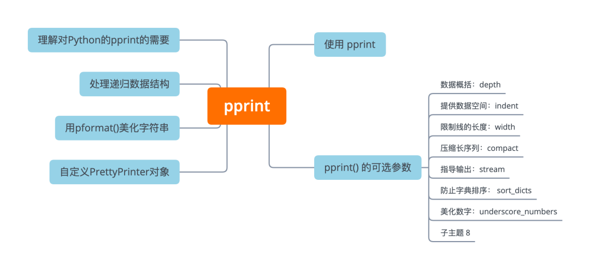

Python<br />Python 中的 `pprint` 模块是一个实用模块，可以用它来以一种可读的、漂亮的方式打印数据结构。它是标准库的一部分，对于调试处理 API 请求、大型 JSON 文件和一般数据的代码特别有用。<br /><br />接下来主要学习：

- 理解 `pprint` 模块的优势
- 了解如何使用 `pprint()`、`PrettyPrinter` 及它们的参数
- 能够创建自己的 `PrettyPrinter` 实例
- 保存格式化的字符串输出而不是打印它
- 打印和识别递归数据结构
<a name="yj4hy"></a>
## pprint 模块的优势
Python `pprint` 模块在很多情况下都有帮助。在进行 API 请求，处理JSON文件，或者处理复杂的嵌套数据时，它都能派上用场。可能会发现，使用普通的 `print()` 函数并不足以有效地探索数据和调试应用程序。当对字典和列表使用 `print()` 时，输出不包含任何新行。<br />为了演示，获取一些样例数据，它是一个json数据结构的数据，用一般 `print()` 函数打印结果看看。
```python
>>> print(users)
[{'address': {'city': 'chengdu', 'geo': {'lat': '102.54', 'lng': '30.05'}}, 'email': 'yund@study.com', 'id': 1, 'name': '数据', 'WeChat': 'data', 'authorname': 'yund', 'website': 'http://mp.weixin.qq.com/'}, {'address': {'city': 'chengdu', 'geo': {'lat': '102.54', 'lng': '30.05'}}, 'email': 'xiaohouzi@study.com', 'id': 1, 'name': '学习', 'WeChat': 'data', 'authorname': 'xiaohouzi', 'website': 'http://mp.weixin.qq.com/'}]
```
天哪！一个巨大的行，并且没有换行。根据控制台设置，这可能显示为一个很长的行。另外，控制台输出可能开启了包字模式，这是最常见的情况。不幸的是，这并不能使输出变得更友好。<br />如果只需要获取第一个和最后一个用户数据。首先分析这似乎是一个列表，可能会想到写一个循环来打印这些项目。
```python
for user in users:
    print(user)
```
这个 for 循环会将每个对象打印在一个单独的行上，但即使如此，每个对象所占的空间也远远超过了单行所能容纳的。这样的打印方式确实让事情变得更好一些，但这绝不是理想的。上面的例子是一个相对简单的数据结构，**但是对于一个深度嵌套的字典，会怎么做？**<br />当然，可以写一个使用递归的函数来找到打印一切的方法。不幸的是，很可能会遇到一些边缘情况，在这些情况下这是行不通的。甚至会发现自己写了一整个模块的函数，只是为了掌握数据的结构。<br />接下来开始进入`pprint`模块的学习！
<a name="RHr6B"></a>
## 使用 pprint
前面已经提到， `pprint` 是一个 Python 模块，以一种漂亮的方式打印数据结构。它早就是 Python 内置标准库的一部分，所以没有必要单独安装。只需要导入它的 `pprint()` 函数。
```python
from pprint import pprint
```
然后，不要像上面的例子那样采用一般的 `print(users)` 方法，可以调用这个优雅的函数 `pprint(users)` 来使输出更加美观。<br />这个函数以一种新的和改进的 pretty 的方式打印用户数据。
```python
pprint(users)

[{'WeChat': 'data',
  'address': {'city': 'chengdu', 'geo': {'lat': '102.54', 'lng': '30.05'}},
  'authorname': '云朵',
  'email': 'yund@study.com',
  'id': 1,
  'name': '数据',
  'website': 'http://mp.weixin.qq.com/'},
 {'WeChat': 'data',
  'address': {'city': 'chengdu', 'geo': {'lat': '102.54', 'lng': '30.05'}},
  'authorname': '小猴子',
  'email': 'xiaohouzi@study.com',
  'id': 10,
  'name': '学习',
  'website': 'http://mp.weixin.qq.com/'}]
```
为了演示结果更加便于阅读，截取其中一小段。<br />这个输出结构相当漂亮！字典的键以缩进的格式展示出来，这样的输出使得在直观上分析数据结构变得更加直接了当。<br />如果是一个喜欢尽可能少打字的人，可以通过使用别名来使用 `pprint()`，即 `pp()`。
```python
from pprint import pp
pp(users)
```
`pp()`只是`pprint()`的一个包装，它的行为完全相同。<br />**注意：** 从[**Python3.8.0 alpha 2版本**](https://github.com/python/cpython/tree/96831c7fcf888af187bbae8254608cccb4d6a03c)开始包含这个别名。<br />然而，即使是默认的输出，也可能会有太多的信息需要扫描。接下来对输出进行一些调整。可以向 `pprint()` 传递各种参数，使最复杂的数据结构也变得漂亮。
<a name="SZ9gC"></a>
## `pprint()` 的可选参数
接下来将一起了解 `pprint()` 的所有可用参数。这里共有七个参数，可以用来配置 Pythonic pretty printer。这些参数没有必要全部使用，可以根据需求选用其中最有价值的那几个参数即可。然而，可以发现其中最有价值的一个参数非深度`depth`莫属了。
<a name="ahJw8"></a>
### 数据概括：`depth`
其中一个最方便的参数是深度`depth`。下面的Python命令只有在数据结构处于或低于指定的深度时才会打印用户的全部内——当然是在保持美观的情况下。更深的数据结构的内容被替换成三个点。
```python
pprint( users, depth=1)

	[{...}, {...}, {...}, {...}, {...}, {...}, {...}, {...}, {...}, {...}]
```
从结果可以看出，这确实是一个字典的列表。为了进一步探索这个数据结构，可以把深度增加一级，这将打印出用户中所有字典的顶层键。
```python
[{'WeChat': 'Mr_cloud_data',
  'address': {...},
  'authorname': '云',
  'email': 'yund@study.com',
  'id': 1,
  'name': '数据',
  'website': 'http://mp.weixin.qq.com/'},
 {'WeChat': 'data',
  'address': {...},
  'authorname': '小猴子',
  'email': 'xiaohouzi@study.com',
  'id': 10,
  'name': '学习',
  'website': 'http://mp.weixin.qq.com/'}]
```
现在可以快速检查所有的字典是否共享它们的顶层键。这个观察结果很有价值，特别是如果任务是开发一个消耗这样的数据的应用程序。
<a name="FByLe"></a>
### 提供数据空间：`indent`
缩进`indent`参数控制每一级 pretty-printed 表述在输出中的缩进程度。默认的缩进是`1`，即一个空格字符。
```python
pprint(users[0], depth=1)

{'WeChat': 'data',
 'address': {...},
 'authorname': '云朵',
 'email': 'yund@study.com',
 'id': 1,
 'name': '数据',
 'website': 'http://mp.weixin.qq.com/'}

pprint(users[0], depth=1, indent=4)

{   'WeChat': 'data',
    'address': {...},
    'authorname': '云朵',
    'email': 'yund@study.com',
    'id': 1,
    'name': '数据',
    'website': 'http://mp.weixin.qq.com/'}
```
`pprint()` 的缩进行为中最重要的部分是保持所有的键在视觉上对齐，缩进的程度取决于缩进参数和键的位置。<br />由于上面的例子中没有嵌套，缩进量完全基于缩进参数。在这两个例子中，请注意开头的大括号（`{`）是如何被算作第一个键的缩进单位的。在第一个例子中，第一个键的开头单引号就在{之后，中间没有任何空格，因为缩进被设置为1。<br />然而，当有嵌套时，缩进被应用于第一个元素的行内，然后`pprint()`使所有后续元素与第一个元素保持一致。因此，如果在打印用户时将缩进设置为4，第一个元素将被缩进4个字符，而嵌套的元素将被缩进8个以上的字符，因为缩进是从第一个键的末端开始的。
```python
pprint(users[0], depth=2, indent=4)

{   'WeChat': 'data',
    'address': {'city': 'chengdu', 'geo': {...}},
    'authorname': '云朵',
    'email': 'yund@study.com',
    'id': 1,
    'name': '数据',
    'website': 'http://mp.weixin.qq.com/'}
```
<a name="FytY1"></a>
### 限制行长度：`width`
默认情况下，`pprint()` 每行最多只能输出80个字符。可以通过传递一个宽度参数来定制这个值。`pprint()` 将努力把内容放在一行中。如果一个数据结构的内容超过了这个限制，那么它将把当前数据结构的每一个元素都打印在新的一行。
```python
pprint(users[0])

{'WeChat': 'Mr_cloud_data',
 'address': {'city': 'chengdu', 'geo': {'lat': '102.54', 'lng': '30.05'}},
 'authorname': '云朵',
 'email': 'yund@study.com',
 'id': 1,
 'name': '数据',
 'website': 'http://mp.weixin.qq.com/'}
```
当把宽度保持在默认的 80 个字符时，在`users[0]['address']['geo']` 处的字典只包含一个'lat'和一个 'lng' 属性。这意味着将缩进和打印出字典所需的字符数（包括中间的空格）相加，不到八十个字符。由于少于80个字符，默认的宽度，`pprint()` 把它全部放在一行。<br />然而，如果字典会超过默认的宽度，所以 `pprint()` 将每个键放在一个新行上。这对于字典、列表、元组和集合都是如此。<br />如果把宽度设置成一个大的数值，如160，那么所有嵌套的字典都可以放在一行。甚至可以把它做到极致，使用500这样一个巨大的值，对于这个例子来说，它把整个字典打印在一行上。
```python
>>> pprint( users[0], width=500)
{'WeChat': 'data', 'address': {'city': 'chengdu', 'geo': {'lat': '102.54', 'lng': '30.05'}}, 'authorname': '云朵', 'email': 'yund@study.com', 'id': 1, 'name': '数据', 'website': 'http://mp.weixin.qq.com/'}
```
在这里，得到了将宽度设置为一个相对较大的值的效果。可以反其道而行之，将宽度设置为一个较低的值，如1。然而，这样做的主要效果是确保每个数据结构都能在不同的行上显示其组件。仍然会得到视觉上的缩进，将组件排成一行。
```python
>>> pprint( users[0], width=5)

{'WeChat': 'data',
 'address': {'city': 'chengdu',
             'geo': {'lat': '102.54',
                     'lng': '30.05'}},
 'authorname': '云朵',
 'email': 'yund@study.com',
 'id': 1,
 'info': {'introduction': 'Python｜MySQL',
          'motto': '数据分析和挖掘'},
 'name': '数据',
 'website': 'http://mp.weixin.qq.com/'}
```
`pprint()` 尽一切努力使输出结果变得漂亮。<br />这个例子中，增加了 **info** 信息，引入了更长的 **introduction** 信息。目的是为了演示除了学习宽度之外，**pprint是如何分割长行文字的**。注意 `Users[0]["info"]["introduction"]`，在每个空格处被分割。`pprint` 避免在字的中间分割这个字符串，因为这样会使输出结果难以阅读。
<a name="OqcnA"></a>
### 压缩长序列：`compact`
开始可能会认为 `compact` 指的是在前面介绍关于宽度时所探讨的行为—— `compact` 是让数据结构出现在一行还是多行。然而，`compact`只在一行**超过宽度时才会影响输出**。<br />**注意：** `compact` 只影响到序列的输出：列表、集合和元组，而不影响字典的输出。这其实是有意为之，尽管不清楚为什么会做出这样的决定。在 [**Python Issue #34798**](https://bugs.python.org/issue34798) 中有一个关于这个问题的讨论，感兴趣的小伙伴可以看看。<br />如果 `compact` 设置为 `True`，那么输出将包裹到下一行。默认情况，如果数据结构长于宽度，每个元素都会出现在自己的行上。
```python
pprint(users, depth=1)

[{...}, {...}, {...}, {...}, {...}, {...}, {...}, {...}, {...}, {...}]

pprint( users, depth=1, width=40)

[{...},
{...},
{...},
{...},
{...},
{...},
{...},
{...},
{...},
{...}]

pprint( users, depth=1, width=40, compact=True)

[{...}, {...}, {...}, {...}, {...},
{...}, {...}, {...}, {...}, {...}]
```
使用默认设置对这个列表进行漂亮的打印，可以在一行中打印出缩写的版本。限制宽度为40个字符，可以强制 `pprint()` 在不同的行上输出所有列表的元素。如果设置 `compact=True`，那么列表就会在40个字符处被包起来，比通常看起来更紧凑。<br />**注意：** 将宽度设置为小于7个字符。在本例中，相当于`[{…},...,{…}]` ——似乎完全绕过了 `depth` 参数，而 `pprint()` 最终不需要任何折叠就可以打印所有内容。这被报告为[**bug #45611**](https://bugs.python.org/issue45611)。<br />紧凑对于短元素的长序列很有用，否则会占用很多行，使输出的可读性降低。
<a name="Ia2DY"></a>
### 指导输出：`stream`
`stream` 参数指的是 `pprint()` 的输出。默认情况下，它会出现在与`print()` 相同的位置。具体来说，它进入`sys.stdout`（是Python中的一个文件对象）。但是，可以将其重定向到任何文件对象，就像可以使用`print()`一样:
```python
with open("output.txt", mode="w") as file_object。
    pprint(users, stream=file_object)
```
在这里，用 `open()` 创建了一个文件对象，然后把 `pprint()` 中的 `stream` 参数设置为该文件对象。如果打开 output.txt 文件，应该看到已经把用户的所有内容都打印出来了。<br />的确，Python 有自己的日志模块，但如果愿意的话，也可以使用 `pprint()` 来将这些输出作为日志并向文件对象发送漂亮的输出。
<a name="fXtwj"></a>
### 防止字典排序：`sort_dicts`
尽管字典通常被认为是无序的数据结构，但从Python 3.6开始，[**字典可以通过插入来排序**](https://docs.python.org/3.6/whatsnew/3.6.html#new-dict-implementation)。<br />`pprint()`按字母顺序排列key，以便打印。
```python
pprint( users[0], depth=1)

{'WeChat': 'data',
 'address': {...},
 'authorname': '云朵',
 'email': 'yund@study.com',
 'id': 1,
 'info': {...},
 'name': '数据',
 'website': 'http://mp.weixin.qq.com/'}

pprint( users[0], depth=1, sort_dicts=False)

{'id': 1,
 'name': '数据',
 'authorname': '云朵',
 'WeChat': 'data',
 'info': {...},
 'address': {...},
 'email': 'yund@study.com',
 'website': 'http://mp.weixin.qq.com/'}
```
除非把 `sort_dicts` 设置为 `False`，否则 Python 的 `pprint()` 会按字母顺序排列键值。它使字典的输出保持一致，可读性强，而且很漂亮!<br />当 `pprint()` 第一次实现时，字典是无序的。如果不按字母顺序排列键值，理论上一个字典的键值在每次打印时都可能不同。
<a name="DN0Km"></a>
### 美化数字：`underscore_numbers`
`underscore_numbers` 参数是 Python3.10 中引入的一个特性，它使长数字更易读。考虑到到目前为止所使用的例子并不包含任何长数字，因此添加一个新的例子来作为演示。
```python
number_list = [123456789, 10000000000000]
pprint(number_list, underscore_numbers=True)

[123_456_789, 10_000_000_000_000]
```
如果尝试运行调用 `pprint()` ，程序会得到一个错误：TypeError: __init__() got an unexpected keyword argument 'underscore_numbers'。从2021年10月起，这个参数在直接调用 `pprint()` 时不起作用。Python 社区很快注意到了这一点，并且在 2021 年 12 月的 [**3.10.1 漏洞修复版本**](https://www.python.org/dev/peps/pep-0619/#bugfix-releases)中[**已经修复**](https://github.com/python/cpython/pull/29133)了。<br />如果 `underscore_numbers` 在直接调用 `pprint()` 时不起作用，而如果真的想要漂亮的数字，可以换一种方法，当创建自己的 `PrettyPrinter` 对象时，这个参数应该像上面的例子那样起作用。<br />接下来，将一起学习如何创建一个`PrettyPrinter`对象。
<a name="h2Drw"></a>
## 自定义PrettyPrinter对象
可以创建一个具有自定义的默认值的 `PrettyPrinter` 实例。一旦有了这个新的自定义 `PrettyPrinter` 对象的实例，就可以通过调用 `PrettyPrinter` 实例的`.pprint()`方法来使用它。
```python
from pprint import PrettyPrinter
custom_printer = PrettyPrinter(
    indent=4,
    width=100,
    depth=2,
    compact=True,
    sort_dicts=False,
    underscore_numbers=True)

custom_printer.pprint(users[0])

{   'WeChat': 'data',
    'address': {'city': 'chengdu', 'geo': {...}},
    'authorname': '云朵',
    'email': 'yund@study.com',
    'info': {   'introduction': 'Python｜MySQL',
                'motto': '数据分析和挖掘'},
    'id': 1,
    'name': '数据',
    'website': 'http://mp.weixin.qq.com/'}

number_list = [123456789, 10000000000000] 。
custom_printer.pprint(number_list)

[123_456_789, 10_000_000_000_000]
```
通过这些命令，可以：

- **导入了**`PrettyPrinter`，它是一个**类**的定义
- **创建了**一个具有某些参数的该类的**新实例**
- **打印了**用户中的第一个**用户**
- **定义了**一个由几个长数字组成的**列表**
- **打印了 **`number_list`，这也展示了`underscore_numbers` 的作用。

**注意：** 传递给 `PrettyPrinter` 的参数与默认的 `pprint()` 参数完全相同，只是跳过了第一个参数。这样，可以有各种打印机预设（可能会指向不同的stream），在需要的时候调用它们。
<a name="RjvgM"></a>
## 用`pformat()`美化字符串
如果不想把 `pprint()` 的漂亮输出发送到一个输出流中怎么办？也许想做一些正则匹配和替换某些键。对于普通的字典，可能会发现自己想去掉大括号和引号，以便更易阅读。<br />无论想对输出前的字符串做什么，都可以通过使用[**pformat()**](https://docs.python.org/3/library/pprint.html#pprint.pformat)来获得该字符串。
```python
from pprint import pformat
address = pformat(users[0]["address"])
chars_to_remove = ["{", "}", "'"]
for char in chars_to_remove:
    address = address.replace(char, "")

print(address)

city: chengdu, geo: lat: 102.54, lng: 30.05
```
工具 `pformat()` 可以用来联系 `pprint` 和 `stream`。
<a name="M3YNk"></a>
## 处理递归数据结构
Python 的 `pprint()` 是递归的，它将漂亮地打印一个字典的所有内容，以及所有子字典的内容，等等。<br />思考下，当递归函数运行到递归数据结构中会发生什么。假设有字典A和字典B：

- A有一个属性`.link`，它指向B。
- B有一个属性`.link`，它指向A。

如果假想递归函数没有办法处理这种循环引用，它就陷入死循环，永远不会完成打印！首先打印A，然后打印子级B，此时它会先打印A，然后再打印它的子级B，但B也有A这个子级，所以它会一直到无穷大。<br />幸运的是，普通的 `print()` 函数和 `pprint()` 函数都能优雅地处理这个问题。
```python
>>> A = {}
>>> B = {"link": A}
>>> A["link"] = B
>>> print(A)
{'link': {'link': {...}}}
>>> from pprint import pprint
>>> pprint(A)
{'link': {'link': <Recursion on dict with id=3032338942464>}}
```
Python 的常规 `print()` 只是缩写输出，而 `pprint()` 明确地通知递归的情况，还加上了字典的 ID。
<a name="XMy1R"></a>
## 总结
已经探索了 `pprint` 模块在 Python 中的主要用途，以及使用 `pprint()` 和 `PrettyPrinter` 的一些方法。可以发现，当在开发处理复杂数据结构的东西时，`pprint()` 特别方便。也许正在开发一个使用不熟悉的 API 的应用程序。也许有一个充满深度嵌套的JSON文件的数据仓库。这些都是 `pprint` 可以派上用场的情况。<br />阅读到了这里，说明已经学会了如何：

- **使用 **`**pprint()**` 来代替常规的 `print()`
- **了解**`pprint`所有的**参数**，可以用来定制漂亮的打印输出
- 在打印之前，**获得** **字符串** 格式化的输出
- **创建**一个自定义的 `PrettyPrinter` 的实例
- **了解**了递归 **数据结构** 以及`pprint()`如何处理它们

为了更好地掌握这个函数和参数，使用了一个user代表的数据结构的例子。通过使用Python的`pprint`模块，已经拥有了处理复杂数据的能力。
<a name="al8JS"></a>
## 参考资料
Python3.8.0 alpha 2版本: [https://github.com/python/cpython/tree/96831c7fcf888af187bbae8254608cccb4d6a03c](https://github.com/python/cpython/tree/96831c7fcf888af187bbae8254608cccb4d6a03c)<br />Python Issue #34798: [https://bugs.python.org/issue34798](https://bugs.python.org/issue34798)<br />bug #45611: [https://bugs.python.org/issue45611](https://bugs.python.org/issue45611)<br />字典排序: [https://docs.python.org/3.6/whatsnew/3.6.html#new-dict-implementation](https://docs.python.org/3.6/whatsnew/3.6.html#new-dict-implementation)<br />3.10.1 漏洞修复版本: [https://www.python.org/dev/peps/pep-0619/#bugfix-releases](https://www.python.org/dev/peps/pep-0619/#bugfix-releases)<br />漏洞修复: [https://github.com/python/cpython/pull/29133](https://github.com/python/cpython/pull/29133)<br />pformat(): [_https://docs.python.org/3/library/pprint.html#pprint.pformat_](https://docs.python.org/3/library/pprint.html#pprint.pformat)
