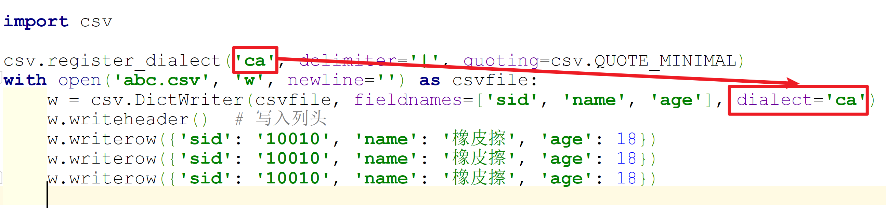

Python csv
<a name="cq7p3"></a>
## csv（Comma-Separated Values）文件是什么？
它是一种文件格式，一般也被叫做逗号分隔值文件，可以使用 Excel 软件或者文本文档打开 。其中数据字段用半角逗号间隔（也可以使用其它字符），使用 Excel 打开时，逗号会被转换为分隔符。csv 文件是以纯文本形式存储了表格数据，并且在兼容各个操作系统。<br />例如下面的文本，在 Excel 中就以表格的形式存在。
```
sid,name,age
10010,橡皮擦,18
10086,Fcant,19
10000,各位,20
```
下面就对 Python 内置模块 csv 的用法进行简单的说明。
<a name="ZPisP"></a>
## Python 中的 csv 文件清晰解法
<a name="vsMNh"></a>
### 读取文件
使用 `csv.reader()` 读取 csv 文件内容。
```python
import csv  # 模块导入

with open('aa.csv', 'r', newline='', encoding='utf-8') as f:
 # &lt;_csv.reader object at 0x00000000020918D0&gt;
    reader = csv.reader(f)
    for r in reader:
        print(r)
```
其中 `csv.reader()` 方法的原型如下所示：
```python
csv.reader(csvfile, dialect='excel', **fmtparams)
```
其中的参数 csvfile 可以是任何对象，但要求该对象是一个迭代器，所以文件对象和列表对象都可以传入，如果是文件对象，还要求打开它时携带参数 `newline=''` 。后面的参数保持默认即可。<br />第二种方式是使用 `DictReader` 类，该类实现的效果与 `reader()` 方法一致，也是接收可迭代对象，返回生成器，差异是将返回的结果放到了一个字典的值内，字典的键就是单元格的标题。并且这样输出的函数是，不需要单独处理 csv 的列头行了。
```python
import csv  # 模块导入

with open('aa.csv', 'r', newline='', encoding='utf-8') as f:
    reader = csv.DictReader(f)
    for r in reader:
        print(r)
```
输出内容：
```python
OrderedDict([('sid', '10010'), ('name', '橡皮擦'), ('age', '18')])
OrderedDict([('sid', '10086'), ('name', 'Fcant'), ('age', '19')])
OrderedDict([('sid', '10000'), ('name', '各位'), ('age', '20')])
```
<a name="fCPuy"></a>
### 写入文件
csv 文件写入用到的模块方法是 `csv.writer()`，该方法的原型如下：
```python
csv.writer(csvfile, dialect='excel', **fmtparams)
```
最基本的写入：
```python
import csv

with open('abc.csv', 'w', newline='') as csvfile:
    w = csv.writer(csvfile)
    # 写入列头
    w.writerow(["sid", "name", "age"])
    w.writerow(["10010", "橡皮擦", "18"])
    w.writerow(["10086", "Fcant", "18"])
```
这时如果在打开文件时，缺少了 `newline=''`，那写入 csv 文件内容之后，会出现多余的换行。除此之外，写入 csv 文件的时候，可以启用 `dialect`（方言）参数。例如使用 `|` 作为列的分隔符。此时的文件写入代码写成下述内容：
```python
class my_dialect(csv.Dialect):
    lineterminator = '\r\n'
    delimiter = ';'
    quotechar = '"'
    quoting = csv.QUOTE_MINIMAL


with open('abc.csv', 'w', newline='') as csvfile:
    w = csv.writer(csvfile, dialect=my_dialect)
    # 写入列头
    w.writerow(["sid", "name", "age"])
    w.writerow(["10010", "橡皮擦", "18"])
    w.writerow(["10086", "Fcant", "18"])
```
上述代码定义了一个新的类 my_dialect，并使其继承 `csv.Dialect` 类，重写了其中的部分字段。

- `delimiter`：分隔字符，默认为 `,`；
- `lineterminator`：`writer` 方法写入数据时，每行的结尾字符，默认为 `\r\n`；
- `quotechar`：单字符，用于包裹具有特殊字符的字段，例如 定界符，引号字符，换行符，默认是 `"`；
- `quoting`：控制 writer 何时生成引号，以及 reader 何时识别引号，默认是 `QUOTE_MINIMAL`，其余几个值分别是 `QUOTE_ALL（全部加引号）`，`QUOTE_MINIMAL（特定情况加）`，`QUOTE_NONNUMERIC（所有非数字加）`，`QUOTE_NONE（都不加）`；`Writer` 对象的方法说明：
- `csvwriter.writerow(row)`：写入单行；
- `csvwriter.writerows(rows)`：写入多行
```python
import csv  # 模块导入

csv_headers = ['name', 'age']
rows = [('橡皮擦', 18),
        ('Fcant', 19),
        ('各位', 20)]

with open('./aa.csv', 'w', encoding='utf-8',newline='') as f:
    csv_file = csv.writer(f)
    csv_file.writerow(csv_headers)  # 写入头
    csv_file.writerows(rows)
```
与 `DictReader` 类使用方法差不多，还存在一个 `DictWriter` 类，该类将以字段格式写入 csv 文件字段。
```python
import csv

with open('abc.csv', 'w', newline='') as csvfile:
    w = csv.DictWriter(csvfile, fieldnames=['sid', 'name', 'age'])
    w.writeheader()  # 写入列头
    w.writerow({'sid': '10010', 'name': '橡皮擦', 'age': 18})
    w.writerow({'sid': '10010', 'name': '橡皮擦', 'age': 18})
    w.writerow({'sid': '10010', 'name': '橡皮擦', 'age': 18})
```
上述代码尤其注意 `fieldnames` 参数是必填参数，表示的是列头，并且在写入正式数据前，需使用 `w.writeheader()` 写入列头。
<a name="oM1Hs"></a>
## csv 文件其它说明
关于 csv 方言，可以使用 `csv.register_dialect` 方法将 `name` 与 `dialect` 关联起来，核心含义相当于给 `dialect` 起了一个别名。删除也比较简单，使用 `csv.unregister_dialect(name)` 即可。`csv.list_dialects()` 返回已经注册的方言名称，可以在电脑上做一下测试，查看 Python 环境中提供的几种方言。
```python
import csv

csv.register_dialect('ca', delimiter='|', quoting=csv.QUOTE_MINIMAL)
with open('abc.csv', 'w', newline='') as csvfile:
    w = csv.DictWriter(csvfile, fieldnames=['sid', 'name', 'age'], dialect='ca')
    w.writeheader()  # 写入列头
    w.writerow({'sid': '10010', 'name': '橡皮擦', 'age': 18})
    w.writerow({'sid': '10010', 'name': '橡皮擦', 'age': 18})
    w.writerow({'sid': '10010', 'name': '橡皮擦', 'age': 18})
```
<br />csv 模块还提供了 `csv.Sniffer` 类，用于推断 csv 文件的格式，其存在两个方法：

- `sniff(sample, delimiters=None)`：分析并返回一个 `dialect` 子类，可以分析出格式参数；
- `has_header(sample)`：分析 csv 文件是否存在标题。
