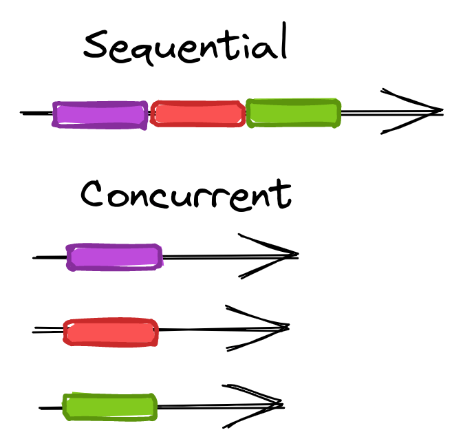
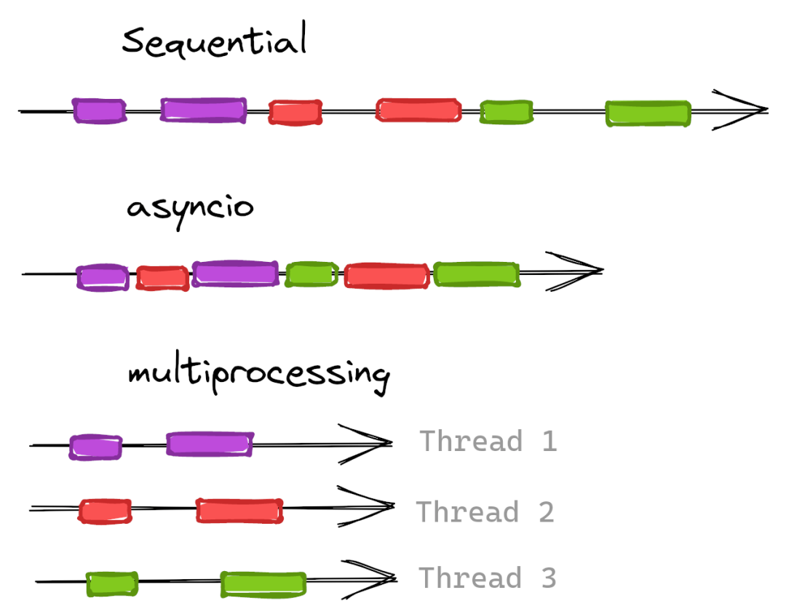

Python<br />从网站中抓取数据是开发者的一个典型“用例”。无论它是属于副业项目，还是正在成立一个初创公司，抓取数据似乎都很有必要。<br />举个例子，倘若想要创建一个比价网站，那么会需要从各种电商网站上抓取价格信息；或者想要构建一个可以识别商品并在亚马逊上自动查找价格的“人工智能”。类似的场景还有很多。<br />但是有没有注意到，获取所有页面信息的速度有多慢呢？会选择一个接一个地去抓取商品吗？应该会有更好的解决方案吧？答案是肯定的。<br />抓取网页可能非常耗时，因为必须花时间等待服务器响应，抑或是速率受限。这就是为什么要展示**如何通过在 Python 中使用并发来加速网页数据抓取项目**。
<a name="abXmE"></a>
## 前提
为了使代码正常运行，需要安装 [**python 3**](https://www.python.org/downloads/)。部分系统可能已经预装了它。然后还需要使用 `pip install` 安装所有必要的库。
```bash
pip install requests beautifulsoup4 aiohttp numpy
```
_如果了解并发背后的基础知识，可以跳过理论部分直接进入实际操作环节。_
<a name="dqEsI"></a>
## 并发
并发是一个术语，用于描述**同时运行多个计算任务**的能力。<br />当按顺序向网站发出请求时，可以选择一次发出一个请求并等待结果返回，然后再发出下一个请求。<br />不过，也可以同时发送多个请求，并在它们返回时处理对应的结果，这种方式的速度提升效果是非常显著的。与顺序请求相比，并发请求无论是否并行运行（多个 CPU），都会比前者快得多 -- 稍后会详细介绍。<br />要理解并发的优势。需要了解顺序处理和并发处理任务之间的区别。假设有五个任务，每个任务需要 10 秒才能完成。当按顺序处理它们时，完成五个任务所需的时间为 50 秒；而并发处理时，仅需要 10 秒即可完成。<br /><br />除了提高处理速度之外，并发还允许通过将网页抓取任务负载分布于多个进程中，来实现在更短的时间内完成更多的工作。<br />这里有几种实现并行化请求的方式：例如 multiprocessing 和 asyncio。从网页抓取的角度来看，可以使用这些库来并行处理对不同网站或同一网站不同页面的请求。这里将重点关注 asyncio，这是一个 Python 内置的模块，它提供了使用协程编写单线程并发代码的基础设施。<br />由于并发意味着更复杂的系统和代码，因此在使用前请考虑在使用场景中是否利大于弊。
<a name="vjtqc"></a>
### 并发的优势

- **在更短的时间内完成更多的工作**
- **可以将空闲的网络时间投入到其他请求中**
<a name="Oku8G"></a>
### 并发的危险之处

- **更不易于开发和调试**
- **可能存在竞争条件**
- **需要检查并使用线程安全的函数**
- **一不小心就会增加程序阻塞的概率**
- **并发自带系统开销，因此需要设置合理的并发级别**
- **针对小型站点请求过多的话，可能会变成 DDoS 攻击**
<a name="iv518"></a>
## 为何选择 asyncio
在做出选择之前，有必要了解一下 asyncio 和 multiprocessing 之间的区别，以及 IO 密集型与 CPU 密集型之间的区别。<br />[**asyncio**](https://docs.python.org/3/library/asyncio.html) “是一个使用 async/await 语法编写并发代码的库”，它在单个处理器上运行。<br />[**multiprocessing**](https://docs.python.org/3/library/multiprocessing.html) “是一个支持使用 API 生产进程的包 [...] 允许程序员充分利用给定机器上的多个处理器”。每个进程将在不同的 CPU 中启动自己的 Python 解释器。<br />IO 密集型意味着程序将受 I/O 影响而变得运行缓慢。在案例中，主要指的是网络请求。<br />CPU 密集型意味着程序会由于 CPU 计算压力导致运行缓慢 -- 例如数学计算。<br />为什么这会影响选择用于并发的库？因为并发成本的很大一部分是创建和维护线程/进程。对于 CPU 密集型问题，在不同的 CPU 中拥有多个进程将会提升效率。但对于 I/O 密集型的场景，情况可能并非如此。<br />由于网页数据抓取主要受 I/O 限制，因此选择了 asyncio。但如果有疑问（或只是为了好玩），可以使用 multiprocessing 尝试这个场景并比较一下结果。<br />
<a name="iVv9j"></a>
## 顺序实现的版本
从抓取 scrapeme.live 作为示例开始，这是一个专门用于测试的电子商务网站。<br />首先，从顺序抓取的版本开始。以下几个片段是所有案例的一部分，因此它们将保持不变。<br />通过访问目标主页，可以发现它有 48 个子页面。由于是测试环境，这些子页面不会很快发生变化，会使用到以下两个常量：
```python
base_url = "https://scrapeme.live/shop/page" 
pages = range(1, 49) # max page (48) + 1
```
现在，从目标产品中提取基础数据。为此，使用 requests.get 获取 HTML 内容，然后使用 BeautifulSoup 解析它。将遍历每个产品并从中获取一些基本信息。所有选择器都来自对内容的手动审查（使用 DevTools），但为简洁起见，不会在这里详细介绍。
```python
import requests
from bs4 import BeautifulSoup


def extract_details(page):
    # concatenate page number to base URL 
    response = requests.get(f"{base_url}/{page}/")
    soup = BeautifulSoup(response.text, "html.parser")

    pokemon_list = []
    for pokemon in soup.select(".product"):  # loop each product 
        pokemon_list.append({
            "id": pokemon.find(class_="add_to_cart_button").get("data-product_id"),
            "name": pokemon.find("h2").text.strip(),
            "price": pokemon.find(class_="price").text.strip(),
            "url": pokemon.find(class_="woocommerce-loop-product__link").get("href"),
        })
    return pokemon_list
```
extract_details 函数将获取一个页码并将其连接起来，用于创建子页面的 URL。获取内容并创建产品数组后返回。这意味着返回的值将是一个字典列表，这是一个后续使用的必要细节。<br />需要为每个页面运行上面的函数，获取所有结果，并存储它们。
```python
import csv

# modified to avoid running all the pages unintentionally 
pages = range(1, 3)


def store_results(list_of_lists):
    pokemon_list = sum(list_of_lists, [])  # flatten lists 

    with open("pokemon.csv", "w") as pokemon_file:
        # get dictionary keys for the CSV header 
        fieldnames = pokemon_list[0].keys()
        file_writer = csv.DictWriter(pokemon_file, fieldnames=fieldnames)
        file_writer.writeheader()
        file_writer.writerows(pokemon_list)


list_of_lists = [
    extract_details(page)
    for page in pages
]
store_results(list_of_lists)
```
运行上面的代码将获得两个产品页面，提取产品（总共 32 个），并将它们存储在一个名为 pokemon.csv 的 CSV 文件中。 store_results 函数不影响顺序或并行模式下的抓取。可以跳过它。<br />由于结果是列表，必须将它们展平以允许 writerows 完成其工作。这就是为什么将变量命名为list_of_lists（即使它有点奇怪），只是为了提醒大家它不是扁平的。<br />输出 CSV 文件的示例：

| **id** | **name** | **price** | **url** |
| --- | --- | --- | --- |
| 759 | Bulbasaur | £63.00 | https://scrapeme.live/shop/Bulbasaur/ |
| 729 | Ivysaur | £87.00 | https://scrapeme.live/shop/Ivysaur/ |
| 730 | Venusaur | £105.00 | https://scrapeme.live/shop/Venusaur/ |
| 731 | Charmander | £48.00 | https://scrapeme.live/shop/Charmander/ |
| 732 | Charmeleon | £165.00 | https://scrapeme.live/shop/Charmeleon/ |

如果要为每个页面 (48) 运行脚本，它将生成一个包含 755 个产品的 CSV 文件，并花费大约 30 秒。
```bash
time python script.py 

real 0m31,806s 
user 0m1,936s 
sys 0m0,073s
```
<a name="cKgZi"></a>
## asyncio 介绍
如果**同时执行所有请求**，它应该花费更少时间，对吧？也许会和执行最慢的请求所花费的时间相等。<br />并发确实应该运行得更快，但它也涉及一些开销。所以这不是线性的数学改进。<br />为此，将使用上面提到的 asyncio。它允许在事件循环中的同一个线程上运行多个任务（就像 Javascript 一样）。它将运行一个函数，并在运行时允许时将上下文切换到不同的上下文。在例子中，HTTP 请求允许这种切换。<br />将开始看到一个 sleep 一秒钟的示例。并且脚本应该需要一秒钟才能运行。请注意，不能直接调用 main。需要让 asyncio 知道它是一个需要执行的异步函数。
```python
import asyncio 

async def main(): 
    print("Hello ...") 
    await asyncio.sleep(1) 
    print("... World!") 
 
asyncio.run(main())
```
```bash
time python script.py 
Hello ... 
... World! 
 
real 0m1,054s 
user 0m0,045s 
sys 0m0,008s
```
<a name="B5kkO"></a>
### 简单的并行代码
接下来，将扩展一个示例案例来运行一百个函数。它们每个都会 sleep 一秒钟并打印一个文本。如果按顺序运行它们大约需要一百秒。使用 asyncio，只需要一秒！<br />这就是并发背后的力量。如前所述，对于纯 I/O 密集型任务，它将执行得更快 - sleep 不是，但它对示例很重要。<br />需要创建一个辅助函数，它会 sleep 一秒钟并打印一条消息。然后，编辑 main 以调用该函数一百次，并将每个调用存储在一个任务列表中。最后也是关键的部分是执行并等待所有任务完成。这就是 [**asyncio.gather**](https://docs.python.org/3/library/asyncio-task.html#asyncio.gather) 所做的事情。
```python
import asyncio


async def demo_function(i):
    await asyncio.sleep(1)
    print(f"Hello {i}")


async def main():
    tasks = [
        demo_function(i)
        for i in range(0, 100)
    ]
    await asyncio.gather(*tasks)


asyncio.run(main())
```
正如预期的那样，一百条消息和一秒钟的执行时间。完美！
<a name="urHHr"></a>
## 使用 asyncio 进行抓取
需要将这些知识应用于数据抓取。遵循的方法是同时请求并返回产品列表，并在所有请求完成后存储它们。每次请求后或者分批保存数据可能会更好，以避免实际情况下的数据丢失。<br />_第一次尝试不会有并发限制，所以使用时要小心。在使用数千个 URL 运行它的情况下......好吧，它几乎会同时执行所有这些请求。这可能会给服务器带来巨大的负载，并可能会损害计算机。_<br />requests 不支持开箱即用的异步，因此将使用 [**aiohttp**](https://docs.aiohttp.org/) 来避免复杂化。 requests 可以完成这项工作，并且没有实质性的性能差异。但是使用 aiohttp 代码更具可读性。
```python
import asyncio
import aiohttp
from bs4 import BeautifulSoup


async def extract_details(page, session):
    # similar to requests.get but with a different syntax 
    async with session.get(f"{base_url}/{page}/") as response:
        # notice that we must await the .text() function 
        soup = BeautifulSoup(await response.text(), "html.parser")

        # [...] same as before 
        return pokemon_list


async def main():
    # create an aiohttp session and pass it to each function execution 
    async with aiohttp.ClientSession() as session:
        tasks = [
            extract_details(page, session)
            for page in pages
        ]
        list_of_lists = await asyncio.gather(*tasks)
        store_results(list_of_lists)


asyncio.run(main())
```
CSV 文件应该像以前一样包含每个产品的信息 (共 755 个)。由于同时执行所有页面调用，结果不会按顺序到达。如果将结果添加到 extract_details 内的文件中，它们可能是无序的。但可以等待所有任务完成然后处理它们，因此顺序性不会有太大影响。
```python
time python script.py 
 
real 0m11,442s 
user 0m1,332s 
sys 0m0,060s
```
速度提升了 3 倍，但是……不应该是 40 倍吗？没那么简单。许多因素都会影响性能（网络、CPU、RAM 等）。<br />在这个演示页面中，注意到当执行多个调用时，响应时间会变慢，这可能是设计使然。一些服务器/提供商可以限制并发请求的数量，以避免来自同一 IP 的过多流量。它不是一种阻塞，而是一个队列。会得到服务响应，但需要稍等片刻。<br />要查看真正的加速，可以针对[**延迟**](https://httpbin.org/delay/2)页面进行测试。这是另一个测试页面，它将等待 2 秒然后返回响应。
```python
base_url = "https://httpbin.org/delay/2" 
#... 

async def extract_details(page, session): 
    async with session.get(base_url) as response: 
        #...
```
这里去掉了所有的提取和存储逻辑，只调用了延迟 URL 48 次，并在 3 秒内运行完毕。
```python
time python script.py 
 
real 0m2,865s 
user 0m0,245s 
sys 0m0,031s
```
<a name="yl1dT"></a>
### 使用信号量限制并发
如上所述，应该限制并发请求的数量，尤其是针对单个域名。<br />asyncio 带有 [**Semaphore**](https://docs.python.org/3/library/asyncio-sync.html#asyncio.Semaphore)，一个将获取和释放锁的对象。它的内部功能将阻塞一些调用，直到获得锁，从而创建最大的并发性。<br />需要创建尽可能最大值的信号量。然后等待提取函数运行，直到 async with sem 可用。
```python
max_concurrency = 3
sem = asyncio.Semaphore(max_concurrency)


async def extract_details(page, session):
    async with sem:  # semaphore limits num of simultaneous downloads 
        async with session.get(f"{base_url}/{page}/") as response:
    # ... 


async def main():


# ... 

loop = asyncio.get_event_loop()
loop.run_until_complete(main())
```
它完成了工作，并且相对容易实现！这是最大并发设置为 3 的输出。
```bash
time python script.py 

real 0m13,062s 
user 0m1,455s 
sys 0m0,047s
```
这表明无限并发的版本并没有全速运行。如果将限制增加到 10，总时间与未限制的脚本运行时间相近。
<a name="vrbPX"></a>
### 使用 TCPConnector 限制并发
aiohttp 提供了一种替代解决方案，可提供进一步的配置。可以创建传入自定义 [**TCPConnector**](https://docs.aiohttp.org/en/stable/client_reference.html#tcpconnector) 的客户端会话。<br />可以使用两个适合需求的参数来构建它：

- **limit - “同时连接的总数”。**
- **limit_per_host - “限制同时连接到同一端点的连接数”（同一主机、端口和 is_ssl）。**
```python
max_concurrency = 10 
max_concurrency_per_host = 3 

async def main(): 
    connector = aiohttp.TCPConnector(limit=max_concurrency, limit_per_host=max_concurrency_per_host) 
    async with aiohttp.ClientSession(connector=connector) as session: 
        # ... 

asyncio.run(main())
```
这种写法也易于实施和维护！这是每个主机最大并发设置为 3 的输出。
```bash
time python script.py 
 
real 0m16,188s 
user 0m1,311s 
sys 0m0,065s
```
与 Semaphore 相比的优势是可以选择限制每个域的并发调用和请求的总量。可以使用同一个会话来抓取不同的站点，每个站点都有自己的限制。<br />缺点是它看起来有点慢。需要针对真实案例，使用更多页面和实际数据运行一些测试。
<a name="Nd9cc"></a>
## multiprocessing
就像之前看到的那样，数据抓取是 I/O 密集型的。但是，如果需要将它与一些 CPU 密集型计算混合怎么办？为了测试这种情况，将使用一个函数，该函数将在每个抓取的页面之后 count_a_lot。这是强制 CPU 忙碌一段时间的简单（且有些愚蠢）的方法。
```python
def count_a_lot():
    count_to = 100_000_000
    counter = 0
    while counter < count_to:
        counter = counter + 1


async def extract_details(page, session):
    async with session.get(f"{base_url}/{page}/") as response:
        # ... 
        count_a_lot()
        return pokemon_list
```
对于 asyncio 版本，只需像以前一样运行它。可能需要很长时间⏳。
```bash
time python script.py 
 
real 2m37,827s 
user 2m35,586s 
sys 0m0,244s
```
现在，比较难理解的部分来了：<br />直接引入 multiprocessing 看起来有点困难。实际上，需要创建一个 ProcessPoolExecutor，它能够“使用一个进程池来异步执行调用”。它将处理**不同 CPU 中每个进程的创建和控制**。<br />但它不会分配负载。为此，将使用 NumPy 的 array_split，它会根据 CPU 的数量将页面范围分割成相等的块。<br />main 函数的其余部分类似于 asyncio 版本，但更改了一些语法以匹配 multiprocessing 的语法风格。<br />此处的本质区别是不会直接调用extract_details。实际上是可以的，将尝试通过将 multiprocessing 与 asyncio 混合使用来获得最好的执行效率。
```python
from concurrent.futures import ProcessPoolExecutor
from multiprocessing import cpu_count
import numpy as np

num_cores = cpu_count()  # number of CPU cores 


def main():
    executor = ProcessPoolExecutor(max_workers=num_cores)
    tasks = [
        executor.submit(asyncio_wrapper, pages_for_task)
        for pages_for_task in np.array_split(pages, num_cores)
    ]
    doneTasks, _ = concurrent.futures.wait(tasks)

    results = [
        item.result()
        for item in doneTasks
    ]
    store_results(results)


main()
```
长话短说，每个 CPU 进程都会有几页需要抓取。一共有 48 个页面，假设机器有 8 个 CPU，每个进程将请求 6 个页面（6 * 8 = 48）。<br />这六个页面将同时运行！之后，计算将不得不等待，因为它们是 CPU 密集型的。但是有很多 CPU，所以它们应该比纯 asyncio 版本运行得更快。
```python
async def extract_details_task(pages_for_task):
    async with aiohttp.ClientSession() as session:
        tasks = [
            extract_details(page, session)
            for page in pages_for_task
        ]
        list_of_lists = await asyncio.gather(*tasks)
        return sum(list_of_lists, [])


def asyncio_wrapper(pages_for_task):
    return asyncio.run(extract_details_task(pages_for_task))
```
这就是神奇的地方。每个 CPU 进程将使用页面的子集启动一个 asyncio（例如，第一个页面从 1 到 6）。<br />然后，每一个都将调用几个 URL，使用已知的 extract_details 函数。<br />上述内容需要花点时间来吸收它。整个过程是这样的：

1. **创建执行器**
2. **拆分页面**
3. **每个进程启动 asyncio**
4. **创建一个 aiohttp 会话并创建页面子集的任务**
5. **提取每一页的数据**
6. **合并并存储结果**

下面是本次的执行时间。虽然之前没有提到它，但这里的 user 时间却很显眼。对于仅运行 asyncio 的脚本：
```bash
time python script.py 
 
real 2m37,827s 
user 2m35,586s 
sys 0m0,244s
```
具有 asyncio 和多个进程的版本：
```bash
time python script.py 
 
real 0m38,048s 
user 3m3,147s 
sys 0m0,532s
```
发现区别了吗？实际运行时间方面第一个用了两分钟多，第二个用了 40 秒。但是在总 CPU 时间（user 时间）中，第二个超过了三分钟！看起来系统开销的耗时确实有点多。<br />这表明并行处理“浪费”了更多时间，但程序是提前完成的。显然，在决定选择哪种方法时，需要考虑到开发和调试的复杂度。
<a name="Xi9JM"></a>
## 结论
可以看到 asyncio 足以用于抓取，因为大部分运行时间都用于网络请求，这种场景属于 I/O 密集型并且适用于单核中的并发处理。<br />如果收集的数据需要一些 CPU 密集型工作，这种情况就会改变。虽然有关计数的例子有一点愚蠢，但至少理解了这种场景。<br />在大多数情况下，带有 aiohttp 的 asyncio 比异步的 requests 更适合完成目标工作。同时可以添加自定义连接器以限制每个域名的请求数、并发请求总数。有了这三个部分，就可以开始构建一个可以扩展的数据抓取程序了。
<a name="BieZ8"></a>
## 参考资料
python 3: [_https://www.python.org/downloads/_](https://www.python.org/downloads/)<br />asyncio: [_https://docs.python.org/3/library/asyncio.html_](https://docs.python.org/3/library/asyncio.html)<br />multiprocessing: [_https://docs.python.org/3/library/multiprocessing.html_](https://docs.python.org/3/library/multiprocessing.html)<br />asyncio.gather: [_https://docs.python.org/3/library/asyncio-task.html#asyncio.gather_](https://docs.python.org/3/library/asyncio-task.html#asyncio.gather)<br />aiohttp: [_https://docs.aiohttp.org/_](https://docs.aiohttp.org/)<br />延迟: [_https://httpbin.org/delay/2_](https://httpbin.org/delay/2)<br />Semaphore: [_https://docs.python.org/3/library/asyncio-sync.html#asyncio.Semaphore_](https://docs.python.org/3/library/asyncio-sync.html#asyncio.Semaphore)<br />TCPConnector: [_https://docs.aiohttp.org/en/stable/client_reference.html#tcpconnector_](https://docs.aiohttp.org/en/stable/client_reference.html#tcpconnector)
