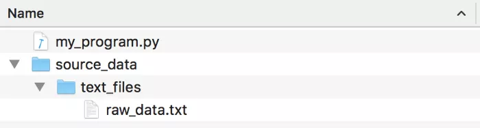

Python <br />在编程过程中，往往会遇到一个小麻烦——微软的 Windows 系统在文件夹名之间使用反斜杠字符，而几乎所有其它的计算机（操作系统）都使用正斜杠：
```
Windows filenames:
C:\some_folder\some_file.txt

Most other operating systems:
/some_folder/some_file.txt
```
这是由于上世纪 80 年代早期计算机历史上的一个小意外。「MS-DOS」的第一版使用了正斜杠字符来指定命令行选项。当微软在「MS-DOS 2.0」中加入了对文件夹的支持时，正斜杠字符已经被使用了，所以他们采用了反斜杠作为替代。现在仍然被受困于这种不一致性。<br />如果想让 Python 代码同时在 Windows 和 Mac/Linux 上工作，就需要处理这种与平台相关的问题。幸运的是，Python 3 有一个名为「pathlib」的新模块，使得用户处理文件几乎没有任何困难。<br />「pathlib」模块链接：[https://docs.python.org/3/library/pathlib.html](https://docs.python.org/3/library/pathlib.html)
<a name="WahNI"></a>
## 错误的解决方案：手动构建文件路径
假设有一个数据文件夹，该文件夹包含在 Python 程序中打开的文件：<br /><br />在 Python 中对其进行编码是「错误」的方式：
```python
data_folder = "source_data/text_files/"
file_to_open = data_folder + "raw_data.txt"
f = open(file_to_open)
print(f.read())
```
请注意，由于上面使用的是 Mac 系统，所以使用了「Unix」风格的正斜杠对路径进行了硬编码。<br />从技术上讲，这段代码在 Windows 上仍然有效，因为 Python 有一个「黑客」（hack）技术：当在 Windows 上调用「`open()`」函数时，它会识别这两种斜线。但即便如此，也不应该依赖它。如果在错误的操作系统上使用了错误类型的斜杠（尤其是在它们与外部程序或代码库交互时），并不是所有的 Python 库都会正常工作。<br />Python 对混合斜杠类型的支持是一种只针对 Windows 的「黑客」技术，它反过来并不起作用。在 Mac 系统环境下，在代码中使用反斜杠会导致彻底失败：
```python
data_folder = "source_data\\text_files\\"
file_to_open = data_folder + "raw_data.txt"
f = open(file_to_open)
print(f.read())
# On a Mac, this code will throw an exception:
# FileNotFoundError: [Errno 2] No such file or directory: 'source_data\\text_files\\raw_data.txt'
```
由于所有这些原因以及其他原因，使用硬编码的路径字符串编写代码，是一种会让其他程序员十分「嫌弃」的做法。一般来说应该尽量避免这么做。
<a name="LPPzZ"></a>
## 以前的解决方案：Python 的「os.path」模块
Python 的「os.path」模块有很多工具来处理这类针对特定操作系统的文件系统问题。<br />可以使用「`os.path.join()`」为当前的操作系统构建一个使用正确类型斜杠的路径字符串：
```python
import os.path
data_folder = os.path.join("source_data", "text_files")
file_to_open = os.path.join(data_folder, "raw_data.txt")
f = open(file_to_open)
print(f.read())
```
这段代码可以同时在「Windows」或「Mac」系统上完美运行。问题是它使用起来很麻烦。写出「`os.path.join()`」并将路径的每个部分作为独立的字符串传给该函数非常冗长，而且很不直观。
<a name="ejRCt"></a>
## 更好的解决方案：Python3 的「pathlib」
为了处理文件和路径，Python 3.4 引入了一个名为「pathlib」的新标准库，而且非常好用！<br />要使用该库，只需使用正斜杠将一个路径或文件名传给一个新的「`Path()`」对象，然后它将处理余下的操作：
```python
from pathlib import Path
data_folder = Path("source_data/text_files/")
file_to_open = data_folder / "raw_data.txt"
f = open(file_to_open)
print(f.read())
```
在这里，有两点需要注意：

- 应该在使用「pathlib」函数的情况下使用正斜杠。「`Path()`」函数将会把正斜杠转化为适应当前操作系统环境的正确斜杠。
- 如果想要在路径上进行添加，可以直接在代码中使用「`/`」操作符。再也不用一遍又一遍地输入「`os.path.join(a, b)`」了。

如果「pathlib」所做的就这么多，它也已经是对于 Python 的一个很好的补充了。但是，它还能做更多！<br />例如，可以在无需打开和关闭文件的情况下，读取文本文件的内容：
```python
from pathlib import Path
data_folder = Path("source_data/text_files/")
file_to_open = data_folder / "raw_data.txt"
print(file_to_open.read_text())
```
:::warning
💡提示：之前的示例是有 Bug 的，因为打开的文件从来没有被关闭过。而这里的这种语法则彻底避免了这个 Bug。
:::
事实上，「pathlib」使大多数标准的文件操作变得快速而简单：
```python
from pathlib import Path
filename = Path("source_data/text_files/raw_data.txt")
print(filename.name)
# prints "raw_data.txt"
print(filename.suffix)
# prints "txt"
print(filename.stem)
# prints "raw_data"
if not filename.exists():
    print("Oops, file doesn't exist!")
else:
    print("Yay, the file exists!")
```
甚至可以使用「pathlib」显式地将一个「Unix」路径转化为一个「Windows」格式的路径：
```python
from pathlib import Path, PureWindowsPath
filename = Path("source_data/text_files/raw_data.txt")
# Convert path to Windows format
path_on_windows = PureWindowsPath(filename)
print(path_on_windows)
# prints "source_data\text_files\raw_data.txt"
```
如果真的想安全地在代码中使用反斜杠，可以按照「Windows」格式声明路径，而「pathlib」可以对其进行转化，使其能在当前的操作系统中工作：
```python
from pathlib import Path, PureWindowsPath
# I've explicitly declared my path as being in Windows format, so I can use forward slashes in it.
filename = PureWindowsPath("source_data\\text_files\\raw_data.txt")
# Convert path to the right format for the current operating system
correct_path = Path(filename)
print(correct_path)
# prints "source_data/text_files/raw_data.txt" on Mac and Linux
# prints "source_data\text_files\raw_data.txt" on Windows
```
如果想把代码写得更「高级」一些，甚至可以使用「pathlib」来做诸如解析相对路径、解析网络共享路径并生成「file:// urls」之类的。在下面的例子中，仅仅使用两行代码，就可以在 web 浏览器中打开一个本地文件夹：
```python
from pathlib import Path
import webbrowser
filename = Path("source_data/text_files/raw_data.txt")
webbrowser.open(filename.absolute().as_uri())
```
这只是「pathlib」的好处之一。它很好地替代了过去分散在不同 Python 模块中与文件相关的许多不同功能。
