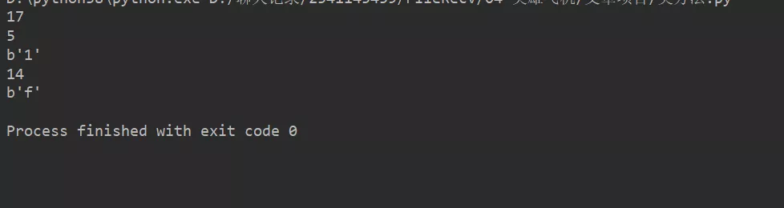

Python
<a name="Nlv92"></a>
## 1、什么是文件？
文件就是把一些存储存放起来，可以让程序下一次执行的时候直接使用，而不必重新制作一份，省时省力。
<a name="msAjg"></a>
## 2、文件如何的打开？
Python内置了一个`open()`方法，可以对文件进行读写操作。<br />使用`open()`方法操作文件就像把大象塞进冰箱一样，可以分三步走，一是打开文件，二是操作文件，三是关闭文件。
<a name="eDYcA"></a>
### open语法
`open()`方法的返回值是一个file对象，可以将它赋值给一个变量（文件句柄）。<br />其基本语法格式为:
```python
f = open(filename, mode)
```
注：<br />Python中，所有具有`read`和`write`方法的对象，都可以归类为`file`类型。而所有的`file`类型对象都可以使用`open`方法打开，`close`方法结束。<br />`filename`：一个包含了要访问的文件名称的字符串值，通常是一个文件路径。<br />`mode`：打开文件的模式，有很多种，默认是只读方式r。<br />例：
```python
# 打开一个文件
f = open("1.txt", "w")
f.write("Python 是一种非常好的语言。\nPython!!\n")
# 关闭打开的文件
f.close()
```
在1.txt文件中写入Python 是一种非常好的语言。Python。
<a name="XZE8G"></a>
## 3、访问模式
通过一个表格，了解Python常用的读写模式

| 访问模式 | 说明 |
| --- | --- |
| r | 以只读方式打开文件。文件的指针将会放在文件的开头。（默认模式）。 |
| w | 打开一个文件只用于写入。如果该文件已存在则将其覆盖。如果该文件不存在，创建新文件。 |
| a | 打开一个文件用于追加。如果该文件已存在，文件指针将会放在文件的结尾。也就是说，新的内容将会被写入到已有内容之后。如果该文件不存在，创建新文件进行写入。 |
| rb | 以二进制格式打开一个文件用于只读。文件指针将会放在文件的开头。这是默认模式。 |
| wb | 以二进制格式打开一个文件只用于写入。如果该文件已存在则将其覆盖。如果该文件不存在，创建新文件。 |
| ab | 以二进制格式打开一个文件用于追加。如果该文件已存在，文件指针将会放在文件的结尾。也就是说，新的内容将会被写入到已有内容之后。如果该文件不存在，创建新文件进行写入。 |
| r+ | 打开一个文件用于读写。文件指针将会放在文件的开头。 |
| w+ | 打开一个文件用于读写。如果该文件已存在则将其覆盖。如果该文件不存在，创建新文件。 |
| a+ | 打开一个文件用于读写。如果该文件已存在，文件指针将会放在文件的结尾。文件打开时会是追加模式。如果该文件不存在，创建新文件用于读写。 |
| rb+ | 以二进制格式打开一个文件用于读写。文件指针将会放在文件的开头。 |
| wb+ | 以二进制格式打开一个文件用于读写。如果该文件已存在则将其覆盖。如果该文件不存在，创建新文件。 |
| ab+ | 以二进制格式打开一个文件用于追加。如果该文件已存在，文件指针将会放在文件的结尾。如果该文件不存在，创建新文件用于读写。 |

如果要读取非UTF-8编码的文件，需要给`open()`函数传入`encoding`参数。<br />例如，读取GBK编码的文件：
```python
>>> f = open('gbk.txt', 'r', encoding='gbk')
>>> f.read()'GBK' 
#编码
```
遇到有些编码不规范的文件，可能会抛出`UnicodeDecodeError`异常，这表示在文件中可能夹杂了一些非法编码的字符。遇到这种情况，可以提供errors参数，表示如果遇到编码错误后如何处理。
```python
f = open('gbk.txt', 'r', encoding='gbk', errors='ignore')
```
<a name="yc5u2"></a>
## 4、文件对象操作
用`open`方法打开一个文件，将返回一个文件对象。这个对象内置了很多操作方法。<br />下面打开了一个f文件对象（1.txt）。对文件对象进行相关的操作。
<a name="hO2h5"></a>
### 1. `f.read(size)`
读取一定大小的数据, 然后作为字符串或字节对象返回。size是一个可选的数字类型的参数，用于指定读取的数据量。当size被忽略了或者为负值，那么该文件的所有内容都将被读取并且返回。
```python
f = open("1.txt", "r")
str = f.read()print(str)
f.close()
```
如果文件体积较大，请不要使用`read()`方法一次性读入内存，而是`read(312)`这种一点一点的读。
<a name="NWiUv"></a>
### 2. `f.readline()`
从文件中读取一行n内容。换行符为'\n'。如果返回一个空字符串，说明已经已经读取到最后一行。这种方法，通常是读一行，处理一行的情况下使用。
```python
f = open("1.txt", "r")

str = f.read()
print(str)

f.close()
```
<a name="kVhKC"></a>
### 3. `f.readlines()`
将文件中所有的行，一行一行全部读入一个列表内，按顺序一个一个作为列表的元素，并返回这个列表。`readlines`方法会一次性将文件全部读入内存，所以也存在一定的弊端。但是它有个好处，每行都保存在列表里，可随意存取。
```python
f = open("1.txt", "r")
a = f.readlines()
print(a)
f.close()
```
<a name="n7ejK"></a>
### 4. 遍历文件
实际情况中，会将文件对象作为一个迭代器来使用。
```python
# 打开一个文件
f = open("1.txt", "r")

for line in f:
    print(line, end='')

# 关闭打开的文件
f.close()
```
这个方法很简单, 不需要将文件一次性读出，但是同样没有提供一个很好的控制，与`readline`方法一样只能前进，不能回退。<br />几种不同的读取和遍历文件的方法比较：<br />如果文件很小，`read()`一次性读取最方便；<br />如果不能确定文件大小，反复调用`read(size)`比较保险；<br />如果是配置文件，调用`readlines()`最方便。普通情况，使用for循环更好，速度更快。
<a name="DEVU8"></a>
### 5. `f.write()`
使用`write()`可以完成向文件写入数据。
```python
# 打开一个文件
f = open("/tmp/foo.txt", "w")

f.write("Python 是一种非常好的语言。\n我喜欢Python!!\n")

# 关闭打开的文件
f.close()
```
<a name="FABbJ"></a>
### 6. `f.tell()`
返回文件读写指针当前所处的位置，它是从文件开头开始算起的字节数。一定要注意了，是字节数，不是字符数。
<a name="J4nzv"></a>
### 7. `f.seek()`
如果要改变位置指针的位置, 可以使用`f.seek(offset, from_what)`方法。`seek()`经常和`tell()`方法配合使用。<br />from_what的值，如果是0表示从文件开头计算，如果是1表示从文件读写指针的当前位置开始计算，2表示从文件的结尾开始计算，默认为0，例如：<br />`offset`：表示偏移量。

- `seek(x,0)`：从起始位置即文件首行首字符开始移动 x 个字符。
- `seek(x,1)`：表示从当前位置往后移动x个字符。
- `seek(-x,2)`：表示从文件的结尾往前移动x个字符。

例：
```python

f = open("1.txt", "rb+")
f.write(b"1232312adsfalafds")

print(f.tell())


print(f.seek(5))

print(f.read(1))

print(f.seek(-3, 2))

print(f.read(1))
```
运行结果：<br />
<a name="m48zu"></a>
### 8. `f.close()`
关闭文件对象。当处理完一个文件后，调用`f.close()`来关闭文件并释放系统的资源。文件关闭后，如果尝试再次调用该文件对象，则会抛出异常。忘记调用`close()`的后果是数据可能只写了一部分到磁盘，剩下的丢失了，或者更糟糕的结果。
<a name="euCLB"></a>
## 5、`with`关键字
`with`关键字用于Python的上下文管理器机制。为了防止`open`这一类文件打开方法，在操作过程出现异常或错误，或者最后忘了执行`close`方法，文件非正常关闭等可能导致文件泄露、破坏的问题。<br />Python提供了`with`这个上下文管理器机制，保证文件会被正常关闭。不需要再写`close`语句。注意缩进。
```python
with open('test.txt', 'w') as f:
    f.write('Hello, world!')
```
`with`支持同时打开多个文件（文件都是随机创建的）：
```python
with open('1') as obj1, open('2','w') as obj2:
    s=obj1.read()    
    obj2.write(s)
```
