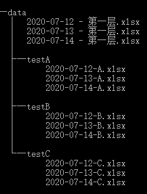

Python OS 文件管理<br />python中 `os.walk` 是一个简单易用的文件、目录遍历器，可以高效的处理文件、目录方面的事情。最后使用`os.walk`模块实现一个在指定日志整理文件的程序。
<a name="CL8tJ"></a>
### 基本介绍
`os.walk()` ：扫描某个指定目录下所包含的子目录和文件，返回的是一个迭代器。
<a name="d19f2c10"></a>
### 基本使用
假设文件夹data有如下的目录结构(cmd 命令：`tree /f` )<br />
<a name="yP5Wa"></a>
#### 2.1扫描所有文件
扫描内容：

- 子文件夹和文件
- 子文件夹下的文件

输出内容：

- 文件夹名称/文件名称

扫描路径：

- 自顶向下 `topdown=True` (默认)
- 自底向上 `topdown=False` 
```python
from os import walk
path="data"
for curDir, dirs, files in walk(path):
#for curDir, dirs, files in walk(path,topdown=False):
    print("现在的目录：" ,curDir)
    print("该目录下包含的子目录：" , str(dirs))
    print("该目录下包含的文件：",str(files))
    print("*"*20)
```
自顶向下扫描结果：
```
现在的目录：data
该目录下包含的子目录：['testA', 'testB', 'testC']
该目录下包含的文件：['2020-07-12 - 第一层.xlsx', '2020-07-13 - 第一层.xlsx', '2020-07-14 - 第一层.xlsx']
********************
现在的目录：data\testA
该目录下包含的子目录：[]
该目录下包含的文件：['2020-07-12-A.xlsx', '2020-07-13-A.xlsx', '2020-07-14-A.xlsx']
********************
现在的目录：data\testB
该目录下包含的子目录：[]
该目录下包含的文件：['2020-07-12-B.xlsx', '2020-07-13-B.xlsx', '2020-07-14-B.xlsx']
********************
现在的目录：data\testC
该目录下包含的子目录：[]
该目录下包含的文件：['2020-07-12-C.xlsx', '2020-07-13-C.xlsx', '2020-07-14-C.xlsx']
********************
```
自底向上扫描结果：
```
现在的目录：data\testA
该目录下包含的子目录：[]
该目录下包含的文件：['2020-07-12-A.xlsx', '2020-07-13-A.xlsx', '2020-07-14-A.xlsx']
********************
现在的目录：data\testB
该目录下包含的子目录：[]
该目录下包含的文件：['2020-07-12-B.xlsx', '2020-07-13-B.xlsx', '2020-07-14-B.xlsx']
********************
现在的目录：data\testC
该目录下包含的子目录：[]
该目录下包含的文件：['2020-07-12-C.xlsx', '2020-07-13-C.xlsx', '2020-07-14-C.xlsx']
********************
现在的目录：data
该目录下包含的子目录：['testA', 'testB', 'testC']
该目录下包含的文件：['2020-07-12 - 第一层.xlsx', '2020-07-13 - 第一层.xlsx', '2020-07-14 - 第一层.xlsx']
********************
```
<a name="SRITl"></a>
#### 2.2扫描输出所有文件的路径
<a name="BFeMW"></a>
##### 输出所有文件
```python
import os
path="data"
for curDir, dirs, files in os.walk(path):
    for file in files:
        print(os.path.join(curDir, file))
```
```
data\2020-07-12 - 第一层.xlsx
data\2020-07-13 - 第一层.xlsx
data\2020-07-14 - 第一层.xlsx
data\testA\2020-07-12-A.xlsx
data\testA\2020-07-13-A.xlsx
data\testA\2020-07-14-A.xlsx
data\testB\2020-07-12-B.xlsx
data\testB\2020-07-13-B.xlsx
data\testB\2020-07-14-B.xlsx
data\testC\2020-07-12-C.xlsx
data\testC\2020-07-13-C.xlsx
data\testC\2020-07-14-C.xlsx
```
<a name="l5bgX"></a>
##### 输出指定类型文件
```python
#endswith 截取文件后缀
import os
path="data"
for curDir, dirs, files in os.walk(path):
    [print(os.path.join(curDir, file)) for file in files  if file.endswith(".xlsx")]
```
<a name="mTp9V"></a>
#### 2.3扫描输出所有的子目录（子文件夹）
```python
# 使用os.walk输出某个目录下的所有文件
import os
path="data"
for curDir, dirs, files in os.walk(path):
    for _dir in dirs:
        print(os.path.join(curDir, _dir))
```
```
data\testA
data\testB
data\testC
```
<a name="i85fr"></a>
### 案例代码
综合运用`os.walk()`——文件指定日期整理程序
```python
import pandas as pd
import numpy as np
import os,openpyxl
#移动符合条件文件，并删除二级文件夹和多余文件
def move_file(file_path,_new_path,date_xl_str):
    
    #本月文件移动至对应新建文件夹，非本月文件直接删除
    for curDir, dirs, files in os.walk(file_path):
        for file in files:
            old_path = os.path.join(curDir, file)
            new_path = os.path.join(_new_path, file)
            file_date=file.split("_")[-1][:10] 
            try:
                os.rename(old_path,new_path) if file_date in date_xl_str else os.remove(old_path)
            except:
                os.remove(old_path)

    #移除子文件夹
    for curDir, dirs, files in os.walk(file_path):
        for _dir in dirs:
            os.removedirs(os.path.join(curDir, _dir))
    os.mkdir("data")

#文件去重-相同日期文件
def qch_date(file_path):
    wj_names=os.listdir(file_path)
    wj_list=[]
    num=0
    for wj in wj_names:
        new_wj=wj[:-11]
        if new_wj not  in wj_list:
            wj_list.append(new_wj)
        else: 
            os.remove(file_path+"\\"+wj)
            num+=1
    return num

#更新数据源
def refresh_data(file_path,sheet_name,data):
    book=openpyxl.load_workbook(file_path)
    writer=pd.ExcelWriter(file_path,engine="openpyxl")
    
    #在ExcelWriter的源代码中，它初始化空工作簿并删除所有工作表，
    #writer.book = book将原来表里面的内容保存到writer中
    writer.book=book
    
    #activate激活指定sheet工作表
    ws=book[sheet_name]
    
    #清空当前活动表数据
    for row in ws.iter_rows():
        for cell in row:
            cell.value=None
    
    #dataframe行列数
    idx_num,col_num=data.shape
    
    #新数据写入当前活动表-注意索引偏移
    for i in  range(1,idx_num+1):
        for j in range(1,col_num+1):
            ws.cell(row=i,column=j).value=data.iloc[i-1,j-1]
    
    #保存关闭writer
    writer.save()
    writer.close()
    
    return None

#文件检查
def check_file(file_path,check_file="文件检查.xlsx"):
    wj_names=os.listdir(file_path)
    data=pd.DataFrame([wj.split("_")[2:] for wj in wj_names],columns=["店铺名称","日期"])
    data['日期']=data['日期'].str[:10] 
    
    #标题columns放到dataframe中
    nind=data.index.insert(0,'0')
    data1=data.reindex(index=nind)
    data1.loc['0']=data.columns
    data1.reset_index(drop=True,inplace=True)

    #刷新数据源
    refresh_data(check_file,"数据源",data1)
    
    return None

file_path="data"
#日期格式：xxxx-xx eg:2020-07-01
start_date=input("请输入开始日期：")
end_date=input("请输入开始日期：")

#生成日期区间-字符串类型
date_xl_str=[str(i)[:10] for i in pd.date_range(start_date,end_date,freq='D')]

#创建指定文件夹
new_path=start_date+"~"+end_date
try:
    os.mkdir(new_path)
except:
    print("文件夹 【%s】 已存在"%new_path)
    
#移动符合条件文件，并删除二级文件夹和多余文件
move_file(file_path,new_path,date_xl_str)
    
#文件去重
num=qch_date(new_path)
print("去除重复文件 %s 个"%num)

#文件检查
check_file(new_path)
```
