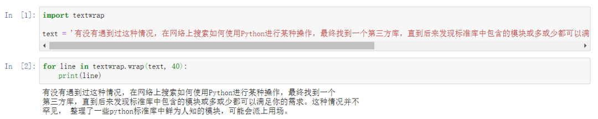
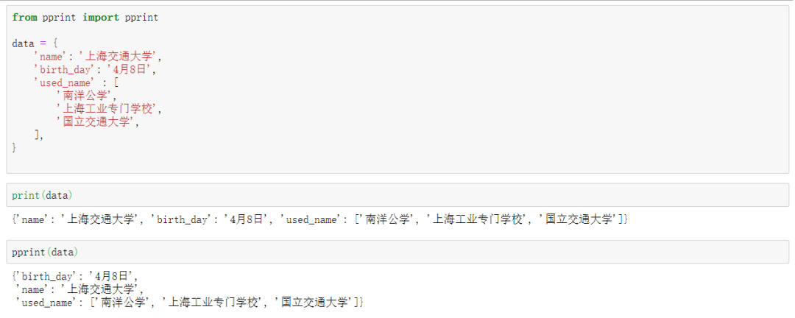
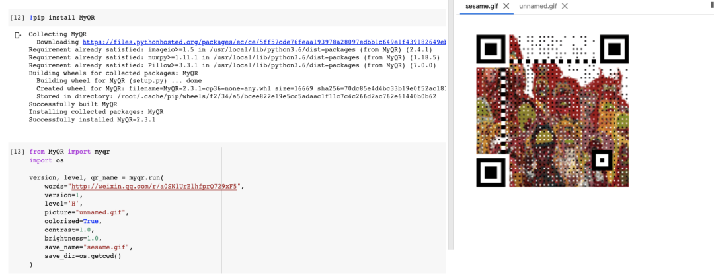
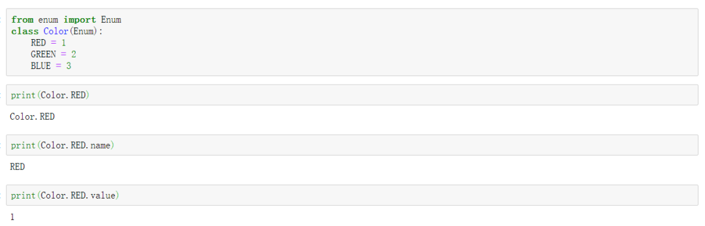
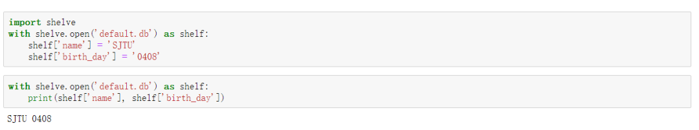
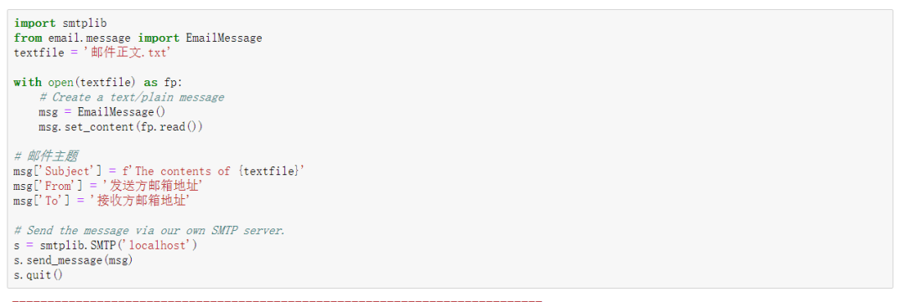
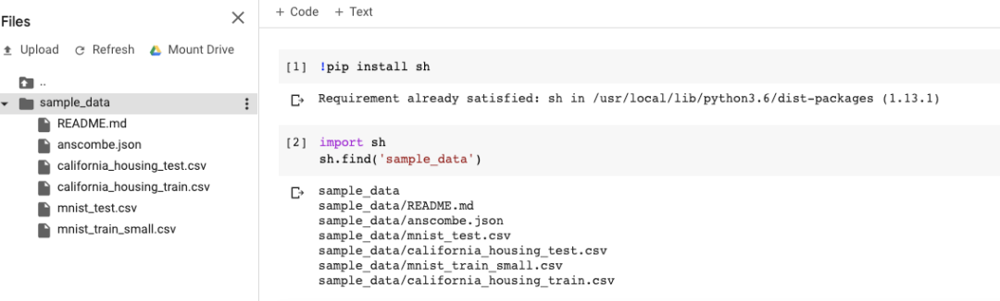
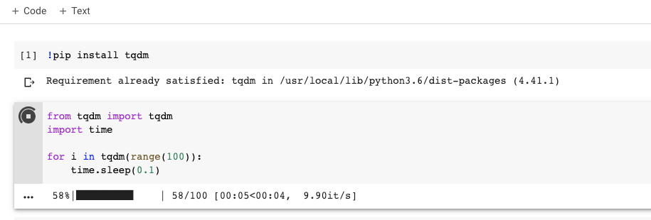

Python 模块

## textwrap
这个模块具可轻松包装和缩进纯文本的功能， 奇怪需求是将所有打印内容以80个字符包装到终端时，它很有用。例如，

## pprint
在使用python开发时，总是会使用print大法来debug。当处理更复杂的数据结构，例如嵌套字典，print的输出就会显得非常不规则，引起不适，这时候就需要pprint了。

## myqr
大概就是一个自己制作酷炫二维码的工具  直接看效果，生成的二维码也是动图，感兴趣的小伙伴可以玩玩。

## enum
enum 枚举模块是一组符号名称（枚举成员）的集合，枚举成员应该是唯一的、不可变的。在枚举中，可以对成员进行恒等比较，并且枚举本身是可迭代的。它可以为值创建具有良好定义的标识符，而不是直接使用字面上的字符串或者整数。

## shelve
当使用关系数据库是一种浪费的时候，shelve 模块可以为 Python 对象提供一个简单的持久性存储选择。就像使用字典一样，通过关键字访问 shelf 对象。其值经过序列化，写入到由 dbm 创建和管理的数据库。

## email & smtplib

- smtplib模块是python中smtp(简单邮件传输协议)的客户端实现。可以使用smtplib模块，轻松的发送电子邮件。
- email模块用来处理邮件消息，包括MIME和其他基于RFC 2822 的消息文档。使用这些模块来定义邮件的内容，是非常简单的。

## sh
如果需要在python程序中完成某项工作，发现这在bash中很简单，但是却不知道怎么在python中实现（或者很复杂），譬如『递归搜索文件』。这时候就需要尝试一下sh这个库了，它能将shell命令以函数的形式导入到python中。

## Tqdm
说实话感觉tqdm并不算低调，因为至今已经听到好多人为它代言了。但是，这么好用的工具必须值得再安利一次，tqdm是一个python进度条工具，可以在 Python 长循环中添加一个进度提示信息，使用时只需要封装任意的迭代器即可。
