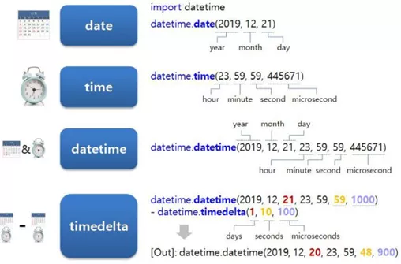
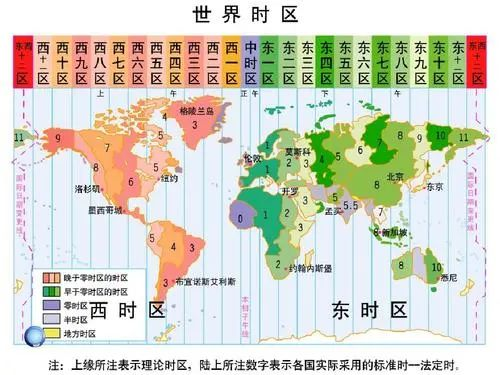

Python
<a name="CUXqK"></a>
## 时间相关概念
秒 在1967年的第13届国际度量衡会议上决定以原子时定义的秒作为时间的国际标准单位：铯133原子基态的两个超精细能阶间跃迁对应辐射的9,192,631,770个周期的持续时间, 起始历元定在1958年1月1日0时。<br />原子钟是一种时钟，它以原子共振频率标准来计算及保持时间的准确。原子钟是世界上已知最准确的时间测量和频率标准。<br />GMT 格林威治标准时间（Greenwich Mean Time），是指位于伦敦郊区的皇家格林威治天文台的标准时间，因为本初子午线（Prime meridian）被定义为通过那里的经线。GMT也叫世界时UT。<br />UTC 协调世界时间（Coordinated Universal Time）, 又称世界标准时间，基于国际原子钟，误差为每日数纳秒。协调世界时的秒长与原子时的秒长一致，在时刻上则要求尽量与世界时接近（规定二者的差值保持在 0.9秒以内）。<br />闰秒 不只有闰年，还有闰秒。闰秒是指为保持协调世界时接近于世界时时刻，由国际计量局统一规定在年底或年中（也可能在季末）对协调世界时增加或减少1秒的调整。由于地球自转的不均匀性和长期变慢性（主要由潮汐摩擦引起的），会使世界时（民用时）和原子时之间相差超过到±0.9秒时，就把世界时向前拨1秒（负闰秒，最后一分钟为59秒）或向后拨1秒（正闰秒，最后一分钟为61秒）；闰秒一般加在公历年末或公历六月末。<br />时区 是地球上的区域使用同一个时间定义。有关国际会议决定将地球表面按经线从南到北，划分成24个时区，并且规定相邻区域的时间相差1小时。当人们跨过一个区域，就将自己的时钟校正1小时（向西减1小时，向东加1小时），跨过几个区域就加或减几小时。比如中国处于东八区，表示为GMT+8。<br />夏令时 （Daylight Saving Time：DST），又称日光节约时制、日光节约时间或夏令时间。这是一种为节约能源而人为规定地方时间的制度，在夏天的时候，白天的时间会比较长，所以为了节约用电，因此在夏天的时候某些地区会将他们的时间定早一小时，也就是说，原本时区是8点好了，但是因为夏天太阳比较早出现，因此把时间向前挪，在原本8点的时候，订定为该天的9点(时间提早一小时)～如此一来，就可以利用阳光照明，省去了花费电力的时间，因此才会称之为夏季节约时间！<br />Unix时间戳 指的是从协调世界时（UTC）1970年1月1日0时0分0秒开始到现在的总秒数，不考虑闰秒。
<a name="cICv5"></a>
## Python time模块
在 Python 文档里，time是归类在Generic Operating System Services中，换句话说， 它提供的功能是更加接近于操作系统层面的。通读文档可知，time 模块是围绕着 Unix Timestamp 进行的。<br />该模块主要包括一个类 struct_time，另外其他几个函数及相关常量。需要注意的是在该模块中的大多数函数是调用了所在平台C library的同名函数， 所以要特别注意有些函数是平台相关的，可能会在不同的平台有不同的效果。另外一点是，由于是基于Unix Timestamp，所以其所能表述的日期范围被限定在 1970 – 2038 之间，如果写的代码需要处理在前面所述范围之外的日期，那可能需要考虑使用datetime模块更好。<br /><br />获取当前时间和转化时间格式

- `time()` 返回时间戳格式的时间 (相对于1.1 00:00:00以秒计算的偏移量)
- `ctime()` 返回字符串形式的时间，可以传入时间戳格式时间，用来做转化
- `asctime()` 返回字符串形式的时间，可以传入`struct_time`形式时间，用来做转化
- `localtime()` 返回当前时间的`struct_time`形式，可传入时间戳格式时间，用来做转化
- `gmtime()` 返回当前时间的`struct_time`形式，UTC时区(0时区) ，可传入时间戳格式时间，用来做转化
```python
>>> import time
>>> time.time()
1473386416.954
>>> time.ctime()
'Fri Sep 09 10:00:25 2016'
>>> time.ctime(time.time())
'Fri Sep 09 10:28:08 2016'
>>> time.asctime()
'Fri Sep 09 10:22:40 2016'
>>> time.asctime(time.localtime())
'Fri Sep 09 10:33:00 2016'
>>> time.localtime()
time.struct_time(tm_year=2016, tm_mon=9, tm_mday=9, tm_hour=10, tm_min=1, tm_sec=19, tm_wday=4, tm_yday=253, tm_isdst=0)
>>> time.localtime(time.time())
time.struct_time(tm_year=2016, tm_mon=9, tm_mday=9, tm_hour=10, tm_min=19, tm_sec=11, tm_wday=4, tm_yday=253, tm_isdst=0)
>>> time.gmtime()
time.struct_time(tm_year=2016, tm_mon=9, tm_mday=9, tm_hour=2, tm_min=13, tm_sec=10, tm_wday=4, tm_yday=253, tm_isdst=0)
>>> time.gmtime(time.time())
time.struct_time(tm_year=2016, tm_mon=9, tm_mday=9, tm_hour=2, tm_min=15, tm_sec=35, tm_wday=4, tm_yday=253, tm_isdst=0)
```
`struct_time`共有9个元素，其中前面6个为年月日时分秒，后面三个分别代表的含义为：

- `tm_wday` 一周的第几天（周日是0）
- `tm_yday` 一年的第几天
- `tm_isdst` 是否是夏令时
<a name="vVGh2"></a>
### 时间格式化
<a name="vBOaU"></a>
#### `time.mktime()`
将一个以`struct_time`格式转换为时间戳
```python
>>> time.mktime(time.localtime())
1473388585.0
```
`time.strftime(format[,t])` 把一个`struct_time`时间转化为格式化的时间字符串。如果t未指定，将传入`time.localtime()`。如果元组中任何一个元素越界，ValueError的错误将会被抛出。

- %c 本地相应的日期和时间表示
- %x 本地相应日期
- %X 本地相应时间
- %y 去掉世纪的年份（00 – 99）
- %Y 完整的年份
- %m 月份（01 – 12）
- %b 本地简化月份名称
- %B 本地完整月份名称
- %d 一个月中的第几天（01 – 31）
- %j 一年中的第几天（001 – 366）
- %U 一年中的星期数。（00 – 53星期天是一个星期的开始。）第一个星期天之前的所有天数都放在第0周。
- %W 和%U基本相同，不同的是%W以星期一为一个星期的开始。
- %w 一个星期中的第几天（0 – 6，0是星期天）
- %a 本地（locale）简化星期名称
- %A 本地完整星期名称
- %H 一天中的第几个小时（24小时制，00 – 23）
- %I 第几个小时（12小时制，01 – 12）
- %p 本地am或者pm的相应符，“%p”只有与“%I”配合使用才有效果。
- %M 分钟数（00 – 59）
- %S 秒（01 – 61），文档中强调确实是0 – 61，而不是59，闰年秒占两秒
- %Z 时区的名字（如果不存在为空字符）
- %% ‘%’字符
```python
>>> time.strftime("%Y-%m-%d %H:%M:%S", time.localtime())
'2016-09-09 10:54:21'
```
<a name="C5NHn"></a>
#### `time.strptime(string[,format])`
把一个格式化时间字符串转化为`struct_time`。实际上它和`strftime()`是逆操作。
```python
>>> time.strptime(time.ctime())
time.struct_time(tm_year=2016, tm_mon=9, tm_mday=9, tm_hour=11, tm_min=0, tm_sec=4, tm_wday=4, tm_yday=253, tm_isdst=-1)
```
<a name="CND84"></a>
### 计时器功能
<a name="luKQA"></a>
#### `time.sleep(secs)`
线程推迟指定的时间运行。单位为秒。
<a name="BG89Q"></a>
#### `time.clock()`
这个需要注意，在不同的系统上含义不同。在UNIX系统上，它返回的是“进程时间”，它是用秒表示的浮点数（时间戳）。而在WINDOWS中，第一次调用，返回的是进程运行的实际时间。而第二次之后的调用是自第一次调用以后到现在的运行时间。（实际上是以WIN32上`QueryPerformanceCounter()`为基础，它比毫秒表示更为精确）
```python
import time
time.sleep(1)
print("clock1:%s" % time.clock())
time.sleep(1)
print("clock2:%s" % time.clock())
time.sleep(1)
print("clock3:%s" % time.clock())
```
运行结果为：
```python
clock1:1.57895443216e-06
clock2:1.00064381867
clock3:2.00158724394
```
其中第一个`clock()`输出的是程序运行时间，第二、三个`clock()`输出的都是与第一个`clock`的时间间隔
<a name="K4Sem"></a>
### time模块其他内置函数

- `altzone()` 返回格林威治西部的夏令时地区的偏移秒数。如果该地区在格林威治东部会返回负值（如西欧，包括英国）。对夏令时启用地区才能使用。
- `tzset()` 根据环境变量TZ重新初始化时间相关设置。
<a name="dRUVe"></a>
### time模块包含的属性

- timezone 是当地时区（未启动夏令时）距离格林威治的偏移秒数（>0，美洲;<=0大部分欧洲，亚洲，非洲）。
- tzname 包含一对根据情况的不同而不同的字符串，分别是带夏令时的本地时区名称和不带的。
```python
import time
print(time.timezone)
print(time.tzname)
print(time.tzname[0].decode("GBK"))
print(time.tzname[1].decode("GBK"))
```
运行结果
```python
-28800
('\xd6\xd0\xb9\xfa\xb1\xea\xd7\xbc\xca\xb1\xbc\xe4', '\xd6\xd0\xb9\xfa\xcf\xc4\xc1\xee\xca\xb1')
中国标准时间
中国夏令时
```
<a name="Nj6sw"></a>
## datetime模块
datetime 比 time 高级了不少，可以理解为 datetime 基于 time 进行了封装，提供了更多实用的函数。<br /><br />datetime模块定义了下面这几个类：

- date：表示日期的类。常用的属性有year, month, day
- time：表示时间的类。常用的属性有hour, minute, second, microsecond
- datetime：表示日期时间
- timedelta：表示时间间隔，即两个时间点之间的长度
- tzinfo：与时区有关的相关信息

注：上面这些类型的对象都是不可变（immutable）的。
<a name="nr9Xm"></a>
### date类
date类定义了一些常用的类方法与类属性:

- max、min：date对象所能表示的最大、最小日期
- resolution：date对象表示日期的最小单位。这里是天
- today()：返回一个表示当前本地日期的date对象
- fromtimestamp(timestamp)：根据给定的时间戮，返回一个date对象
- fromordinal(ordinal)：将Gregorian日历时间转换为date对象(特殊历法用不上)
```python
from datetime import date
import time
print('date.max:', date.max)
print('date.min:', date.min)
print('date.resolution:', date.resolution)
print('date.today():', date.today())
print('date.fromtimestamp():', date.fromtimestamp(time.time()))
```
执行结果：
```python
date.max: 9999-12-31
date.min: 0001-01-01
date.resolution: 1 day, 0:00:00
date.today(): 2016-09-12
date.fromtimestamp(): 2016-09-12
```
date提供的实例方法和属性：

- .year：返回年
- .month：返回月
- .day：返回日
- .replace(year, month, day)：生成一个新的日期对象，用参数指定的年，月，日代替原有对象中的属性。（原有对象仍保持不变）
- .weekday()：返回weekday，如果是星期一，返回0；如果是星期2，返回1，以此类推
- .isoweekday()：返回weekday，如果是星期一，返回1；如果是星期2，返回2，以此类推
- .isocalendar()：返回格式如(year, wk num, wk day)
- .isoformat()：返回格式如’YYYY-MM-DD’的字符串
- .strftime(fmt)：自定义格式化字符串。与time模块中的strftime类似。
- .toordinal()：返回日期对应的Gregorian Calendar日期
```python
from datetime import date
today = date.today()
print('today:', today)
print('.year:', today.year)
print('.month:', today.month)
print('.replace():', today.replace(year=2017) )
print('.weekday():', today.weekday())
print('.isoweekday():', today.isoweekday())
print('.isocalendar():', today.isocalendar())
print('.isoformat():', today.isoformat())
print('.strftime():', today.strftime('%Y-%m-%d') )
print('.toordinal():', today.toordinal())
```
执行结果：
```python
today: 2016-09-12
.year: 2016
.month: 9
.replace(): 2017-09-12
.weekday(): 0
.isoweekday(): 1
.isocalendar(): (2016, 37, 1)
.isoformat(): 2016-09-12
.strftime(): 2016-09-12
.toordinal(): 736219
```
date还对某些操作进行了重载，它允许对日期进行如下一些操作：

- date2 = date1 + timedelta # 日期加上一个间隔，返回一个新的日期对象
- date2 = date1 – timedelta # 日期减去一个间隔，返回一个新的日期对象
- timedelta = date1 – date2 # 两个日期相减，返回一个时间间隔对象
- date1 < date2 # 两个日期进行比较
<a name="ICtTR"></a>
### time类
time类的构造函数如下：（其中参数tzinfo，它表示时区信息。）
```python
class datetime.time(hour[, minute[, second[, microsecond[, tzinfo]]]])
```
time类定义的类属性：

- min、max：time类所能表示的最小、最大时间。其中，time.min = time(0, 0, 0, 0)， time.max = time(23, 59, 59, 999999)
- resolution：时间的最小单位，这里是1微秒

time类提供的实例方法和属性：

- .hour、.minute、.second、.microsecond：时、分、秒、微秒
- .tzinfo：时区信息
- .replace([hour[, minute[, second[, microsecond[, tzinfo]]]]])：创建一个新的时间对象，用参数指定的时、分、秒、微秒代替原有对象中的属性（原有对象仍保持不变）；
- .isoformat()：返回型如”HH:MM:SS”格式的字符串表示；
- .strftime(fmt)：返回自定义格式化字符串。

像date一样，也可以对两个time对象进行比较，或者相减返回一个时间间隔对象。这里就不提供例子了。
<a name="XKQyF"></a>
### datetime类
datetime是date与time的结合体，包括date与time的所有信息。它的构造函数如下：`datetime.datetime(year, month, day[, hour[, minute[, second[, microsecond[, tzinfo]]]]])`，各参数的含义与date、time的构造函数中的一样，要注意参数值的范围。<br />datetime类定义的类属性与方法：

- min、max：datetime所能表示的最小值与最大值；
- resolution：datetime最小单位；
- today()：返回一个表示当前本地时间的datetime对象；
- now([tz])：返回一个表示当前本地时间的datetime对象，如果提供了参数tz，则获取tz参数所指时区的本地时间；
- utcnow()：返回一个当前utc时间的datetime对象；
- fromtimestamp(timestamp[, tz])：根据时间戮创建一个datetime对象，参数tz指定时区信息；
- utcfromtimestamp(timestamp)：根据时间戮创建一个datetime对象；
- combine(date, time)：根据date和time，创建一个datetime对象；
- strptime(date_string, format)：将格式字符串转换为datetime对象；
```python
from datetime import datetime
import time
print('datetime.max:', datetime.max)
print('datetime.min:', datetime.min)
print('datetime.resolution:', datetime.resolution)
print('today():', datetime.today())
print('now():', datetime.now())
print('utcnow():', datetime.utcnow())
print('fromtimestamp(tmstmp):', datetime.fromtimestamp(time.time()))
print('utcfromtimestamp(tmstmp):', datetime.utcfromtimestamp(time.time()))
```
运行结果：
```python
datetime.max: 9999-12-31 23:59:59.999999
datetime.min: 0001-01-01 00:00:00
datetime.resolution: 0:00:00.000001
today(): 2016-09-12 19:57:00.761000
now(): 2016-09-12 19:57:00.761000
utcnow(): 2016-09-12 11:57:00.761000
fromtimestamp(tmstmp): 2016-09-12 19:57:00.761000
utcfromtimestamp(tmstmp): 2016-09-12 11:57:00.761000
```
datetime类提供的实例方法与属性（很多属性或方法在date和time中已经出现过，在此有类似的意义，这里只罗列这些方法名，具体含义不再逐个展开介绍，可以参考上文对date与time类的讲解。）：<br />year、month、day、hour、minute、second、microsecond、tzinfo：

- date()：获取date对象；
- time()：获取time对象；
- replace([year[, month[, day[, hour[, minute[, second[, microsecond[, tzinfo]]]]]]]])：
- timetuple()
- utctimetuple()
- toordinal()
- weekday()
- isocalendar()
- isoformat([sep])
- ctime()：返回一个日期时间的C格式字符串，等效于`ctime(time.mktime(dt.timetuple()))`；
- strftime(format)

像date一样，也可以对两个datetime对象进行比较，或者相减返回一个时间间隔对象，或者日期时间加上一个间隔返回一个新的日期时间对象。
<a name="gMr69"></a>
### `timedelta`类
通过`timedelta`函数返回一个`timedelta`对象，也就是一个表示时间间隔的对象。函数参数情况如下所示:
```python
class datetime.timedelta([days[, seconds[, microseconds[, milliseconds[, minutes[, hours[, weeks]]]]]]])
```
其没有必填参数，简单控制的话第一个整数就是多少天的间隔的意思:
```python
datetime.timedelta(10)
```
两个时间间隔对象可以彼此之间相加或相减，返回的仍是一个时间间隔对象。而更方便的是一个datetime对象如果减去一个时间间隔对象，那么返回的对应减去之后的datetime对象，然后两个datetime对象如果相减返回的是一个时间间隔对象。这很是方便。
<a name="feEMy"></a>
### `tzinfo`类
tzinfo是一个抽象类，不能被直接实例化。需要派生子类，提供相应的标准方法。datetime模块并不提供tzinfo的任何子类。最简单的方式是使用pytz模块。
<a name="WNPAy"></a>
## pytz模块
pytz是Python的一个时区处理模块（同时也包括夏令时），在理解时区处理模块之前，需要先要了解一些时区的概念。<br /><br />要知道时区之间的转换关系，其实这很简单：把当地时间减去当地时区，剩下的就是格林威治时间了。例如北京时间的18:00就是18:00+08:00，相减以后就是10:00+00:00，因此就是格林威治时间的10:00。<br />Python的datetime可以处理2种类型的时间，分别为offset-naive和offset-aware。前者是指没有包含时区信息的时间，后者是指包含时区信息的时间，只有同类型的时间才能进行减法运算和比较。<br />datetime模块的函数在默认情况下都只生成offset-naive类型的datetime对象，例如`now()`、`utcnow()`、`fromtimestamp()`、`utcfromtimestamp()`和`strftime()`。其中`now()`和`fromtimestamp()`可以接受一个tzinfo对象来生成offset-aware类型的`datetime`对象，但是标准库并不提供任何已实现的`tzinfo`类，只能自己实现。<br />下面就是实现格林威治时间和北京时间的`tzinfo`类的例子：
```python
ZERO_TIME_DELTA = timedelta(0)
LOCAL_TIME_DELTA = timedelta(hours=8) # 本地时区偏差
class UTC(tzinfo):
    def utcoffset(self, dt):
        return ZERO_TIME_DELTA
    def dst(self, dt):
        return ZERO_TIME_DELTA
class LocalTimezone(tzinfo):
    def utcoffset(self, dt):
        return LOCAL_TIME_DELTA
    def dst(self, dt):
        return ZERO_TIME_DELTA
    def tzname(self, dt):
        return '+08:00'
```
一个tzinfo类需要实现utcoffset、dst和tzname这3个方法。其中utcoffset需要返回夏时令的时差调整；tzname需要返回时区名，如果不需要用到的话，也可以不实现。<br />一旦生成了一个offset-aware类型的datetime对象，就能调用它的`astimezone()`方法，生成其他时区的时间（会根据时差来计算）。而如果拿到的是offset-naive类型的datetime对象，也是可以调用它的`replace()`方法来替换tzinfo的，只不过这种替换不会根据时差来调整其他时间属性。因此，如果拿到一个格林威治时间的offset-naive类型的datetime对象，直接调用`replace(tzinfo=UTC())`即可转换成offset-aware类型，然后再调用`astimezone()`生成其他时区的datetime对象。<br />看上去一切都很简单，提起夏时令，因为它没有规则可循：有的国家实行夏时令，有的国家不实行，有的国家只在部分地区实行夏时令，有的地区只在某些年实行夏时令，每个地区实行夏时令的起止时间都不一定相同，而且有的地方TMD还不是用几月几日来指定夏时令的起止时间的，而是用某月的第几个星期几这种形式。<br />pytz模块，使用Olson TZ Database解决了跨平台的时区计算一致性问题，解决了夏令时带来的计算问题。由于国家和地区可以自己选择时区以及是否使用夏令时，所以pytz模块在有需要的情况下得更新自己的时区以及夏令时相关的信息。<br />pytz提供了全部的timezone信息，如：
```python
import pytz
print(len(pytz.all_timezones))
print(len(pytz.common_timezones))
```
运行结果：
```python
588
436
```
如果需要获取某个国家的时区，可以使用如下方式：
```python
import pytz
print(pytz.country_timezones('cn'))
```
执行结果：
```python
[u'Asia/Shanghai', u'Asia/Urumqi']
```
中国一个有两个时区，一个为上海，一个为乌鲁木齐，来看下有什么区别：
```python
from datetime import datetime
import pytz
print(pytz.country_timezones('cn'))
tz1 = pytz.timezone(pytz.country_timezones('cn')[0])
print(tz1)
print(datetime.now(tz1))
tz2 = pytz.timezone(pytz.country_timezones('cn')[1])
print(tz2)
print(datetime.now(tz2))
```
执行结果：
```python
[u'Asia/Shanghai', u'Asia/Urumqi']
Asia/Shanghai
2016-09-14 09:55:39.384000+08:00
Asia/Urumqi
2016-09-14 07:55:39.385000+06:00
```
可以看到上海是东八区，而乌鲁木齐是东六区。
<a name="bzoWz"></a>
### 时区转换
操作起来有而比较简单，本地时区与UTC的互转：
```python
from datetime import datetime
import pytz
now = datetime.now()
tz = pytz.timezone('Asia/Shanghai')
print(tz.localize(now))
print(pytz.utc.normalize(tz.localize(now)))
```
执行结果：
```python
2016-09-14 10:25:44.633000+08:00
2016-09-14 02:25:44.633000+00:00
```
使用`astimezone()`可以进行时区与时区之间的转换。
```python
from datetime import datetime
import pytz
utc = pytz.utc
beijing_time = pytz.timezone('Asia/Shanghai')
japan_time = pytz.timezone('Asia/Tokyo')
now = datetime.now(beijing_time)
print("Beijing Time:",now)
print("UTC:",now.astimezone(utc))
print("JAPAN TIME:",now.astimezone(japan_time))
```
执行结果：
```python
Beijing Time: 2016-09-14 10:19:22.671000+08:00
UTC: 2016-09-14 02:19:22.671000+00:00
JAPAN TIME: 2016-09-14 11:19:22.671000+09:00
```
另外可以采用 replace来修改时区，时区多出6分钟（不要使用）。具体原因为：
:::info
民國17年（1928年），國民政府統一中國，原中央觀象台的業務由南京政府中央研究院的天文研究所和氣象研究所分別接收。天文研究所編寫的曆書基本上沿襲中央觀象台的做法，仍將全國劃分為5個標準時區，只是在有關交氣、合朔、太陽出沒時刻等處，不再使用北平的地方平時，而改以南京所在的標準時區的區時即東經120°標準時替代。從北平地方平時改為東經120°標準時，兩者相差了352秒。
:::
```python
from datetime import datetime
import pytz
now = datetime.now()
print(now)
tz = pytz.timezone('Asia/Shanghai')
print(now.replace(tzinfo=tz))
```
执行结果：
```python
2016-09-14 10:29:20.200000
2016-09-14 10:29:20.200000+08:06
```
<a name="TZ4Ab"></a>
### 夏令时处理
由于用到的场景比较少，不做细化学习。
<a name="o7Cfx"></a>
## dateutil模块
安装模块：`pip install Python-dateutil`
<a name="XsOp6"></a>
### `parser.parse()`
解析时间到datetime格式，支持大部分时间字符串。没指定时间默认是0点，没指定日期默认是今天，没指定年份默认是今年。
```python
from dateutil import parser
print(parser.parse("8th March,2004"))
print(parser.parse("8 March,2004"))
print(parser.parse("March 8th,2004"))
print(parser.parse("March 8,2004"))
print(parser.parse("2016-09-14"))
print(parser.parse("20160914"))
print(parser.parse("2016/09/14"))
print(parser.parse("09/14/2016"))
print(parser.parse("09,14"))
print(parser.parse("12:00:00"))
print(parser.parse("Wed, Nov 12"))
```
执行结果：
```python
2004-03-08 00:00:00
2004-03-08 00:00:00
2004-03-08 00:00:00
2004-03-08 00:00:00
2016-09-14 00:00:00
2016-09-14 00:00:00
2016-09-14 00:00:00
2016-09-14 00:00:00
2016-09-09 00:00:00
2016-09-14 12:00:00
2016-11-12 00:00:00
```
<a name="US1r9"></a>
### `rrule.rrule()`
函数主要功能：按照规则生成日期和时间。函数原型如下。
```python
rrule(self, freq, dtstart=None, interval=1, wkst=None, count=None, until=None, bysetpos=None, bymonth=None, bymonthday=None, byyearday=None, byeaster=None, byweekno=None, byweekday=None, byhour=None, byminute=None, bysecond=None, cache=False)
```
其中：

- freq:可以理解为单位。可以是 YEARLY, MONTHLY, WEEKLY, DAILY, HOURLY, MINUTELY, SECONDLY。即年月日周时分秒。
- dtstart,until:是开始和结束时间。
- wkst:周开始时间。
- interval:间隔。
- count:指定生成多少个。
- byxxx:指定匹配的周期。比如byweekday=(MO,TU)则只有周一周二的匹配。byweekday可以指定MO,TU,WE,TH,FR,SA,SU。即周一到周日。

更多参考：[http://dateutil.readthedocs.io/en/stable/index.html](http://dateutil.readthedocs.io/en/stable/index.html)
<a name="VI4Oa"></a>
## Arrow
Arrow 提供了一个友好而且非常易懂的方法，用于创建时间、计算时间、格式化时间，还可以对时间做转化、提取、兼容 python datetime 类型。它包括dateutil模块，根据其文档描述Arrow旨在“使用更少的代码来处理日期和时间”。
<a name="smEtQ"></a>
### UTC 时间
使用`utcnow()`功能创建 UTC 时间。<br />使用`to()`方法，将 UTC 时间转换为本地时间。
```python
import arrow
utc = arrow.utcnow()
print(utc)
print(utc.to('local'))
```
<a name="dqpQR"></a>
### 当地时间
本地时间是特定区域或时区中的时间。
```python
import arrow
now = arrow.now()
print(now)
print(now.to('UTC'))
```
使用`now()`功能创建本地时间。`to()`方法用于将本地时间转换为 UTC 时间。
<a name="ILZdU"></a>
### 解析时间
`get()`方法用于解析时间。
```python
import arrow
d1 = arrow.get('2012-06-05 16:20:03', 'YYYY-MM-DD HH:mm:ss')
print(d1)
d2 = arrow.get(1504384602)
print(d2)
```
该示例从日期和时间字符串以及时间戳解析时间。
<a name="Q496j"></a>
### Unix 时间戳
```python
import arrow
utc = arrow.utcnow()
print(utc)
unix_time = utc.timestamp
print(unix_time)
date = arrow.Arrow.fromtimestamp(unix_time)
print(date)
```
该示例显示本地时间和 Unix 时间。然后，它将 Unix 时间转换回 date 对象。<br />使用`fromtimestamp()`方法，将 Unix 时间转换回 Arrow 日期对象。<br />也可以将日期格式化为 Unix 时间。
```python
import arrow
utc = arrow.utcnow()
print(utc.format('X'))
```
通过将'X'说明符传递给`format()`方法，将当前本地日期打印为 Unix 时间。
<a name="riZTa"></a>
### 格式化日期和时间
日期和时间可以用`format()`方法格式化。
```python
import arrow
now = arrow.now()
year = now.format('YYYY')
print("Year: {0}".format(year))
date = now.format('YYYY-MM-DD')
print("Date: {0}".format(date))
date_time = now.format('YYYY-MM-DD HH:mm:ss')
print("Date and time: {0}".format(date_time))
date_time_zone = now.format('YYYY-MM-DD HH:mm:ss ZZ')
print("Date and time and zone: {0}".format(date_time_zone))
```
格式说明：<br />
<a name="LaNH3"></a>
### 转换为区域时间
```python
import arrow
utc = arrow.utcnow()
print(utc.to('US/Pacific').format('HH:mm:ss'))
print(utc.to('Europe/Bratislava').format('HH:mm:ss'))
print(utc.to('Europe/Moscow').format('HH:mm:ss'))
```
<a name="aM31H"></a>
### 工作日
可以使用`weekday()`或`format()`方法找到日期的工作日。
```python
import arrow
d1 = arrow.get('1948-12-13')
print(d1.weekday())
print(d1.format('dddd'))
```
<a name="sU8fF"></a>
### 移动时间
`shift()`方法用于移动时间。
```python
import arrow
now = arrow.now()
print(now.shift(hours=5).time())
print(now.shift(days=5).date())
print(now.shift(years=-8).date())
```
<a name="AV7fk"></a>
### 夏令时
```python
import arrow
now = arrow.now()
print(now.format("YYYY-MM-DD HH:mm:ss ZZ"))
print(now.dst())
```
该示例使用`dst()`显示夏令时。
<a name="auCqv"></a>
### 人性化的日期和时间
在社交网站上，经常可以看到诸如“一个小时前”或“ 5 分钟前”之类的术语，这些术语可以为人们提供有关帖子创建或修改时间的快速信息。Arrow 包含`humanize()`方法来创建此类术语。
```python
import arrow
now = arrow.now()
d1 = now.shift(minutes=-15).humanize()
print(d1)
d2 = now.shift(hours=5).humanize()
print(d2)
```
<a name="FB148"></a>
## ISO 8601类
国际标准ISO 8601，是国际标准化组织的日期和时间的表示方法，全称为《数据存储和交换形式·信息交换·日期和时间的表示方法》，在API接口开发中涉及的比较多。
```python
>>> import dateutil.parser
>>> dateutil.parser.parse('2008-09-03T20:56:35.450686Z') # RFC 3339 format
datetime.datetime(2008, 9, 3, 20, 56, 35, 450686, tzinfo=tzutc())
>>> dateutil.parser.parse('2008-09-03T20:56:35.450686') # ISO 8601 extended format
datetime.datetime(2008, 9, 3, 20, 56, 35, 450686)
>>> dateutil.parser.parse('20080903T205635.450686') # ISO 8601 basic format
datetime.datetime(2008, 9, 3, 20, 56, 35, 450686)
>>> dateutil.parser.parse('20080903') # ISO 8601 basic format, date only
datetime.datetime(2008, 9, 3, 0, 0)
```
或者使用如下方式解析：
```python
>>> datetime.datetime.strptime("2008-09-03T20:56:35.450686Z", "%Y-%m-%dT%H:%M:%S.%fZ")
```
另外还可以使用iso8601模块：[http://pyiso8601.readthedocs.io/en/latest/](http://pyiso8601.readthedocs.io/en/latest/)<br />其他日期与时间工具：

- 公历转农历：[https://pypi.python.org/pypi/LunarSolarConverter/](https://pypi.python.org/pypi/LunarSolarConverter/)
- 口语化日期：[https://github.com/scrapinghub/dateparser](https://github.com/scrapinghub/dateparser)
- Moment：[https://github.com/zachwill/moment](https://github.com/zachwill/moment)
- Delorean：[https://github.com/myusuf3/delorean](https://github.com/myusuf3/delorean)
- When：[https://whenpy.readthedocs.io/en/latest/](https://whenpy.readthedocs.io/en/latest/)
- Pendulum：[https://pendulum.eustace.io/](https://pendulum.eustace.io/)
- 时间机器：[https://github.com/spulec/freezegun](https://github.com/spulec/freezegun)
- 工作日历：[https://github.com/peopledoc/workalendar](https://github.com/peopledoc/workalendar)
- 中国法定节假日：[https://github.com/NateScarlet/holiday-cn](https://github.com/NateScarlet/holiday-cn)
