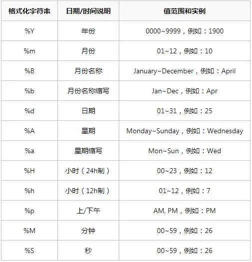

Python 时间函数
<a name="zc5De"></a>
## 两个函数的区别
strftime：将给定格式的日期时间对象转换为字符串。日期时间对象=>字符串，控制输出格式<br />strptime：将字符串解析为给定格式的日期时间对象。字符串=>日期时间对象，解析字符串

| <br /> | strftime | strptime |
| --- | --- | --- |
| 用法 | 日期时间对象=>字符串，控制输出格式 | 字符串=>日期时间对象，解析字符串 |
| 类型 | 实例方法 | 类方法 |
| 方法 | date; datetime; time | datetime |
| 用法 | `strftime(format)` | `strptime(date_string, format)` |
| 示例 | `datetime.datetime(2006,11,21,16,30)`  =>  '2006-11-21 16:30' | "21/11/06 16:30" => `datetime.datetime(2006, 11, 21, 16, 30)` |

<a name="WWQyF"></a>
## strftime函数
作用：将给定格式的日期时间对象转换为字符串。日期时间对象=>字符串，控制日期时间对象的输出格式，date、datetime、time对象都支持`strftime(format)` 方法，可用来创建由一个显式格式字符串所控制的表示时间的字符串。要获取格式指令的完整列表，查看文末列表。<br />用法：`datetime.strftime(format)`
```python
import datetime
dt=datetime.datetime(2006, 11, 21, 16, 30)
dt.strftime("%Y-%m-%d %H:%M")
'2006-11-21 16:30'

dt.strftime("%Y-%m-%d")
'2006-11-21'

dt.strftime("%A, %d. %B %Y %I:%M%p")
'Tuesday, 21. November 2006 04:30PM
```
<a name="ab2XZ"></a>
## strptime函数
作用：按照特定时间格式将字符串转换（解析）为时间类型。返回一个由显式格式字符串所指明的代表时间的字符串。要获取格式指令的完整列表，查看文末列表。<br />语法：`datetime.strptime(date_string, format)`
```python
import datetime
dt=datetime.datetime.strptime("21/11/06 16:30", "%d/%m/%y %H:%M")
print(dt)
2006-11-21 16:30:00
dt
datetime.datetime(2006, 11, 21, 16, 30)
```
`strftime`是转换为特定格式输出，而`strptime`是将一个（时间）字符串解析为时间的一个类型对象。一个是按照想要的格式，去转换。重点是格式！另外一个不管什么格式，只要把特定的时间字符串转成时间类型即可！虽然只是一个字母之差，但是意义和侧重点完全不一样！
<a name="y0lo3"></a>
## 格式指令完整列表
```python
%y    两位数的年份表示（00-99）
%Y    四位数的年份表示（000-9999）
%m   月份（01-12）
%d    月内中的一天（0-31）
%H   24小时制小时数（0-23）
%I    12小时制小时数（01-12）
%M  分钟数（00=59）
%S    秒（00-59）
%a    本地简化星期名称
%A   本地完整星期名称
%b   本地简化的月份名称
%B   本地完整的月份名称
%c   本地相应的日期表示和时间表示
%j    年内的一天（001-366）
%p   本地A.M.或P.M.的等价符
%U   一年中的星期数（00-53）星期天为星期的开始
%w   星期（0-6），星期天为星期的开始
%W   一年中的星期数（00-53）星期一为星期的开始
%x   本地相应的日期表示
%X   本地相应的时间表示
%Z   当前时区的名称
%%   %号本身
```

