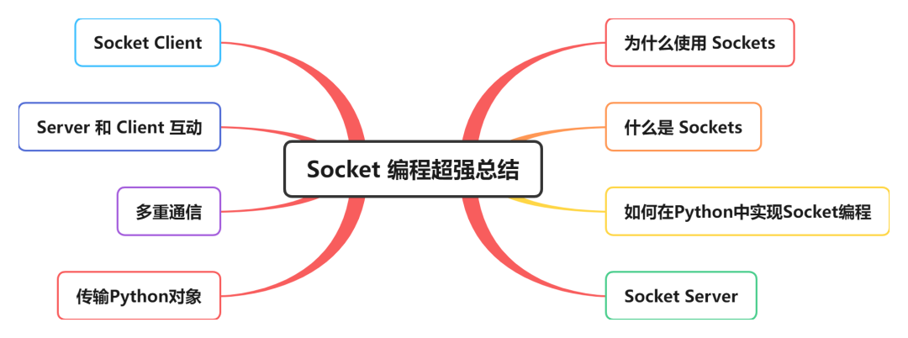
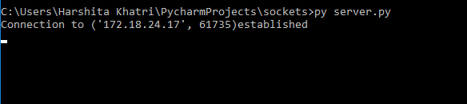
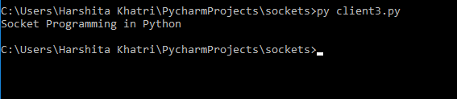
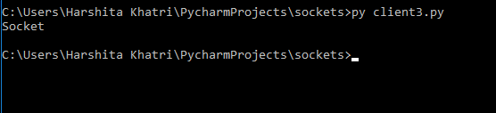
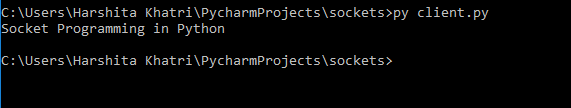
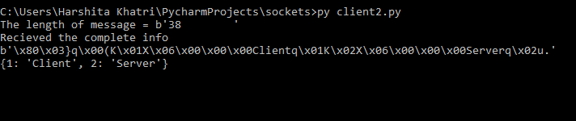

Python<br />在如今的互联网当中，Socket 协议是最重要的基础之一。本文涵盖了在 Python 中处理 Socket 编程的所有领域。<br />
<a name="SLMjR"></a>
## 为什么使用 Sockets
Sockets 是组成当今网络的各种通信协议，这些协议使得在两个不同的程序或设备之间传输信息成为可能。例如，当打开浏览器时，作为客户机就会创建与服务器的连接以传输信息。<br />在深入研究这个通信原理之前，先弄清楚 Sockets 到底是什么。
<a name="ApAfm"></a>
## 什么是 Sockets
一般来说，Socket 是为发送和接收数据而构建的内部应用协议。单个网络将有两个 Sockets，每个 Sockets 用于通信设备或程序，这些 Sockets 是IP地址和端口的组合。根据使用的端口号，单个设备可以有“n”个 Sockets，不同的端口可用于不同类型的协议。<br />下图展示了一些常见端口号和相关协议的信息：

| 协议 | 端口号 | Python 库 | 应用 |
| --- | --- | --- | --- |
| HTTP | 80 | httplib，urllib，requests | 网页，网站 |
| FTP | 20 | ftplib | 文件传输 |
| NNTP | 119 | nttplib | 新闻传输 |
| SMTP | 25 | smtplib | 发送邮件 |
| Telnet | 23 | telnetlib | 命令行 |
| POP3 | 110 | poplib | 接收邮件 |
| Gopher | 70 | gopherlib | 文档传输 |

现在已经了解了 Sockets 的概念，现在来看看 Python 的 Socket 模块
<a name="DPTmk"></a>
## 如何在 Python 中实现 Socket 编程
要在 Python 中实现 Socket 编程，需要导入 socket 模块。<br />该模块的一些重要方法如下：

| 方法 | 描述 |
| --- | --- |
| `socket.socket()` | 用于创建 socket（服务器端和客户端都需要创建） |
| `socket.accept()` | 用于接受连接。它返回一对值（conn，address），其中conn是用于发送或接收数据的新 socket 对象，address是连接另一端的 socket 地址 |
| `socket.bind()` | 用于绑定到指定为参数的地址 |
| `socket.close()` | 用于关闭 socket |
| `socket.connect()` | 用于连接到指定为参数的远程地址 |
| `socket.listen()` | 使服务器能够接受连接 |

现在已经了解了 socket 模块的重要性，接下来看看如何在 Python 中建服务器和客户机。
<a name="LOBCj"></a>
## 什么是服务器
服务器或者是一个程序、一台计算机，或者是一台专门用于管理网络资源的设备。服务器可以位于同一设备或计算机上，也可以本地连接到其他设备和计算机，甚至可以远程连接。有各种类型的服务器，如数据库服务器、网络服务器、打印服务器等。<br />服务器通常使用`socket.socket()`，`socket.bind()`，`socket.listen()`等来建立连接并绑定到客户端，现在编写一个程序来创建服务器。
```python
import socket
s=socket.socket(socket.AF_INET, socket.SOCK_STREAM)
s.bind((socket.gethostname(),1234))          
#port number can be anything between 0-65535(we usually specify non-previleged ports which are > 1023)
s.listen(5)
 
while True:
    clt,adr=s.accept()
    print(f"Connection to {adr}established")  
    #f string is literal string prefixed with f which 
    #contains python expressions inside braces
    clt.send(bytes("Socket Programming in Python","utf-8 ")) #to send info to clientsocket
```
创建 socket 的第一个必要条件是导入相关模块。之后是使用`socket.socket()`方法创建服务器端 socket。
> AF_INET 是指来自 Internet 的地址，它需要一对（主机、端口），其中主机可以是某个特定网站的 URL 或其地址，端口号为整数。SOCK_STREAM 用于创建 TCP 协议。

`bind()`方法接受两个参数作为元组（主机、端口）。这里需要注意的是最好使用4位的端口号，因为较低的端口号通常被占用或者是系统预留的。`listen()`方法允许服务器接受连接，5是同时接受的多个连接的队列。此处可以指定的最小值为0，如果未指定参数，则采用默认的合适参数。<br />`while`循环允许永远接受连接，`clt`和`adr`是客户端对象和地址，`print`语句只是打印出客户端 socket 的地址和端口号，最后，`clt.send`用于以字节为单位发送数据。<br />现在服务器已经设置好了，继续向客户机前进。
<a name="SdTj4"></a>
## 什么是客户端
客户端是从服务器接收信息或服务的计算机或软件。在客户端-服务器模型中，客户端从服务器请求服务。最好的例子是 Google Chrome、Firefox 等 Web 浏览器，这些 Web 浏览器根据用户的指示请求 Web 服务器提供所需的网页和服务。其他示例包括在线游戏、在线聊天等。<br />现在，看看如何用 Python 编程语言编写客户端程序：
```python
import socket
s=socket.socket(socket.AF_INET, socket.SOCK_STREAM)
s.connect((socket.gethostname(), 2346))
msg=s.recv(1024)
print(msg.decode("utf-8"))
```
首先依然是导入 socket 模块，然后像创建服务器时那样创建套接字。接着要在客户端服务器之间创建连接，需要通过指定（host，port）使用 `connect()`方法。
> 注意：当客户端和服务器位于同一台计算机上时，需要使用gethostname。（LAN–localip/WAN–publicip）

在这里，客户端希望从服务器接收一些信息，为此，需要使用`recv()`方法，信息存储在另一个变量msg中。需要注意的是正在传递的信息将以字节为单位，在上述程序的客户端中，一次传输最多可以接收1024字节（缓冲区大小）。根据传输的信息量，可以将其指定为任意数量。<br />最后，再解码并打印正在传输的消息。<br />现在已经了解了如何创建客户端-服务器程序，接下来看看它们需要如何执行。
<a name="bn6nc"></a>
## 客户端服务器交互
要执行这些程序，需要打开命令程序，进入创建客户端和服务器程序的文件夹，然后键入：
```bash
py server.py #这里，server.py 是服务器的文件名
```
不出意外服务器开始运行<br /><br />要执行客户端，需要打开另一个cmd窗口，然后键入：
```bash
py client.py
```
<br />下面将缓冲区大小减少到7，来看看相同的程序会怎么样<br /><br />如图所示，传输7个字节后，连接终止。<br />其实这是一个问题，因为尚未收到完整的信息，但是连接却提前关闭了，下面来解决这个问题。
<a name="tokc3"></a>
## 多重通信
为了在客户端收到完整信息之前继续连接，可以使用while循环
```python
import socket
s=socket.socket(socket.AF_INET, socket.SOCK_STREAM)
s.connect((socket.gethostname(), 2346))
while True:
    msg=s.recv(7)
	print(msg.decode("utf-8"))
```
如此修改之后，每次传输将以7个字节接收完整消息。<br />但这又引来了另一个问题，连接永远不会终止，永远不知道什么时候会终止。此外，如果实际上不知道客户端将从服务器接收到的消息或信息有多大，该怎么办。在这种情况下，需要继续完善代码
```python
complete_info=''
while True:
    msg = s.recv(7)  
    if len(msg)<=0:
        break
    complete_info += msg.decode("utf-8")
print(complete_info)
```
在服务器端，使用`close()`方法，如下所示：
```python
clt.close()
```
输出如下<br /><br />程序会检查信息的大小，并将其打印到一次两个字节的缓冲区中，然后在完成连接后关闭连接。
<a name="uZME0"></a>
## 传输 Python 对象
目前为止仅仅掌握了传递字符串的方法，但是，Python 中的 Socket 编程也允许传输 Python 对象。这些对象可以是集合、元组、字典等。要实现这一点，需要用到 Python 的 pickle 模块。
<a name="b1Twl"></a>
### Python pickle模块
实际序列化或反序列化 Python 中的对象时，就会使用到 Python pickle 模块。看一个小例子
```python
import pickle

mylist=[1,2,'abc']
mymsg = pickle.dumps(mylist) 
print(mymsg)
```
Output:
```
b’x80x03]qx00(Kx01Kx02Xx03x00x00x00abcqx01e.’
```
在上面的程序中，mylist是使用pickle模块的`dumps()`函数序列化的。还要注意，输出以b开头，表示它已转换为字节。在 socket 编程中，可以实现此模块以在客户端和服务器之间传输 python 对象。
<a name="jCMvR"></a>
### 如何使用 pickle 模块传输 Python 对象
将 pickle 与 socket 一起使用时，完全可以通过网络传输任何内容。<br />先来看看服务端代码<br />Server-Side:
```python
import socket
import pickle
 
a=10
s=socket.socket(socket.AF_INET, socket.SOCK_STREAM)
s.bind((socket.gethostname(), 2133))        #binding tuple
s.listen(5)
while True:
    clt , adr = s.accept()
    print(f"Connection to {adr}established")
 
    m={1:"Client", 2:"Server"}
    mymsg = pickle.dumps(m)  #the msg we want to print later
    mymsg = {len(mymsg):{a}}"utf-8") + mymsg
    clt.send(mymsg)
```
这里，m是一个字典，它基本上是一个需要从服务器发送到客户端的 Python 对象。这是通过首先使用`dumps()`序列化对象，然后将其转换为字节来完成的。<br />现在，记下客户端：<br />Client-Side:
```python
import socket
import pickle
a=10
s=socket.socket(socket.AF_INET, socket.SOCK_STREAM)
s.connect((socket.gethostname(), 2133))
 
while True:
    complete_info = b''
    rec_msg = True
    while True:
        mymsg = s.recv(10)
       if rec_msg:
            print(f"The length of message = {mymsg[:a]}")
            x = int (mymsg[:a ] )
            rec_msg = False
            complete_info += mymsg
            if len(complete_info)-a == x:
            print("Recieved the complete info")
            print(complete_info[a:])
            m = pickle.loads(complete_info[a:])
            print(m)
            rec_msg = True
complete_info = b''
print(complete_info)
```
第一个`while`循环将帮助我们跟踪完整的消息（complete_info）以及正在使用缓冲区接收的消息（rec_msg）。<br />然后，在接收消息时，所做的就是打印每一位消息，并将其放在大小为10的缓冲区中接收。此大小可以是任何大小，具体取决于个人选择。<br />然后如果收到的消息等于完整消息，只会将消息打印为收到的完整信息，然后使用`loads()`反序列化消息。<br />输出如下：<br />
