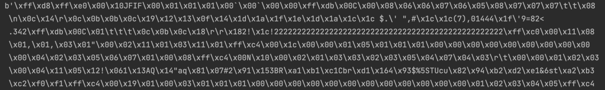
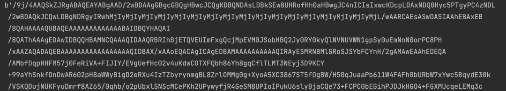
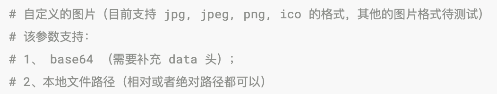

Python<br />在使用某个网站、在使用QQ、微信等社交工具的时候应该都经常的会更换自己的头像，那么大家都没有想过，上传的图片在服务器是以什么样的形式存在的，很多的网站、甚至QQ、微信等社交工具都会把上传的图片以**base64**的形式存储，那么base64究竟是一个什么东西呢？

<a name="Q0gre"></a>
### **概念**
base64是一组相似的二进制到文本（binary-to-text）的编码规则，使得二进制数据在解释成 radix-64 的表现形式后能够用 ASCII 字符串的格式表示出来。<br />知道这个概念之后，再来使用base64就会很简单。
<a name="o47sf"></a>
### **进入正题**
来了解下Python中的base64模块是如何将图片等文件转换成base64的。<br />base64模块提供了将**二进制数据**编码为可打印的ASCII字符以及将这种编码格式解码回二进制数据的函数。目前，它能够为Base16，Base32和Base64算法及已成为事实标准的ASCII85和Base85编码格式提供了编码和解码函数。<br />上述编码格式适用于编码二进制数据使得它能安全地通过电子邮件发送、用作 URL 的一部分，或者包括在 HTTP POST 请求之中。
<a name="uPxkV"></a>
### **举个例子**
本地有这样一张名为photo1.jpeg的表情包，要将它 👇👇👇转换成base64的形式。<br />首先应该将图片读取出来，图片读取出来以后正好是**二进制数据**编码。
```python
with open('./photo1.jpeg', 'rb') as f:
    result1 = f.read()
    print(result1)
```
二进制数据是这个样子的：<br /><br />二进制数据有了，再转换base64就很简单了，base64模块提供了一个b64encode**方法，它能够将**bytes-like object**（字节类对象：字节类对象可在多种二进制数据操作中使用）进行base64编码并返回编码后的**bytes。
```python
import base64

b1 = base64.b64encode(result1)
print(b1)
```
下方所示就是base64编码后的结果，这个时候一张图片就正确的被转成了base64的形式。<br /><br />不知道大家有没有使用过pyecharts这个模块，这个模块能够绘制出各式各样的图表，包括柱状图、条形图、饼图、地图、词云图等等，其中画词云图可以自定义图片，但是其官方文档中有这样一条要求：<br />它要求要给base64形式的图片补充data头，那么data头又是什么？继续看。<br />
<a name="Zi5wY"></a>
### 显示base64编码的图片
pyecharts的词云图在使用了这个图片之后，一定是会再将这张图片显示出来，并且pyecharts画的图默认是以网页的形式显示的（知道为什么它可以交互了吧！）。<br />在编写 HTML 网页时，对于一些简单图片，通常会选择将图片内容直接内嵌在网页中，从而减少不必要的网络请求，但是图片数据是二进制数据，该怎么嵌入呢？绝大多数现代浏览器都支持一种名为Data URLs的特性，允许使用base64对图片或其他文件的二进制数据进行编码，将其作为文本字符串嵌入网页中。<br />**Data URLs**由四部分组成：前缀（data:）、指示数据类型的 MIME 类型、如果非文本则为可选的base64标记、数据本身。
> data:[<mediatype>][;base64],<data>

mediatype是个 MIME 类型的字符串，例如 "image/jpeg" 表示 JPEG 图像文件。如果被省略，则默认值为 `text/plain;charset=US-ASCII`。如果数据是文本类型，可以直接将文本嵌入（根据文档类型，使用合适的实体字符或转义字符）。如果是二进制数据，可以将数据进行 base64 编码之后再进行嵌入。<br />例如一开始的那张图片，就可以写成如下形式：
> data:image/jpeg;base64,/9j/4AAQSkZJRgABAQEAYABgAAD/2wBDAAgGBgcGBQgHBwcJCQgKDBQN......

但是要注意，上述**Data URLs**不能手动拼接，需要使用代码进行转换之后再拼接！<br />Data URLs是一个字符串类型，所以可以将图片的base64形式转成字符串
```python
# 使用decode方法进行解码转换成字符串
s1 = b1.decode()
s2 = 'data:image/jpeg;base64,'
result1 = s2 + s1
```
这个时候，上方所示Data URLs就被使用代码拼接出来了。<br />既然把图片转换成了base64，那么如何再将base64转为图片？
<a name="RgsuP"></a>
### **base64转图片**
base64模块提供了一个b64decode**方法，它可以解码base64编码过的**bytes-like object**或**ASCII字符串并返回解码后的bytes。
```python
import base64

result2 = base64.decode(base64.b64encode(result1))
# 也就是说上方代码看似发生了变化，实则没有任何变化：result2 == result1
# result1是图片的二进制数据，result2也是，然后再将result2的数据写入文件即可得到原来的图片。
```
<a name="roB2C"></a>
### **总结**
base64是一种数据编码方式，目的是为了保障数据的安全传输。但标准的base64编码无需额外的信息，即可以进行解码，是完全可逆的。因此在涉及传输私密数据时，并不能直接使用 base64 编码，而是要使用专门的对称或非对称加密算法。
