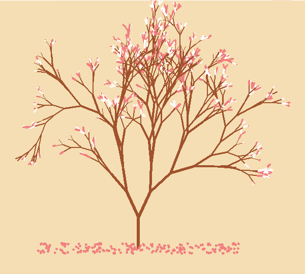
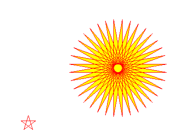
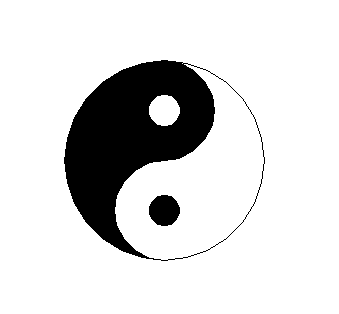
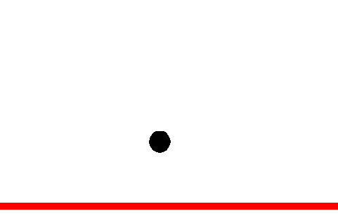
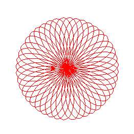
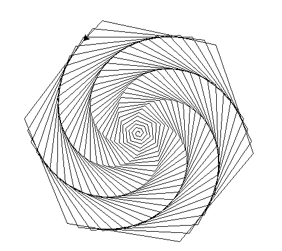
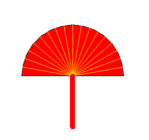

Python 可视化
<a name="JGu30"></a>
## 1、什么是turtle
turtle又称为海龟绘图，是Wally Feurzeig，Seymour Papert 和 Cynthia Solomon 于 1967 年所创造的 Logo 编程语言的Python实现。turtle是基于tkinter图形界面设计的。<br />turtle模拟了人在画布前画画的过程：给你一支笔（Pen）， 下笔（pendown），移动画笔绘制图形，然后填色等等。turtle提供了几种简单的命令，通过组合他们的顺序，只要够耐心，turtle可以画出令人惊叹的作品，很适合用来引导小朋友学习编程。<br />先来感受下作品：<br />
<a name="EgOb7"></a>
## 2、turtle例子
通过一个简单的例子来了解`turtle`的基本操作
```python
import turtle

# screen 画布属性设置
canvas = turtle.Screen()
canvas.bgcolor("white")

# 画笔设置
pen = turtle.Pen()
pen.hideturtle()
pen.color('red', 'yellow')

# 开始画第一个部分，并填充颜色
pen.begin_fill()
while True:
    pen.forward(200)
    pen.left(170)
    if abs(pen.pos()) < 1:
        break
pen.end_fill()

# 提笔， 移动位置，画第二个部分
pen.penup()
pen.goto(-100, -100)
pen.pendown()

for i in range(5):
    pen.forward(30) #长度300像素
    pen.right(144) #转角144度

turtle.done()
```
<br />从上面可知turtle有两个部分组成画笔`Turtle` 和 画布`Screen`，`Turtle`在`Screen`上移动来作画。<br />需要注意的是，`turtle`起始的位置是`(0, 0)`，位于画布中心，左边和下边的坐标为负值。<br />画笔`Turtle`重要操作：

- 画笔申明：如果画笔上有很多画笔需要 申明 `turtle.Pen()`，否则 默认是一个画笔，无需申明，如`turtle.forward(50)`就是表示画笔向前移动50
- 画笔颜色：`color('red', 'yellow')`， 第一个red表示画笔颜色， `yellow`表示填充颜色
- 填充的范围：`begin_fill()`和`end_fill()`之间的部分
- 画笔的移动：`forward`是向前多少距离，`left`是向左角度， 与之对应的是向后`backward` 和向右`right`。`goto()`是移动到某个坐标值
- 画笔的当前属性：如位置`pos()`即海龟当前的坐标 `(x,y)` ，还有如朝向角度值：`heading()`
- 画笔的控制：`penup`和`pendown`，默认画笔是在`pendown`状态下，只要有移动就会在画布上画出图形，如果需要调整位置，在另外一个位置下笔，需要先`penup`，否则移动画笔时也会有线条出来。这个和现实中画画是一样的。
- 画笔的可见性：正常情况下画笔时一个箭头的形状，可以通过`hideturtle()`和`showturtle()`隐藏和显示画笔

Screen重要操作：

- 设置背景颜色：`bgcolor("white")`
<a name="z9BGj"></a>
## 3、其他turtle功能
除了上面例子中涉及到turtle常用功能函数，还有一些重要的功能。

- 圆形`circle()` 前面的例子给出的是直线的例子（直线可以构成三角形，多边形等），另外一个重要的图形是圆形`turtle.circle(radius, extent=None, steps=None)`来看一个太极的例子：
```python
import turtle
from turtle import *  #从turtle中导出所有模块
radius = 100     #半径为100
color("black", "black")  #画线颜色黑色，填充颜色黑色
begin_fill()  #开始填充
circle(radius/2, 180)  #逆时针画圈，半径为50,180°
circle(radius, 180)  #逆时针画圈，半径为100,180°
left(180)  #转向180°
circle(-radius/2, 180)  #顺时针画圈，半径50,180°
end_fill()  #填充结束
#移动到画太极图黑色的小圈位置，开始画小白圈
left(90)#左转向90°，海龟头垂直水平线向上
penup()#提笔，不留痕迹
forward(radius*0.35)#向前，半径的0.35=35像素
right(90)#右转向90°，海龟头与右侧水平线同向
pendown()#落笔，开始画线
#开始画太极图黑色部分的小白圈
color("white", "white")#画线颜色为白色，填充颜色为白色
begin_fill()#开始填充
circle(radius*0.15)#逆时针画圈，半径的0.15=15像素（35+15+15+35=100）
end_fill() #填充结束

left(90)#左转向90°
penup()#提笔，不留痕迹
backward(radius*0.7)#后退往下走，为半径的0.7=70，此时海龟头朝上与水平垂直
pendown()#落笔，开始留下痕迹
left(90)#左转90°，此时海龟头与左侧水平同向
#开始画太极图白色部分里的小黑圈
color("black", "black")#画线颜色为黑色，填充为黑色
begin_fill()#开始填充
circle(radius*0.15)#开始逆时针画圈，半径的0.15=15个像素
end_fill() #填充完毕

right(90)#再右转90°，此时海龟头垂直水平线向上
penup()#提笔，不留痕迹
backward(radius*0.65)#后退为半径的0.65=65个像素，往下到达太极图黑色半圈的底点处
right(90)#右转90°，海龟头与右侧水平线同向
pendown()#落笔，开始留下痕迹
circle(radius, 180)#逆时针画圈，半径100,180°，画太极图的白色部分的大圈
hideturtle()#隐藏笔头hideturtle
turtle.done()
```

   - `radius`：半径， radius 为正值则朝逆时针方向绘制圆弧，否则朝顺时针方向
   - `extent`：表示是否画部分的圆，如半圆是180，默认是一整个圆
   - `steps`：是表示画圆用多少个多边形来画。圆其实是无穷多个多边形来近似得到。不过一般情况下，一定程度的多边形，肉眼就会人为圆的幅度是光滑的

<br />可以看出太极图有2个小半圆和2个大半圆，以及2个更小的整圆构成。

- 动画控制 `turtle`绘制图像的过程其实是动态的，每绘制一个部分画面可以理解为一个视频帧，画完视频就结束。所以`turtle`除了可以绘制图形，还可以用来做动画演示或者交互游戏也是可以。下面以一个例子说明下: 
```python
import turtle, time
# 初始不更新画面
turtle.tracer(0)

# 地板墙
wall = turtle.Pen()
wall.pencolor('red')
wall.pensize(10)
wall.hideturtle()
wall.penup()
wall.goto(-300, -200)
wall.pendown()
wall.forward(600)

# 小球
R = 15
ball = turtle.Turtle('circle')
ball.shapesize(R / 10)
ball.penup()
pos_x, pos_y = [100, 100]
pos_x, pos_y = ball.pos()
ball.goto(pos_x, pos_y)
wall_x, wall_y = wall.pos()

# 球参数
FPS = 60  # 每秒60帧
G = 0.03  # 模拟重力加速度
DRAG = 0.9956 # 阻力
v_y = 1 # 初始速度

while True:
    # 清除印章
    ball.clearstamps()

    v_y += G  # 模拟重力加速度
    if pos_y - R - 10 < wall_y:  # 撞地面
        v_y *= -1

        pos_x, pos_y = pos_x, pos_y - v_y
        ball.goto(pos_x, pos_y)
        v_y = v_y * DRAG

        # 通过印章显示球
        ball.stamp()

        # 更新画面信息
        turtle.update()
        time.sleep(1 / FPS)
```

<a name="BBHl9"></a>
## 4、更多的例子
<a name="vIZPT"></a>
### 玫瑰曲线
```python
from turtle import *
from math import *
color("red")
def draw(a,end):
    t=0
    while t<(14*end):
        x=a*sin(t*3.14)*cos(t)
        y=a*sin(t*3.14)*sin(t)
        goto(x,y)
        t=t+0.03

draw(100,3.14)
done()
```

<a name="CA2uE"></a>
### 螺旋
```python
import turtle
t=turtle.Pen()
for x in range(360):
    t.forward(x)
    t.left(59)

done()
```

<a name="P7xtO"></a>
### 扇子
```python
from turtle import *
forward(200)
left(90)
fillcolor('red')
begin_fill()
circle(100,180)
end_fill()
left(90)
forward(100)
for i in range(17):
    left(10)
    pencolor('yellow')
    forward(100)
    backward(100)
left(100)
pensize(10)
pencolor('red')
forward(100)
hideturtle()
done()
```

<a name="B7gnv"></a>
## 5、总结
Python的logo语言`turtle`库，可以绘制图画和动画。总结如下：

- `turtle`两个重要元素：画布`Screen`和画笔`Turtle`
- 默认当前为一个画笔，`turtle.Pen()`申明多个画笔
- 画笔属性：颜色`color`， 大小`pensize`，位置`pos`
- 画笔填充：`begin_fill()`和`end_fill()`
- 画笔移动：前后`forward`和`backward`， 角度`left`和`right`
- 圆形画笔：`circle`
- 画笔控制：`penup` 和`pendown`
- 动画控制：`update`和`trace`追踪
<a name="YOwSg"></a>
## 6、参考资料
[https://docs.python.org/zh-cn/3/library/turtle.html#](https://docs.python.org/zh-cn/3/library/turtle.html#)
