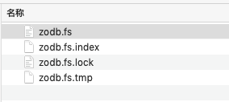

Python
<a name="vTgoP"></a>
### 关系型数据库
使用关系型数据库，一定要先创建/定义一张表，写入读取必须使用约定的sql语句。<br />最常见的类型，但是使用相对死板，最主要的是存不了Python的对象。
<a name="VC2T3"></a>
### 非关系型数据库
NoSQL已经没有了表的概念，所以无须建表就能使用。<br />例如利用Python操作MongoDB时，可以直接将Python的字典写入数据库，操作起来也非常方便，但是也只是对字典类型比较友好。
<a name="bi97T"></a>
### 对象数据库
顾名思义，能存储\读取对象的数据库，如果需要存储一些对象信息（持久化），使用这个就对了。<br />下文将分享一个比较轻型对象数据库，它不用安全任何软件，开盒即用。
:::danger
pickle模块只可以对python对象进行序列化操作，序列化到文件中，所以它不能称之为对象数据库，它只是一个序列化工具。
:::
<a name="HcYaL"></a>
## zodb模块的使用
<a name="Pvl0Q"></a>
### 安装
```bash
pip install zodb
```
<a name="RUWhP"></a>
### 创建数据库
zodb有两种方式创建数据库实例，一种是直接将数据存到硬盘中，另一种方式是将数据进行缓存（存入内存空间）。
<a name="UXsEH"></a>
#### 存进文件
```python
import ZODB, ZODB.FileStorage

storage = ZODB.FileStorage.FileStorage('zodb.fs')
db = ZODB.DB(storage)
```
<a name="HxTfM"></a>
#### 存进内存
```python
import ZODB

db = ZODB.DB(None)
```
如果选择存入本地文件，运行目录下会生成相关的文件：<br />
<a name="z7kSR"></a>
### 连接数据库
```python
connection = db.open()
```
<a name="E3ga2"></a>
### 写入数据
**「需要**`**transaction**`**模块来处理提交事务。」**
```python
import transaction
import ZODB, ZODB.FileStorage

storage = ZODB.FileStorage.FileStorage('zodb.fs')
db = ZODB.DB(storage)

connection = db.open()
root = connection.root()
# 写入数据库
root['person_info'] = {"name":"maishu","age":18,"hobbies":"coding"}
# 提交事务
transaction.commit()
# 关闭数据库连接
db.close()
```
这个操作是不是和对字典的操作很像？
<a name="UIePD"></a>
### 读取数据
把上一步存入的字典类型的数据取出：
```python
import ZODB, ZODB.FileStorage

storage = ZODB.FileStorage.FileStorage('zodb.fs')
db = ZODB.DB(storage)

connection = db.open()
root = connection.root()

print(root['person_info'])
```
运行结果：
```
{'name': 'maishu', 'age': 18, 'hobbies': 'coding'}
```
输入单单存个字典、字符串、数值... 那这个库也没啥好讲了...<br />下面看如何把对象实例存入zodb。<br />**「存储自定义类的创建的对象，必须继承**`**persistent.Persistent**`**」**
<a name="z0omG"></a>
### 存储自定义类创建的对象
先定义一个类并继承`persistent.Persistent`：
```python
import persistent

class PersonInfo(persistent.Persistent):

    def __init__(self, name):
        self.name = name

    def eat(self, food):
        print(f"吃{food}。")

    def wear(self, clothes):
        print(f"穿{clothes}。")
```
<a name="juho4"></a>
### 存入、读取对象
```python
import transaction
import ZODB, ZODB.FileStorage

storage = ZODB.FileStorage.FileStorage('zodb.fs')
db = ZODB.DB(storage)

def write_data(db_instance):
    connection = db_instance.open()
    root = connection.root()
    person_info = PersonInfo("maishu")
    person_info.eat("Banana")
    root["1"] = person_info
    transaction.commit()
    db.close()
    print("写入成功！")

def read_data():
    storage = ZODB.FileStorage.FileStorage('zodb.fs')
    db = ZODB.DB(storage)
    connection = db.open()
    root = connection.root()
    return root["1"]
```
完整代码：
```python
import persistent
import transaction
import ZODB, ZODB.FileStorage

storage = ZODB.FileStorage.FileStorage('zodb.fs')
db = ZODB.DB(storage)

class PersonInfo(persistent.Persistent):

    def __init__(self, name):
        self.name = name

    def eat(self, food):
        print(f"吃{food}。")

    def wear(self, clothes):
        print(f"穿{clothes}。")

def write_data(db_instance):
    connection = db_instance.open()
    root = connection.root()
    person_info = PersonInfo("maishu")
    person_info.eat("Banana")
    root["1"] = person_info
    transaction.commit()
    db.close()
    print("写入成功！")

def read_data():
    storage = ZODB.FileStorage.FileStorage('zodb.fs')
    db = ZODB.DB(storage)
    connection = db.open()
    root = connection.root()
    return root["1"]

write_data(db)
print(read_data().name)
```
执行结果：
```
吃Banana。
写入成功！
maishu
```
存好对象之后，用的时候拿就好了，对象多的情况就不用次次实例化。<br />如果一个类继承了`persistent.Persistent`，那么在定义属性时就要注意，对于**「可变类型对象」**要特殊处理
```python
class Employee(Persistent):

    def __init__(self):
        self.tasks = []
```
特殊处理后：
```python
import persistent.list

class Employee(Persistent):

    def __init__(self):
        self.tasks = persistent.list.PersistentList()
```
<a name="K9Fpm"></a>
## 后记
这个轻量型的数据库非常好用，在一些数据量不大的情况下会使用这个模块实现存储。<br />但是如果数据量较大的话，还是老老实实用回主流的数据库吧。
