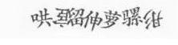

爬虫是 Python 的一个常见应用场景，很多练习项目就是让大家去爬某某网站。爬取网页的时候，大概率会碰到一些反爬措施。这种情况下，该如何应对呢？本文梳理了常见的反爬措施和应对方案。

<a name="Cz47h"></a>
## 1、通过User-Agent来控制访问
无论是浏览器还是爬虫程序，在向服务器发起网络请求的时候，都会发过去一个头文件：headers，比如知乎的requests headers<br /><br />这里面的大多数的字段都是浏览器向服务表明身份用的<br />对于爬虫程序来说，最需要注意的字段就是：User-Agent<br />很多网站都会建立user-agent白名单，只有属于正常范围的user-agent才能够正常访问。
<a name="wtznt"></a>
### 解决方法：
可以自己设置一下user-agent，或者更好的是，可以从一系列的user-agent里随机挑出一个符合标准的使用。图片<br />实现难度：★
<a name="ror3J"></a>
## 2、IP限制
如果一个固定的ip在短暂的时间内，快速大量的访问一个网站，后台管理员可以编写IP限制，不让该IP继续访问。
<a name="OkWvf"></a>
### 解决方法：
比较成熟的方式是：IP代理池<br /><br />简单的说，就是通过ip代理，从不同的ip进行访问，这样就不会被封掉ip了。<br />可是ip代理的获取本身就是一个很麻烦的事情，网上有免费和付费的，但是质量都层次不齐。如果是企业里需要的话，可以通过自己购买集群云服务来自建代理池。<br />实现难度：★
<a name="BaGKn"></a>
## 3、SESSION访问限制
后台统计登录用户的操作，比如短时间的点击事件，请求数据事件，与正常值比对，用于区分用户是否处理异常状态，如果是，则限制登录用户操作权限。<br />缺点：需要增加数据埋点功能，阈值设置不好，容易造成误操作。
<a name="WtFdg"></a>
### 解决方法：
注册多个账号、模拟正常操作。<br />实现难度：★★★
<a name="yHfTN"></a>
## 4、Spider Trap
蜘蛛陷阱导致网络爬虫进入无限循环之类的东西，这会浪费蜘蛛的资源，降低其生产力，并且在编写得不好的爬虫的情况下，可能导致程序崩溃。礼貌蜘蛛在不同主机之间交替请求，并且不会每隔几秒钟从同一服务器请求多次文档，这意味着“礼貌”网络爬虫比“不礼貌”爬虫的影响程度要小得多。<br />反爬方式：

- 创建无限深度的目录结构 HTTP：//example.com/bar/foo/bar/foo/bar/foo/bar /
- 动态页面，为网络爬虫生成无限数量的文档。如由算法生成杂乱的文章页面。
- 文档中填充了大量字符，使解析文档的词法分析器崩溃。

此外，带蜘蛛陷阱的网站通常都有robots.txt告诉机器人不要进入陷阱，因此合法的“礼貌”机器人不会陷入陷阱，而忽视robots.txt设置的“不礼貌”机器人会受到陷阱的影响。
<a name="qMwnC"></a>
### 解决方法
把网页按照所引用的css文件进行聚类，通过控制类里最大能包含的网页数量防止爬虫进入trap后出不来，对不含css的网页会给一个penalty，限制它能产生的链接数量。这个办法理论上不保证能避免爬虫陷入死循环，但是实际上这个方案工作得挺好，因为绝大多数网页都使用了css，动态网页更是如此。<br />缺点：反爬方式1，2会增加很多无用目录或文件，造成资源浪费，也对正常的SEO十分不友好，可能会被惩罚。<br />实现难度：★★★
<a name="RLpY2"></a>
## 5、验证码
验证码是一种区分用户是计算机还是人的公共全自动程序。可以防止：恶意破解密码、刷票、论坛灌水，有效防止某个黑客对某一个特定注册用户用特定程序暴力破解方式进行不断的登陆尝试，实际上用验证码是现在很多网站通行的方式.
<a name="HAST2"></a>
### 图片验证码：复杂型
<br />打码平台雇佣了人力，专门帮人识别验证码。识别完把结果传回去。总共的过程用不了几秒时间。这样的打码平台还有记忆功能。图片被识别为“锅铲”之后，那么下次这张图片再出现的时候，系统就直接判断它是“锅铲”。时间一长，图片验证码服务器里的图片就被标记完了，机器就能自动识别了。
<a name="gf7v3"></a>
### 图片验证码：简单型
<br />上面两个不用处理直接可以用OCR识别技术(利用python第三方库--esserocr)来识别。<br /><br />背景比较糊<br /><br />清晰可见<br />经过灰度变换和二值化后,由模糊的验证码背景变成清晰可见的验证码。<br /><br />容易迷惑人的图片验证码<br />对于在这种验证码，语言一般自带图形库，添加上扭曲就成了这个样子，可以利用9万张图片进行训练，完成类似人的精准度，到达识别验证码的效果<br />**短信验证码**用ebbrowser术，模拟用户打开短信的行为，最终获取短信验证码。
<a name="NTGGD"></a>
### 计算题图片验证码
<br />把所有可能出现的汉字都人工取出来，保存为黑白图片，把验证码按照字体颜色二值化，去除噪点，然后将所有图片依次与之进行像素对比，计算出相似值，找到最像的那张图片<br />**滑动验证码**<br /><br />对于滑动验证码，可以利用图片的像素作为线索，确定好基本属性值，查看位置的差值，对于差值超过基本属性值，就可以确定图片的大概位置。
<a name="CDTOl"></a>
### 图案验证码
<br />对于这种每次拖动的顺序不一样，结果就不一样，怎么做来识别呢?

- 利用机器学习所有的拖动顺序，利用1万张图片进行训练，完成类似人的操作，最终将其识别
- 利用selenium技术来模拟人的拖动顺序，穷尽所有拖动方式，这样达到是别的效果
<a name="LPA2N"></a>
### 标记倒立文字验证码
<br />不妨分析下：对于汉字而言，有中华五千年庞大的文字库，加上文字的不同字体、文字的扭曲和噪点，难度更大了。<br />方法：首先点击前两个倒立的文字，可确定7个文字的坐标， 验证码中7个汉字的位置是确定的，只需要提前确认每个字所在的坐标并将其放入列表中，然后人工确定倒立文字的文字序号，将列表中序号对应的坐标即可实现成功登录。
<a name="I2vUN"></a>
### 解决方法
接入第三方验证码平台，实时破解网站的验证码。<br />缺点：影响正常的用户体验操作，验证码越复杂，网站体验感越差。<br />实现难度：★★
<a name="W7BZa"></a>
## 6、通过robots.txt来限制爬虫
robots.txt（统一小写）是一种存放于网站根目录下的ASCII编码的文本文件，它通常告诉网络搜索引擎的漫游器（又称网络蜘蛛），此网站中的哪些内容是不应被搜索引擎的漫游器获取的，哪些是可以被漫游器获取的。<br />robots.txt协议并不是一个规范，而只是约定俗成的，所以并不能保证网站的隐私。注意robots.txt是用字符串比较来确定是否获取URL，所以目录末尾有与没有斜杠“/”表示的是不同的URL。<br /><br />缺点：只是一个君子协议，对于良好的爬虫比如搜索引擎有效果，对于有目的性的爬虫不起作用
<a name="EKexE"></a>
### 解决方法
如果使用scrapy框架，只需将settings文件里的ROBOTSTXT_OBEY设置值为 False<br />实现难度：★
<a name="JG3bP"></a>
## 7、数据动态加载
python的requests库只能爬取静态页面，爬取不了动态加载的页面。使用JS加载数据方式，能提高爬虫门槛。
<a name="NtOEB"></a>
### 解决方法
抓包获取数据url<br />通过抓包方式可以获取数据的请求url，再通过分析和更改url参数来进行数据的抓取。<br />示例：

- 看https://image.baidu.com这部分的包。可以看到，这部分包里面，search下面的那个 url和访问的地址完全是一样的，但是它的response却包含了js代码。


- 当在动物图片首页往下滑动页面，想看到更多的时候，更多的包出现了。从图片可以看到，下滑页面后得到的是一连串json数据。在data里面，可以看到thumbURL等字样。它的值是一个url。这个就是图片的链接。


- 打开一个浏览器页面，访问thumbURL="https://ss1.bdstatic.com/70cFvXSh_Q1YnxGkpoWK1HF6hhy/it/u=1968180540,4118301545&fm=27&gp=0.jpg" 发现搜索结果里的图片。
- 根据前面的分析，就可以知道，请求
```
URL="https://image.baidu.com/search/acjsontn=resultjson_com&ipn=rj&ct=201326592&is=&fp=result&queryWord=%E5%8A%A8%E7%89%A9%E5%9B%BE%E7%89%87&cl=2&lm=-1&ie=utf8&oe=utf8&adpicid=&st=-1&z=&ic=0&word=%E5%8A%A8%E7%89%A9%E5%9B%BE%E7%89%87&s=&se=&tab=&width=&height=&face=0&istype=2&qc=&nc=1&fr=&pn=30&rn=30&gsm=1e&1531038037275="
```
用浏览器访问这个链接确定他是公开的。

- 最后就可以寻找URL的规律，对URL进行构造便可获取所有照片。

使用selenium<br />通过使用selenium来实现模拟用户操作浏览器，然后结合BeautifulSoup等包来解析网页通过这种方法获取数据，简单，也比较直观，缺点是速度比较慢。<br />缺点：如果数据API没做加密处理，容易曝光接口，让爬虫用户更容易获取数据。<br />实现难度：★
<a name="gylSt"></a>
## 8、数据加密-使用加密算法
前端加密 通过对查询参数、user-agent、验证码、cookie等前端数据进行加密生成一串加密指令，将加密指令作为参数，再进行服务器数据请求。该加密参数为空或者错误，服务器都不对请求进行响应。<br />服务器端加密 在服务器端同样有一段加密逻辑，生成一串编码，与请求的编码进行匹配，匹配通过则会返回数据。
<a name="o131T"></a>
### 解决方法
JS加密破解方式，就是要找到JS的加密代码，然后使用第三方库js2py在Python中运行JS代码，从而得到相应的编码。<br />案例参考：[https://blog.csdn.net/lsh19950928/article/details/81585881](https://blog.csdn.net/lsh19950928/article/details/81585881)<br />缺点：加密算法明文写在JS里，爬虫用户还是可以分析出来。<br />实现难度：★★★
<a name="SzT50"></a>
## 9、数据加密-使用字体文件映射
服务器端根据字体映射文件先将客户端查询的数据进行变换再传回前端，前端根据字体文件进行逆向解密。<br />映射方式可以是数字乱序显示，这样爬虫可以爬取数据，但是数据是错误的。
<a name="uxvV1"></a>
### 解决办法
其实，如果能看懂JS代码，这样的方式还是很容易破解的，所以需要做以下几个操作来加大破解难度。

- 对JS加密
- 使用多个不同的字体文件，然后约定使用指定字体文件方式，比如时间戳取模，这样每次爬取到的数据映射方式都不一样，映射结果就不一样，极大提高了破解的难度。该种方式相比使用加密算法方式难度更高，因为加密算法是固定的几种，对方很容易获取并破解，而字体文件映射可以按任意规则映射，正常的数据使之错误显示，爬虫不容易察觉。

参考案例：[https://www.jianshu.com/p/f79d8e674768](https://www.jianshu.com/p/f79d8e674768)<br />缺点：需要生成字体文件，增加网站加载资源的体量。<br />实现难度：★★★★
<a name="G7O0h"></a>
## 10、非可视区域遮挡
此方式主要针对使用senlium进行的爬虫，如果模拟界面未进入可视区域，则对未见数据进行遮挡，防止senlium的`click()`操作。这种方式只能稍稍降低爬虫的爬取速度，并不能阻止继续进行数据爬取。<br />实现难度：★
