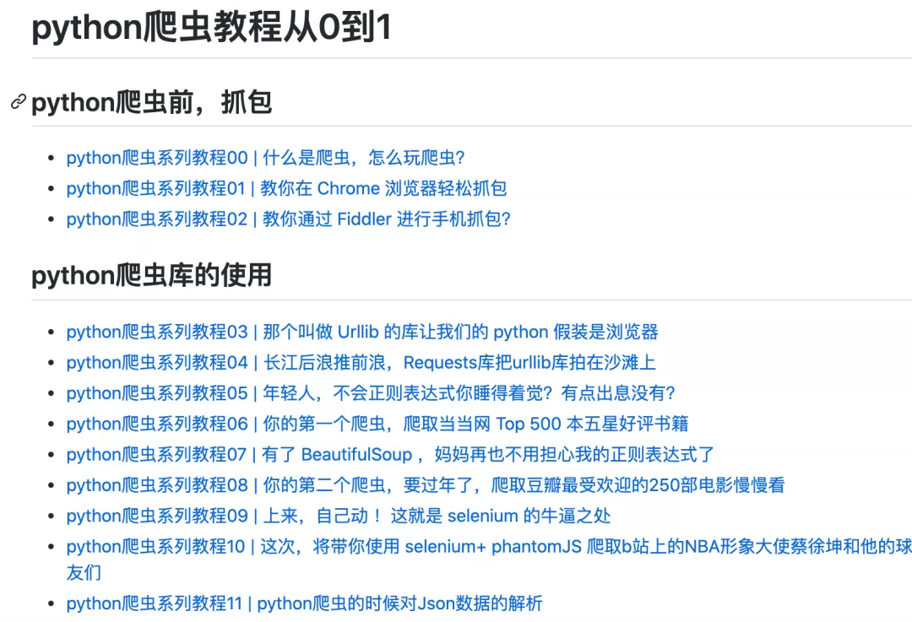
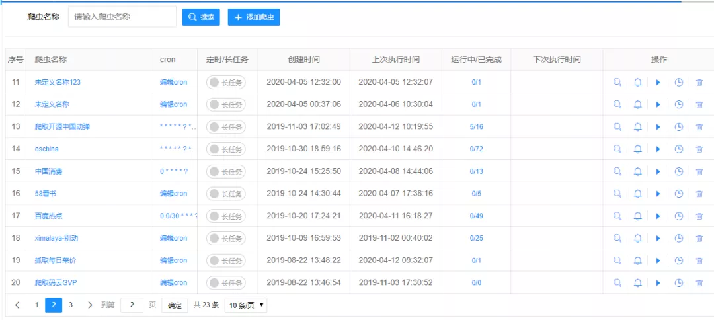
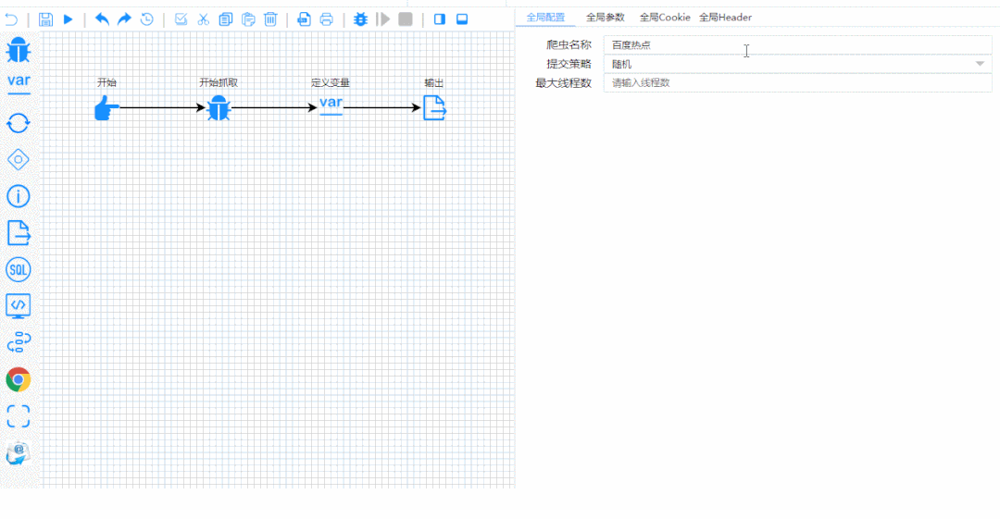
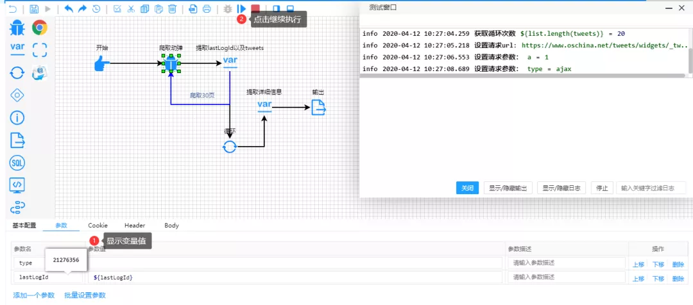
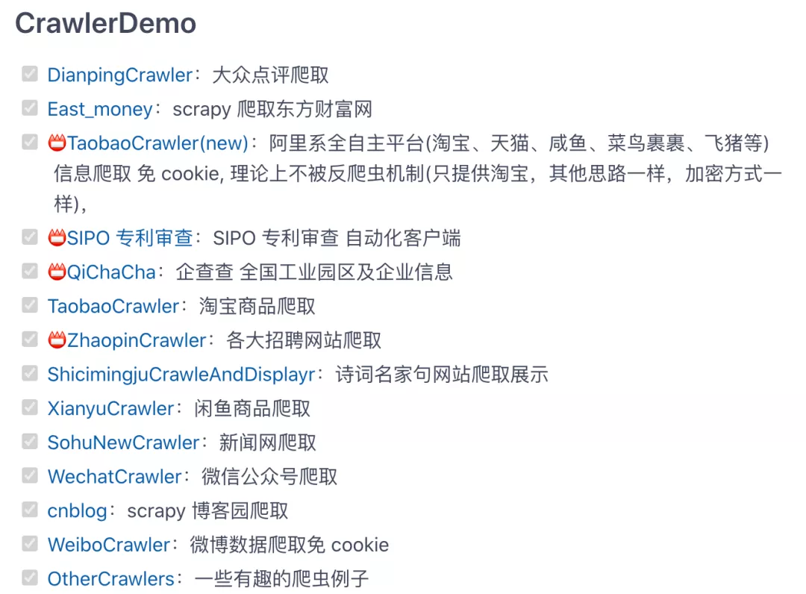

Python 爬虫

## 1、微博爬虫
这个开源项目程序可以持续爬取一个或多个新浪微博用户（如李文di、无疫烦）的数据，并将结果信息写入文件或数据库。写入信息几乎包括用户微博的所有数据，包括用户信息和微博信息两大类。 地址：[https://github.com/dataabc/weiboSpider](https://github.com/dataabc/weiboSpider) 爬取结果可写入文件和数据库，具体的写入文件类型如下：

- txt文件
- csv文件
- json文件
- MySQL数据库
- MongoDB数据库
- SQLite数据库

同时支持下载微博中的图片和视频，具体的可下载文件如下：

- 原创微博中的原始图片
- 转发微博中的原始图片
- 原创微博中的视频
- 转发微博中的视频
- 原创微博Live Photo中的视频
- 转发微博Live Photo中的视频

首先需要修改 config.json 文件，然后爬取，程序会自动生成一个 weibo 文件夹，以后爬取的所有微博都被存储在这里。 然后程序在该文件夹下生成一个名为"微博名字"的文件夹，明星的所有微博爬取结果都在这里。文件夹里包含一个csv文件、一个txt文件、一个json文件、一个img文件夹和一个video文件夹，img文件夹用来存储下载到的图片，video文件夹用来存储下载到的视频。如果设置了保存数据库功能，这些信息也会保存在数据库里，数据库设置见设置数据库部分。   

---

## 2、Python爬虫教程
Python爬虫教程系列、从 0 到 1 学习 Python 爬虫，包括浏览器抓包，手机 APP 抓包，如 fiddler、mitmproxy，各种爬虫涉及的模块的使用，如：requests、beautifulSoup、selenium、appium、scrapy 等，以及验证码识别，MySQL，MongoDB 数据库的 Python 使用，多线程多进程爬虫的使用，css 爬虫加密逆向破解，JS爬虫逆向，分布式爬虫，爬虫项目实战实例等。 地址：[https://github.com/wistbean/learn_python3_spider](https://github.com/wistbean/learn_python3_spider) 

---

## 3、爬虫集合
这个开源项目收集了各种爬虫 ，包括 Blibli、博客园、百度百科、北邮人、百度云网盘、Boss、贝壳、豆瓣、CSDN、抖音、GitHub、京东、知乎、拉钩、链家、微信公众号、网易云等等，能想到的国内外网站爬虫，都可以先来这里看看有没有开源的爬虫。 地址：[https://github.com/facert/awesome-spider](https://github.com/facert/awesome-spider)

---

## 4、智能爬虫平台
这个开源平台以流程图的方式定义爬虫，是一个高度灵活可配置的爬虫平台。可以在该平台配置各种爬虫。 地址：[https://gitee.com/ssssssss-team/spider-flow](https://gitee.com/ssssssss-team/spider-flow)  接下来以流程图的方式，开始配置一些变量和参数，点开始就能爬出想要的数据。  

---

## 5、Java爬虫
Spiderman 是一个Java开源Web数据抽取工具，它能够收集指定的Web页面并从这些页面中提取有用的数据。 Spiderman主要是运用了像XPath，正则表达式等这些技术来实数据抽取。 地址：[https://gitee.com/l-weiwei/spiderman](https://gitee.com/l-weiwei/spiderman)

---

## 6、爬虫大全
这个开源项目包含多种网站、电商数据爬虫。包含：淘宝商品、微信公众号、大众点评、招聘网站、闲鱼、阿里任务、scrapy博客园、微博、百度贴吧、豆瓣电影、包图网、全景网、豆瓣音乐、某省药监局、搜狐新闻、机器学习文本采集、fofa资产采集、汽车之家、国家统计局、百度关键词收录数、蜘蛛泛目录、今日头条、豆瓣影评️️️。 地址：[https://gitee.com/AJay13/ECommerceCrawlers](https://gitee.com/AJay13/ECommerceCrawlers) 
