爬虫动态代理IP<br />有爬虫经验的小伙伴，在对知名网站爬数据时，是否都遇到过IP限制速度等情况呢？来看看什么是动态代理Ip，以及实现一个简单的爬虫。

- **什么是动态代理IP**
- **动态代理的好处**
- **动态代理IP的类别**
- **申请获取代理ip**
- **使用代理IP**
- **使用代理ip简单爬下谷歌数据**
<a name="Iw1wK"></a>
## 1、什么是动态代理IP
动态代理IP，指访问目标网站服务器的代理IP是不断变化的。它可以隐藏真实IP，让彼此无法追踪，成功地脱离对方的限制；可以通过代理服务器，对一些外来访问者，特别是网站上的重要信息进行限制；很多本地网站会限制外地IP访问，动态代理IP则可以突破限制。<br />动态代理IP一般用于用户爬虫等
<a name="fszvw"></a>
## 2、动态代理IP的好处
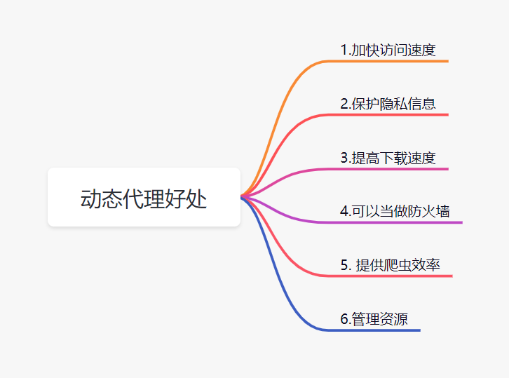

- **加快访问速度：一般情况，访问了某个网站后，代理服务器有缓存功能的。它会缓存浏览网站的信息，因此再次访问网站时，这些信息可以直接在代理服务中获取。**
- **保护隐私信息：高质量代理的IP对网络安全是有好处的。它可以保护电脑免受病毒的侵扰，尤其对于企业来说，可以有效地保护企业的内部信息，防止黑客攻击。**
- **提高下载速度：有些网站提供的下载资源，是会做一个IP一个线程的限制的，这时则可以使用代理IP突破下载限制。**
- **作为防火墙：代理服务器可以保护局域网的安全，起到防火墙的作用。它隔离内网与外网，提供监控网络和记录传输信息的功能，加强局域网的安全性。代理商还可以用来限制IP地址的封锁，禁止用户浏览某些页面。。**
- **提高爬虫的速率：因为很多网站会限制IP，以制约爬虫。而使用动态代理ip可以绕过目标网站限制，更好的抓取网络数据，比如可以自定义时间更换ip地址，提高爬虫效率。**
- **管理网络资源：可以限定一部分共享资源进到特殊的地区用户，维护资源的地区性**
<a name="YAhWn"></a>
## 3、动态代理IP的类别
按照**匿名度分类**的话，代理IP分为**高匿名代理IP、普通匿名代理IP、透明代理IP**三种。

- **高匿名代理IP：匿名度最高的代理IP，一般来说目标网站服务器无法识别出用户使用了代理；**
- **普通匿名代理IP：匿名度较低，目标网站服务器可以发现用户正在使用代理IP进行访问，往往会限制访问；**
- **透明代理IP：不能匿名访问，将会直接暴露用户终端的真实IP，存在着一定的风险。**

按**时效划分**的话，可将代理IP分为静态代理IP和动态代理IP。

- **静态代理IP：固定分配一个IP地址给你，每次都是固定的，**
- **动态代理IP：有时效性，时效过后会失效。动态代理IP又可以分为长期代理IP和短期代理IP，短期代理IP的时效一般从几秒到几分钟不等；长期代理IP的时效通常从几分钟到几天不等。**

按协议类型分类，代理IP分为http(s)代理IP和socks5代理IP。

- **http(s)代理IP同时支持http和https协议**
- **socks5代理则只是单纯的进行数据传输，对于协议类型没有要求。**
<a name="MDR5V"></a>
## 4、申请获取代理ip
接下来，讲讲怎样申请这个代理IP。这里使用的是IPIDEA这个网站：www.ipidea.net。<br />新用户注册成功后，是有赠送流量的，这些流量可以学习用：<br />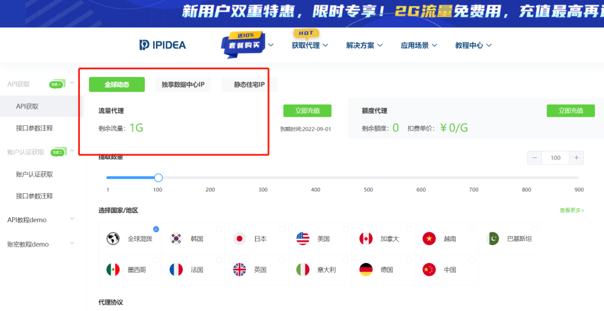<br />个人认证赠送500M，技术认证赠送1G，企业认证成功后赠送2G<br />直接点击注册就可以了：[https://www.ipidea.net/](https://www.ipidea.net/)<br />注册成功进入网站后，按这个步骤来：代理服务->API获取<br />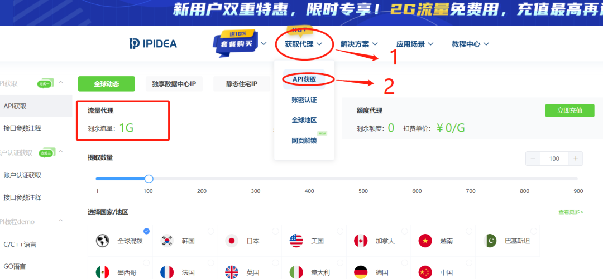<br />紧接着，可以自己选择国家地区、代理协议，数据格式。再然后点击下面的生成链接<br />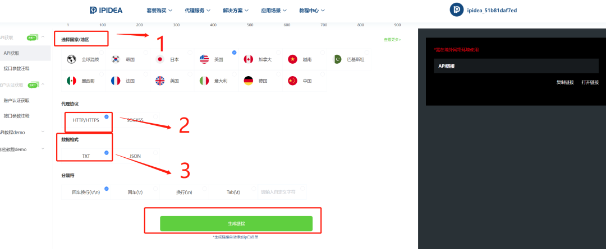<br />如果没有实名认证的话，去实名一下就好了。到这里呢，就拿到代理ip的api链接：<br />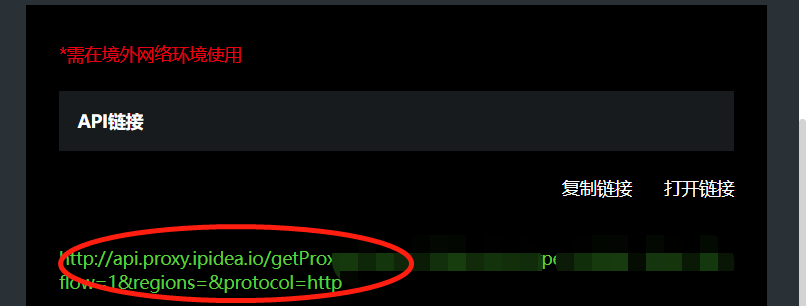<br />用浏览器访问下这个链接，就可以看到生成的代理IP<br /><br />**为什么选择IPIDEA呢？**<br />虽然代理ip的网站很多，但是选择哪个平台？需要从这个几个因素出发：安全稳定性、性价比

- **安全性和稳定：IPIDEA覆盖220+国家地区的海外住宅代理资源，支持住宅动态ip**
- **性价比：新用户注册就送一部分免费的流量，给用户体检一把。整体的价格也不贵**

**动态住宅IP有哪些好处**：

- **超过9000万个真正的动态住宅代理，保证您可以大规模采集数据**
- **无限并发请求**
- **覆盖全球220+国家城市地区，优质的家庭住宅代理IP资源**
- **HTTP、HTTPS和SOCKS5多种协议**
- **IP可用率大于98%**
<a name="Wo1kk"></a>
## 5、使用代理IP
代理IP的三种使用方法，分别是**浏览器设置代理服务器、ip代理软件、编程代码的使用**。
<a name="HEYJG"></a>
### 5.1 浏览器设置代理服务器
这是最简单的使用代理Ip的方式，直接在浏览器上设置代理服务器，然后访问网站。<br />下面演示一下， 谷歌浏览器使用代理ip。

1. **首先，登录Ipidea.net账号，生成API链接，打开链接并将链接内的IP复制。就是复制下面这些IP**

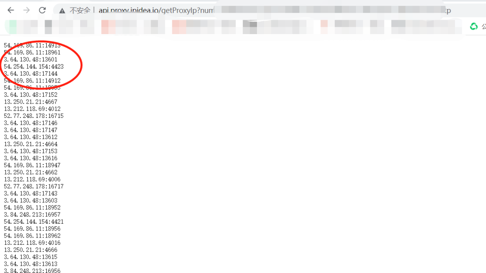

1. **在谷歌浏览器菜单中， 点击设置。**

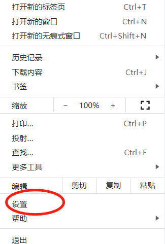

1. **再点击高级，点击系统，最后打开您计算机的代理设置。**

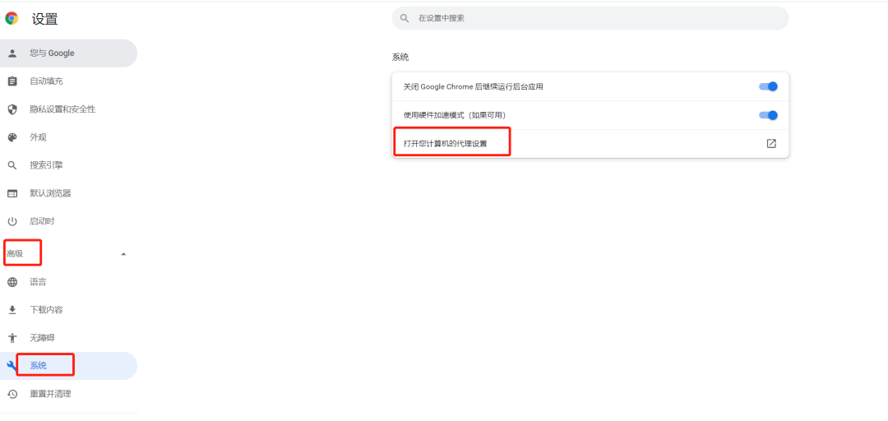

1. **开启使用代理服务器按钮，并填写刚才复制的IP和端口，点击保存。**

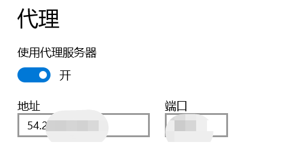

1. **打开百度，搜索框输入IP，即可当前代理后的IP地址。**

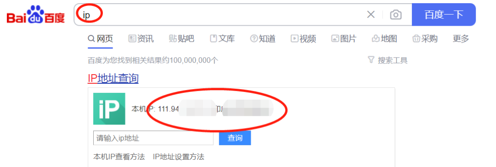<br />当前只**支持境外网络使用哈，不提供任何形式的境内使用方式**。其他浏览器设置，可以参考教程：不同浏览器设置代理ip<br />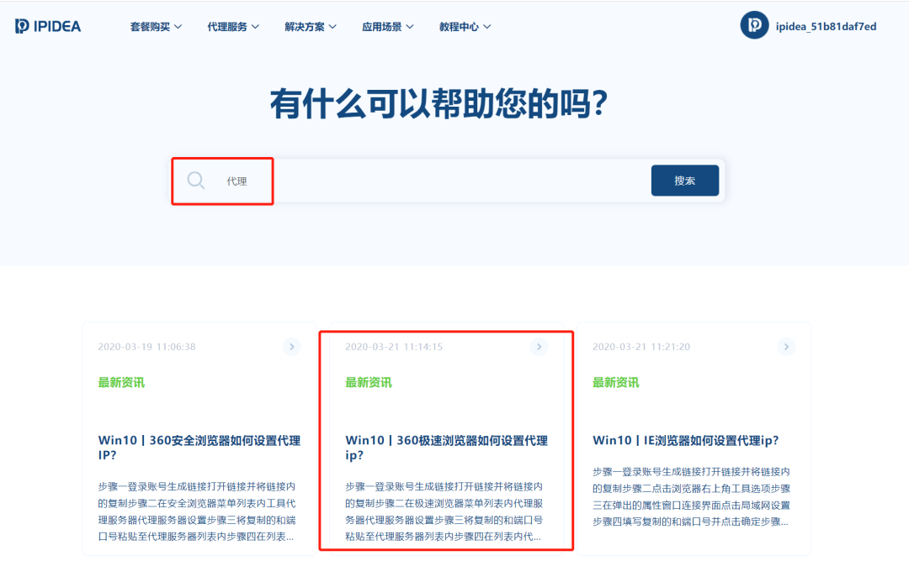
<a name="sh3Ov"></a>
### 5.2 ip代理软件
如果觉得浏览器设置代理服务器，太麻烦的话。可以每次切换代理IP时，通过IP代理软件一键设置切换。或者通过IP代理软件自动切换。
<a name="DwOkC"></a>
### 5.3 java代码设置代理IP
用Java代码设置代理IP，一般会有这两种方式：

1. **系统属性设置完成代理设置**
```java
System.getProperties().setProperty("http.proxyHost", ip);
System.getProperties().setProperty("http.proxyPort", "80");
```
这种设置的优势明显。即快捷方便，并且是JVM级别的设置，就可以对整个项目起作用。但是也有个明显的缺点，当代理IP不可用时，会直接调用本地网络进行连接。

1. **使用SocketAddress网络代理**
```java
SocketAddress address = new InetSocketAddress(host, Integer.parseInt(port));
Proxy proxy = new Proxy(Proxy.Type.HTTP, address);

URL url = new URL("https://www.google.com/");
URLConnection conn = url.openConnection(proxy);
```
这种方式，当代理连接发生错误时，会直接抛出异常，而并不是使用本地的连接继续访问。缺点是每次代理都需要创建连接。
<a name="scRf1"></a>
## 6、使用代理ip爬谷歌数据
使用代理Ip，访问一下谷歌，代码如下：
```java
public class IPProxyTest {

	public static void main(String[] args) throws IOException {

		URL url = new URL("https://www.google.com/");
		SocketAddress address = new InetSocketAddress("你的代理IP", 你的代理端口);

		Proxy proxy = new Proxy(Proxy.Type.HTTP, address);
		URLConnection conn =  url.openConnection(proxy);

		BufferedReader in = new BufferedReader(new InputStreamReader(
			conn.getInputStream()));
		String inputLine;
		while ((inputLine = in.readLine()) != null)
			System.out.println(inputLine);
		in.close();
	}
}
```
这里简单演示了使用代理ip 爬取了谷歌官网数据。其实**动态代理ip**还可以做很多很多事情，可以自行去体检一下！

- **1、注册认证，领2G免费用！**
- **2、套餐充值，加赠10%，最高送1000元额度!**

TIPS：平时需要用到爬虫时，如果IP被限制速度什么的，可以自定义一个时间自动切换ip，这样就可以提高爬虫下效率啦~当然，一般爬虫只是**学习用**哈！
