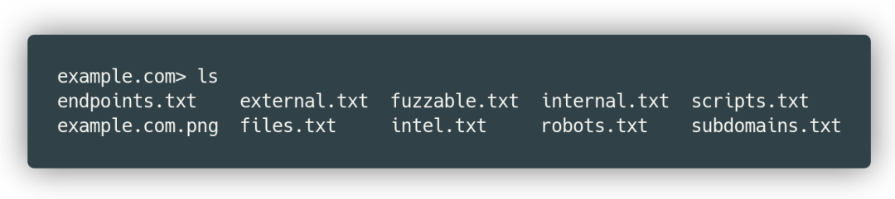
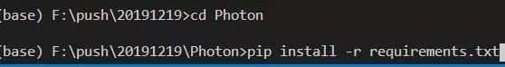
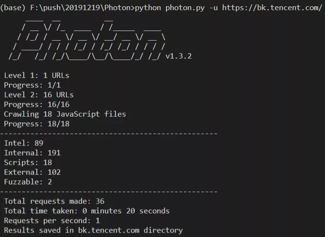
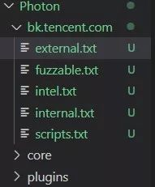
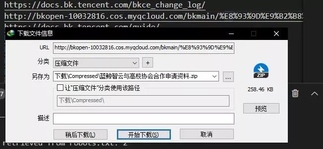
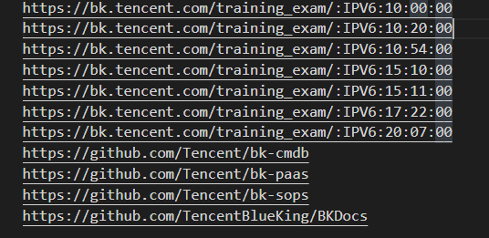
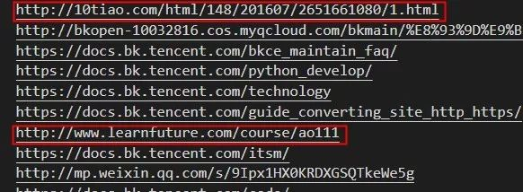

Python<br />Photon是一个由s0md3v开源的情报搜集爬虫，其主要功能有：

1. 爬取链接(内链、外链)。
2. 爬取带参数的链接，如(pythondict.com/test?id=2)。
3. 文件(pdf，png，xml)。
4. 密钥(在前端代码中不小心被释放出来的)。
5. js文件和Endpoint(spring中比较重要的监视器)
6. 匹配自定义正则表达式的字符串。
7. 子域名和DNS相关数据。

可以用它来干很多事，比如爬图片、找漏洞、找子域名、爬数据等等。而且提取出来的数据格式非常整洁：<br /><br />不仅如此，它甚至支持json格式 ，仅需要在输入命令的时候加上json参数：
```bash
python photon.py -u "http://example.com" --export=json
```
为什么能用来做情报搜集呢？耐心往后看哦。
<a name="cnQ2Y"></a>
## 1、下载安装
可以上photon的Github下载完整项目：[https://github.com/s0md3v/Photon](https://github.com/s0md3v/Photon)<br />安装完Python后，打开CMD(windows)/Terminal(macOS)，下面简称为终端，进入刚解压的文件夹，然后输入以下命令安装Photon的依赖：
```bash
pip install -r requirements.txt
```
如图所示：<br />
<a name="mKmCi"></a>
## 2、简单使用
注意，使用的时候要在Photon文件夹下。比如随便提取一个网站的URL试一下，在终端输入以下命令：
```bash
python photon.py -u https://bk.tencent.com/
```
结果如下：<br /><br />它会在当前目录下产生一个测试的域名的文件夹，比如在这里是 bk.tencent.com：<br /><br />看看里面有什么东西，有没有程序员留下的小彩蛋，打开external.txt，这是该网站的外链的存放位置。可以看到，这里不仅仅是只有网站页面，连CDN文件地址都会放在这里，所以external可能是个藏宝库哦。<br /><br />还能一下找出该网站上链接的全部开源项目：<br />
<a name="sHhlU"></a>
## 3、扩展
这个项目的价值，不仅在于能够快速拉取想要得到的数据，还在于能够构建一个牛逼轰轰的**情报系统**~~（如果技术够强的话）~~。因为它是能不断延伸下去的，比如从外链出发，能找到很多和这个网站相关的讯息：<br /><br /><br /><br />相比于搜索引擎搜索的结果，实际上这些信息更符合情报的要求。因为存在禁止搜索引擎爬取的 robot.txt，所以**不是网站的所有信息都能在搜索引擎搜索得到**，而通过这个Photon，可以顺藤摸瓜找到那些隐藏在互联网世界的它们。
