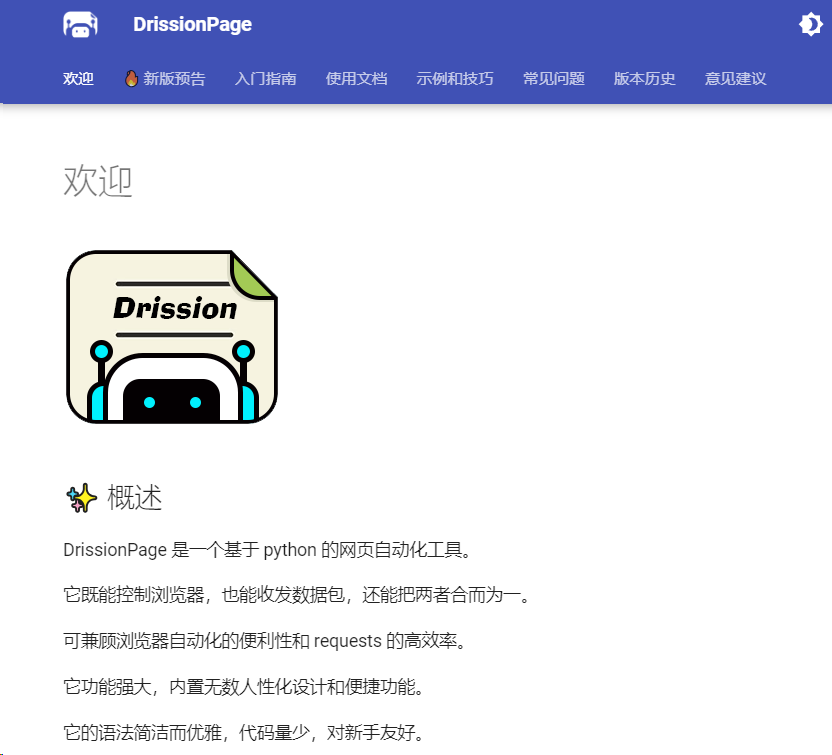

<a name="GwICK"></a>
## 背景
做数据采集的同学应该知道，当采集要登录的网站时，不仅要分析数据包、JS 源码，构造复杂的请求，还要应付验证码、JS 混淆、签名参数等反爬手段，<br />门槛较高，开发效率不高。然后使用浏览器，可以很大程度上绕过这些坑，但是浏览器运行效率仍然不高。<br />因此，今天给大家介绍的**DrissionPage **正是为了解决上诉问题，实现“写得快”和“跑得快”，提供一种人性化的使用方法，提高开发和运行效率。<br />
<a name="CPtG0"></a>
## 介绍
**DrissionPage **是一个基于 python 的网页自动化工具，秉着简洁、易用 、方便三个理念，不仅支持 Chromium 内核浏览器。它还将控制浏览器和收发请求两大功能合二为一，并提供了统一、简洁的接口。并且有强大的特性和亮点：

- 采用全自研的内核，内置了 N 多实用功能，对常用功能作了整合和优化
- 功能强大，内置无数人性化设计和便捷功能
- 语法简洁而优雅，代码量少，对新手友好
<a name="omIQo"></a>
## 快速使用
官方提供了非常详细的文档如下：<br />官网地址：[http://g1879.gitee.io/drissionpagedocs/](http://g1879.gitee.io/drissionpagedocs/)
<a name="rr4PS"></a>
### 1、安装库
使用 pip 安装 DrissionPage
```bash
#安装
pip install DrissionPage
#升级
pip install DrissionPage --upgrade
```
<a name="wmoo5"></a>
### 2、使用示例
<a name="JB9Bs"></a>
#### 📌 页面类
页面类用于控制浏览器，或收发数据包，是最主要的工具。DrissionPage 包含三种主要页面类。根据须要在其中选择使用。<br />**WebPage**是功能最全面的页面类，既可控制浏览器，也可收发数据包：
```python
from DrissionPage import WebPage
```
如果只要控制浏览器，导入**ChromiumPage**：
```python
from DrissionPage import ChromiumPage
```
如果只要收发数据包，导入**SessionPage**：
```python
from DrissionPage import SessionPage
```
<a name="P5v1m"></a>
#### 📌 配置工具
很多时候需要设置启动参数，可导入以下两个类，但不是必须的。<br />`**ChromiumOptions**`类用于设置浏览器启动参数：
```python
from DrissionPage import ChromiumOptions
```
**SessionOptions**类用于设置**Session**对象启动参数：
```python
from DrissionPage import SessionOptions
```
**Settings**用于设置全局配置：
```python
from DrissionPage.common import Settings
```

---

<a name="r8DMK"></a>
#### 📌 其它工具
有两个可能须要用到的工具，需要时可以导入。动作链，用于模拟一系列键盘和鼠标的操作：
```python
from DrissionPage.common import ActionChains
```
键盘按键类，用于键入 ctrl、alt 等按键：
```python
from DrissionPage.common import Keys
```
与 selenium 一致的**By**类，便于项目迁移：
```python
from DrissionPage.common import By
```

---

整体使用非常简单，可以根据文档各取所需，具体参考官方的详细使用文档<br />[http://g1879.gitee.io/drissionpagedocs/usage_introduction/](http://g1879.gitee.io/drissionpagedocs/usage_introduction/)
<a name="CDImu"></a>
## 总结
DrissionPage作为一个基于 python 的网页自动化工具，并且在社区拥有2.3k的star，可以说功能非常强大，社区也比较活跃，作者也会及时更新版本，可以放心使用<br />最后在贴上地址：<br />使用文档：[http://g1879.gitee.io/drissionpagedocs/](http://g1879.gitee.io/drissionpagedocs/)<br />github代码：**「**[**https://github.com/g1879/DrissionPage**](https://github.com/g1879/DrissionPage)**」**<br />gitee代码：**「**[**https://gitee.com/g1879/DrissionPage**](https://gitee.com/g1879/DrissionPage)**」**
