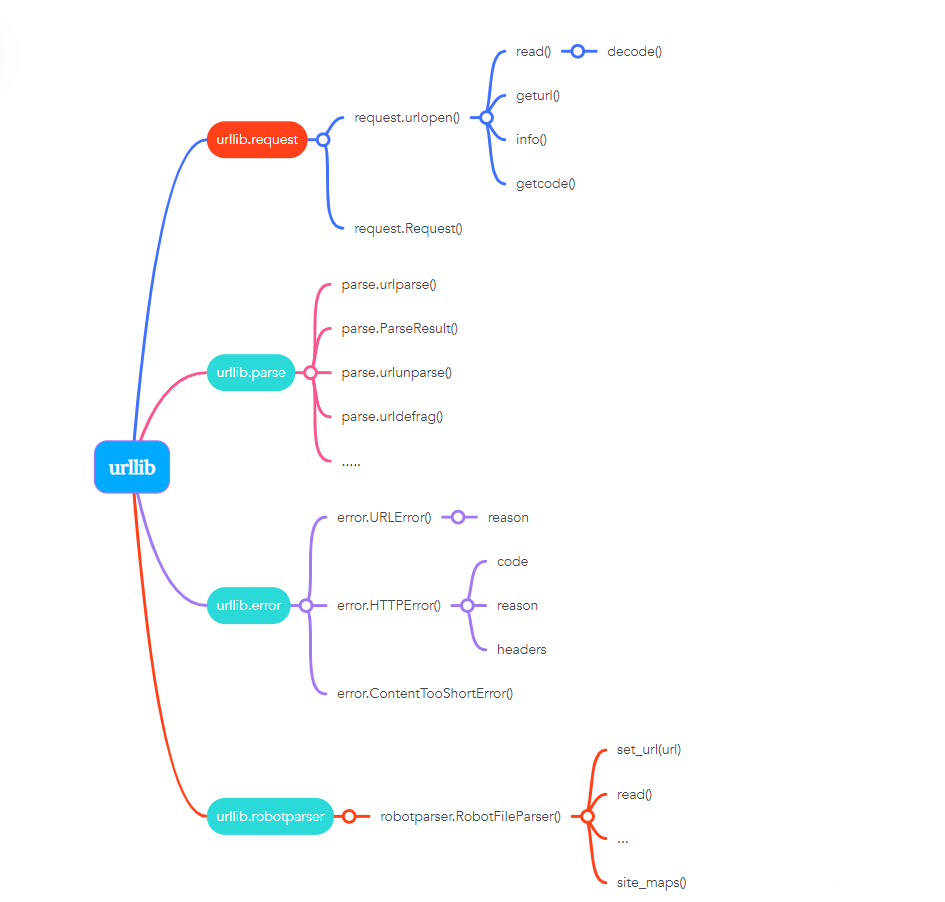

Python
<a name="zIP60"></a>
## Python urllib库
**Python urllib**库用于操作网页**URL**，并对网页的内容进行抓取处理。<br />**urllib**包 包含以下几个模块：

- `**urllib.request**` - 打开和读取**URL**。
- `**urllib.error**` - 包含`**urllib.request**`抛出的异常。
- `**urllib.parse**` - 解析**URL**。
- `**urllib.robotparser**` - 解析**robots.txt**文件。

需要用的就是每个模块的内置方法和函数。大概方法如下图：<br />
<a name="N6EIl"></a>
## `urllib.request`模块
`**urllib.request**`定义了一些打开**URL**的函数和类，包含授权验证、重定向、浏览器**cookies**等。<br />`**urllib.request**`可以模拟浏览器的一个请求发起过程。<br />这里主要介绍两个常用方法，`**urlopen**`和`**Request**`。
<a name="xObQT"></a>
### `urlopen`函数
语法格式如下：
```python
urllib.request.urlopen(url, data=None, [timeout, ]*, cafile=None, capath=None, cadefault=False, context=None)
```

- `**url**`：**url**地址。
- `**data**`：发送到服务器的其他数据对象，默认为**None**。
- `**timeout**`：设置访问超时时间。
- **cafile** 和 **capath**：**cafile**为**CA**证书，**capath**为**CA**证书的路径，使用`**HTTPS**`需要用到。
- `**cadefault**`：已经被弃用。
- `**context**`：`**ssl.SSLContext**`类型，用来指定**SSL**设置。

示例：
```python
import urllib.request
#导入urllib.request模块
url=urllib.request.urlopen("https://www.baidu.com")
#打开读取baidu信息
print(url.read().decode('utf-8'))
#read获取所有信息，并decode()命令将网页的信息进行解码
```
运行结果
```
<!DOCTYPE html><!--STATUS OK--><html><head><meta http-equiv="Content-Type" content="text/html;charset=utf-8"><meta http-equiv="X-UA-Compatible" content="IE=edge,chrome=1"><meta content="always" name="
html{color:#000;overflow-y:scroll;overflow:-moz-scrollbars}
body,button,input,select,textarea{font-size:12px;font-family:Arial,sans-serif}  
h1,h2,h3,h4,h5,h6{font-size:100%}                  
em{font-style:normal}
small{font-size:12px}
ol,ul{list-style:none}
a{text-decoration:none}
a:hover{text-decoration:underline}
legend{color:#000}
fieldset,img{border:0}
button,input,select,textarea{font-size:100%} 
...
```
**response**对象是`**http.client.HTTPResponse**`类型，主要包含**read**、**readinto**、**getheader**、**getheaders**、**fileno**等方法，以及**msg**、**version**、**status**、**reason**、**debuglevel**、**closed**等属性。<br />常用方法：

- `**read()**`：是读取整个网页内容，也可以指定读取的长度，如`**read(300)**`。获取到的是二进制的乱码，所以需要用到`**decode()**`命令将网页的信息进行解码。
- `**readline()**`：读取文件的一行内容。
- `**readlines()**`：读取文件的全部内容，它会把读取的内容赋值给一个列表变量。
- `**info()**`：返回`**HTTPMessage**`对象，表示远程服务器返回的头信息。
- `**getcode()**`：返回**Http**状态码。如果是**http**请求，200请求成功完成;404网址未找到。
- `**geturl()**`：返回请求的链接。
<a name="zGkHd"></a>
### Request 类
抓取网页一般需要对**headers**（网页头信息）进行模拟，否则网页很容易判定程序为爬虫，从而禁止访问。这时候需要使用到`**urllib.request.Request**`类：
```python
class urllib.request.Request(url, data=None, headers={}, origin_req_host=None, unverifiable=False, method=None)
```

- `**url**`：**url**地址。
- `**data**`：发送到服务器的其他数据对象，默认为**None**。
- `**headers**`：**HTTP**请求的头部信息，字典格式。
- `**origin_req_host**`：请求的主机地址，**IP**或域名。
- `**unverifiable**`：很少用整个参数，用于设置网页是否需要验证，默认是**False**。
- `**method**`：请求方法， 如 **GET**、**POST**、**DELETE**、**PUT**等。

示例：
```python
import urllib.request
#导入模块
url = "https://www.baidu.com"
#网页连接
headers = {
    "User-Agent": "Mozilla/5.0 (Windows NT 10.0; Win64; x64) AppleWebKit/537.36 (KHTML, like Gecko) Chrome/80.0.3987.122 Safari/537.36"
}
#定义headers，模拟浏览器访问
req = urllib.request.Request(url=url,headers=headers)
#模拟浏览器发送，访问网页
response = urllib.request.urlopen(req)
#获取页面信息
print(response.read().decode("utf-8"))
```
<a name="HDYuo"></a>
## `urllib.error`模块
`**urllib.error**`模块为`**urllib.request**`所引发的异常定义了异常类，基础异常类是`**URLError**`。<br />`**urllib.error**`包含了两个方法，`**URLError**`和`**HTTPError**`。<br />`**URLError**`是`**OSError**`的一个子类，用于处理程序在遇到问题时会引发此异常（或其派生的异常），包含的属性**reason**为引发异常的原因。<br />`**HTTPError**`是`**URLError**`的一个子类，用于处理特殊**HTTP**错误例如作为认证请求的时候，包含的属性**code**为**HTTP**的状态码，**reason**为引发异常的原因，**headers**为导致`**HTTPError**`的特定**HTTP**请求的**HTTP**响应头。<br />区别：

- `**URLError**`封装的错误信息一般是由网络引起的，包括**url**错误。
- `**HTTPError**`封装的错误信息一般是服务器返回了错误状态码。

关系：

- `**URLError**`是`**OSERROR**`的子类，`**HTTPError**`是`**URLError**`的子类。
<a name="DPNoo"></a>
### URLError 示例
```python
from urllib import request
from urllib import error

if __name__ == "__main__":
    #一个不存在的连接
    url = "http://www.baiiiduuuu.com/"
    req = request.Request(url)
    try:
        response = request.urlopen(req)
        html = response.read().decode('utf-8')
        print(html)
    except error.URLError as e:
        print(e.reason)
```
返回结果
```
[Errno -2] Name or service not known
```
此错误的原因。它可以是一个消息字符串或另一个异常实例。
<a name="tSNdc"></a>
### `HTTPError`示例
```python
from urllib import request
from urllib import error

if __name__ == "__main__":
    #网站服务器上不存在资源
    url = "http://www.baidu.com/no.html"
    req = request.Request(url)
    try:
        response = request.urlopen(req)
        html = response.read().decode('utf-8')
        print(html)
    except error.HTTPError as e:
        print(e.code)
```
output
```
404
```
<a name="wPPrE"></a>
### `URLError`和`HTTPError`混合使用
注意：由于`**HTTPError**`是`**URLError**`的子类，所以捕获的时候`**HTTPError**`要放在`**URLError**`的上面。<br />示例：
```python
from urllib import request
from urllib import error

if __name__ == "__main__":
    #网站服务器上不存在资源
    url = "http://www.baidu.com/no.html"
    req = request.Request(url)
    try:
        response = request.urlopen(req)
 #       html = response.read().decode('utf-8')
    except error.HTTPError as e:
        print(e.code)
    except error.URLError as e:
        print(e.code)
```
如果不用上面的方法，可以直接用判断的形式
```python
from urllib import request
from urllib import error

if __name__ == "__main__":
    #网站服务器上不存在资源
    url = "http://www.baidu.com/no.html"
    req = request.Request(url)
    try:
        response = request.urlopen(req)
 #       html = response.read().decode('utf-8')
    except error.URLError as e:
        if hasattr(e, 'code'):
            print("HTTPError")
            print(e.code)
        elif hasattr(e, 'reason'):
            print("URLError")
            print(e.reason)
```
output
```
HTTPError
404
```
<a name="MsncX"></a>
## `urllib.parse`模块
模块定义的函数可分为两个主要门类：**URL**解析和**URL**转码。
<a name="ACkTJ"></a>
### `urlparse()`
**urllib.parse**用于解析**URL**，格式如下：
```python
urllib.parse.urlparse(urlstring, scheme='', allow_fragments=True)
```
**urlstring**为字符串的**url**地址，**scheme**为协议类型。<br />`**allow_fragments**`参数为**false**，则无法识别片段标识符。相反，它们被解析为路径，参数或查询组件的一部分，并**fragment**在返回值中设置为空字符串。<br />标准链接格式为：
```
scheme://netloc/path;params?query#fragment
```
对象中包含了六个元素，分别为：协议（scheme）、域名（netloc）、路径（path）、路径参数（params）、查询参数（query）、片段（fragment）。<br />示例：
```python
from urllib.parse import urlparse

o = urlparse("https://docs.python.org/zh-cn/3/library/urllib.parse.html#module-urllib.parse")

print('scheme  :', o.scheme)
print('netloc  :', o.netloc)
print('path    :', o.path)
print('params  :', o.params)
print('query   :', o.query)
print('fragment:', o.fragment)
print('hostname:', o.hostname)
```
output
```
scheme  : https
netloc  : docs.python.org
path    : /zh-cn/3/library/urllib.parse.html
params  :
query   :
fragment: module-urllib.parse
hostname: docs.python.org
```
以上还可以通过索引获取，如通过
```python
print(o[0])
...
print(o[5])
```
<a name="ZwgRp"></a>
### `urlunparse()`
`**urlunparse()**`可以实现**URL**的构造。（构造**URL**）<br />`**urlunparse()**`接收一个是一个长度为6的可迭代对象，将**URL**的多个部分组合为一个**URL**。若可迭代对象长度不等于6，则抛出异常。<br />示例：
```python
from urllib.parse import urlunparse
url_compos = ['http','www.baidu.com','index.html','user= test','a=6','comment']
print(urlunparse(url_compos))
```
output
```
http://www.baidu.com/index.html;user= test?a=6#comment
```
<a name="MD8JO"></a>
### `urlsplit()`
`**urlsplit()**`函数也能对 **URL**进行拆分，所不同的是，`**urlsplit()**`并不会把 路径参数(params) 从 路径(path) 中分离出来。<br />当**URL**中路径部分包含多个参数时，使用`**urlparse()**`解析是有问题的，这时可以使用`**urlsplit()**`来解析.<br />`**urlunsplit()**`与`**urlunparse()**`类似，（构造**URL**），传入对象必须是可迭代对象，且长度必须是5。<br />示例：
```python
from urllib.parse import urlunsplit
url_compos = ['http','www.baidu.com','index.html','user= test','a = 2']
print(urlunsplit(url_compos))urlunsplit()
```
output
```
http://www.baidu.com/index.html?user= test#a = 2
```
<a name="SNgoT"></a>
### `urljoin()`
同样可以构造**URL**。<br />传递一个基础链接，根据基础链接可以将某一个不完整的链接拼接为一个完整链接。<br />注：连接两个参数的**url**，将第二个参数中缺的部分用第一个参数的补齐，如果第二个有完整的路径，则以第二个为主。
<a name="NvXF3"></a>
### URL 转码
**python**中提供`**urllib.parse**`模块用来编码和解码，分别是`**urlencode()**`与`**unquote()**`。
<a name="ZGVuT"></a>
### 编码`quote(string)`
**URL**转码函数的功能是接收程序数据并通过对特殊字符进行转码并正确编码非**ASCII**文本来将其转为可以安全地用作**URL**组成部分的形式。它们还支持逆转此操作以便从作为**URL**组成部分的内容中重建原始数据，如果上述的**URL**解析函数还未覆盖此功能的话<br />语法：
```python
urllib.parse.quote(string, safe='/', encoding=None, errors=None)
```
使用**%xx**转义符替换**string**中的特殊字符。字母、数字和 '_.-~' 等字符一定不会被转码。在默认情况下，此函数只对**URL**的路径部分进行转码。可选的**safe**形参额外指定不应被转码的**ASCII**字符 --- 其默认值为 '/'。<br />**string**可以是**str**或**bytes**对象。<br />示例：
```python
from urllib import parse

url = "http://www.baidu.com/s?wd={}"
words = "爬虫"

#quote()只能对字符串进行编码
query_string = parse.quote(words)
url = url.format(query_string)
print(url)
```
执行结果：
```
http://www.baidu.com/s?wd=%E7%88%AC%E8%99%AB
```
<a name="qX3JA"></a>
### 编码`urlencode()`
`**quote()**`只能对字符串编码，而`**urlencode()**`可以对查询字符串进行编码。
```python
# 导入parse模块
from urllib import parse

#调用parse模块的urlencode()进行编码
query_string = {'wd':'爬虫'}
result = parse.urlencode(query_string)

# format函数格式化字符串，进行url拼接
url = 'http://www.baidu.com/s?{}'.format(result)
print(url)
```
output
```
http://www.baidu.com/s?wd=%E7%88%AC%E8%99%AB
```
<a name="YY4PM"></a>
### 解码`unquote(string)`
解码就是对编码后的**url**进行还原。<br />示例：
```python
from urllib import parse
string = '%E7%88%AC%E8%99%AB'
result = parse.unquote(string)
print(result)
```
执行结果：
```
爬虫
```
<a name="Ps1nc"></a>
## `urllib.robotparser`模块
（在网络爬虫中基本不会用到，使用较少，仅作了解）<br />`**urllib.robotparser**`用于解析**robots.txt**文件。<br />**robots.txt**（统一小写）是一种存放于网站根目录下的**robots**协议，它通常用于告诉搜索引擎对网站的抓取规则。<br />**Robots**协议也称作爬虫协议，机器人协议，网络爬虫排除协议，用来告诉爬虫哪些页面是可以爬取的，哪些页面是不可爬取的。它通常是一个**robots.txt**的文本文件，一般放在网站的根目录上。<br />当爬虫访问一个站点的时候，会首先检查这个站点目录是否存在**robots.txt**文件，如果存在，搜索爬虫会根据其中定义的爬取范围进行爬取。如果没有找到这个文件，搜索爬虫会访问所有可直接访问的页面。<br />`**urllib.robotparser**`提供了**RobotFileParser**类，语法如下：
```python
class urllib.robotparser.RobotFileParser(url='')
```
这个类提供了一些可以读取、解析**robots.txt**文件的方法：

- `**set_url(url)**` - 设置**robots.txt**文件的**URL**。
- `**read()**` - 读取**robots.txt URL**并将其输入解析器。
- `**parse(lines)**` - 解析行参数。
- `**can_fetch(useragent, url)**` - 如果允许**useragent**按照被解析**robots.txt**文件中的规则来获取**url**则返回**True**。
- `**mtime()**` - 返回最近一次获取**robots.txt**文件的时间。这适用于需要定期检查**robots.txt**文件更新情况的长时间运行的网页爬虫。
- `**modified()**` - 将最近一次获取**robots.txt**文件的时间设置为当前时间。
- `**crawl_delay(useragent)**` - 为指定的**useragent**从**robots.txt** 返回**Crawl-delay**形参。如果此形参不存在或不适用于指定的**useragent** 或者此形参的**robots.txt**条目存在语法错误，则返回**None**。
- `**request_rate(useragent)**` -以 `**named tuple RequestRate(requests, seconds)**`的形式从**robots.txt**返回**Request-rate**形参的内容。如果此形参不存在或不适用于指定的**useragent**或者此形参的**robots.txt**条目存在语法错误，则返回**None**。
- `**site_maps()**` - 以**list()**的形式从**robots.txt**返回**Sitemap**形参的内容。如果此形参不存在或者此形参的**robots.txt**条目存在语法错误，则返回**None**。
