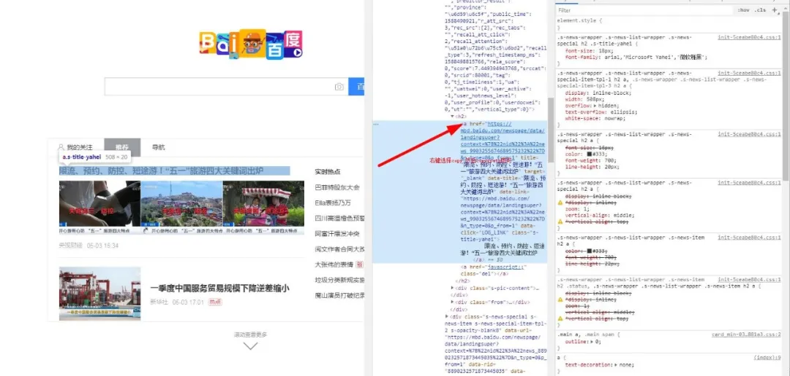
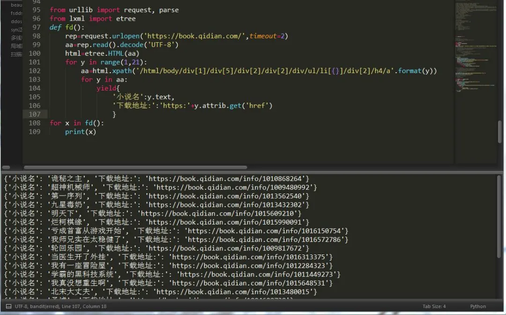

Python 爬虫 lxml xpath
<a name="3I4yh"></a>
## 一、xpath
<a name="3KL9D"></a>
### 1、XPath概念
XPath 是一门在 XML 文档中查找信息的语言。XPath 使用路径表达式在 XML 文档中进行导航 。XPath 包含一个标准函数库 。XPath 是 XSLT 中的主要元素 。XPath 是一个 W3C 标准 。
<a name="qYXgf"></a>
### 2、XPath节点
XPath有七种类型的节点：元素、属性、文本、命名空间、处理指令、注释以及文档（根）节点。<br />节点关系：父、子、兄弟、先辈、后辈。
<a name="zKEoM"></a>
### 3、XPath语法
XPath语法在W3c网站上有详细的介绍，这里截取部分知识，供大家学习。<br />XPath 使用路径表达式在 XML 文档中选取节点。节点是通过沿着路径或者 step 来选取的。下面列出了最有用的路径表达式：

| 表达式 | 描述 |
| --- | --- |
| nodename | 选取此节点的所有子节点。 |
| / | 从根节点选取。 |
| // | 从匹配选择的当前节点选择文档中的节点，而不考虑它们的位置。 |
| . | 选取当前节点。 |
| .. | 选取当前节点的父节点。 |
| @ | 选取属性。 |

在下面的表格中，已列出了一些路径表达式以及表达式的结果：

| 路径表达式 | 结果 |
| --- | --- |
| bookstore | 选取 bookstore 元素的所有子节点。 |
| /bookstore | 选取根元素 bookstore。注释：假如路径起始于正斜杠( / )，则此路径始终代表到某元素的绝对路径！ |
| bookstore/book | 选取属于 bookstore 的子元素的所有 book 元素。 |
| //book | 选取所有 book 子元素，而不管它们在文档中的位置。 |
| bookstore//book | 选择属于 bookstore 元素的后代的所有 book 元素，而不管它们位于 bookstore 之下的什么位置。 |
| //@lang | 选取名为 lang 的所有属性。 |

<a name="Msl4r"></a>
#### 谓语（Predicates）
谓语用来查找某个特定的节点或者包含某个指定的值的节点。<br />谓语被嵌在方括号中。<br />在下面的表格中，列出了带有谓语的一些路径表达式，以及表达式的结果：

| 路径表达式 | 结果 |
| --- | --- |
| /bookstore/book[1] | 选取属于 bookstore 子元素的第一个 book 元素。 |
| /bookstore/book[last()] | 选取属于 bookstore 子元素的最后一个 book 元素。 |
| /bookstore/book[last()-1] | 选取属于 bookstore 子元素的倒数第二个 book 元素。 |
| /bookstore/book[position()<3] | 选取最前面的两个属于 bookstore 元素的子元素的 book 元素。 |
| //title[@lang] | 选取所有拥有名为 lang 的属性的 title 元素。 |
| //title[@lang='eng'] | 选取所有 title 元素，且这些元素拥有值为 eng 的 lang 属性。 |
| /bookstore/book[price>35.00] | 选取 bookstore 元素的所有 book 元素，且其中的 price 元素的值须大于 35.00。 |
| /bookstore/book[price>35.00]/title | 选取 bookstore 元素中的 book 元素的所有 title 元素，且其中的 price 元素的值须大于  35.00。 |

<a name="Bqvwr"></a>
#### 选取未知节点
XPath 通配符可用来选取未知的 XML 元素。

| 通配符 | 描述 |
| --- | --- |
| * | 匹配任何元素节点。 |
| @* | 匹配任何属性节点。 |
| node() | 匹配任何类型的节点。 |

在下面的表格中，列出了一些路径表达式，以及这些表达式的结果：

| 路径表达式 | 结果 |
| --- | --- |
| /bookstore/* | 选取 bookstore 元素的所有子元素。 |
| //* | 选取文档中的所有元素。 |
| //title[@*] | 选取所有带有属性的 title 元素。 |

<a name="nLF16"></a>
#### 选取若干路径
通过在路径表达式中使用"|"运算符，可以选取若干个路径。<br />在下面的表格中，列出了一些路径表达式，以及这些表达式的结果：

| 路径表达式 | 结果 |
| --- | --- |
| //book/title &#124; //book/price | 选取 book 元素的所有 title 和 price 元素。 |
| //title &#124; //price | 选取文档中的所有 title 和 price 元素。 |
| /bookstore/book/title &#124; //price | 选取属于 bookstore 元素的 book 元素的所有 title 元素，以及文档中所有的 price  元素。 |

<a name="A6Mj6"></a>
### 4、xpath 轴
轴可定义相对于当前节点的节点集。

| 轴名称 | 结果 |
| --- | --- |
| ancestor | 选取当前节点的所有先辈（父、祖父等）。 |
| ancestor-or-self | 选取当前节点的所有先辈（父、祖父等）以及当前节点本身。 |
| attribute | 选取当前节点的所有属性。 |
| child | 选取当前节点的所有子元素。 |
| descendant | 选取当前节点的所有后代元素（子、孙等）。 |
| descendant-or-self | 选取当前节点的所有后代元素（子、孙等）以及当前节点本身。 |
| following | 选取文档中当前节点的结束标签之后的所有节点。 |
| namespace | 选取当前节点的所有命名空间节点。 |
| parent | 选取当前节点的父节点。 |
| preceding | 选取文档中当前节点的开始标签之前的所有节点。 |
| preceding-sibling | 选取当前节点之前的所有同级节点。 |
| self | 选取当前节点。 |

<a name="2LvNo"></a>
### 5、xpath运算符
下面列出了可用在 XPath 表达式中的运算符：

| 运算符 | 描述 | 实例 | 返回值 |
| --- | --- | --- | --- |
| &#124; | 计算两个节点集 | //book &#124; //cd | 返回所有拥有 book 和 cd 元素的节点集 |
| + | 加法 | 6 + 4 | 10 |
| - | 减法 | 6 - 4 | 2 |
| * | 乘法 | 6 * 4 | 24 |
| div | 除法 | 8 div 4 | 2 |
| = | 等于 | price=9.80 | 如果 price 是 9.80，则返回 true。如果 price 是 9.90，则返回 false。 |
| != | 不等于 | price!=9.80 | 如果 price 是 9.90，则返回 true。如果 price 是 9.80，则返回 false。 |
| < | 小于 | price<9.80 | 如果 price 是 9.00，则返回 true。如果 price 是 9.90，则返回 false。 |
| <= | 小于或等于 | price<=9.80 | 如果 price 是 9.00，则返回 true。如果 price 是 9.90，则返回 false。 |
| > | 大于 | price>9.80 | 如果 price 是 9.90，则返回 true。如果 price 是 9.80，则返回 false。 |
| >= | 大于或等于 | price>=9.80 | 如果 price 是 9.90，则返回 true。如果 price 是 9.70，则返回 false。 |
| or | 或 | price=9.80 or price=9.70 | 如果 price 是 9.80，则返回 true。如果 price 是 9.50，则返回 false。 |
| and | 与 | price>9.00 and price<9.90 | 如果 price 是 9.80，则返回 true。如果 price 是 8.50，则返回 false。 |
| mod | 计算除法的余数 | 5 mod 2 | 1 |

<a name="jZ1hG"></a>
## 二、lxml
lxml速度很快，比其他的html.parser 和html5lib快了许多。
<a name="KOZdL"></a>
### 1、lxml安装
lxml 是一个xpath格式解析模块，安装很方便，直接`pip install lxml` 或者`easy_install lxml`即可。
<a name="keXrl"></a>
### 2、lxml使用
lxml提供了两种解析网页的方式，一种是解析自己写的离线网页时，另一种则是解析线上网页。<br />导入包：
```python
from lxml import etree
```
<a name="pE2oa"></a>
#### 1. 解析离线网页
```python
html=etree.parse('xx.html',etree.HTMLParser())
aa=html.xpath('//*[@id="s_xmancard_news"]/div/div[2]/div/div[1]/h2/a[1]/@href')
print(aa)
```
<a name="dfehx"></a>
#### 2. 解析在线网页
```python
from lxml import etree
import requests
rep=requests.get('https://www.baidu.com')
html=etree.HTML(rep.text)
aa=html.xpath('//*[@id="s_xmancard_news"]/div/div[2]/div/div[1]/h2/a[1]/@href')
print(aa)
```
那么怎么获取这些标签和标签对应的属性值，首先获取标签只需这样做：<br />

---

然后要获取a标签内的文本和它的属性href所对应的值，有两种方法，
<a name="JryPi"></a>
#### 1. 表达式内获取
```python
aa=html.xpath('//*[@id="s_xmancard_news"]/div/div[2]/div/div[1]/h2/a[1]/text()')
ab=html.xpath('//*[@id="s_xmancard_news"]/div/div[2]/div/div[1]/h2/a[1]/@href')
```
<a name="MaeeU"></a>
#### 2. 表达式外获取
```python
aa=html.xpath('//*[@id="s_xmancard_news"]/div/div[2]/div/div[1]/h2/a[1]')
aa.text
aa.attrib.get('href')
```
这样就完成了获取。<br />下面再来lxml的解析规则：

| 表达式 | 描述 |
| --- | --- |
| nodename | 选取此节点的所有子节点 |
| / | 从当前节点选取直接子节点 |
| // | 从当前节点选取子孙节点 |
| . | 选取当前节点 |
| .. | 选取当前节点的父节点 |
| @ | 选取属性 |

```python

html = lxml.etree.HTML(text)
#使用text构造一个XPath解析对象,etree模块可以自动修正HTML文本
html = lxml.etree.parse('./ex.html',etree.HTMLParser())
#直接读取文本进行解析
from lxml import etree
result = html.xpath('//*')
#选取所有节点
result = html.xpath('//li')
#获取所有li节点
result = html.xpath('//li/a')
#获取所有li节点的直接a子节点
result = html.xpath('//li//a')
#获取所有li节点的所有a子孙节点
result = html.xpath('//a[@href="link.html"]/../@class')
#获取所有href属性为link.html的a节点的父节点的class属性
result = html.xpath('//li[@class="ni"]')
#获取所有class属性为ni的li节点
result = html.xpath('//li/text()')
#获取所有li节点的文本
result = html.xpath('//li/a/@href')
#获取所有li节点的a节点的href属性
result = html.xpath('//li[contains(@class,"li")]/a/text())
#当li的class属性有多个值时，需用contains函数完成匹配
result = html.xpath('//li[contains(@class,"li") and @name="item"]/a/text()')
#多属性匹配
result = html.xpath('//li[1]/a/text()')
result = html.xpath('//li[last()]/a/text()')
result = html.xpath('//li[position()<3]/a/text()')
result = html.xpath('//li[last()-2]/a/text()')
#按序选择，中括号内为XPath提供的函数
result = html.xpath('//li[1]/ancestor::*')
#获取祖先节点
result = html.xpath('//li[1]/ancestor::div')
result = html.xpath('//li[1]/attribute::*')
#获取属性值
result = html.xpath('//li[1]/child::a[@href="link1.html"]')
#获取直接子节点
result = html.xpath('//li[1]/descendant::span')
#获取所有子孙节点
result = html.xpath('//li[1]/following::*[2]')
#获取当前节点之后的所有节点的第二个
result = html.xpath('//li[1]/following-sibling::*')
#获取后续所有同级节点
```
<a name="e411b34a"></a>
### 3、lxml案例

