Python Selenium 爬虫
<a name="fwHWZ"></a>
## 一、 Web 元素定位
<a name="t1XTv"></a>
### 使用 `find_element(s)_by_*()` 定位元素

- `find_element(s)\_by_id()` 较常用，一般不会存在 ID 重名的元素
- `find_element(s)\_by_name()`
- `find_element(s)\_by_class_name()` class 用来关联 CSS 中定义的属性，「有时某元素的 class 属性由通过空格隔开的两个值组成，此时只取其中一个即可」
- `find_element(s)\_by_xpath()` 可以灵活使用绝对或相对路径来定位元素，「如果元素无法通过自身属性来定位，可以通过上一级（父级）元素来定位，也可考虑多个属性的组合来定位，通过 and 连接多个属性」
- `find_element(s)\_by_tag_name()` 「不建议使用」
- `find_element(s)\_by_css_selector()` 可以灵活选择控件的任意属性，速度比 XPath 快，也「可以通过层级（父级）实现元素的定位，父元素和子元素通过 > 连接起来」
- `find_element(s)\_by_link_text()`
- `find_element(s)\_by_partial_link_text()` 通过文本链接的一部分文本来定位元素
- `find_element(By.XX,value="xxx")`
<a name="up4wy"></a>
## 二、Webdriver 的 API
<a name="WLUEO"></a>
### 1、操作浏览器的基本方法
<a name="tLQTQ"></a>
#### 浏览器最大化
```python
driver.maximize_window()
```
<a name="mLjj8"></a>
#### 控制浏览器大小
```python
driver.set_window_size(xxx,yyy)
```
<a name="FhJX3"></a>
#### 浏览器前进
```python
driver.forward()
```
<a name="JR6CJ"></a>
#### 浏览器后退
```python
driver.back()
```
<a name="VPfMc"></a>
#### 页面刷新
```python
driver.refresh()
```
<a name="gmfhV"></a>
#### 获取页面 URL 地址
```python
url = driver.current_url
```
<a name="WBttj"></a>
#### 获取 URL 标题
```python
title = driver.title
```
<a name="fVvHQ"></a>
#### 获取浏览器类型
```python
browser_name = driver.name
```
<a name="SBWxI"></a>
#### 关闭当前窗口
```python
driver.quit()
```
<a name="IvmI9"></a>
#### 退出浏览器（关闭所有窗口）
```python
driver.quit()
```
<a name="GJqUU"></a>
### 2、元素的操作方法
<a name="wEjhv"></a>
#### 单击元素
```python
click()
```
<a name="nQkz7"></a>
#### 在元素上输入内容
```python
send_keys("xxx")
```
<a name="s2N2H"></a>
#### 清除元素内容
```python
clear()
```
<a name="OpSNO"></a>
#### 提交表单（模拟回车）
```python
submit()
```
<a name="MSdXL"></a>
#### 获取元素尺寸
```python
size
```
<a name="sMNxj"></a>
#### 获取元素的属性
```python
get_attribute("xxx")
```
<a name="bJTGG"></a>
#### 获取元素的文本
```python
text
```
<a name="WAwf7"></a>
### 3、鼠标操作
<a name="S9nxh"></a>
#### 导入 ActionChains 类
```python
from selenium.webdriver.common.action_chains import ActionChains
```
<a name="c2Mm3"></a>
#### ActionChains 方法列表
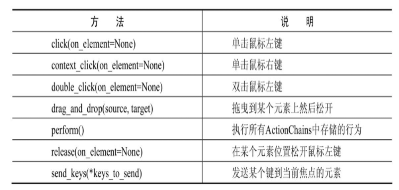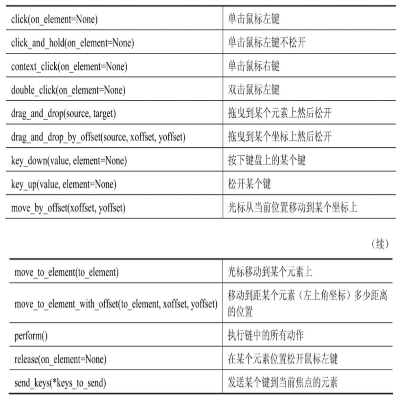
<a name="lQrBV"></a>
### 4、键盘操作
<a name="gKnys"></a>
#### 导入 Keys 类
```python
from selenium.webdriver.common.keys import Keys
```
<a name="CPIKA"></a>
#### Keys 方法列表
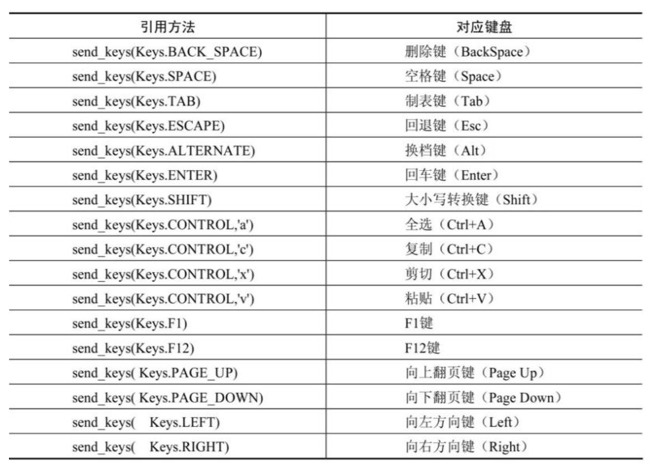
<a name="Hk9DH"></a>
### 5、定位一组元素

- 如果被定位的元素无法通过自身属性来唯一标识自己，此时可以考虑借助上级元素来定位自己
- 在定位一组元素时，也可以用层级定位的方法
<a name="y831b"></a>
### 6、等待时间
<a name="ir7v3"></a>
#### 当UI自动化页面元素不存在时，常见的发生异常的原因

- 页面加载时间过慢，需要查找的元素代码已经执行完成，但是页面还未加载成功，从而发生异常查到的元素
- 没有在当前的 iframe 或者 frame 中，此时需要切换至对应的 iframe 或者 frame 中
- 代码中对元素的描述错误
<a name="PFLSV"></a>
#### 强制等待

- 强制等待也叫作固定休眠时间，是设置等待的最简单的方法
- `sleep()`的缺点是不够智能，如果设置的时间太短，而元素还没有加载出来，代码照样会报错；如果设置的时间太长，则又会浪费时间
```python
from time import sleep

sleep(n)
```
<a name="EdzuV"></a>
#### 隐式等待

- 隐式等待也叫作智能等待（`implicitly_wait(xx)`），当设置了一段时间后，在这段时间内如果页面完成加载，则进行下一步，如果未加载完，则会报超时错误
- 隐式等待中的最长等待时间也可理解为查找元素的最长时间
- 程序代码会一直等待整个页面加载完成才会执行下一步
- 隐式等待对整个 Driver 的周期都会起作用，所以只需要设置一次即可，就是在整个程序代码中的最前面设置一次即可
```python
driver.implicitly_wait(n)
```
<a name="HnqAH"></a>
#### 显式等待

- 显式等待（WebDriverWait）配合该类的 `until()`和 `until_not()` 方法，能够根据判断条件进行灵活地等待
- 程序每隔多长时间检查一次，如果条件成立了，则执行下一步，否则继续等待，直到超过设置的最长时间，然后抛出 TimeoutException
- 「WebDriverWait 等待是推荐的方法」，使用 WebDriverWait 方法时「常常会结合 `expected_conditions` 模块一起使用」
- 「WebDriverWait 需要与 `until()` 或者 `until_not()` 方法结合使用」
- 「隐式等待和显式等待是可以结合起来使用的」

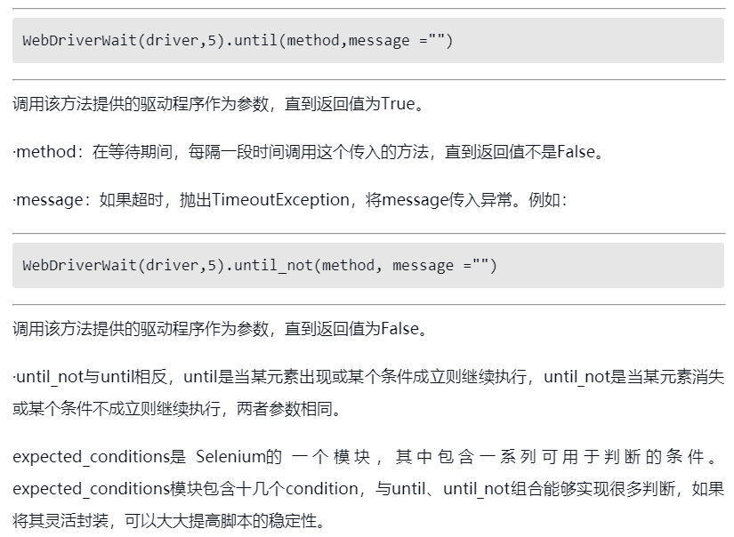
<a name="g98jQ"></a>
#### 需要导入库
```python
from selenium.webdriver.support.ui import WebDriverWait
from selenium.webdriver.support import expected_conditions as EC
```
<a name="CTOx7"></a>
### 7、Frame 切换

- Frame 标签有 Frameset 、Frame 和 IFrame 3种
- WebDriver 提供了 `switch_to.frame()` 方法来切换 Frame
- 切换到主窗体的方法是 `driver.switch_to.default_content()`
- 如果遇到嵌套的 Frame，由子窗体切换到它的上一级父窗体，则可以使用 `switch_to. parent_frame()` 方法
```python
switch_to.frame(reference)
```
<a name="ugV1s"></a>
### 8、警告框与弹出框的处理
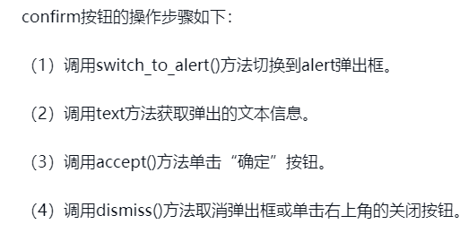
<a name="nK36j"></a>
### 9、单选按钮、复选框和下拉列表框的处理

- `is_selected()` 方法用来检查是否选中该元素，一般针对单选按钮、复选框，其返回的结果是 Bool 值
- WebDriver 还提供了 Select 模块来定位下拉列表框
```python
from selenium.webdriver.support.select import Select
```
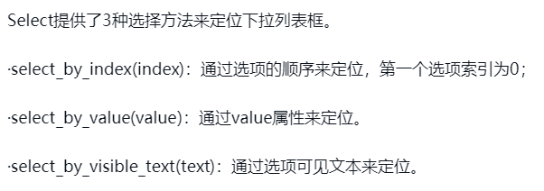
<a name="Vw6l8"></a>
### 10、检查元素是否启用或显示

- 当判断元素在屏幕上是否可见的时候，可调用 `is_displayed()` 方法来实现
- 当判断元素是否可编辑的时候，可调用 `is_enabled()` 方法实现
- `is_selected()` 方法用于判断元素是否为选中状态
- `is_enabled()` 方法用于存储 `input` 、 `select` 等元素的可编辑状态，可以编辑返回 True ，否则返回 False
- `is_enabled()`方法可以判断按钮的单击状态，如有一个按钮在某种情况下置灰不可单击，可以用 `is_enable()` 来判断
<a name="Rdi4r"></a>
### 11、文件上传与下载
<a name="C1JlO"></a>
#### 文件上传


- 关于非 `input` 标签的文件上传，可借助 「AutoIt」，AutoIt 是一个使用类似 BASIC 脚本语言的免费软件，用于在 Windows GUI（图形用户界面）中进行自动化操作，利用模拟键盘按键、鼠标移动和窗口/控件的组合来实现自动化任务


<a name="QVs73"></a>
#### 文件下载
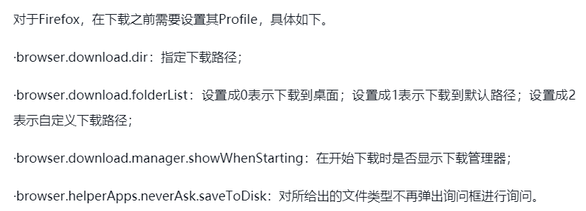<br />

- 更多对应文件的MIME类型，可以访问[《MIME参考手册》](https://www.w3school.com.cn/media/media_mimeref.asp)，网址是 「[https://www.w3school.com.cn/media/media_mimeref.asp](https://www.w3school.com.cn/media/media_mimeref.asp)」


<a name="oRW2C"></a>
### 12、Cookie 的处理

- Cookie 存放在浏览器端（客户端），Session 存放在服务器端，每个客户在服务器端都有与其对应的 Session
- Cookie 只能存储一些少量的数据
- Cookie 在生成时会被指定一个 Expire 值，这就是 Cookie 的生存周期，在这个周期内 Cookie 有效，超出周期 Cookie 就会被清除。有些页面将 Cookie 的生存周期设置为 0 或负值，这样在关闭浏览器时就马上清除 Cookie
- 通过 `get_cookies()` 获得的 Cookie 有多对，而通过 `get_cookie(self,name)` 可获得指定的 Cookie
- 添加 Cookie 调用的方法是 `add_cookie(cookie_dict)` ，其中 `cookie_dict` 为字典对象，必须有 name 和 value 值

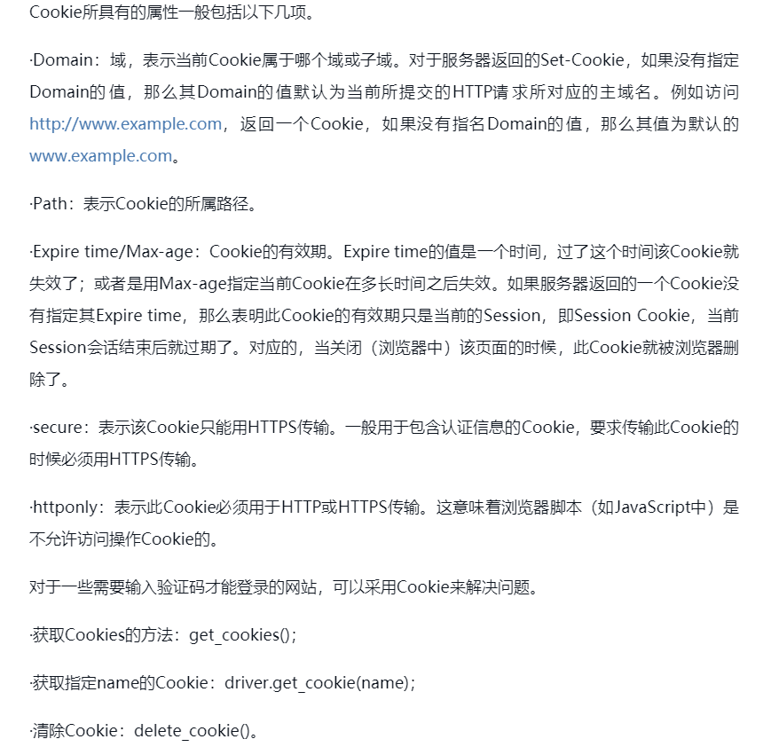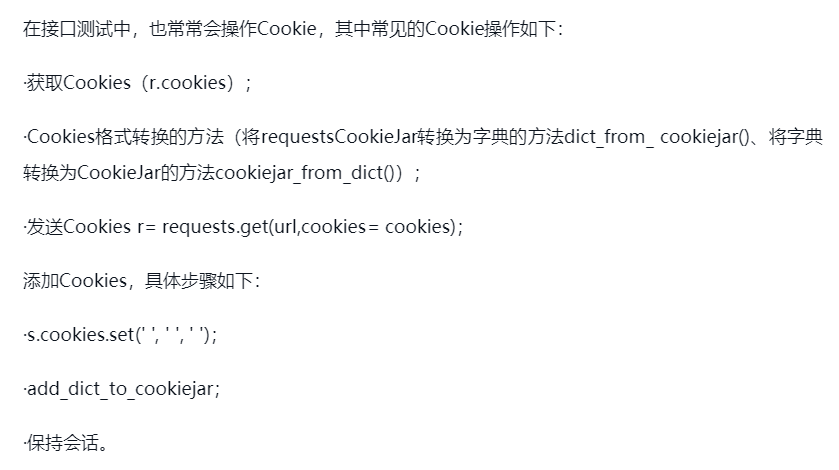
<a name="CbahT"></a>
### 13、富文本

- 富文本常常被嵌入 IFrame 中，所以对于富文本的操作需要先切换到 IFrame 中，再进行操作
<a name="iULkU"></a>
### 14、标签页切换
<a name="aF4aU"></a>
#### 通过 JS 打开新标签页
```python
js = 'window.open("url");'
driver.execute_script(js)
```
<a name="rogH1"></a>
#### 获得所有窗口
```python
handles = driver.window_handles
```
<a name="Yn9L3"></a>
### 15、屏幕截图

- `save_screenshot()` 方法是保存一张后缀名为 png 的图片， `save_screenshot()` 的参数是文件名称，截图会保存在当前代码的目录下
- 使用 `get_screenshot_as_file(filename)` 方法，通过 Driver 获取该方法，将截图保存到指定的路径（该路径为绝对路径）下
- `get_screenshot_as_png()` 方法是获取当前屏幕截图的二进制文件数据
- `get_screenshot_as_base64()` 方法是获取当前屏幕截图的 Base64 编码字符串，便于 HTML 页面直接嵌入 Base64 编码图片
<a name="f00HJ"></a>
### 16、执行 JavaScript 脚本
```python
driver.execute_script(self,script,args)
```

- 在文档根级别下，使用 JavaScript 提供的方法捕获想要的元素，然后声明一些操作并使用 WebDriver 执行此 JavaScript
- 在元素级别下，使用 WebDriver 捕获想要使用的元素，然后使用 JavaScript 声明一些操作，并通过将 Web 元素作为参数传递给 JavaScript 来使用 WebDriver 执行此 JavaScript
<a name="CY6U7"></a>
#### 操作日期控件

- 当通过 `send_keys()` 给时间控件赋值时，看到只是把时间控件打开了，并没有选择设定的日期，给日期控件赋值是通过 JS 方法改掉了输入框的 value 值
- 要想实现给 `readonly` 属性的日期控件赋值，需要先通过 JS 去掉 `readonly` 属性，然后再给日期控件赋值
<a name="NxuFp"></a>
#### 处理多窗口

- 可以修改HTML中元素的属性，通过JS修改元素属性可以实现多窗口之间的切换
- 对于多窗口的处理，只需要修改 `target` 属性即可，因为target的属性为 `"_blank"` ，所以打开链接的时候会重新打开一个新的标签页，只要去掉 `target="_blank"` 属性，即可实现在原标签页打开链接
<a name="SfGBH"></a>
#### 处理视频

- `canvas`（画布）、`video`（视频）和 `audio`（音频）是 HTML5 中常见的 3 个对象
- HTML5 定义了一个新的元素 `<video>` ，指定了一个标准的方式来嵌入电影片段，大部分浏览器都支持该元素
<a name="n60we"></a>
#### 控制浏览器滚动条

- 当访问页面时，页面上的展现结果超过一屏时就需要操作滚动条上下滑动
- Windows 7 之后，JS 中可以修改 `scrollTop` 的值来定位浏览器右侧（竖）滚动条的位置（纵向），0 表示最上面，10000 表示最底部，scrollTop 的值介于 0～10000
- 有时也需要浏览器页面左右滚动来展现全部内容。通过 `scrollTop(x,y)` 可以实现横向与纵向滚动条的移动，x 是横坐标，y 是纵向坐标

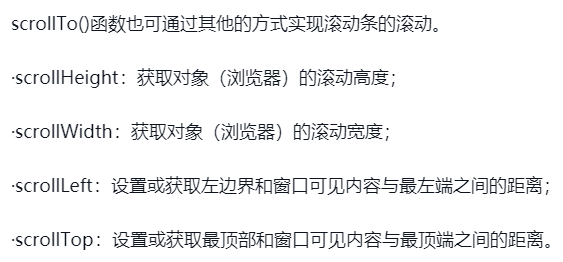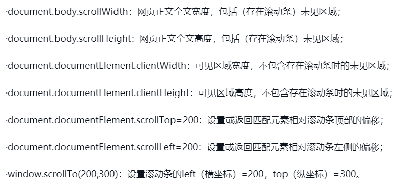
<a name="ptP3S"></a>
#### 其它操作

- 取消置灰
- 隐藏与可见
<a name="izZMm"></a>
### 17、操作画布

- Canvas 拥有绘制路径、矩形、圆形、字符及添加图像的方法
- Canvas 有两个属性，一个是宽度（width），另一个是高度（height），宽度和高度可以使用内联的属性
- 操作画布，可以通过 Action 与 JS 来实现
<a name="zuONr"></a>
## 三、不要直接使用 Chrome 里的 XPath

- 使用 requests 或者 Scrapy 时，拿到的是网页真正的源代码
- 在开发者工具里面的 HTML 代码，是经过 Chrome 浏览器修饰甚至大幅度增删后的 HTML 代码
- 写爬虫的时候，不仅仅是 Chrome 开发者工具里面复制的 XPath 仅作参考，甚至这个开发者工具里面显示的 HTML 代码也是仅作参考
- 应该首先检查需要的数据是不是在真正的源代码里面，然后再来确定是写 XPath 还是抓接口；如果是写 XPath，那么更应该以这个真正的源代码为准，而不是开发者工具里面的 HTML 代码
<a name="uq4PO"></a>
## 四、使用上下文管理器来强制关闭 Chromedriver

- 实现一个包含上下文管理器的程序
- 随意定义一个类，里面写好需要执行的逻辑
- 增加`__enter__(self)`方法，定义进入上下文管理器时返回的内容
- 增加`__exit__(self, exc_type, exc_val, exc_tb)`方法，定义退出上下文管理器时需要执行的代码
- `__enter__` 和 `__exit__` 需要成对使用，不能单独使用其中一个
- selenium 源码里面对 driver 类本身就已经支持上下文管理协议了，可以直接使用 `with...as...`语句而不需要再新建一个类
<a name="CfQj3"></a>
#### 创建一个 SafeDriver.py 文件
```python
from selenium.webdriver import Chrome

class SafeDriver:
    def __init__(self):
        self.driver = Chrome('./chromedriver')

    def __enter__(self):
        return self

    def __exit__(self, exc_type, exc_val, exc_tb):
        if self.driver:
            self.driver.quit()
```
<a name="O6Na1"></a>
#### 在另一个程序里面调用它
```python
from SafeDriver import SafeDriver

safe_driver = SafeDriver()
with safe_driver as driver:
    driver.driver.get('url')
    ……
```
<a name="jvje6"></a>
## 五、使用 selenium 无法提取到网页内容怎么办

- XPath 只能提取 Dom 树中的内容，但是伪元素是不属于 Dom 树的，因此无法提取；要提取伪元素，需要使用 CSS 选择器或者正则表达式来提取
- 需要把 CSS 和 HTML 放到一起来渲染，然后再使用 JavaScript 的 CSS 选择器找到需要提取的内容
```python
result = driver.execute_script("return window.getComputedStyle(document.querySelector('class 属性名'),'伪元素').getPropertyValue('键名')")
```

- shadow DOM 的行为跟 iframe 很像，都是把一段 HTML 信息嵌入到另一个 HTML 中
- `iframe` 被嵌入的地址需要额外再搭建一个 HTTP 服务，而 shadow DOM 可以只嵌入一段 HTML 代码，所以它比 iframe 更节省资源
- 需要使用 JavaScript 获取 shadow DOM，然后再进行提取
- 通过 JavaScript 找到 shadow-root 的父节点元素，然后返回这个元素的 `.shadowRoot`属性。在 Python 里面拿到这个属性以后，使用 `.find_element_by_class_name()` 方法获取里面的内容
- 拿到 shadow-root 节点以后，只能通过 CSS 选择器进一步筛选里面的内容，不能用 XPath，否则会导致报错
```python
shadow = driver.execute_script('return document.querySelector("父节点元素").shadowRoot')
content = shadow.find_element_by_class_name('xxx')
print(content.text)
```
<a name="Jmawl"></a>
## 六、不让浏览器切换标签页

- 如果要用一个 a 标签的链接在当前页面打开，只需要设置它的 `target` 属性值为 `_self`
- 打开开发者工具的 Console 选项卡，执行如下两行 JavaScript
```python
let a_list = document.getElementsByTagName('a')
[...a_list].map(a => {a.setAttribute('target', '_self')})
```

- 不适用于通过 JavaScript 的 `window.open()`函数打开新网址的情况
- 对于 `<form>` 标签的表单提交，也可以设置 `target="_self"` 属性
- 必须等页面完全加载完成才能执行这两行 JavaScript 语句；如果执行语句以后，页面通过 Ajax 或者其他途径又加载了新的 HTML，那么需要重新执行
- 每次打开新的链接以后，需要再次执行这两行语句
- 先通过 `Page.addScriptToEvaluateOnNewDocument` 让当前标签页的 `window.navigator.webdriver` 属性消失，等页面完全加载完成以后，再通过 `driver.execute_script()` 运行本文讲到的两行 JavaScript 代码，强迫网页在当前标签页打开新的链接
<a name="NFA4D"></a>
## 七、隐藏 selenium 的特征（基于 Chrome 88 以上版本）

- 在使用 Selenium 调用 Chrome 的时候，只需要增加一个配置参数：`chrome_options.add_argument('--disable-blink-features=AutomationControlled')`就可以再次隐藏 `window.navigator.webdriver` 了

检测网站：「[https://bot.sannysoft.com/](https://bot.sannysoft.com/)」
<a name="AQKSk"></a>
## 八、通用代码格式（基于 Chrome）
```python
from selenium import webdriver
from selenium.webdriver.common.by import By
from selenium.webdriver.support.ui import WebDriverWait
from selenium.webdriver.support import expected_conditions as EC
import time

options = webdriver.ChromeOptions()
prefs = {
        'download.prompt_for_download':False,
        'download.default_directory':'路径',
        'plugins.always_open_pdf_externally':True,
        'profile.default_content_settings.popups':0,
        }
options.add_experimental_option('prefs',prefs)
options.add_experimental_option("excludeSwitches", ["enable-automation"])
options.add_experimental_option('useAutomationExtension', False)
options.add_argument('--headless')
options.add_argument('user-agent=……')
options.add_argument('--disable-blink-features=AutomationControlled')


driver = webdriver.Chrome(chrme_options=options,executable_path='./chromedriver')

with open(stealth.min.js) as f:
  js = f.read()
  
driver.execute_cdp_cmd("Page.addScriptToEvaluateOnNewDocument", {
  "source": js
  """
    Object.defineProperty(navigator, 'webdriver', {
      get: () => undefined
    })
  """
})

driver.get(url)
time.sleep(n)
driver.maximize_window()
driver.save_screenshot(png_name)

driver.find_element(By.XX,value="xxx").click()

source = driver.page_source
with open('result,html','w') as f:
  f.write(source)

driver.quit()
```
