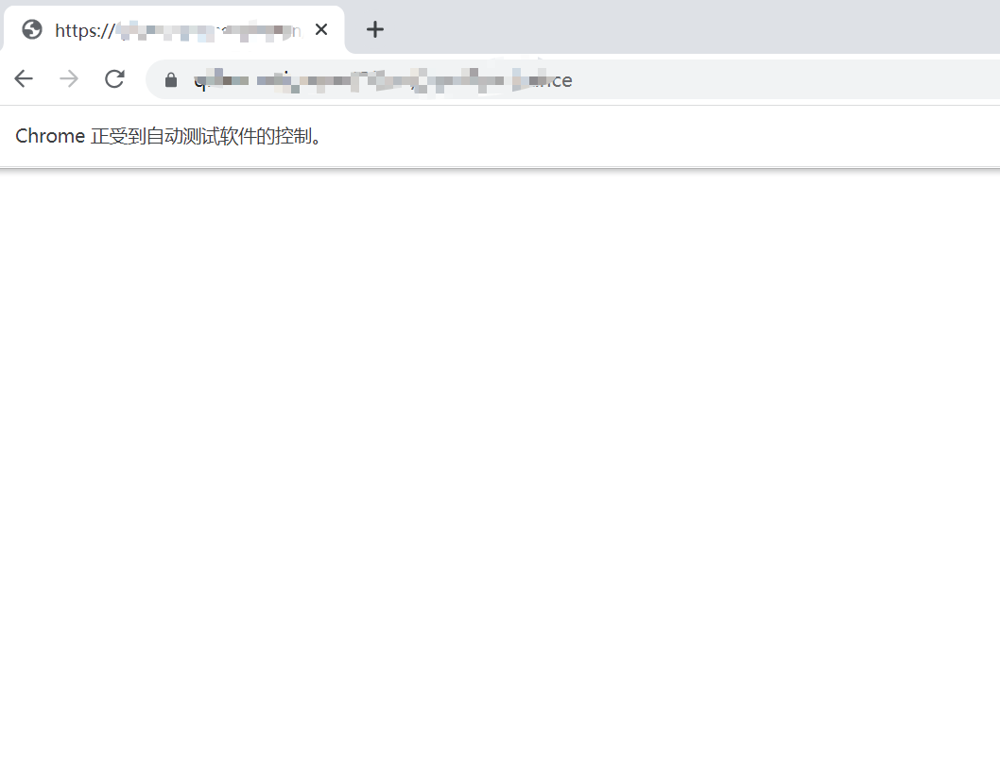

PythonSelenium<br />使用 Selenium 对网页进行爬虫时，如果不做任何处理直接进行爬取，会导致很多特征是暴露的，对一些做了反爬的网站，做了特征检测，用来阻止一些恶意爬虫。<br />这里介绍几种常用的隐藏浏览器指纹特征的方式。
<a name="PVOew"></a>
## 1、直接爬取
使用 Selenium 直接爬取目标页面
```python
# selenium 直接爬取

from selenium import webdriver
from selenium.webdriver.chrome.options import Options
from selenium.webdriver.chrome.service import Service
import time

chrome_options = Options()

s = Service(r"chromedriver.exe路径")

driver = webdriver.Chrome(service=s, options=chrome_options)

driver.get(url='URL')

driver.save_screenshot('result.png')

# 保存
source = driver.page_source
with open('result.html', 'w') as f:
    f.write(source)

time.sleep(200)
```
页面明显做了反爬，网页返回直接返回空白内容<br />
<a name="SSNfr"></a>
## 2、CDP
CDP 全称为 Chrome Devtools-Protocol<br />[https://chromedevtools.github.io/devtools-protocol/](https://chromedevtools.github.io/devtools-protocol/)<br />通过执行 CDP 命令，可以在网页加载前运行一段代码，进而改变浏览器的指纹特征。<br />比如，`window.navigator.webdriver` 在 Selenium 直接打开网页时返回结果为 true；而手动打开网页时，该对象值为 undefined。<br />因此，可以利用 CDP 命令修改该对象的值，达到隐藏指纹特征的目的。
```python
from selenium import webdriver
from selenium.webdriver.chrome.options import Options
from selenium.webdriver.chrome.service import Service
import time

chrome_options = Options()

s = Service(r"chromedriver.exe路径")

driver = webdriver.Chrome(service=s, options=chrome_options)

# 执行cdp命令，修改（window.navigator.webdriver ）对象的值
driver.execute_cdp_cmd("Page.addScriptToEvaluateOnNewDocument", {
    "source": """
            Object.defineProperty(navigator, 'webdriver', {
              get: () => undefined
            })
            """
})

driver.get(url='URL')

driver.save_screenshot('result.png')

# 保存
source = driver.page_source
with open('result.html', 'w', encoding='utf-8') as f:
    f.write(source)

time.sleep(200)
```
需要指出的是，浏览器的指纹特征很多，使用该方法存在一些局限性。
<a name="eA3R9"></a>
## 3、stealth.min.js
该文件包含了常用的浏览器特征，只需要读取该文件，然后执行 CDP 命令即可<br />下载地址：[https://github.com/berstend/puppeteer-extra/tree/stealth-js](https://github.com/berstend/puppeteer-extra/tree/stealth-js)
```python
from selenium import webdriver
from selenium.webdriver.chrome.options import Options
from selenium.webdriver.chrome.service import Service
from selenium.webdriver.common.by import By
import time

chrome_options = Options()

# 无头模式
# chrome_options.add_argument("--headless")

# 添加请求头
chrome_options.add_argument(
    'user-agent=Mozilla/5.0 (Windows NT 10.0; Win64; x64) AppleWebKit/537.36 (KHTML, like Gecko) Chrome/109.0.0.0 Safari/537.36')

s = Service(r"chromedriver.exe路径")

driver = webdriver.Chrome(service=s, options=chrome_options)

# 利用stealth.min.js隐藏浏览器指纹特征
# stealth.min.js下载地址：https://github.com/berstend/puppeteer-extra/tree/stealth-js
with open('./stealth.min.js') as f:
    driver.execute_cdp_cmd("Page.addScriptToEvaluateOnNewDocument", {
        "source": f.read()
    })

driver.get(url='URL')
# driver.get(url='https://bot.sannysoft.com/')

# 保存图片
driver.save_screenshot('result.png')

time.sleep(200)
```
<a name="ZFTrc"></a>
## 4、undetected_chromedriver
这是一个防止浏览器指纹特征被识别的依赖库，可以自动下载驱动配置再运行<br />项目地址：[https://github.com/ultrafunkamsterdam/undetected-chromedriver](https://github.com/ultrafunkamsterdam/undetected-chromedriver)<br />使用步骤也很方便，首先，安装依赖库
```bash
# 安装依赖
pip3 install undetected-chromedriver
```
然后，通过下面几行代码就能完美隐藏浏览器的指纹特征
```python
from selenium.webdriver.chrome.options import Options
from selenium.webdriver.chrome.service import Service
import time
import undetected_chromedriver as uc

chrome_options = Options()
# chrome_options.add_argument("--headless")

s = Service(r"chromedriver.exe")

driver = uc.Chrome(service=s, options=chrome_options)

driver.get(url='URL')
# driver.get(url='https://bot.sannysoft.com/')

driver.save_screenshot('result.png')
time.sleep(100)
```
<a name="Thw16"></a>
## 5、操作已开启的浏览器
只需要通过命令行启动一个浏览器
```python
import subprocess

# 1、打开浏览器
# 指定端口号为：1234
# 配置用户数据路径：--user-data-dir
cmd = 'C:\\Program Files\\Google\\Chrome\\Application\\chrome.exe --remote-debugging-port=1234 --user-data-dir="C:\\selenum\\user_data"'

subprocess.run(cmd)
```
然后，利用 Selenium 直接操作上面的浏览器即可模拟正常操作浏览器的行为
```python
import time
from selenium import webdriver
from selenium.webdriver.chrome.options import Options
from selenium.webdriver.chrome.service import Service

# 操作上面已经打开的浏览器，进行百度搜索
chrome_options = Options()

# 指定已经打开浏览器的地址及端口号
chrome_options.add_experimental_option("debuggerAddress", "127.0.0.1:1234")

# 注意：chrome版本与chromedirver驱动要保持一致
# 下载地址：http://chromedriver.storage.googleapis.com/index.html
s = Service(r"chromedriver.exe")

driver = webdriver.Chrome(service=s, options=chrome_options)

# 打开目标网站
driver.get(url="URL")

time.sleep(200)
```
<a name="P84Dv"></a>
## 6、最后
上面罗列出了多种应对网站反爬的解决方案，大家可以根据实际需求去选择适合自己的方案。
