Python 自动化 爬虫 Selenium
<a name="OypFV"></a>
## 准备工作
在开始后续功能演示之前，需要先安装Chrome浏览器并配置好ChromeDriver，当然也需要安装selenium库！
<a name="k8s59"></a>
### 1. 安装selenium库
```bash
pip install selenium
```
<a name="deskH"></a>
### 2. 安装浏览器驱动
其实，有两种方式安装浏览器驱动：一种是常见的手动安装，另一种则是利用第三方库自动安装。<br />以下前提：已经安装好了Chrome浏览器
<a name="Cxb6f"></a>
#### 手动安装
先查看本地Chrome浏览器版本：（两种方式均可）

- 在浏览器的地址栏键入Chrome://version，即可查看浏览器版本号

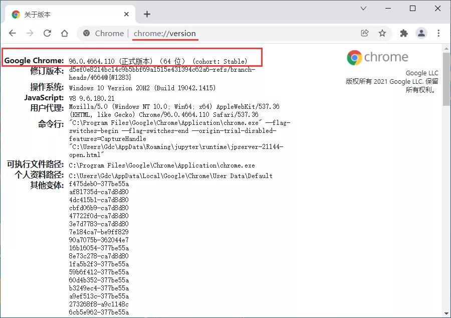

- 或者点击Chrome菜单 帮助→关于Google Chrome，查看浏览器版本号

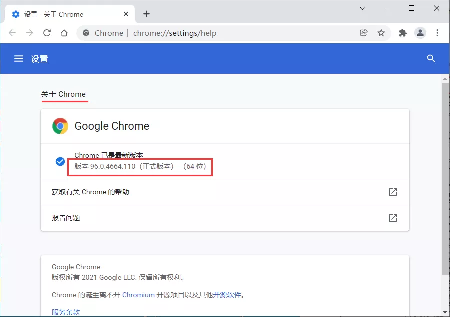<br />再选择对应版本号的驱动版本<br />下载地址：[https://chromedriver.storage.googleapis.com/index.html](https://chromedriver.storage.googleapis.com/index.html)<br />最后进行环境变量配置，也就是将对应的`ChromeDriver`的可执行文件`chromedriver.exe`文件拖到Python的Scripts目录下。<br />注：当然也可以不这样做，但是在调用的时候指定`chromedriver.exe`绝对路径亦可。
<a name="vw8re"></a>
#### 自动安装
自动安装需要用到第三方库`webdriver_manager`，先安装这个库，然后调用对应的方法即可。
```python
from selenium import webdriver
from selenium.webdriver.common.keys import Keys
from webdriver_manager.chrome import ChromeDriverManager

browser = webdriver.Chrome(ChromeDriverManager().install())

browser.get('http://www.baidu.com')
search = browser.find_element_by_id('kw')
search.send_keys('python')
search.send_keys(Keys.ENTER)

# 关闭浏览器
browser.close()
```
在上述代码中，`ChromeDriverManager().install()`方法就是自动安装驱动的操作，它会自动获取当前浏览器的版本并去下载对应的驱动到本地。
```python
====== WebDriver manager ======
Current google-chrome version is 96.0.4664
Get LATEST chromedriver version for 96.0.4664 google-chrome
There is no [win32] chromedriver for browser  in cache
Trying to download new driver from https://chromedriver.storage.googleapis.com/96.0.4664.45/chromedriver_win32.zip
Driver has been saved in cache [C:\Users\Gdc\.wdm\drivers\chromedriver\win32\96.0.4664.45]
```
如果本地已经有该浏览器渠道，则会提示其已存在。
```python
====== WebDriver manager ======
Current google-chrome version is 96.0.4664
Get LATEST driver version for 96.0.4664
Driver [C:\Users\Gdc\.wdm\drivers\chromedriver\win32\96.0.4664.45\chromedriver.exe] found in cache
```
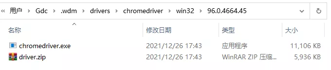<br />搞定以上准备工作，就可以开始正式内容的学习~
<a name="fr1bf"></a>
## 1、基本用法
从初始化浏览器对象、访问页面、设置浏览器大小、刷新页面和前进后退等基础操作。
<a name="gLC6f"></a>
### 1.1. 初始化浏览器对象
在准备工作部分提到需要将浏览器渠道添加到环境变量或者指定绝对路径，前者可以直接初始化后者则需要进行指定。
```python
from selenium import webdriver

# 初始化浏览器为chrome浏览器
browser = webdriver.Chrome()

# 指定绝对路径的方式
path = r'C:\Users\Fcant\.wdm\drivers\chromedriver\win32\96.0.4664.45\chromedriver.exe'
browser = webdriver.Chrome(path)

# 关闭浏览器
browser.close()
```
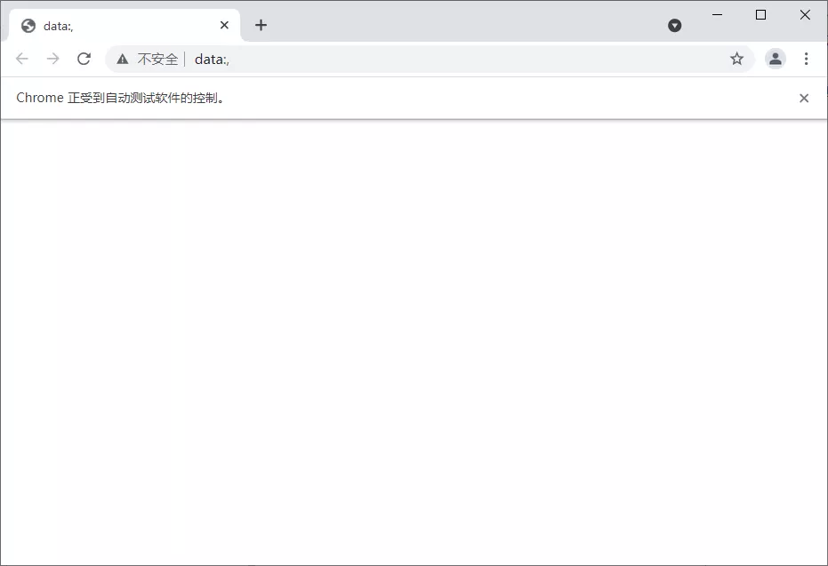<br />可以看到以上是有界面的浏览器，还可以初始化浏览器为无界面的浏览器。
```python
from selenium import webdriver

# 无界面的浏览器
option = webdriver.ChromeOptions()
option.add_argument("headless")
browser = webdriver.Chrome(options=option)

# 访问百度首页
browser.get(r'https://www.baidu.com/')
# 截图预览
browser.get_screenshot_as_file('截图.png')

# 关闭浏览器
browser.close()
```
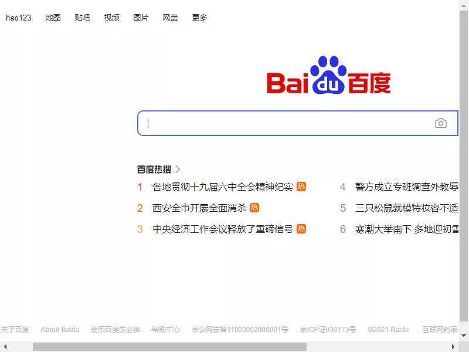<br />完成浏览器对象的初始化后并将其赋值给了`browser`对象，接下来就可以调用`browser`来执行各种方法模拟浏览器的操作了。
<a name="AAsuU"></a>
### 1.2. 访问页面
进行页面访问使用的是`get`方法，传入参数为待访问页面的`URL`地址即可。
```python
from selenium import webdriver

# 初始化浏览器为chrome浏览器
browser = webdriver.Chrome()

# 访问百度首页
browser.get(r'https://www.baidu.com/')

# 关闭浏览器
browser.close()
```
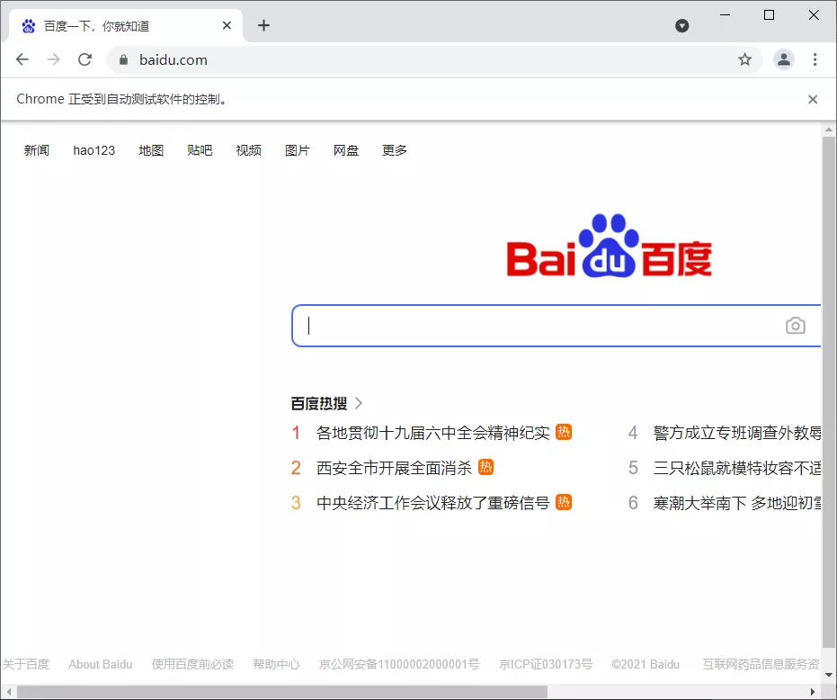
<a name="agBSV"></a>
### 1.3. 设置浏览器大小
`set_window_size()`方法可以用来设置浏览器大小（就是分辨率），而`maximize_window`则是设置浏览器为全屏！
```python
from selenium import webdriver
import time  

browser = webdriver.Chrome()

# 设置浏览器大小：全屏
browser.maximize_window()   
browser.get(r'https://www.baidu.com')  
time.sleep(2)

# 设置分辨率 500*500
browser.set_window_size(500,500)  
time.sleep(2)

# 设置分辨率 1000*800
browser.set_window_size(1000,800) 
time.sleep(2)

# 关闭浏览器
browser.close()
```
<a name="tfpfD"></a>
### 1.4. 刷新页面
刷新页面是在浏览器操作时很常用的操作，这里`refresh()`方法可以用来进行浏览器页面刷新。
```python
from selenium import webdriver
import time  

browser = webdriver.Chrome()

# 设置浏览器全屏
browser.maximize_window()   
browser.get(r'https://www.baidu.com')  
time.sleep(2)

try:
    # 刷新页面
    browser.refresh()  
    print('刷新页面')
except Exception as e:
    print('刷新失败')
   
# 关闭浏览器
browser.close()
```
可以自行演示看效果，同F5快捷键。
<a name="GN0J0"></a>
### 1.5. 前进后退
前进后退也是在使用浏览器时非常常见的操作，这里`forward()`方法可以用来实现前进，`back()`可以用来实现后退。
```python
from selenium import webdriver
import time  

browser = webdriver.Chrome()

# 设置浏览器全屏
browser.maximize_window()   
browser.get(r'https://www.baidu.com')  
time.sleep(2)

# 打开淘宝页面
browser.get(r'https://www.taobao.com')  
time.sleep(2)

# 后退到百度页面
browser.back()  
time.sleep(2)

# 前进的淘宝页面
browser.forward() 
time.sleep(2)

# 关闭浏览器
browser.close()
```
<a name="Yu9Hs"></a>
## 2、获取页面基础属性
当用selenium打开某个页面，有一些基础属性如网页标题、网址、浏览器名称、页面源码等信息。
```python
from selenium import webdriver

browser = webdriver.Chrome()
browser.get(r'https://www.baidu.com') 

# 网页标题
print(browser.title)
# 当前网址
print(browser.current_url)
# 浏览器名称
print(browser.name)
# 网页源码
print(browser.page_source)
```
输出如下：
```html
百度一下，你就知道
https://www.baidu.com/
chrome
<html><head><script async="" src="https://passport.baidu.com/passApi/js/wrapper.js?cdnversion=1640515789507&amp;_=1640515789298"></script><meta http-equiv="Content-Type" content="text/html;charset=utf-8"><meta http-equiv="X-UA-Compatible" content="IE=edge,chrome=1"><meta content="always" name="referrer"><meta name="theme-color"..."
```
需要注意的是，这里的页面源码就可以用正则表达式、Bs4、xpath以及pyquery等工具进行解析提取想要的信息了。
<a name="rni30"></a>
## 3、定位页面元素
在实际使用浏览器的时候，很重要的操作有输入文本、点击确定等等。对此，Selenium提供了一系列的方法来方便实现以上操作。常说的8种定位页面元素的操作方式一一演示一下！<br />以百度首页的搜索框节点为例，搜索python<br />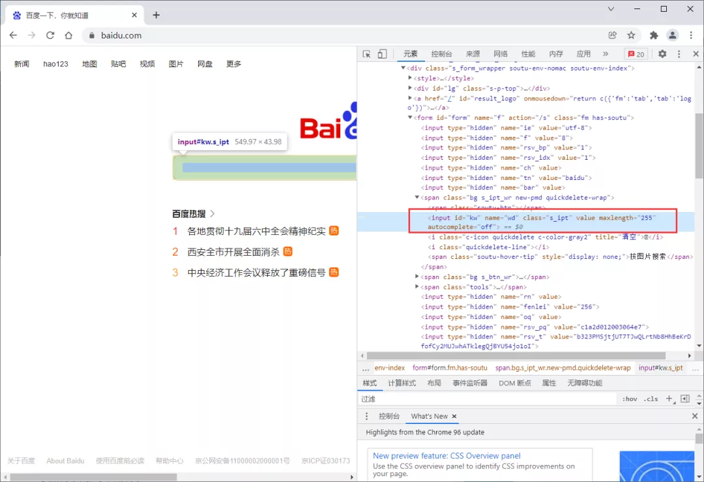<br />搜索框的html结构：
```html
<input id="kw" name="wd" class="s_ipt" value="" maxlength="255" autocomplete="off">
```
<a name="mHBF7"></a>
### 3.1. id定位
`find_element_by_id()`根据`id`属性获取，这里`id`属性是 `kw`
```python
from selenium import webdriver
import time  

browser = webdriver.Chrome()

browser.get(r'https://www.baidu.com')  
time.sleep(2)

# 在搜索框输入 python
browser.find_element_by_id('kw').send_keys('python')
time.sleep(2)

# 关闭浏览器
browser.close()
```
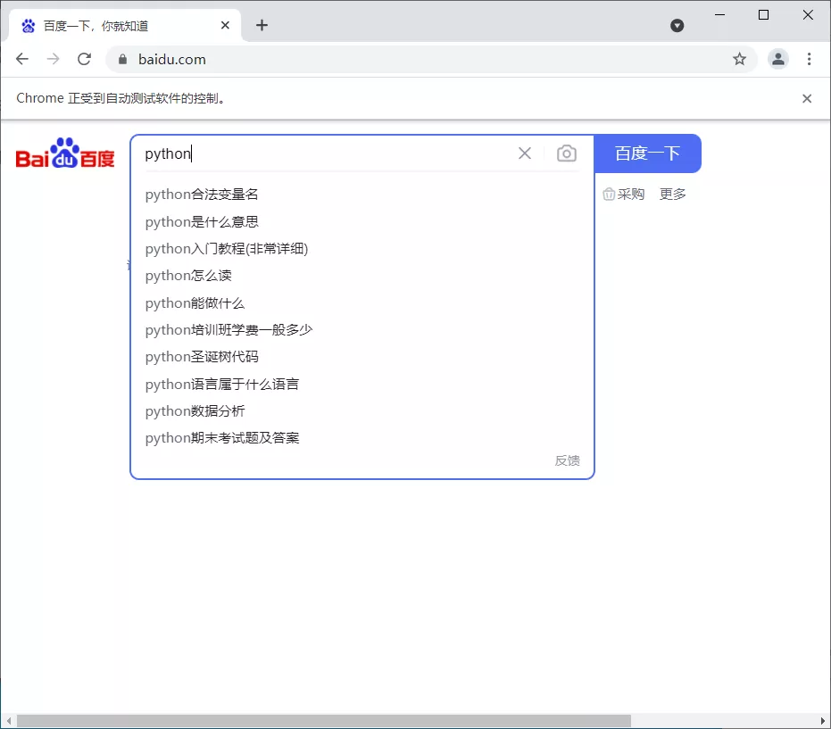
<a name="UlR2n"></a>
### 3.2. name定位
`find_element_by_name()`根据`name`属性获取，这里`name`属性是 `wd`
```python
from selenium import webdriver
import time  

browser = webdriver.Chrome()

browser.get(r'https://www.baidu.com')  
time.sleep(2)

# 在搜索框输入 python
browser.find_element_by_name('wd').send_keys('python')
time.sleep(2)

# 关闭浏览器
browser.close()
```
<a name="GfGee"></a>
### 3.3. class定位
`find_element_by_class_name()`根据`class`属性获取，这里`class`属性是`s_ipt`
```python
from selenium import webdriver
import time  

browser = webdriver.Chrome()

browser.get(r'https://www.baidu.com')  
time.sleep(2)

# 在搜索框输入 python
browser.find_element_by_class_name('s_ipt').send_keys('python')
time.sleep(2)

# 关闭浏览器
browser.close()
```
<a name="eqBjb"></a>
### 3.4. tag定位
HTML是通过`tag`来定义功能的，比如`input`是输入，`table`是表格等等。每个元素其实就是一个`tag`，一个`tag`往往用来定义一类功能，查看百度首页的`html`代码，可以看到有很多同类`tag`，所以其实很难通过`tag`去区分不同的元素。<br />`find_element_by_tag_name()`
```python
from selenium import webdriver
import time  

browser = webdriver.Chrome()

browser.get(r'https://www.baidu.com')  
time.sleep(2)

# 在搜索框输入 python
browser.find_element_by_tag_name('input').send_keys('python')
time.sleep(2)

# 关闭浏览器
browser.close()
```
由于存在多个`input`，以上代码会报错。
<a name="TuTjj"></a>
### 3.5. `link`定位
这种方法顾名思义就是用来定位文本链接的，比如百度首页上方的分类模块链接。<br />`find_element_by_link_text()`<br />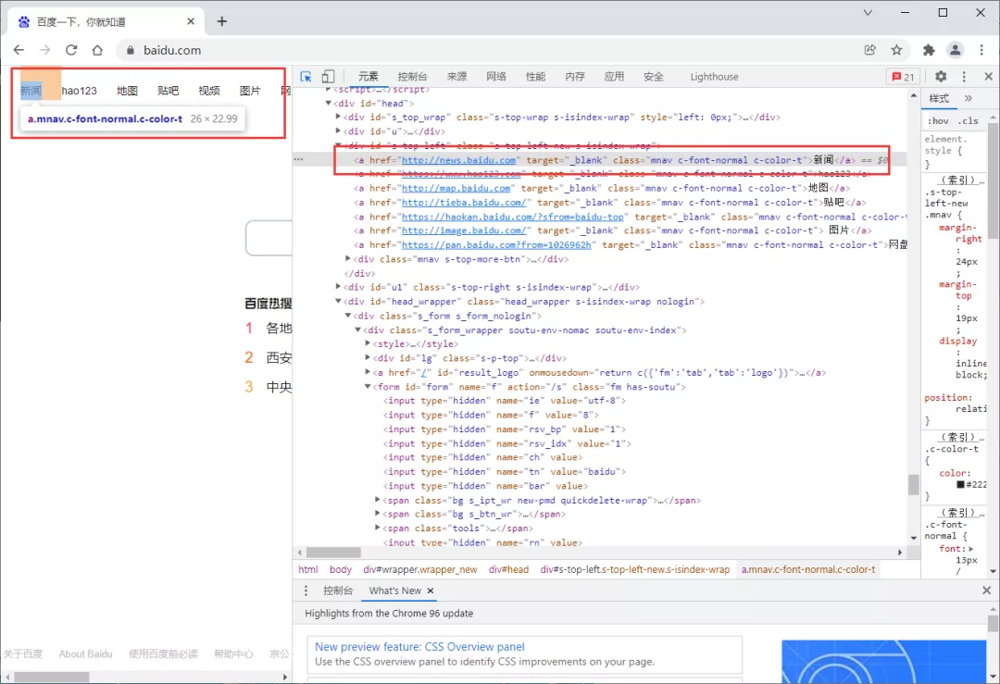<br />以新闻为例
```python
from selenium import webdriver
import time  

browser = webdriver.Chrome()

browser.get(r'https://www.baidu.com')  
time.sleep(2)

# 点击新闻 链接
browser.find_element_by_link_text('新闻').click()
time.sleep(2)

# 关闭浏览器全部页面
browser.quit()
```
<a name="BRDVO"></a>
### 3.6. `partial`定位
有时候一个超链接的文本很长，如果全部输入，既麻烦，又显得代码很不美观，这时候就可以只截取一部分字符串，用这种方法模糊匹配了。<br />`find_element_by_partial_link_text()`
```python
from selenium import webdriver
import time  

browser = webdriver.Chrome()

browser.get(r'https://www.baidu.com')  
time.sleep(2)

# 点击新闻 链接
browser.find_element_by_partial_link_text('闻').click()
time.sleep(2)

# 关闭浏览器全部页面
browser.quit()
```
<a name="cU9aC"></a>
### 3.7. `xpath`定位
前面介绍的几种定位方法都是在理想状态下，有一定使用范围的，那就是：在当前页面中，每个元素都有一个唯一的`id`或`name`或`class`或`超链接文本`的属性，那么就可以通过这个唯一的属性值来定位他们。<br />但是在实际工作中并非有这么美好，那么这个时候就只能通过`xpath`或者`css`来定位了。<br />`find_element_by_xpath()`
```python
from selenium import webdriver
import time  

browser = webdriver.Chrome()

browser.get(r'https://www.baidu.com')  
time.sleep(2)

# 在搜索框输入 python
browser.find_element_by_xpath("//*[@id='kw']").send_keys('python')
time.sleep(2)

# 关闭浏览器
browser.close()
```
<a name="WZ8gk"></a>
### 3.8. css定位
这种方法相对`xpath`要简洁些，定位速度也要快些。<br />`find_element_by_css_selector()`
```python
from selenium import webdriver
import time  

browser = webdriver.Chrome()

browser.get(r'https://www.baidu.com')  
time.sleep(2)

# 在搜索框输入 python
browser.find_element_by_css_selector('#kw').send_keys('python')
time.sleep(2)

# 关闭浏览器
browser.close()
```
<a name="bQYWZ"></a>
### 3.9. `find_element`的By定位
除了上述的8种定位方法，Selenium还提供了一个通用的方法`find_element()`，这个方法有两个参数：定位方式和定位值。
```python
# 使用前先导入By类
from selenium.webdriver.common.by import By
```
以上的操作可以等同于以下：
```python
browser.find_element(By.ID,'kw')
browser.find_element(By.NAME,'wd')
browser.find_element(By.CLASS_NAME,'s_ipt')
browser.find_element(By.TAG_NAME,'input')
browser.find_element(By.LINK_TEXT,'新闻')
browser.find_element(By.PARTIAL_LINK_TEXT,'闻')
browser.find_element(By.XPATH,'//*[@id="kw"]')
browser.find_element(By.CSS_SELECTOR,'#kw')
```
<a name="KqwuS"></a>
### 3.10. 多个元素
如果定位的目标元素在网页中不止一个，那么则需要用到`find_elements`，得到的结果会是列表形式。简单来说，就是element后面多了复数标识s，其他操作一致。
<a name="JpIO5"></a>
## 4、获取页面元素属性
既然有很多方式来定位页面的元素，那么接下来就可以考虑获取以下元素的属性了，尤其是用Selenium进行网络爬虫的时候。
<a name="mZrtT"></a>
### 4.1. `get_attribute`获取属性
以百度首页的logo为例，获取logo相关属性<br />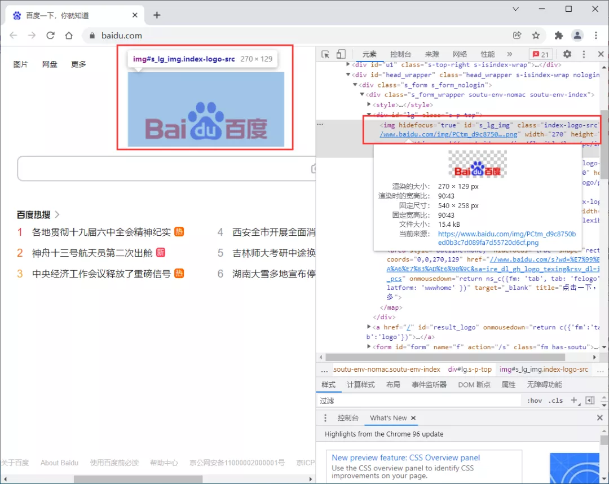
```html

```
获取logo的图片地址
```python
from selenium import webdriver
import time  

browser = webdriver.Chrome()

browser.get(r'https://www.baidu.com')  

logo = browser.find_element_by_class_name('index-logo-src')
print(logo)
print(logo.get_attribute('src'))

# 关闭浏览器
browser.close()
```
输出：
```html
<selenium.webdriver.remote.webelement.WebElement (session="e95b18c43a330745af019e0041f0a8a4", element="7dad5fc0-610b-45b6-b543-9e725ee6cc5d")>
https://www.baidu.com/img/PCtm_d9c8750bed0b3c7d089fa7d55720d6cf.png
```
<a name="B7zUx"></a>
### 4.2. 获取文本
以热榜为例，获取热榜文本和链接<br />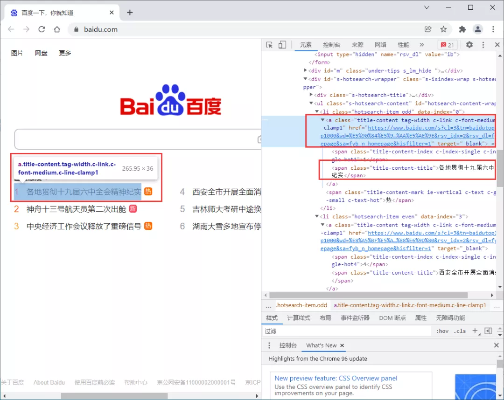
```html
<a class="title-content tag-width c-link c-font-medium c-line-clamp1" href="https://www.baidu.com/s?cl=3&amp;tn=baidutop10&amp;fr=top1000&amp;wd=%E5%90%84%E5%9C%B0%E8%B4%AF%E5%BD%BB%E5%8D%81%E4%B9%9D%E5%B1%8A%E5%85%AD%E4%B8%AD%E5%85%A8%E4%BC%9A%E7%B2%BE%E7%A5%9E%E7%BA%AA%E5%AE%9E&amp;rsv_idx=2&amp;rsv_dl=fyb_n_homepage&amp;sa=fyb_n_homepage&amp;hisfilter=1" target="_blank"><span class="title-content-index c-index-single c-index-single-hot1">1</span><span class="title-content-title">各地贯彻十九届六中全会精神纪实</span></a>
```
获取热榜的文本，用的是text属性，直接调用即可
```python
from selenium import webdriver
import time  

browser = webdriver.Chrome()

browser.get(r'https://www.baidu.com')  

logo = browser.find_element_by_css_selector('#hotsearch-content-wrapper > li:nth-child(1) > a')
print(logo.text)
print(logo.get_attribute('href'))

# 关闭浏览器
browser.close()
```
输出：
```python
1各地贯彻十九届六中全会精神纪实
https://www.baidu.com/s?cl=3&tn=baidutop10&fr=top1000&wd=%E5%90%84%E5%9C%B0%E8%B4%AF%E5%BD%BB%E5%8D%81%E4%B9%9D%E5%B1%8A%E5%85%AD%E4%B8%AD%E5%85%A8%E4%BC%9A%E7%B2%BE%E7%A5%9E%E7%BA%AA%E5%AE%9E&rsv_idx=2&rsv_dl=fyb_n_homepage&sa=fyb_n_homepage&hisfilter=1
```
<a name="nnX03"></a>
### 4.3. 获取其他属性
除了属性和文本值外，还有id、位置、标签名和大小等属性。
```python
from selenium import webdriver
import time  

browser = webdriver.Chrome()

browser.get(r'https://www.baidu.com')  

logo = browser.find_element_by_class_name('index-logo-src')
print(logo.id)
print(logo.location)
print(logo.tag_name)
print(logo.size)

# 关闭浏览器
browser.close()
```
输出：
```python
6af39c9b-70e8-4033-8a74-7201ae09d540
{'x': 490, 'y': 46}
img
{'height': 129, 'width': 270}
```
<a name="pjIZb"></a>
## 5、页面交互操作
页面交互就是在浏览器的各种操作，比如上面演示过的输入文本、点击链接等等，还有像清除文本、回车确认、单选框与多选框选中等。
<a name="soNUs"></a>
### 5.1. 输入文本
`send_keys()`
```python
from selenium import webdriver
import time  

browser = webdriver.Chrome()
browser.get(r'https://www.baidu.com')  
time.sleep(2)

# 定位搜索框
input = browser.find_element_by_class_name('s_ipt')
# 输入python
input.send_keys('python')
time.sleep(2)

# 关闭浏览器
browser.close()
```
<a name="zsLZ7"></a>
### 5.2. 点击
同样也用过这个点击操作。<br />`click()`
```python
from selenium import webdriver
import time  

browser = webdriver.Chrome()
browser.get(r'https://www.baidu.com')  
time.sleep(2)

# 选中新闻按钮
click = browser.find_element_by_link_text('新闻')
# 点击之
click.click()
time.sleep(2)

# 关闭浏览器全部页面
browser.quit()
```
<a name="lgtnR"></a>
### 5.3. 清除文本
既然有输入，这里也就有清除文本。<br />`clear()`
```python
from selenium import webdriver
import time  

browser = webdriver.Chrome()
browser.get(r'https://www.baidu.com')  
time.sleep(2)

# 定位搜索框
input = browser.find_element_by_class_name('s_ipt')
# 输入python
input.send_keys('python')
time.sleep(2)
# 清除python
input.clear()
time.sleep(2)

# 关闭浏览器
browser.close()
```
<a name="ILo2G"></a>
### 5.4. 回车确认
比如，在搜索框输入文本python，然后回车就出查询操作结果的情况。<br />`submit()`
```python
from selenium import webdriver
import time  

browser = webdriver.Chrome()
browser.get(r'https://www.baidu.com')  
time.sleep(2)

# 定位搜索框
input = browser.find_element_by_class_name('s_ipt')
# 输入python
input.send_keys('python')
time.sleep(2)
# 回车查询
input.submit()
time.sleep(5)

# 关闭浏览器
browser.close()
```
<a name="FyKlb"></a>
### 5.5. 单选
单选比较好操作，先定位需要单选的某个元素，然后点击一下即可。
<a name="oeguv"></a>
### 5.6. 多选
多选好像也比较容易，依次定位需要选择的元素，点击即可。
<a name="Yn0rq"></a>
### 5.7. 下拉框
下拉框的操作相对复杂一些，需要用到Select模块。<br />先导入该类
```python
from selenium.webdriver.support.select import Select
```
在select模块中有以下定位方法
```python
'''1、三种选择某一选项项的方法'''

select_by_index()           # 通过索引定位；注意：index索引是从“0”开始。
select_by_value()           # 通过value值定位，value标签的属性值。
select_by_visible_text()    # 通过文本值定位，即显示在下拉框的值。

'''2、三种返回options信息的方法'''

options                     # 返回select元素所有的options
all_selected_options        # 返回select元素中所有已选中的选项
first_selected_options      # 返回select元素中选中的第一个选项                  


'''3、四种取消选中项的方法'''

deselect_all                # 取消全部的已选择项
deselect_by_index           # 取消已选中的索引项
deselect_by_value           # 取消已选中的value值
deselect_by_visible_text    # 取消已选中的文本值
```
由于暂时没找到合适的网页，这边写了一个简单的网页本地测试
```html
<html>
    <body>
        <form>
            <select name="帅哥">
                <option value="才哥">才哥</option>
                <option value="小明" selected="">小明</option>
                <option value="小华">小华</option>
                <option value="草儿">小草</option>
            </select>
        </form>
    </body>
</html>
```
然后，再演示下拉框的不同选择的方式
```python
from selenium import webdriver
from selenium.webdriver.support.select import Select
import time

url = 'file:///C:/Users/Gdc/Desktop/帅哥.html'

browser = webdriver.Chrome()

browser.get(url)
time.sleep(2)

# 根据索引选择
Select(browser.find_element_by_name("帅哥")).select_by_index("2")
time.sleep(2)
# 根据value值选择
Select(browser.find_element_by_name("帅哥")).select_by_value("草儿")
time.sleep(2)
# 根据文本值选择
Select(browser.find_element_by_name("帅哥")).select_by_visible_text("才哥")
time.sleep(2)

# 关闭浏览器
browser.close()
```
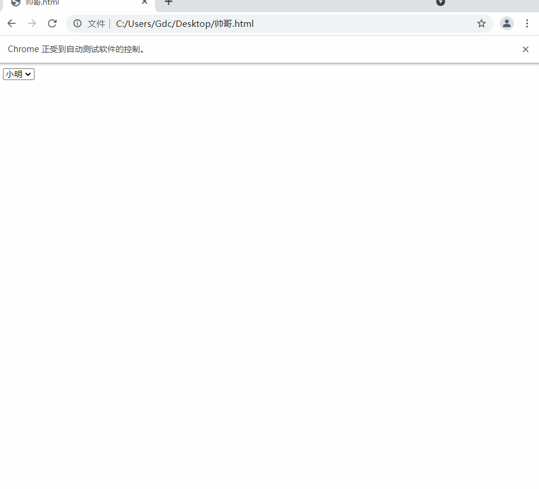
<a name="fcQhC"></a>
## 6. 多窗口切换
比如同一个页面的不同子页面的节点元素获取操作，不同选项卡之间的切换以及不同浏览器窗口之间的切换操作等等。
<a name="Ky2gI"></a>
### 6.1. Frame切换
Selenium打开一个页面之后，默认是在父页面进行操作，此时如果这个页面还有子页面，想要获取子页面的节点元素信息则需要切换到子页面进行擦走，这时候`switch_to.frame()`就来了。如果想回到父页面，用`switch_to.parent_frame()`即可。
<a name="cLch0"></a>
### 6.2. 选项卡切换
在访问网页的时候会打开很多个页面，在Selenium中提供了一些方法方便对这些页面进行操作。<br />`current_window_handle`：获取当前窗口的句柄。<br />`window_handles`：返回当前浏览器的所有窗口的句柄。<br />`switch_to_window()`：用于切换到对应的窗口。
```python
from selenium import webdriver
import time

browser = webdriver.Chrome()

# 打开百度
browser.get('http://www.baidu.com')
# 新建一个选项卡
browser.execute_script('window.open()')
print(browser.window_handles)
# 跳转到第二个选项卡并打开知乎
browser.switch_to.window(browser.window_handles[1])
browser.get('http://www.zhihu.com')
# 回到第一个选项卡并打开淘宝（原来的百度页面改为了淘宝）
time.sleep(2)
browser.switch_to.window(browser.window_handles[0])
browser.get('http://www.taobao.com')
```
<a name="vKAia"></a>
## 7、模拟鼠标操作
既然是模拟浏览器操作，自然也就需要能模拟鼠标的一些操作了，这里需要导入`ActionChains `类。
```python
from selenium.webdriver.common.action_chains import ActionChains
```
<a name="Qx7iB"></a>
### 7.1. 左键
这个其实就是页面交互操作中的点击`click()`操作。
<a name="SXlan"></a>
### 7.2. 右键`context_click()`
```python
from selenium.webdriver.common.action_chains import ActionChains
from selenium import webdriver
import time  

browser = webdriver.Chrome()
browser.get(r'https://www.baidu.com')  
time.sleep(2)

# 定位到要右击的元素，这里选的新闻链接
right_click = browser.find_element_by_link_text('新闻')

# 执行鼠标右键操作
ActionChains(browser).context_click(right_click).perform()
time.sleep(2)

# 关闭浏览器
browser.close()
```
在上述操作中<br />`ActionChains(browser)`：调用`ActionChains()`类，并将浏览器驱动browser作为参数传入<br />`context_click(right_click)`：模拟鼠标双击，需要传入指定元素定位作为参数<br />`perform()`：执行`ActionChains()`中储存的所有操作，可以看做是执行之前一系列的操作
<a name="wQzD3"></a>
### 7.3. 双击`double_click()`
```python
from selenium.webdriver.common.action_chains import ActionChains
from selenium import webdriver
import time  

browser = webdriver.Chrome()
browser.get(r'https://www.baidu.com')  
time.sleep(2)

# 定位到要双击的元素
double_click = browser.find_element_by_css_selector('#bottom_layer > div > p:nth-child(8) > span')

# 双击
ActionChains(browser).double_click(double_click).perform()
time.sleep(15)

# 关闭浏览器
browser.close()
```
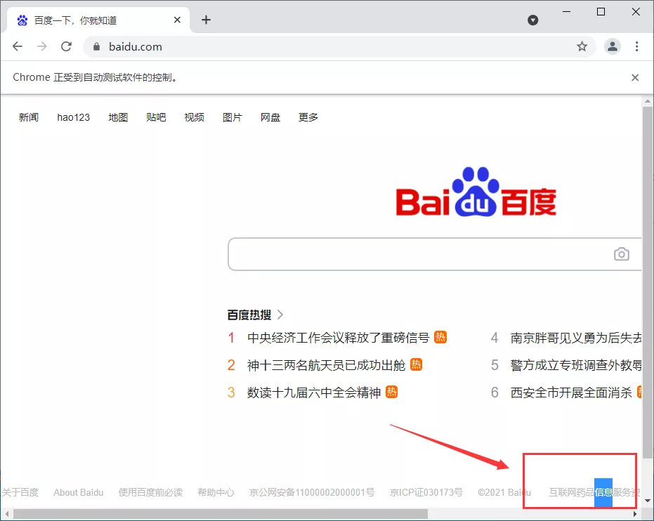
<a name="e9yd4"></a>
### 7.4. 拖拽`drag_and_drop(source,target)`
拖拽操作，开始位置和结束位置需要被指定，这个常用于滑块类验证码的操作之类。<br />以菜鸟教程的一个案例来进行演示：https://www.runoob.com/try/try.php?filename=jqueryui-api-droppable
```python
from selenium.webdriver.common.action_chains import ActionChains
from selenium import webdriver
import time  

browser = webdriver.Chrome()
url = 'https://www.runoob.com/try/try.php?filename=jqueryui-api-droppable'
browser.get(url)  
time.sleep(2)

browser.switch_to.frame('iframeResult')

# 开始位置
source = browser.find_element_by_css_selector("#draggable")

# 结束位置
target = browser.find_element_by_css_selector("#droppable")

# 执行元素的拖放操作
actions = ActionChains(browser)
actions.drag_and_drop(source, target)
actions.perform()
# 拖拽
time.sleep(15)

# 关闭浏览器
browser.close()
```
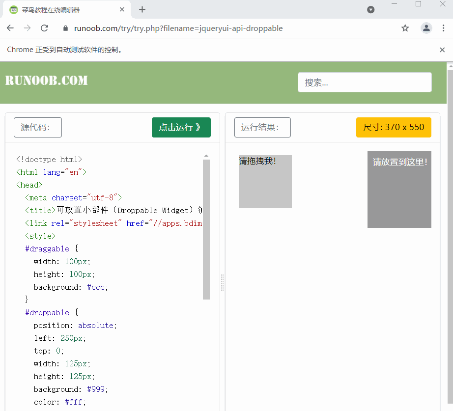
<a name="a6qAe"></a>
### 7.5. 悬停`move_to_element()`
```python
from selenium.webdriver.common.action_chains import ActionChains
from selenium import webdriver
import time  

browser = webdriver.Chrome()
url = 'https://www.baidu.com'
browser.get(url)  
time.sleep(2)

# 定位悬停的位置
move = browser.find_element_by_css_selector("#form > span.bg.s_ipt_wr.new-pmd.quickdelete-wrap > span.soutu-btn")

# 悬停操作
ActionChains(browser).move_to_element(move).perform()
time.sleep(5)

# 关闭浏览器
browser.close()
```
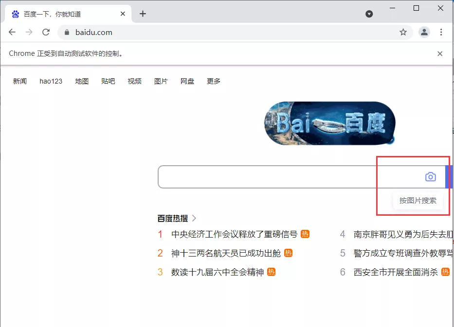
<a name="WXKMy"></a>
## 8、模拟键盘操作
selenium中的`Keys()`类提供了大部分的键盘操作方法，通过`send_keys()`方法来模拟键盘上的按键。<br />引入`Keys`类
```python
from selenium.webdriver.common.keys import Keys
```
常见的键盘操作<br />`send_keys(Keys.BACK_SPACE)`：删除键(BackSpace)<br />`send_keys(Keys.SPACE)`：空格键(Space)<br />`send_keys(Keys.TAB)`：制表键(TAB)<br />`send_keys(Keys.ESCAPE)`：回退键(ESCAPE)<br />`send_keys(Keys.ENTER)`：回车键(ENTER)<br />`send_keys(Keys.CONTRL,'a')`：全选(Ctrl+A)<br />`send_keys(Keys.CONTRL,'c')`：复制(Ctrl+C)<br />`send_keys(Keys.CONTRL,'x')`：剪切(Ctrl+X)<br />`send_keys(Keys.CONTRL,'v')`：粘贴(Ctrl+V)<br />`send_keys(Keys.F1)`：键盘F1<br />.....<br />`send_keys(Keys.F12)`：键盘F12<br />实例操作演示：<br />定位需要操作的元素，然后操作即可！
```python
from selenium.webdriver.common.keys import Keys
from selenium import webdriver
import time

browser = webdriver.Chrome()
url = 'https://www.baidu.com'
browser.get(url)  
time.sleep(2)

# 定位搜索框
input = browser.find_element_by_class_name('s_ipt')
# 输入python
input.send_keys('python')
time.sleep(2)

# 回车
input.send_keys(Keys.ENTER)
time.sleep(5)

# 关闭浏览器
browser.close()
```
<a name="crSuW"></a>
## 9、延时等待
如果遇到使用ajax加载的网页，页面元素可能不是同时加载出来的，这个时候尝试在get方法执行完成时获取网页源代码可能并非浏览器完全加载完成的页面。所以，这种情况下需要设置延时等待一定时间，确保全部节点都加载出来。<br />三种方式可以来玩玩：强制等待、隐式等待和显式等待
<a name="JXj33"></a>
### 9.1. 强制等待
就很简单了，直接`time.sleep(n)`强制等待n秒，在执行`get`方法之后执行。
<a name="Z3gRL"></a>
### 9.2. 隐式等待
`implicitly_wait()`设置等待时间，如果到时间有元素节点没有加载出来，就会抛出异常。
```python
from selenium import webdriver

browser = webdriver.Chrome()

# 隐式等待，等待时间10秒
browser.implicitly_wait(10)  

browser.get('https://www.baidu.com')
print(browser.current_url)
print(browser.title)

# 关闭浏览器
browser.close()
```
<a name="qoJ5Z"></a>
### 9.3. 显式等待
设置一个等待时间和一个条件，在规定时间内，每隔一段时间查看下条件是否成立，如果成立那么程序就继续执行，否则就抛出一个超时异常。
```python
from selenium import webdriver
from selenium.webdriver.support.wait import WebDriverWait
from selenium.webdriver.support import expected_conditions as EC
from selenium.webdriver.common.by import By
import time

browser = webdriver.Chrome()
browser.get('https://www.baidu.com')
# 设置等待时间10s
wait = WebDriverWait(browser, 10)
# 设置判断条件：等待id='kw'的元素加载完成
input = wait.until(EC.presence_of_element_located((By.ID, 'kw')))
# 在关键词输入：关键词
input.send_keys('Python')

# 关闭浏览器
time.sleep(2)
browser.close()
```
WebDriverWait的参数说明：<br />`WebDriverWait(driver,timeout,poll_frequency=0.5,ignored_exceptions=None)`<br />`driver`: 浏览器驱动<br />`timeout`: 超时时间，等待的最长时间（同时要考虑隐性等待时间）<br />`poll_frequency`: 每次检测的间隔时间，默认是0.5秒<br />`ignored_exceptions`: 超时后的异常信息，默认情况下抛出NoSuchElementException异常<br />`until(method,message='')`<br />`method`: 在等待期间，每隔一段时间调用这个传入的方法，直到返回值不是False<br />`message`: 如果超时，抛出TimeoutException，将message传入异常<br />`until_not(method,message='')`<br />`until_not` 与`until`相反，`until`是当某元素出现或什么条件成立则继续执行，`until_not`是当某元素消失或什么条件不成立则继续执行，参数也相同。<br />其他等待条件
```python
from selenium.webdriver.support import expected_conditions as EC

# 判断标题是否和预期的一致
title_is
# 判断标题中是否包含预期的字符串
title_contains

# 判断指定元素是否加载出来
presence_of_element_located
# 判断所有元素是否加载完成
presence_of_all_elements_located

# 判断某个元素是否可见. 可见代表元素非隐藏，并且元素的宽和高都不等于0，传入参数是元组类型的locator
visibility_of_element_located
# 判断元素是否可见，传入参数是定位后的元素WebElement
visibility_of
# 判断某个元素是否不可见，或是否不存在于DOM树
invisibility_of_element_located

# 判断元素的 text 是否包含预期字符串
text_to_be_present_in_element
# 判断元素的 value 是否包含预期字符串
text_to_be_present_in_element_value

#判断frame是否可切入，可传入locator元组或者直接传入定位方式：id、name、index或WebElement
frame_to_be_available_and_switch_to_it

#判断是否有alert出现
alert_is_present

#判断元素是否可点击
element_to_be_clickable

# 判断元素是否被选中,一般用在下拉列表，传入WebElement对象
element_to_be_selected
# 判断元素是否被选中
element_located_to_be_selected
# 判断元素的选中状态是否和预期一致，传入参数：定位后的元素，相等返回True，否则返回False
element_selection_state_to_be
# 判断元素的选中状态是否和预期一致，传入参数：元素的定位，相等返回True，否则返回False
element_located_selection_state_to_be

#判断一个元素是否仍在DOM中，传入WebElement对象，可以判断页面是否刷新了
staleness_of
```
<a name="q3qrI"></a>
## 10、其他
补充一些
<a name="IaT96"></a>
### 10.1. 运行JavaScript
还有一些操作，比如下拉进度条，模拟javaScript，使用`execute_script`方法来实现。
```python
from selenium import webdriver

browser = webdriver.Chrome()
# 知乎发现页
browser.get('https://www.zhihu.com/explore')

browser.execute_script('window.scrollTo(0, document.body.scrollHeight)')
browser.execute_script('alert("To Bottom")')
```
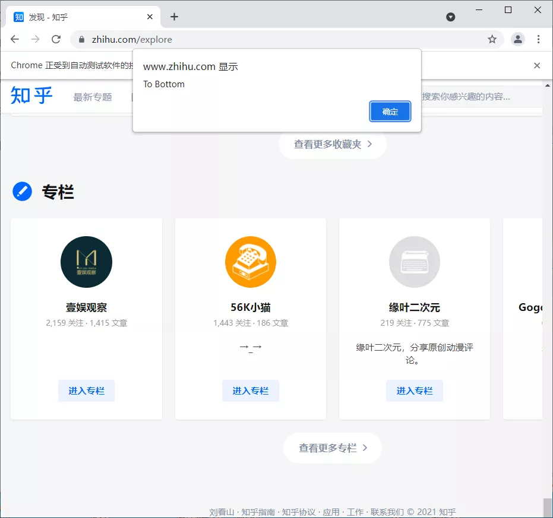
<a name="X4fEH"></a>
### 10.2. Cookie
在selenium使用过程中，还可以很方便对Cookie进行获取、添加与删除等操作。
```python
from selenium import webdriver

browser = webdriver.Chrome()
# 知乎发现页
browser.get('https://www.zhihu.com/explore')
# 获取cookie
print(f'Cookies的值：{browser.get_cookies()}')
# 添加cookie
browser.add_cookie({'name':'才哥', 'value':'帅哥'})
print(f'添加后Cookies的值：{browser.get_cookies()}')
# 删除cookie
browser.delete_all_cookies()
print(f'删除后Cookies的值：{browser.get_cookies()}')
```
输出：
```python
Cookies的值：[{'domain': '.zhihu.com', 'httpOnly': False, 'name': 'Hm_lpvt_98beee57fd2ef70ccdd5ca52b9740c49', 'path': '/', 'secure': False, 'value': '1640537860'}, {'domain': '.zhihu.com', ...]
添加后Cookies的值：[{'domain': 'www.zhihu.com', 'httpOnly': False, 'name': '才哥', 'path': '/', 'secure': True, 'value': '帅哥'}, {'domain': '.zhihu.com', 'httpOnly': False, 'name': 'Hm_lpvt_98beee57fd2ef70ccdd5ca52b9740c49', 'path': '/', 'secure': False, 'value': '1640537860'}, {'domain': '.zhihu.com',...]
删除后Cookies的值：[]
```
<a name="TVwPI"></a>
### 10.3. 反屏蔽
发现美团直接给Selenium给屏蔽了，不知道怎么搞！！
