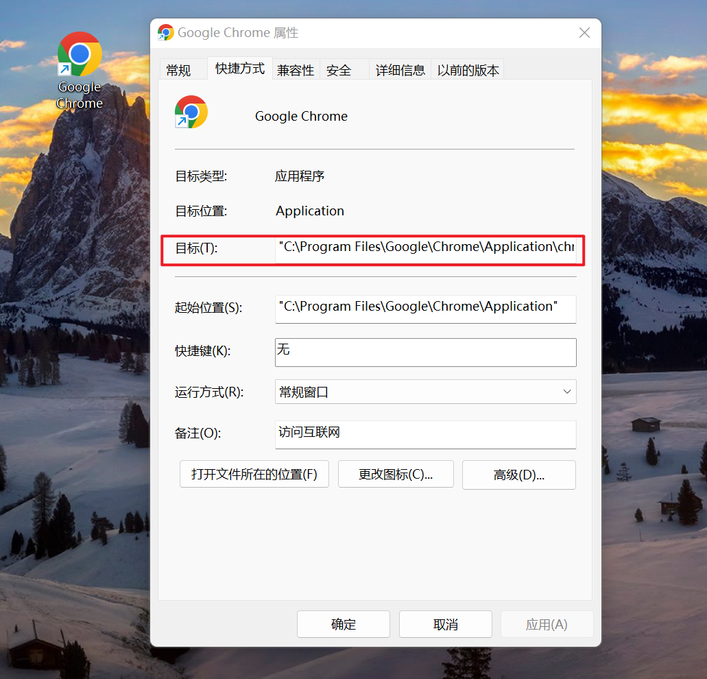

PythonSelenium<br />在对某些网站进行爬虫时，如果该网站做了限制，必须完成登录才能展示数据，而且只能通过短信验证码才能登录<br />这时候，可以通过一个已经开启的浏览器完成登录，然后利用程序继续操作这个浏览器，即可以完成数据的爬取了<br />具体操作步骤如下：
<a name="KdKBA"></a>
### 1、安装依赖
```bash
# 安装依赖
pip3 install selenium
```
<a name="QUZCv"></a>
### 2、Chrome 应用完整路径
右键查看 Chrome 浏览器的完整路径<br />比如：C:\Program Files\Google\Chrome\Application\chrome.exe<br />
<a name="aPQ21"></a>
### 3、命令行启动浏览器
接下来，在 CMD 终端中通过命令行启动 Chrome 浏览器
```powershell
# 启动浏览器
cd C:\Program Files\Google\Chrome\Application && chrome.exe --remote-debugging-port=1234 --user-data-dir=“C:\selenum\user_data”
```
其中

- `--remote-debugging-port`

指定浏览器调试端口号<br />PS：这里可以随机指定一个端口号，不要指定为已经被占用的端口号

- `--user-data-dir`

用户配置文件目录<br />这里需要单独指定一个文件夹目录（不存在会新建），如果不显式指定该参数，运行会污染浏览器默认的配置文件
<a name="A2zbv"></a>
### 4、下载 ChromeDriver
根据 Chrome 浏览器版本下载对应的 ChromeDriver 驱动移动到某一个目录下<br />下载地址：[http://chromedriver.storage.googleapis.com/index.html](http://chromedriver.storage.googleapis.com/index.html)
<a name="vpNiO"></a>
### 5、操作已打开的浏览器
假设上面开启的浏览器打开百度首页，现在编写一个简单的程序来继续操作上面的浏览器<br />注意的是，这里需要利用 debuggerAddress 指定浏览器的地址及端口号
```python
from selenium import webdriver
from selenium.webdriver.chrome.options import Options
from selenium.webdriver.chrome.service import Service
from selenium.webdriver.common.by import By

chrome_options = Options()

# 指定已经打开浏览器的地址及端口号
chrome_options.add_experimental_option("debuggerAddress", "127.0.0.1:1234")

# 注意：chrome版本与chromedirver驱动要保持一致
# 下载地址：http://chromedriver.storage.googleapis.com/index.html
s = Service(r"C:\Users\xingag\Desktop\111\chromedriver.exe")

driver = webdriver.Chrome(service=s, options=chrome_options)

# 操作浏览器
input_element = driver.find_element(By.ID, 'kw')

if input_element:
    # 关键字
    input_element.send_keys("AirPython")

    submit_element = driver.find_element(By.ID, 'su')

    if submit_element:
        # 点击搜索
        submit_element.click()

# 释放资源
# driver.close()
```

