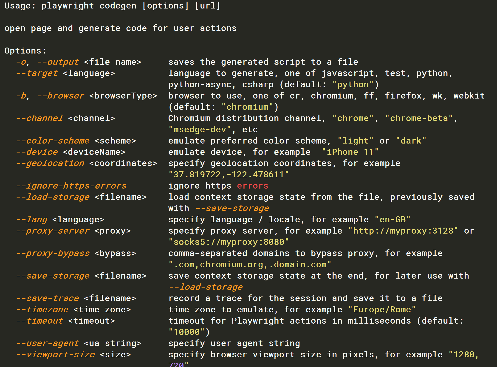

Python 爬虫<br />Playwright 是微软出的一款自动化测试工具，在做爬虫的时候，只需要点点点操作就能将代码录下来，用 python 脚本运行。有非常强大的 API，完全满足爬虫的需要。
<a name="fNKoH"></a>
## 安装
需要安装 playwright 第三方模块和Chromium、Firefox、WebKit等浏览器的驱动文件。
```bash
pip install playwright

python -m playwright install
```
<a name="OGkrI"></a>
## 录制
playwright 在抓取页面的时候是不需要太多写代码的，录制就完事了。首先看看有哪些命令参数：
```bash
python -m playwright codegen --help
```
<br />这里有好几个选项：

- `-o`：输出的代码文件的名称
- `--target`：语言：默认为 python，python-async 自动生成的是异步模块的代码
- `-b`：用的浏览器
- `--time`：页面超时时间

将脚本文件存放在 D 盘的 playwright_demo.py 中。
```bash
# 命令行键入
python -m playwright codegen -o D:\playwright_demo.py
```
打开 D:\playwright_demo.py 在代码中可以看到：
```python
browser = playwright.chromium.launch(headless=False)
```
headless 是 False 的时候会出现浏览器，如果是 True 就以没有浏览器的方式启动。
<a name="X9KTJ"></a>
## Page
Page 就是单独的一个浏览器 tab 标签（第一种）创建，也可以是 a 标签中 `target="_blank"` 打开的 tab 标签（第二种）创建。
```python
# 1
page = context.new_page()

page.goto("https://www.jd.com/")

# 2
with page.expect_popup() as popup_info:
    page.click("[aria-label=\"OPPO A96 8+256GB 琉璃幻彩 小星环 呼吸灯 高通八核5G芯片 33W快充 OLED超清护眼屏 拍照5G手机oppoa96\"] >> text=¥")
page3 = popup_info.value

page3.wait_for_load_state()
print(page3.title())
```
<a name="by8CJ"></a>
### 方法
page 有多个常用的方法：`on`、`goto`、`fill`、`inner_html`、`content`、`query_selector`、`query_selector_all` 等等。
<a name="b3Txz"></a>
#### 一、`goto()`：用于跳转网址。
<a name="IlbDe"></a>
#### 二、`on()`：事件的监听，可以用来监听浏览器中发生的任何事件，如：`close`、`console`、`download`、`request`、`response` 等等。
用来监听 `request` 请求，打印出 post 的提交数据和请求地址：
```python
def on_request(request):
    print('--------start---------')
    print(request.url)
    print(request.post_data)
    print('--------start---------')

def run(playwright: Playwright) -> None:
    browser = playwright.chromium.launch(headless=False)
    context = browser.new_context()
    
    # Open new page
    page = context.new_page()

    page.on('request', on_request)

    page.goto("https://www.baidu.com/")

    context.close()
    browser.close()
```
用来监听 `response` 响应，并打印出百度中的 png 结尾的图片：
```python
from playwright.sync_api import Playwright, sync_playwright
import time

def on_response(response):
    if '.png' in response.url:
        with open('D:\image\\'+str(int(time.time()))+ '.png', 'wb') as f:
            f.write(response.body())

def run(playwright: Playwright) -> None:
    browser = playwright.chromium.launch(headless=False)
    context = browser.new_context()
    
    # Open new page
    page = context.new_page()

    page.on('response', on_response)

    page.goto("https://www.baidu.com/")


    context.close()
    browser.close()
```
<a name="RUxta"></a>
#### 三、`fill()` 用于填写 input 框，在百度搜索框中写入 111：
```python
page.fill("input[name=\"wd\"]", "111")
```
<a name="Rge68"></a>
#### 四、`inner_html()`、`content()` 获取页面源代码：
```python
page.inner_html('//html')

page.content()
```
<a name="aJt0L"></a>
#### 五、`query_selector` 选择一个节点，当匹配到多个节点，只会返回第一个，获取 `class='toindex'` 的文本：
```python
handle = page.query_selector('.toindex')
print(handle.text_content())
```
<a name="Ld68V"></a>
#### 六、`query_selector_all` 选择所有的节点，获取百度页面上所有 input 的 name：
```python
handles = page.query_selector_all('input')
for item in handles:
    print(item.get_attribute('name'))
```
<a name="bgiDt"></a>
## 选择器
<a name="z9UGn"></a>
### Text 选择器
以 jd 网站为例：下面两行可以选择登录或者注册。
```python
page.click("text=你好，请登录")
    
page.click("text=免费注册")
```
`text=`后面也可以写正则表达式，比如：`text=/Log\s*in/i` 就可以匹配 `Login` 或者 `log IN`<br />如果不确定是否存在某个 text 也可以使用 `:has-text('Log')`
<a name="tQGns"></a>
### CSS 选择器
CSS 选择器就是使用的默认 CSS 引擎。Playwright 也自定义了一些伪类：`:visible`、`:text`、`:has` 等等。
<a name="yufYn"></a>
#### 用 id 的方式登录到京东网站：
```python
page.click('#loginsubmit')
```
<a name="qVO0j"></a>
#### 根据节点的属性选择：
```python
page.click('[aria-label="搜索"]')
```
<a name="xAJIM"></a>
#### 根据 CSS 和文本选择：
```python
page.click('a:has-text("电脑")')

page.click("[aria-label=\"OPPO A96 8+256GB 琉璃幻彩 小星环 呼吸灯 高通八核5G芯片 33W快充 OLED超清护眼屏 拍照5G手机oppoa96\"] >> text=¥")
```
<a name="Hjv37"></a>
#### 根据 CSS 和子节点选择
li、img 是标签， seckill_mod_goods_link_img 是 img 的 class 值：
```python
page.click('li:has(img.seckill_mod_goods_link_img)')
```
<a name="gOWbg"></a>
### XPath
Playwright 支持 XPath 选择元素，自动化录制 python 脚本一般是使用的 text 而不是 Xpath。
```python
page.click("//span[contains(@class, 'spinner__loading')]|//div[@id='confirmation']")
```
<a name="j38Ut"></a>
### N-th
N-th 选择第几个：
<a name="Uio6P"></a>
#### 点击第一个按钮
```python
page.click("button >> nth=0")
```
<a name="BZenn"></a>
#### 点击最后一个按钮
```python
page.click("button >> nth=-1")
```
<a name="aXb9b"></a>
## 总结
这里介绍了 Playwright 的用法和部分 api，抓取一个网站主要的操作就是获取 url 地址、参考 post 数据、request、response、元素等。还有大量的 api 可以参考官方网站。
<a name="iZJe7"></a>
## 参考
[https://playwright.dev/python/docs/api/class-playwright](https://playwright.dev/python/docs/api/class-playwright)
