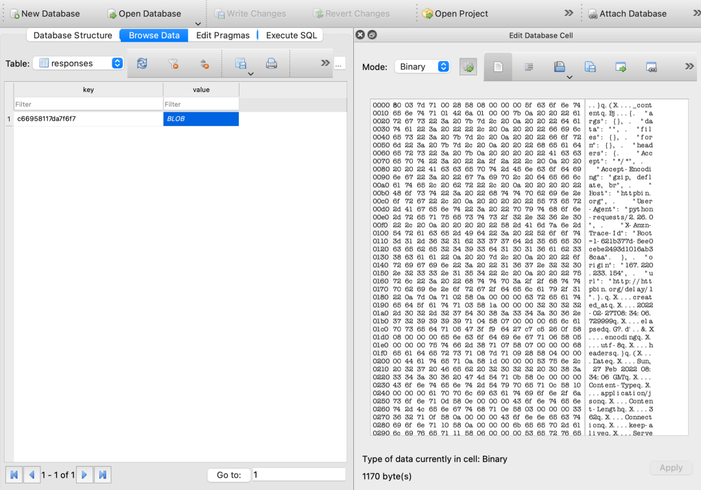

Python 爬虫<br />在做爬虫的时候，往往可能这些情况：

- 网站比较复杂，会碰到很多重复请求。
- 有时候爬虫意外中断了，但没有保存爬取状态，再次运行就需要重新爬取。

还有诸如此类的问题。<br />那怎么解决这些重复爬取的问题呢？大家很可能都想到了“缓存”，也就是说，爬取过一遍就直接跳过爬取。<br />那一般怎么做呢？<br />比如写一个逻辑，把已经爬取过的 URL 保存到文件或者数据库里面，每次爬取之前检查一下是不是在列表或数据库里面就好了。<br />是的，这个思路没问题，但有没有想过这些问题：

- 写入到文件或者数据库可能是永久性的，如果想控制缓存的有效时间，那就还得有个过期时间控制。
- 这个缓存根据什么来判断？如果仅仅是 URL 本身够吗？还有 Request Method、Request Headers 呢，如果它们不一样了，那还要不要用缓存？
- 如果有好多项目，难道都没有一个通用的解决方案吗？

的确是些问题，实现起来确实要考虑很多问题。这里介绍一个神器，可以解决如上的问题。
<a name="V5bml"></a>
## 介绍
它就是 requests-cache，是 requests 库的一个扩展包，利用它可以非常方便地实现请求的缓存，直接得到对应的爬取结果。

- GitHub：[https://github.com/reclosedev/requests-cache](https://github.com/reclosedev/requests-cache)
- PyPi：[https://pypi.org/project/requests-cache/](https://pypi.org/project/requests-cache/)
- 官方文档：[https://requests-cache.readthedocs.io/en/stable/index.html](https://requests-cache.readthedocs.io/en/stable/index.html)

下面来介绍下它的使用。
<a name="mngGm"></a>
## 安装
安装非常简单，使用 pip3 即可：
```bash
pip3 install requests-cache
```
安装完毕之后来了解下它的基本用法。
<a name="DUBK9"></a>
## 基本用法
下面首先来看一个基础实例：
```python
import requests
import time

start = time.time()
session = requests.Session()
for i in range(10):
    session.get('http://httpbin.org/delay/1')
    print(f'Finished {i + 1} requests')
end = time.time()
print('Cost time', end - start)
```
这里请求了一个网站，是 http://httpbin.org/delay/1，这个网站模拟了一秒延迟，也就是请求之后它会在 1 秒之后才会返回响应。<br />这里请求了 10 次，那就至少得需要 10 秒才能完全运行完毕。<br />运行结果如下：
```python
Finished 1 requests
Finished 2 requests
Finished 3 requests
Finished 4 requests
Finished 5 requests
Finished 6 requests
Finished 7 requests
Finished 8 requests
Finished 9 requests
Finished 10 requests
Cost time 13.17966604232788
```
可以看到，这里一共用了13 秒。<br />那如果用上 requests-cache 呢？结果会怎样？<br />代码改写如下：
```python
import requests_cache
import time

start = time.time()
session = requests_cache.CachedSession('demo_cache')

for i in range(10):
    session.get('http://httpbin.org/delay/1')
    print(f'Finished {i + 1} requests')
end = time.time()
print('Cost time', end - start)
```
这里声明了一个 CachedSession，将原本的 Session 对象进行了替换，还是请求了 10 次。<br />运行结果如下：
```python
Finished 1 requests
Finished 2 requests
Finished 3 requests
Finished 4 requests
Finished 5 requests
Finished 6 requests
Finished 7 requests
Finished 8 requests
Finished 9 requests
Finished 10 requests
Cost time 1.6248838901519775
```
可以看到，一秒多就爬取完毕了！<br />发生了什么？<br />这时候可以发现，在本地生成了一个 demo_cache.sqlite 的数据库。<br />打开之后可以发现里面有个 responses 表，里面多了一个 key-value 记录，如图所示：<br /><br />可以看到，这个 key-value 记录中的 key 是一个 hash 值，value 是一个 Blob 对象，里面的内容就是 Response 的结果。<br />可以猜到，每次请求都会有一个对应的 key 生成，然后 requests-cache 把对应的结果存储到了 SQLite 数据库中了，后续的请求和第一次请求的 URL 是一样的，经过一些计算它们的 key 也都是一样的，所以后续 2-10 请求就立马返回了。<br />是的，利用这个机制，就可以跳过很多重复请求了，大大节省爬取时间。
<a name="XzNOQ"></a>
## Patch 写法
但是，刚才在写的时候把 requests 的 session 对象直接替换了。有没有别的写法呢？比如不影响当前代码，只在代码前面加几行初始化代码就完成 requests-cache 的配置呢？<br />当然是可以的，代码如下：
```python
import time
import requests
import requests_cache

requests_cache.install_cache('demo_cache')

start = time.time()
session = requests.Session()
for i in range(10):
    session.get('http://httpbin.org/delay/1')
    print(f'Finished {i + 1} requests')
end = time.time()
print('Cost time', end - start)
```
这次直接调用了 requests-cache 库的 install_cache 方法就好了，其他的 requests 的 Session 照常使用即可。<br />再运行一遍：
```python
Finished 1 requests
Finished 2 requests
Finished 3 requests
Finished 4 requests
Finished 5 requests
Finished 6 requests
Finished 7 requests
Finished 8 requests
Finished 9 requests
Finished 10 requests
Cost time 0.018644094467163086
```
这次比上次更快了，为什么呢？因为这次所有的请求都命中了 Cache，所以很快返回了结果。
<a name="vx7tD"></a>
## 后端配置
刚才知道了，requests-cache 默认使用了 SQLite 作为缓存对象，那这个能不能换啊？比如用文件，或者其他的数据库呢？<br />自然是可以的。<br />比如可以把后端换成本地文件，那可以这么做：
```python
import time
import requests
import requests_cache

requests_cache.install_cache('demo_cache', backend='filesystem')

start = time.time()
session = requests.Session()
for i in range(10):
    session.get('http://httpbin.org/delay/1')
    print(f'Finished {i + 1} requests')
end = time.time()
print('Cost time', end - start)
```
这里添加了一个 backend 参数，然后指定为 filesystem，这样运行之后本地就会生成一个 demo_cache 的文件夹用作缓存，如果不想用缓存的话把这个文件夹删了就好了。<br />当然还可以更改缓存文件夹的位置，比如：
```python
requests_cache.install_cache('demo_cache', backend='filesystem', use_temp=True)
```
这里添加一个 use_temp 参数，缓存文件夹便会使用系统的临时目录，而不会在代码区创建缓存文件夹。<br />当然也可以这样：
```python
requests_cache.install_cache('demo_cache', backend='filesystem', use_cache_dir=True)
```
这里添加一个 `use_cache_dir` 参数，缓存文件夹便会使用系统的专用缓存文件夹，而不会在代码区创建缓存文件夹。<br />另外除了文件系统，requests-cache 也支持其他的后端，比如 Redis、MongoDB、GridFS 甚至内存，但也需要对应的依赖库支持，具体可以参见下表：

| Backend | Class | Alias | Dependencies |
| --- | --- | --- | --- |
| SQLite | SQLiteCache | 'sqlite' | 

 |
| Redis | RedisCache | 'redis' | redis-py |
| MongoDB | MongoCache | 'mongodb' | pymongo |
| GridFS | GridFSCache | 'gridfs' | pymongo |
| DynamoDB | DynamoDbCache | 'dynamodb' | boto3 |
| Filesystem | FileCache | 'filesystem' | 

 |
| Memory | BaseCache | 'memory' | 

 |

比如使用 Redis 就可以改写如下：
```python
backend = requests_cache.RedisCache(host='localhost', port=6379)
requests_cache.install_cache('demo_cache', backend=backend)
```
更多详细配置可以参考官方文档：[https://requests-cache.readthedocs.io/en/stable/user_guide/backends.html#backends](https://requests-cache.readthedocs.io/en/stable/user_guide/backends.html#backends)。
<a name="he5Sr"></a>
## Filter
当然，有时候也想指定有些请求不缓存，比如只缓存 POST 请求，不缓存 GET 请求，那可以这样来配置：
```python
import time
import requests
import requests_cache

requests_cache.install_cache('demo_cache2', allowable_methods=['POST'])

start = time.time()
session = requests.Session()
for i in range(10):
    session.get('http://httpbin.org/delay/1')
    print(f'Finished {i + 1} requests')
end = time.time()
print('Cost time for get', end - start)
start = time.time()

for i in range(10):
    session.post('http://httpbin.org/delay/1')
    print(f'Finished {i + 1} requests')
end = time.time()
print('Cost time for post', end - start)
```
这里添加了一个 `allowable_methods` 指定了一个过滤器，只有 POST 请求会被缓存，GET 请求就不会。<br />看下运行结果：
```python
Finished 1 requests
Finished 2 requests
Finished 3 requests
Finished 4 requests
Finished 5 requests
Finished 6 requests
Finished 7 requests
Finished 8 requests
Finished 9 requests
Finished 10 requests
Cost time for get 12.916549682617188
Finished 1 requests
Finished 2 requests
Finished 3 requests
Finished 4 requests
Finished 5 requests
Finished 6 requests
Finished 7 requests
Finished 8 requests
Finished 9 requests
Finished 10 requests
Cost time for post 1.2473630905151367
```
这时候就看到 GET 请求由于没有缓存，就花了 12 多秒才结束，而 POST 由于使用了缓存，一秒多就结束了。<br />另外还可以针对 Response Status Code 进行过滤，比如只有 200 会缓存，则可以这样写：
```python
import time
import requests
import requests_cache

requests_cache.install_cache('demo_cache2', allowable_codes=(200,))
```
当然还可以匹配 URL，比如针对哪种 Pattern 的 URL 缓存多久，则可以这样写：
```python
urls_expire_after = {'*.site_1.com': 30, 'site_2.com/static': -1}
requests_cache.install_cache(
    'demo_cache2', urls_expire_after=urls_expire_after)
```
这样的话，site_1.com 的内容就会缓存 30 秒，site_2.com/static 的内容就永远不会过期。<br />当然，也可以自定义 Filter，具体可以参见：[https://requests-cache.readthedocs.io/en/stable/user_guide/filtering.html#custom-cache-filtering](https://requests-cache.readthedocs.io/en/stable/user_guide/filtering.html#custom-cache-filtering)。
<a name="y6WPW"></a>
## Cache Headers
除了自定义缓存，requests-cache 还支持解析 HTTP Request / Response Headers 并根据 Headers 的内容来缓存。<br />比如说，知道 HTTP 里面有个 `Cache-Control` 的 Request / Response Header，它可以指定浏览器要不要对本次请求进行缓存，那 requests-cache 怎么来支持呢？<br />实例如下：
```python
import time
import requests
import requests_cache

requests_cache.install_cache('demo_cache3')

start = time.time()
session = requests.Session()
for i in range(10):
session.get('http://httpbin.org/delay/1',
            headers={
                'Cache-Control': 'no-store'
            })
print(f'Finished {i + 1} requests')
end = time.time()
print('Cost time for get', end - start)
start = time.time()
```
这里在 Request Headers 里面加上了 `Cache-Control` 为 `no-store`，这样的话，即使声明了缓存那也不会生效。<br />当然 Response Headers 的解析也是支持的，可以这样开启：
```python
requests_cache.install_cache('demo_cache3', cache_control=True)
```
如果配置了这个参数，那么 `expire_after` 的配置就会被覆盖而不会生效。<br />更多的用法可以参见：[https://requests-cache.readthedocs.io/en/stable/user_guide/headers.html#cache-headers](https://requests-cache.readthedocs.io/en/stable/user_guide/headers.html#cache-headers)。
<a name="jGJ53"></a>
## 总结
到现在为止，一些基本配置、过期时间配置、后端配置、过滤器配置等基本常见的用法就介绍到这里，更多详细的用法大家可以参考官方文档：[https://requests-cache.readthedocs.io/en/stable/user_guide.html](https://requests-cache.readthedocs.io/en/stable/user_guide.html)。
