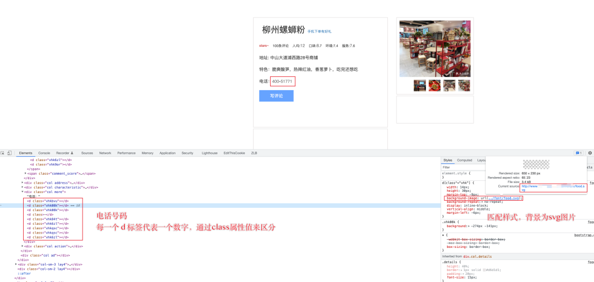
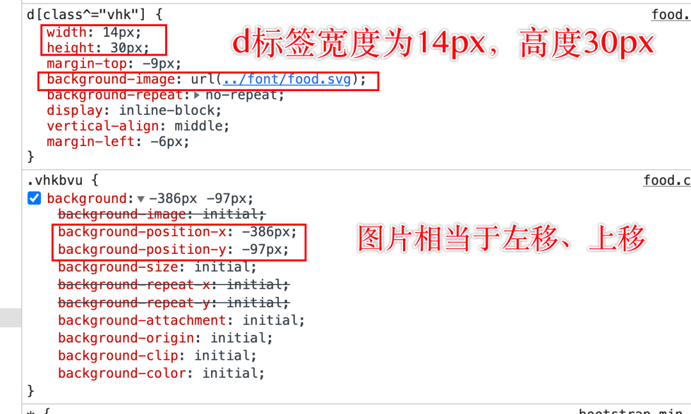

Python爬虫<br />SVG 全称为 Scalable Vector Graphics，是一种基于 XML 并可以缩放的矢量图片文件格式<br />而 SVG 反爬是利用 CSS 样式及 SVG 图片，将 SVG 图片中提取字符内容，映射到网页元素中，由于不能直接通过网页元素直接提取数据，所以起到了反爬的目的
<a name="tWp6D"></a>
## 1、分析
打开目标页面，查看页面中电话号码的网页元素<br />可以发现，电话号码中的每一个数字都对应一个 d 标签，d 标签中的 class 属性值都是以「 vhk 」开头的<br /><br />查看右侧 Styles 样式标签后，发现上面匹配的 d 标签的背景图片「 background-image 」被设置为一张 SVG 图片，d 标签的宽度固定为 14px，高度为 30px<br />在样式「 vhkbvu 」中，通过定义 background_position 指定背景图片的移动方向，比如：图中相当于背景图片向左移动 386px，向上移动 97px<br /><br />然后，查看 svg 图片的源文件

- 字体大小为 14px，颜色值为 #666
- 4 个 text 标签代表 4 行数字
- 4 行数字对应的 y 轴坐标值固定为 38、83、120、164
```html
<?xml version="1.0" encoding="UTF-8" standalone="no"?>
<!DOCTYPE svg PUBLIC "-//W3C//DTD SVG 1.1//EN" "http://www.w3.org/Graphics/SVG/1.1/DTD/svg11.dtd">
<svg xmlns="http://www.w3.org/2000/svg" version="1.1" xmlns:xlink="http://www.w3.org/1999/xlink" width="650px" height="230.0px">
	<style>text {font-family:PingFangSC-Regular,Microsoft YaHei,'Hiragino Sans GB',Helvetica;font-size:14px;fill:#666;}</style>
	<text x="14 28 42 56 70 84 98 112 126 140 154 168 182 196 210 224 238 252 266 280 294 308 322 336 350 364 378 392 406 420 434 448 462 476 490 504 518 532 546 560 574 588 602 616 630 644 658 672 686 700 714 728 742 756 770 784 798 812 826 840 854 868 882 896 910 924 938 952 966 980 994 1008 1022 1036 1050 1064 1078 1092 1106 1120 1134 1148 1162 1176 1190 1204 1218 1232 1246 1260 1274 1288 1302 1316 1330 1344 1358 1372 1386 1400 1414 1428 1442 1456 1470 1484 1498 1512 1526 1540 1554 1568 1582 1596 1610 1624 1638 1652 1666 1680 1694 1708 1722 1736 1750 1764 1778 1792 1806 1820 1834 1848 1862 1876 1890 1904 1918 1932 1946 1960 1974 1988 2002 2016 2030 2044 2058 2072 2086 2100 " y="38">154669136497975167479825383996313925720573</text>
	<text x="14 28 42 56 70 84 98 112 126 140 154 168 182 196 210 224 238 252 266 280 294 308 322 336 350 364 378 392 406 420 434 448 462 476 490 504 518 532 546 560 574 588 602 616 630 644 658 672 686 700 714 728 742 756 770 784 798 812 826 840 854 868 882 896 910 924 938 952 966 980 994 1008 1022 1036 1050 1064 1078 1092 1106 1120 1134 1148 1162 1176 1190 1204 1218 1232 1246 1260 1274 1288 1302 1316 1330 1344 1358 1372 1386 1400 1414 1428 1442 1456 1470 1484 1498 1512 1526 1540 1554 1568 1582 1596 1610 1624 1638 1652 1666 1680 1694 1708 1722 1736 1750 1764 1778 1792 1806 1820 1834 1848 1862 1876 1890 1904 1918 1932 1946 1960 1974 1988 2002 2016 2030 2044 2058 2072 2086 2100 " y="83">560862462805204755437571121437458524985017</text>
	<text x="14 28 42 56 70 84 98 112 126 140 154 168 182 196 210 224 238 252 266 280 294 308 322 336 350 364 378 392 406 420 434 448 462 476 490 504 518 532 546 560 574 588 602 616 630 644 658 672 686 700 714 728 742 756 770 784 798 812 826 840 854 868 882 896 910 924 938 952 966 980 994 1008 1022 1036 1050 1064 1078 1092 1106 1120 1134 1148 1162 1176 1190 1204 1218 1232 1246 1260 1274 1288 1302 1316 1330 1344 1358 1372 1386 1400 1414 1428 1442 1456 1470 1484 1498 1512 1526 1540 1554 1568 1582 1596 1610 1624 1638 1652 1666 1680 1694 1708 1722 1736 1750 1764 1778 1792 1806 1820 1834 1848 1862 1876 1890 1904 1918 1932 1946 1960 1974 1988 2002 2016 2030 2044 2058 2072 2086 2100 " y="120">671260781104096663000892328440489239185923</text>
	<text x="14 28 42 56 70 84 98 112 126 140 154 168 182 196 210 224 238 252 266 280 294 308 322 336 350 364 378 392 406 420 434 448 462 476 490 504 518 532 546 560 574 588 602 616 630 644 658 672 686 700 714 728 742 756 770 784 798 812 826 840 854 868 882 896 910 924 938 952 966 980 994 1008 1022 1036 1050 1064 1078 1092 1106 1120 1134 1148 1162 1176 1190 1204 1218 1232 1246 1260 1274 1288 1302 1316 1330 1344 1358 1372 1386 1400 1414 1428 1442 1456 1470 1484 1498 1512 1526 1540 1554 1568 1582 1596 1610 1624 1638 1652 1666 1680 1694 1708 1722 1736 1750 1764 1778 1792 1806 1820 1834 1848 1862 1876 1890 1904 1918 1932 1946 1960 1974 1988 2002 2016 2030 2044 2058 2072 2086 2100 " y="164">684431081139502796807382</text>
</svg>
```
因此，能得出一个结论，即：d 标签通过 SVG 背景图片，结合一定的偏移量 + 宽高度，从 SVG 图片中固定一个数字展示在页面上
<a name="tDjVR"></a>
## 2、实现
首先获取 SVG 图片、CSS 样式文件的源文件<br />PS：为了方便后面样式的解析，需要将 CSS 样式源码的换行符和空格全部删除掉
```python
import requests

...
def start(self):
        # 1、svg源文件
        self.svg_source = requests.get("http://www.porters.vip/confusion/font/food.svg").text

        # 2、css文件源文件
        # 注意：将换行符、空格清除，方便下一步匹配
        self.css_source = requests.get("http://www.porters.vip/confusion/css/food.css").text.replace('\n', '').replace(
            ' ', '')
...
```
然后，使用正则表达式解析 SVG 图片源文件，提取所有的 y 轴坐标及行数据列表
```python
import re

...
    def parse_svg(self):
        """
        解析svg文件
        :return:
        """
        # 获取y轴值及数据
        text_content = re.findall('y="(.*?)">(.*?)</text>', self.svg_source, re.S)

        # print(text_content)

        # y轴值及行数据
        return [item[0] for item in text_content], [item[1] for item in text_content]
...
```

数据格式如下：
```python
# y轴值列表及行数据值如下
# y轴值列表
['38', '83', '120', '164']

# 对应的行数据值列表
['154669136497975167479825383996313925720573', '560862462805204755437571121437458524985017', '671260781104096663000892328440489239185923', '684431081139502796807382']
```
最后，遍历要解析的样式名，从 SVG 图片中提取对应的数值<br />需要注意的是，SVG 图片的文字大小固定为 14px，根据行内容提取值时，只需要利用偏移量获取索引值，最后拿到实际指向的数值即可
```python
...
def get_number_from_svg(self, style_name, y_nums, datas):
	"""
	获取svg中实际的数据
	:param y_nums: y轴坐标列表
	:param datas: 数据值列表
	:return:
	"""
	# 使用正则表达式从样式内容中匹配x轴、y轴的偏移量（去除了换行符、空格），匹配正数字，\d+
	deviation_x, deviation_y = \
	re.compile('.%s{background:-(\d+)px-(\d+)px;}' % style_name).findall(self.css_source)[0]
	
	# 获取svg图片中的y轴坐标
	# 注意：这里取首次大于偏移量的y轴坐标，作为截取数据真实的y轴坐标
	position_y = [y for y in y_nums if int(deviation_y) <= int(y)][0]
	
	# 获取y轴坐标的索引值，然后获取该行的内容
	content = datas[y_nums.index(position_y)]
	
	# svg字体大小为14px，因此可以通过【偏移量/字体大小】拿到x轴的索引
	x_index = int(int(deviation_x) / 14)
	
	# 通过内容及索引，获取实际截取的数字
	return str(content[x_index])
...
```
以上就完成了对页面中「 电话号码 」的解析，只需要提取页面元素中的样式名，获取映射的数值进行替换即可。
<a name="AtXB2"></a>
## 3、完整代码
```python
#!/usr/bin/env python  
# encoding: utf-8

# 目标对象：http://www.porters.vip/confusion/food.html

import re

import requests


class Food(object):
    def __init__(self, style_names):
        self.style_names = style_names

        self.svg_source = ''
        self.css_source = ''

    def start(self):
        # 1、svg源文件
        self.svg_source = requests.get("http://www.porters.vip/confusion/font/food.svg").text

        # 2、css文件源文件
        # 注意：将换行符、空格清除，方便下一步匹配
        self.css_source = requests.get("http://www.porters.vip/confusion/css/food.css").text.replace('\n', '').replace(
            ' ', '')

        print(f"svg图片中的文字大小:{self.get_font_size()}px")

        # 3、解析svg图片文件，获取每一行数据的y坐标及数据值
        y_nums, datas = self.parse_svg()
        # print(y_nums)
        # print(datas)

        # 4、提取数据
        items = []
        for style_name in self.style_names:
            items.append(self.get_number_from_svg(style_name, y_nums, datas))

        # 组装成电话号码
        print('电话号码为:', ''.join(items))

    def parse_svg(self):
        """
        解析svg文件
        :return:
        """
        # 获取y轴值及数据
        text_content = re.findall('y="(.*?)">(.*?)</text>', self.svg_source, re.S)

        # print(text_content)

        # y轴值及行数据
        return [item[0] for item in text_content], [item[1] for item in text_content]

    def get_number_from_svg(self, style_name, y_nums, datas):
        """
        获取svg中实际的数据
        :param y_nums: y轴坐标列表
        :param datas: 数据值列表
        :return:
        """
        # 使用正则表达式从样式内容中匹配x轴、y轴的偏移量（去除了换行符、空格），匹配正数字，\d+
        deviation_x, deviation_y = \
            re.compile('.%s{background:-(\d+)px-(\d+)px;}' % style_name).findall(self.css_source)[0]

        # 获取svg图片中的y轴坐标
        # 注意：这里取首次大于偏移量的y轴坐标，作为截取数据真实的y轴坐标
        position_y = [y for y in y_nums if int(deviation_y) <= int(y)][0]

        # 获取y轴坐标的索引值，然后获取改行的内容
        content = datas[y_nums.index(position_y)]

        # svg字体大小为14px，因此可以通过【偏移量/字体大小】拿到x轴的索引
        x_index = int(int(deviation_x) / 14)

        # 通过内容及索引，获取实际截取的数字
        return str(content[x_index])

    # 获取svg图片中文字大小
    def get_font_size(self):
        fs = re.compile(r'font-size:(\d+)px')
        res = fs.findall(self.svg_source)
        return int(res[0])


if __name__ == '__main__':
    # 某一个样式变量
    phone_styles = ['vhkbvu', 'vhk08k', 'vhk08k', 'vhk84t', 'vhk6zl', 'vhkqsc', 'vhkqsc', 'vhk6zl']

    Food(phone_styles).start()
```
