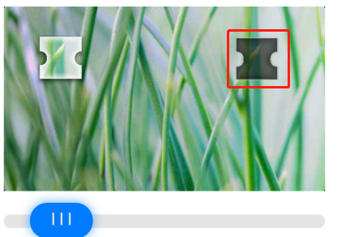
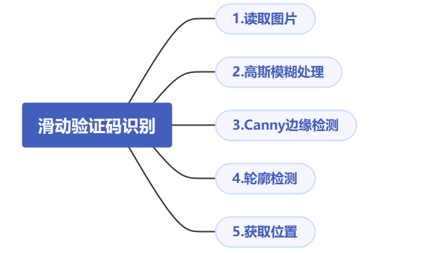
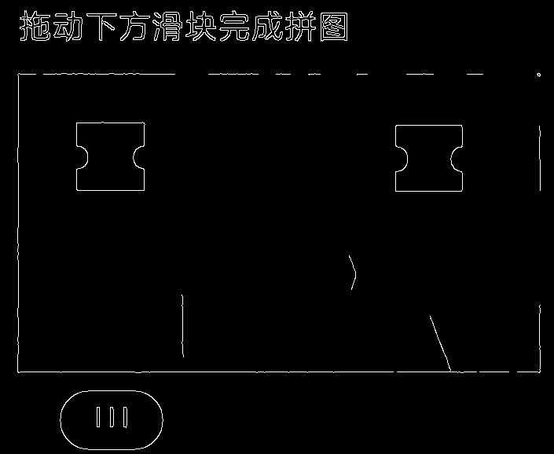
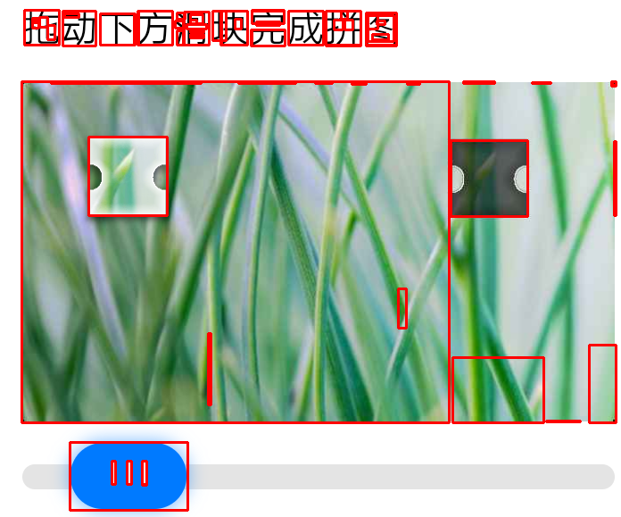
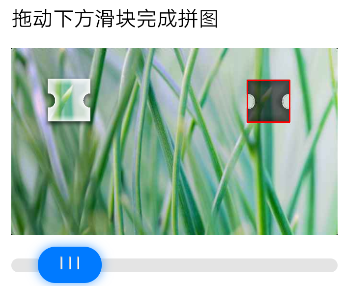

Python 图像识别<br />做爬虫总会遇到各种各样的反爬限制，反爬的第一道防线往往在登录就出现了，为了限制爬虫自动登录，各家使出了浑身解数，所谓道高一尺魔高一丈。<br />如何简单处理滑动图片的验证码呢。<br /><br />类似这种拖动滑块移动到图片中缺口位置与之重合的登录验证在很多网站或者APP都比较常见，因为它对真实用户体验友好，容易识别。同时也能拦截掉大部分初级爬虫。<br />作为一只python爬虫，如何正确地自动完成这个验证过程呢？<br />先来分析下，核心问题其实是要怎么样找到目标缺口的位置，一旦知道了位置，就可以借用selenium等工具完成拖动的操作。<br />可以借用opencv来解决这个问题，主要步骤：<br />
<a name="22BuZ"></a>
## OpenCV
OpenCV（Open Source Computer Vision Library）是开放源代码计算机视觉库，主要算法涉及图像处理、计算机视觉和机器学习相关方法，可用于开发实时的图像处理、计算机视觉以及模式识别程序。
<a name="9a2912c7"></a>
### 安装OpenCV
```bash
pip install opencv-python
```
首先将图片进行高斯模糊处理，高斯模糊的主要作用是减少图像的噪声，用于预处理阶段。
```python
import cv2 as cv
image = cv.imread(image_path)
blurred = cv.GaussianBlur(image, (5, 5), 0)
cv.imshow("blurred", blurred)
```
处理后的效果<br /><br />接着用Canny边缘检测到得到一个包含“窄边界”的二值图像。所谓二值图像就是黑白图，只有黑色和白色。
```python
canny = cv.Canny(blurred, 200, 400)
cv.imshow("canny", canny)
```

<a name="yF0tX"></a>
### 轮廓检测
```python
contours, hierarchy = cv.findContours(canny, cv.RETR_CCOMP, cv.CHAIN_APPROX_SIMPLE)
for i, contour in enumerate(contours):  # 所有轮廓
    x, y, w, h = cv.boundingRect(contour)  # 外接矩形
    cv.rectangle(image, (x, y), (x + w, y + h), (0, 0, 255), 2)
cv.imshow('image', image)
```
找出所有的轮廓，并用红色线框将其绘制标识出来了，看出来大大小小有几十个轮廓<br /><br />剩下的问题就好办了，只需要对轮廓的面积或者周长范围做限制，就能过滤出目标轮廓的位置， 前提是对目标位置的轮廓大小是预先确定的。
```python
for i, contour in enumerate(contours):  # 所有轮廓
    if 6000 < cv.contourArea(contour) <= 8000 and 300 < cv.arcLength(contour, True) < 500:
        x, y, w, h = cv.boundingRect(contour)  # 外接矩形
        print(x, y, w, h)
        cv.rectangle(image, (x, y), (x + w, y + h), (0, 0, 255), 2)
        cv.imshow('image', image)
        # 找目标缺口，第一个可能是滑块
        if x <= 200:
            continue
        return x + int(w / 2), 675
```
轮廓的面积大概是6000到8000之间，周长在300到500之间， 最后用外接矩形获取该轮廓图的坐标位置和宽高大小。<br /><br />如上就找到了目标位置，剩下的工作就是将滑块移动到指定位置即可。
