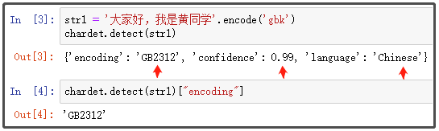
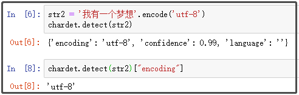
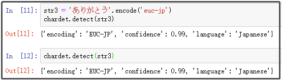
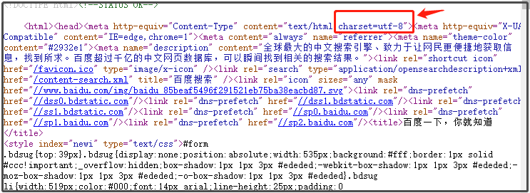
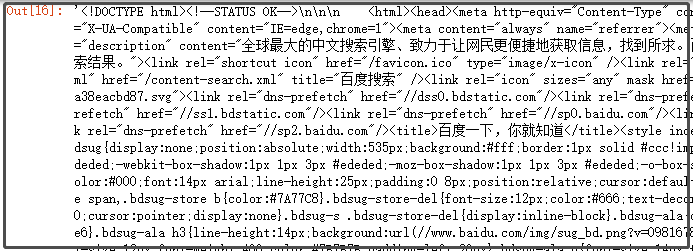
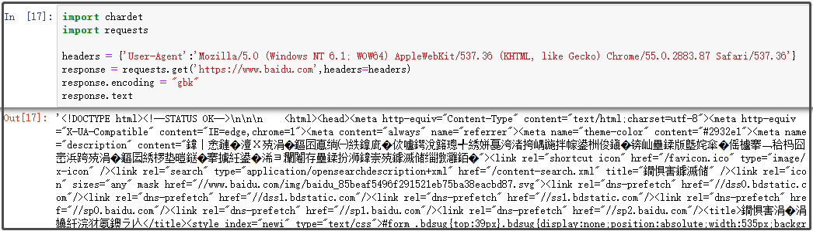
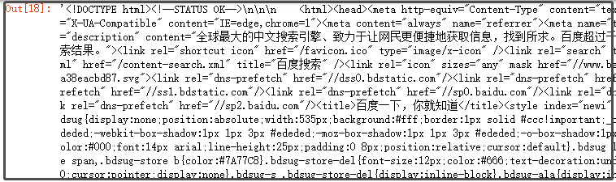

Python 爬虫 字符编码
<a name="ZOi7z"></a>
## 1、chardet库的安装与介绍
在爬取不同的网页时，返回结果会出现乱码的情况。比如，在爬取某个中文网页的时候，有的页面使用GBK/GB2312，有的使用UTF8，如果需要去爬一些页面，知道网页编码很重要的。虽然HTML页面有charset标签，但是有些时候是不对的，那么chardet就能解决。使用 chardet 可以很方便的实现字符串/文件的编码检测。如果安装过Anaconda，那么可以直接使用chardet库。如果只是安装了Python的话，就需要使用pip安装chardet库。
```bash
pip install chardet
```
接着，使用下面这行代码，导入chardet库。
```python
import chardet
```
<a name="LhZen"></a>
## 2、chardet库的使用
<a name="xYnkK"></a>
### 2.1 `chardet.detect()`函数
`detect()`函数接受一个参数，一个非unicode字符串。它返回一个字典，其中包含自动检测到的字符编码和从0到1的可信度级别。

- encoding：表示字符编码方式。
- confidence：表示可信度。
- language：语言。
<a name="3cf02c39"></a>
### 2.2 使用该函数分别检测gbk、utf-8和日语
检测gbk编码的中文：
```python
str1 = '大家好，我是黄同学'.encode('gbk')
chardet.detect(str1)
chardet.detect(str1)["encoding"]
```
结果如下：<br /><br />检测的编码是GB2312，注意到GBK是GB2312的父集，两者是同一种编码，检测正确的概率是99%，language字段指出的语言是'Chinese'。检测utf-8编码的中文：
```python
str2 = '我有一个梦想'.encode('utf-8')
chardet.detect(str2)
chardet.detect(str2)["encoding"]
```
结果如下：<br />检测一段日文：
```python
str3 = 'ありがとう'.encode('euc-jp')
chardet.detect(str3)
chardet.detect(str3)
```
结果如下：
<a name="k9bVS"></a>
### 2.3 在“爬虫”中使用chardet库
以百度首页为例子，检查网页的源代码：<br />从图中可以看到，是utf-8字符编码。如果不使用chardet库，获取网页源代码的时候，怎么指定字符编码呢？
```python
import chardet
import requests
headers = {'User-Agent':'Mozilla/5.0 (Windows NT 6.1; WOW64) AppleWebKit/537.36 (KHTML, like Gecko) Chrome/55.0.2883.87 Safari/537.36'}
response = requests.get('https://www.baidu.com',headers=headers)
response.encoding = "utf-8"
response.text
```
结果如下：<br />正确指定编码后，没有乱码。如果将编码改为gbk，再看看结果。此时已经乱码。<br />如果使用chardet库，获取网页源代码的时候，可以轻松指定字符编码！
```python
import chardet
import requests
headers = {'User-Agent':'Mozilla/5.0 (Windows NT 6.1; WOW64) AppleWebKit/537.36 (KHTML, like Gecko) Chrome/55.0.2883.87 Safari/537.36'}
response = requests.get('https://www.baidu.com',headers=headers)
# 注意下面这行代码，是怎么写的？
response.encoding = chardet.detect(response.content)['encoding']
response.text
```
结果如下：<br />编码不用自己查找，也不用猜，直接交给chardet库去猜测，正确率还高。
