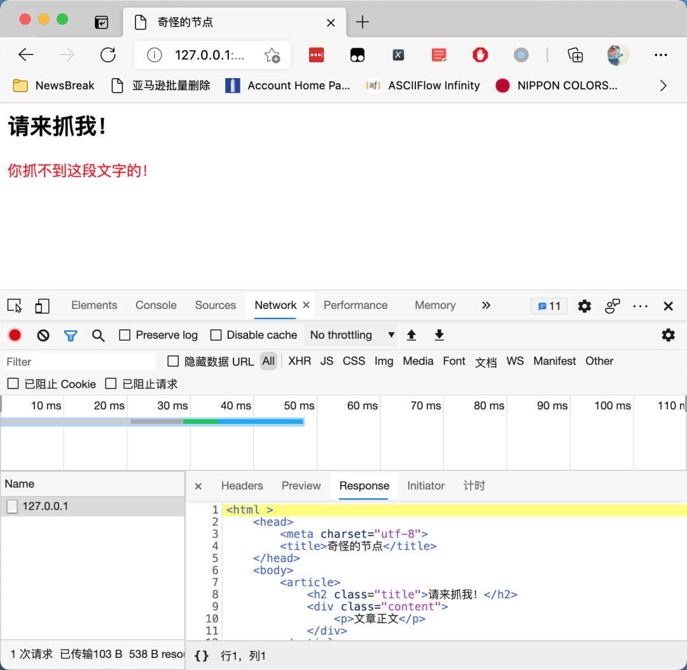
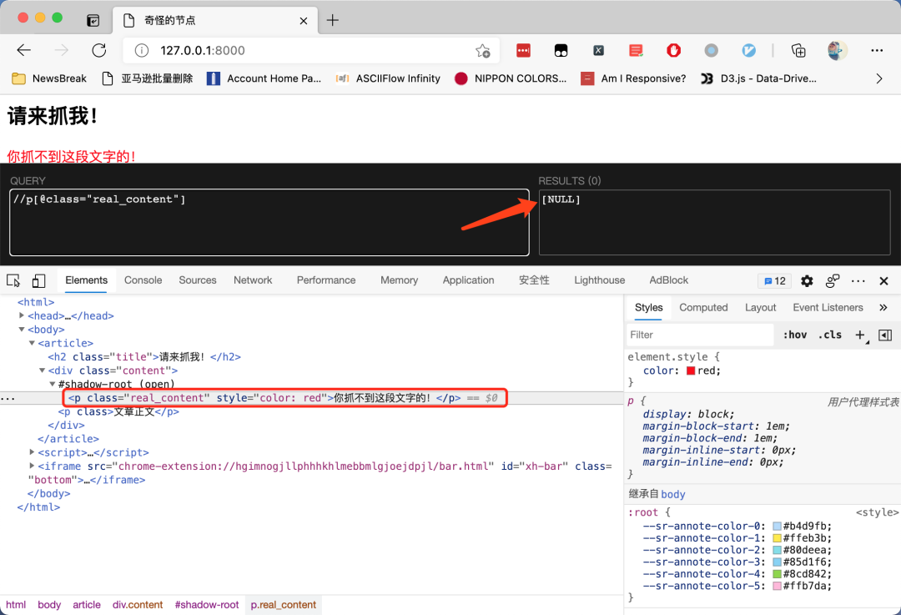
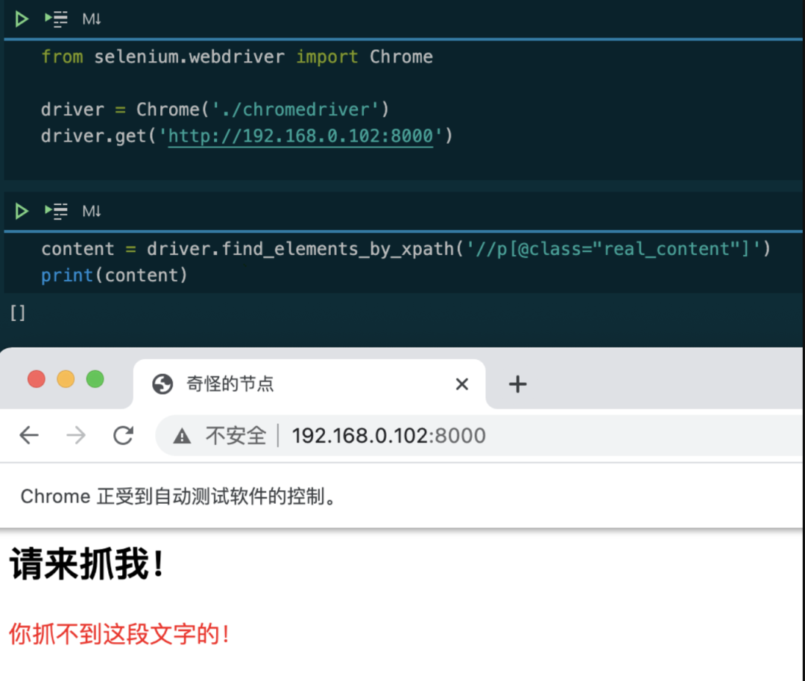
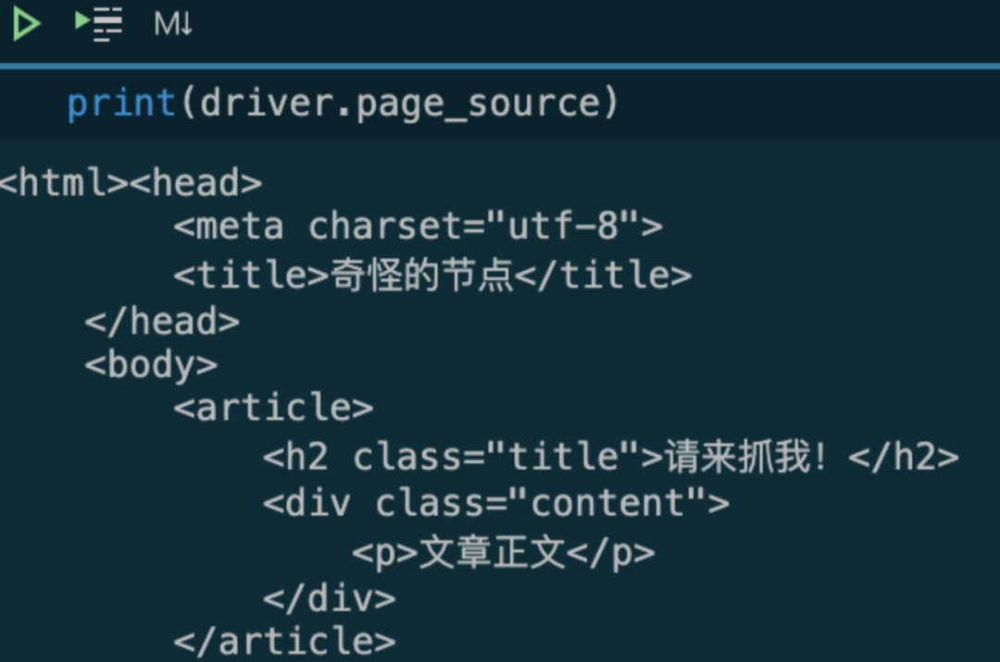
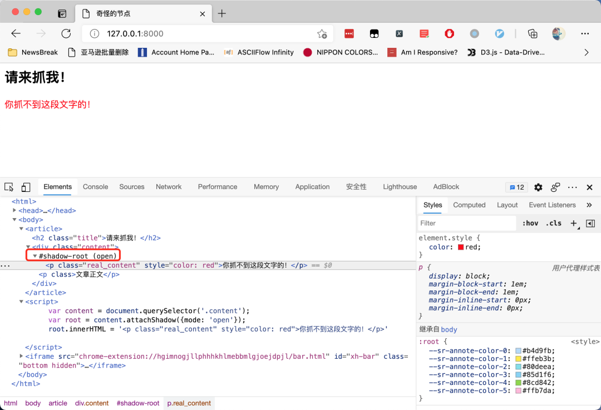
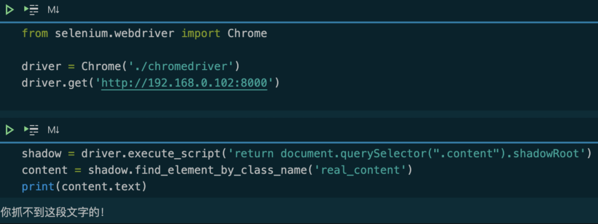

Python 爬虫 Selenium<br />来看一段非常简单的网页。这个网页只有一个HTML 文件，不加载特殊字体，不加载 CSS 文件。<br /><br />这个网页的奇怪之处在哪里呢？试一试使用 XPath Helper 来提取网页上面的红色文字，发现XPath 竟然无法找到这段文字，如下图所示：<br /><br />然后使用 Selenium 来试一试：<br /><br />Selenium果然无法获取 红字到内容。再打印一下网页的源代码：<br /><br />这一次，Selenium 获取到的源代码，竟然跟 Chrome 开发者工具里面显示的源代码不一样？<br />这个问题的关键，就在开发者工具里面的这样一段文字：<br /><br />因为这个节点是一个[shadow DOM](https://developer.mozilla.org/zh-CN/docs/Web/Web_Components/Using_shadow_DOM)。shadow DOM 的行为跟 iframe很像，都是把一段HTML 信息嵌入到另一个 HTML 中。但不同的是，iframe被嵌入的地址需要额外再搭建一个 HTTP服务，而 shadow DOM 可以只嵌入一段 HTML 代码，所以它比 iframe 更节省资源。<br />在上面的截图中，通过下面这三行代码，把一个新的`<p>`标签嵌入到了原来的 HTML 中：
```javascript
var content = document.querySelector('.content');
var root = content.attachShadow({mode: 'open'});
root.innerHTML = '<p class="real_content" style="color: red">你抓不到这段文字的！</p>'
```
而这个被嵌入的影子标签，就像 iframe 一样，是无法直接使用 Selenium 提取的。如果强行提取，那么，需要使用 JavaScript 获取 shadow DOM，然后再进行提取。来看一段可以正常工作的代码：
```javascript
shadow = driver.execute_script('return document.querySelector(".content").shadowRoot')
content = shadow.find_element_by_class_name('real_content')
print(content.text)
```
运行效果如下图所示：<br /><br />这段代码，首先通过 JavaScript 找到`shadow-root`的父节点元素，然后返回这个元素的`.shadowRoot`属性。在 Python 里面拿到这个属性以后，使用`.find_element_by_class_name()`方法获取里面的内容。<br />要特别注意的是，拿到`shadow-root`节点以后，只能通过 CSS 选择器进一步筛选里面的内容，不能用 XPath，否则会导致报错。
