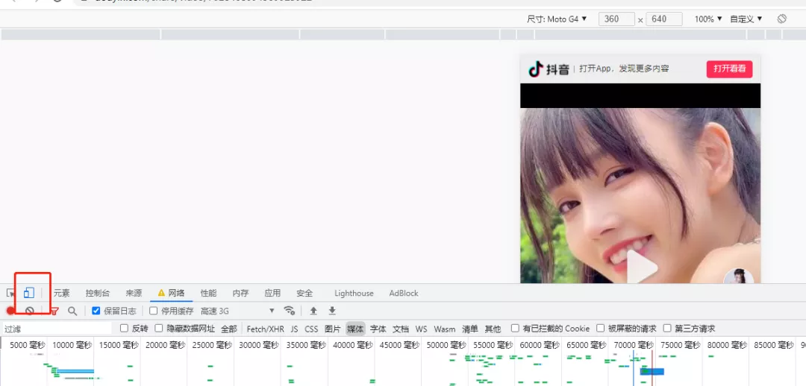
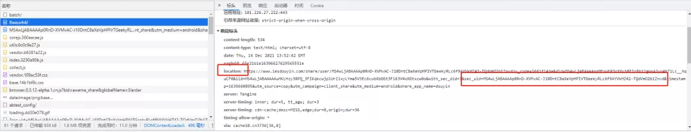
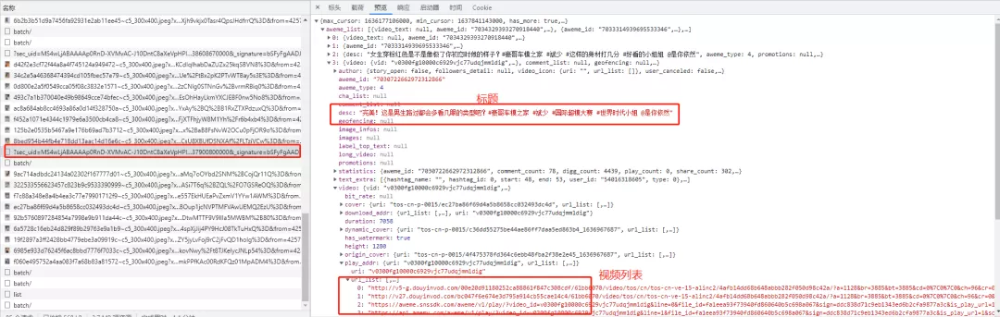

Python 爬虫
<a name="YuTsn"></a>
### 爬虫开始
首先将 google 浏览器在设置中将将重定向设置成否，再打开 F12 控制面板设置页面为 android 样式，如下图：<br /><br />然后开始把抖音分享的地址，复制到地址栏。在控制面板的网络中，就可以找到那个 url，提取header 下的 location 与其中的 sec_uid。<br />
```python
import request
import re
import json
import os
import time

headers = {
    "user-agent": "Mozilla/5.0 (Linux; Android 6.0.1; Moto G (4)) AppleWebKit/537.36 (KHTML, like Gecko) Chrome/96.0.4664.110 Mobile Safari/537.36"
}

#share  = '长按复制此条消息，打开抖音搜索，查看TA的更多作品。https://v.douyin.com/Rwauvh4/'
share = input('分享的链接：')

url = re.findall('(https?://[-A-Za-z0-9+&@#/%?=~_|!:,.;]+[-A-Za-z0-9+&@#/%=~_|]+)', share)[0]

resp = requests.get(url=url, headers=headers, allow_redirects=False)
location = resp.headers['location']

temp = location.split('&')
sec_uid = temp[4].split('=')[1]
print(sec_uid)
```
在控制面板中有一个 /web/api/v2/user/info/ 的地址，这个就是用户的个人资料。其中有需要的昵称，提取后创建文件夹。
```python
url = "https://www.iesdouyin.com/web/api/v2/user/info/?sec_uid={}".format(sec_uid)
resp = requests.get(url, headers=headers)
userinfo = json.loads(resp.text)

name = userinfo['user_info']['nickname']

if os.path.exists(name) == False:
    os.mkdir(name)
os.chdir(name)
```
从响应面板中找到一个是 json 串返回值的，并且有视频标题的存在 /web/api/v2/aweme/post/，这个就是需要的。这里面包含了：视频的地址和标题。它有五个 post 参数：

1. sec_uid，
2. count 每次查询的视频个数，
3. max_cursor：时间戳，
4. _signature：标记，
5. 还有一个隐藏的 min_cursor：最小的时间戳


```python
year = [2020,2021,2022]
cursor = []
for y in year:
    for i in range(1,13):
        calc = str(y) + '-'+ str(i) + '-' + '01 00:00:00'
        timeArray = time.strptime(calc, "%Y-%m-%d %H:%M:%S")
        timeStamp = int(time.mktime(timeArray)) * 1000
        cursor.append(timeStamp)

for i in range(len(cursor) - 1):
    params = {
        "sec_uid": sec_uid,
        "count": 200,
        "min_cursor": cursor[i],
        "max_cursor": cursor[i+1],
        "_signature": "Sq1xlgAAK2.rxFYl7oQq7EqtcY"
    }


    url = 'https://www.iesdouyin.com/web/api/v2/aweme/post/?'

    resp = requests.get(url=url, params=params, headers=headers)
    data = json.loads(resp.text)
    awemenum = data['aweme_list']
    for item in awemenum:
        title = re.sub('[\/:*?"<>|]','-',item['desc'])
        url = item['video']['play_addr']['url_list'][0]
        print(title + ":" + url)
```
获取到视频列表后循环下载每个视频，并写入文件中。
```python
with open(title + ".mp4", 'wb') as f:
    f.write(requests.get(url, headers=headers).content)
    print(title + "------------------下载完成")
```


 
