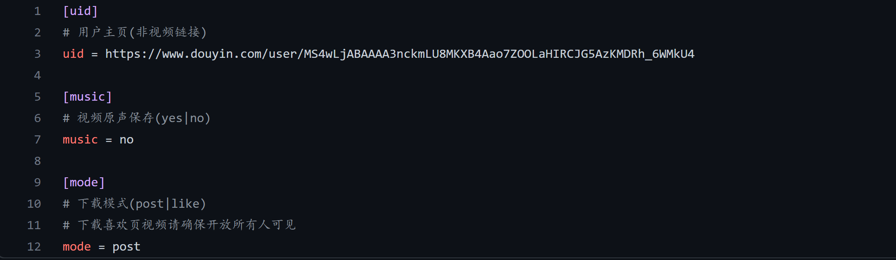

Python<br />TikTokDownload 是由国人开源的抖音去水印视频下载工具。开源地址是：<br />[https://github.com/Johnserf-Seed/TikTokDownload](https://github.com/Johnserf-Seed/TikTokDownload)<br />对于某些做视频分析和研究的同学来说，这个工具非常有用，可以快速获取到视频资料。<br />下面就来介绍一下这个工具的使用方法。
<a name="LAMP8"></a>
## 1、准备
开始之前，要确保Python和pip已经成功安装在电脑上。<br />请选择以下任一种方式输入命令安装依赖：

1. Windows 环境 打开 Cmd (开始-运行-CMD)。
2. MacOS 环境 打开 Terminal (command+空格输入Terminal)。
3. 如果用的是 VSCode编辑器 或 Pycharm，可以直接使用界面下方的Terminal。
```bash
git clone https://github.com/Johnserf-Seed/TikTokDownload.git
cd TikTokDownload
pip install -r requirements.txt
```
<a name="I359H"></a>
## 2、抖音去水印短视频下载方法
运行软件前先打开目录下 conf.ini 文件按照要求进行配置：<br /><br />配置完成后，在 TikTokDownload 目录下新建一个py文件，填入以下代码即可使用：
```python
# example.py
import TikTokDownload as TK
import Util

# 单视频下载
# TK.video_download(*TK.main())

# 批量下载
if __name__ == '__main__':
    # 获取命令行参数
    cmd = Util.Command()
    # 获取用户主页数据
    profile = Util.Profile()
    # 使用参数，没有则使用默认参数并下载
    profile.getProfile(cmd.setting())
    # 如果需要定时下载则注释这个input
    input('[ 完成 ]:已完成批量下载，输入任意键后退出:')
```
视频会被默认保存在当前目录的Download目录下。<br />如果只想下载单个视频，可以通过 `TK.video_download` 下载
```python
import TikTokDownload as TK
TK.video_download("视频链接", "yes")
```
Video_download 第一个参数是视频的原始链接，第二个参数表明是否下载音乐原声，yes为下载。
<a name="eLBHg"></a>
## 3、常见错误

1. 单个视频链接与用户主页链接要分清，链接一定要输入仔细，配置文件只支持_**用户主页。**_
2. 配置文件一定要注意编码格式（推荐Notepad++），使用UTF-8格式编码。
