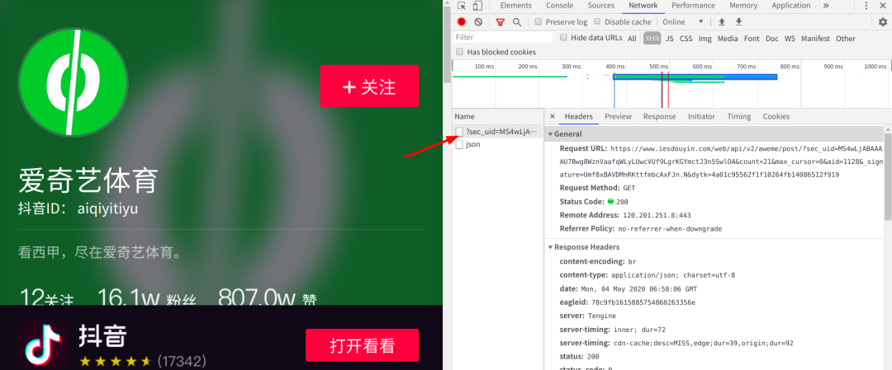

Python 爬虫
<a name="Uaa83"></a>
## 1、使用更简单的方法
随便打开一个抖音个人主页，这里选择的是爱奇艺体育，接着右键检查网页元素，点击network选项卡下的xhr选项，分析抓到的包<br /><br />点到preview选项卡，点击video->download_addr->url_list<br /><br />发现这下面跟着的两个网址正好是视频的网址（根本不需要构造，只是这个网址藏的有点深，需要非常耐心的寻找），打开网址查看：<br /><br />接着往下看，在下面的play_addr下面也有一个链接，这个链接下面的视频就是无水印版本的视频<br /><br /><br />现在只要想办法提取到它就大功告成了，这里使用的方法中用到了jsonpath模块，直接pip下载就可以了：
```bash
pip install jsonpath
```

<a name="D3oX3"></a>
## 2、代码
```python
import requests
import json
import jsonpath

class Douyin:
    def page_num(self,max_cursor):
        #随机码
        random_field = '00nvcRAUjgJQBMjqpgesfdNJ72&dytk=4a01c95562f1f10264fb14086512f919'
        #网址的主体
        url = 'https://www.iesdouyin.com/web/api/v2/aweme/post/?sec_uid=MS4wLjABAAAAU7Bwg8WznVaafqWLyLUwcVUf9LgrKGYmctJ3n5SwlOA&count=21&max_cursor=' + str(max_cursor) + '&aid=1128&_signature=' + random_field
        #请求头
        headers = {
            'user-agent':'Mozilla/5.0 (X11; Linux x86_64) AppleWebKit/537.36 (KHTML, like Gecko) Chrome/81.0.4044.129 Safari/537.36',
        }
        response = requests.get(url,headers=headers).text
        #转换成json数据
        resp = json.loads(response)
        #提取到max_cursor
        max_cursor = resp['max_cursor']
        #遍历
        for data in resp['aweme_list']:
            # 视频简介
            video_title = data['desc']
            #使用jsonpath语法提取paly_addr
            video_url = jsonpath.jsonpath(data,'$..paly_addr')
            for a in video_url:
                #提取出来第一个链接地址
                video_realurl = a['url_list'][1]
            # 请求视频
            video = requests.get(video_realurl, headers=headers).content
            with open('t/' + video_title, 'wb') as f:
                print('正在下载：', video_title)
                f.write(video)

        #判断停止构造网址的条件
        if max_cursor==0:
            return 1
        else:
            douyin.page_num(max_cursor)

if __name__ == '__main__':
    douyin = Douyin()
    douyin.page_num(max_cursor=0)
```
<a name="UrVkl"></a>
## 3、优点
这个方法的优点是可以省去很大一部分的分析网址的步骤，而且没有调用到webdriver（可以不限制浏览器），速度也会有显著提升，得到的视频也是无水印的
<a name="bvxOS"></a>
## 4、不足
还是没有解决随机生成字符串的问题，操作比较麻烦
