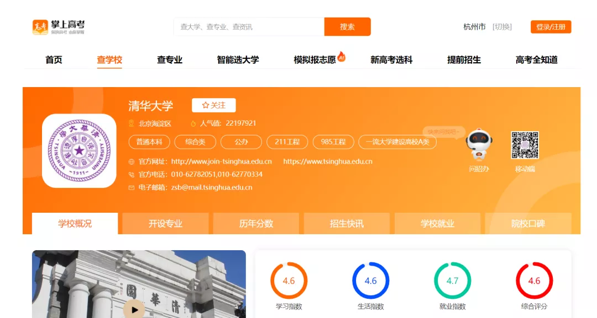
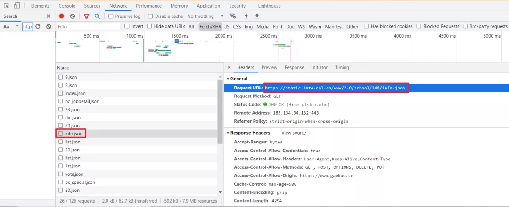
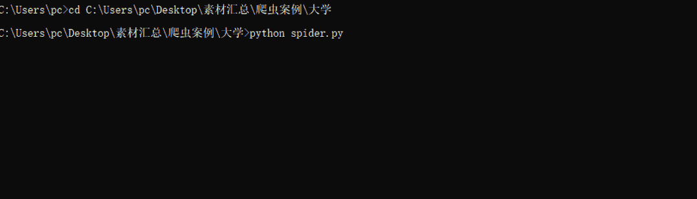
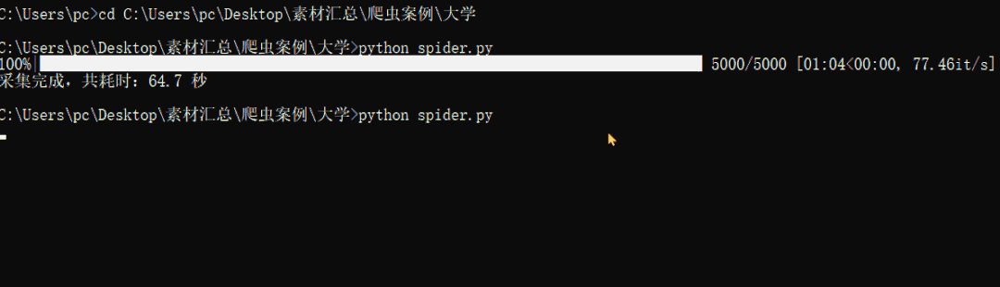
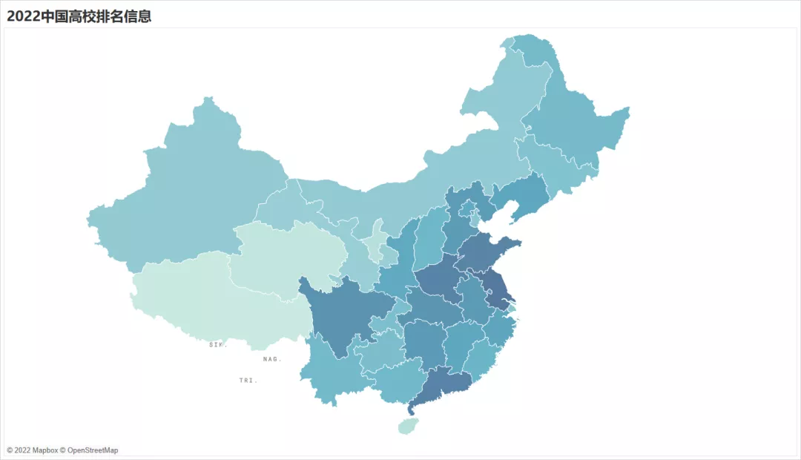
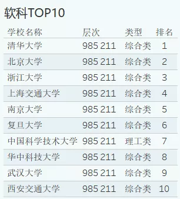
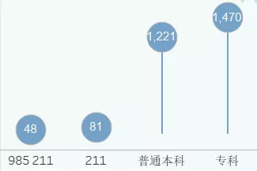
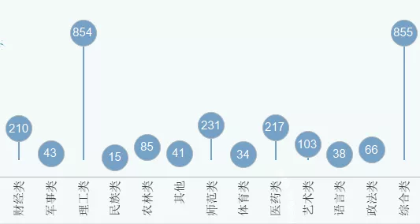
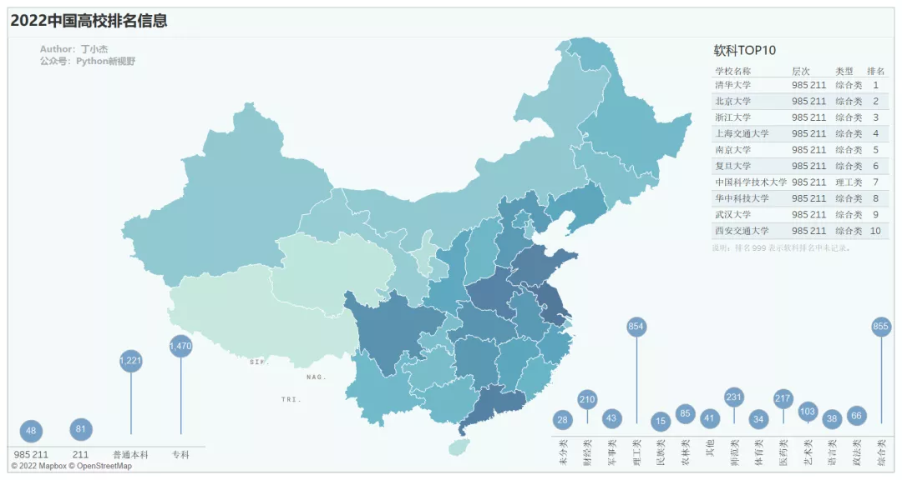
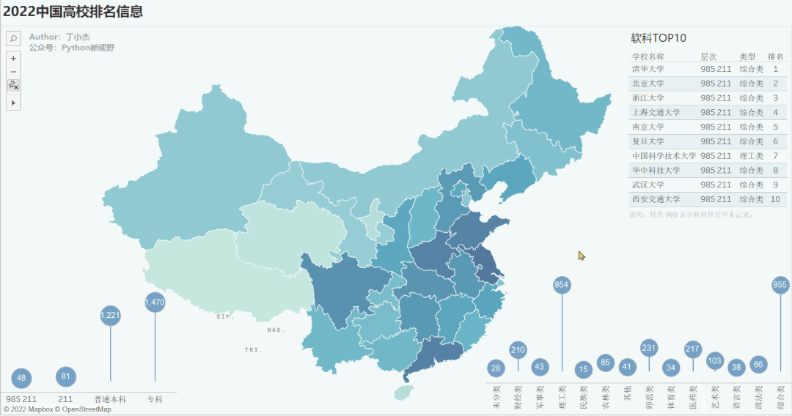

Python
<a name="hQYx5"></a>
## 数据爬取
地址：[https://www.gaokao.cn/school/140](https://www.gaokao.cn/school/140)F12 打开开发者工具，通过抓包工具很轻松就获取到了 json 文件。直接对该链接发起请求，就可以获取对应大学的信息。<br />另外对比发现 [https://static-data.eol.cn/www/2.0/school/140/info.json](https://static-data.eol.cn/www/2.0/school/140/info.json)，关键参数 140 为学校ID，但ID不是连续的，所以，爬取时只能根据大致的学校数量进行爬取。
<a name="CmPh4"></a>
## 爬取代码
<a name="SLYO1"></a>
### 导入模块
```python
import aiohttp
import asyncio
import pandas as pd
from pathlib import Path
from tqdm import tqdm
import time
```
简单说明一下主要模块的用途：

- **aiohttp**：可以实现单线程并发 IO 操作。如果仅用在客户端，发挥的威力不大，只是为了搭配 asyncio 来使用，因为 requests 不支持异步。如果把 asyncio 用在服务器端，例如  Web 服务器，由于 HTTP 连接就是 IO 操作，因此可以用 单线程 + coroutine 实现多用户的高并发支持。
- **asyncio**：提供了完善的异步IO支持，可以将多个协程（coroutine）封装成一组 Task 然后并发执行。
- **pandas**：将爬取的数据转为 DataFrame 类型，并生成 csv 文件。
- **pathlib**：面向对象的编程方式来表示文件系统路径。
- **tqdm**：只需使用 tqdm(iterable) 包装任何可迭代对象，就能让循环生成一个智能进度条。
<a name="fsvst"></a>
### 生成URL序列
通过指定的 URL 模板与 max_id 生成 URL 序列，这里添加了一个**去重操作**，如果之前已采集过高校信息，它会根据同目录下的文件，剔除已采集的高校ID，仅采集未获取过的高校信息。
```python
def get_url_list(max_id):
    url = 'https://static-data.eol.cn/www/2.0/school/%d/info.json'
    not_crawled = set(range(max_id))
    if Path.exists(Path(current_path, 'college_info.csv')):
        df = pd.read_csv(Path(current_path, 'college_info.csv'))
        not_crawled -= set(df['学校id'].unique())
    return [url%id for id in not_crawled]
```
<a name="FDiAJ"></a>
### 采集JSON数据
通过协程对URL序列发出请求，注意要限制并发量，Window：500，Linux：1024。
```python
async def get_json_data(url, semaphore):
    async with semaphore:
        headers = {
            'User-Agent': 'Mozilla/5.0 (Windows NT 10.0; Win64; x64) AppleWebKit/537.36 (KHTML, like Gecko) Chrome/87.0.4280.88 Safari/537.36',
        }
        async with aiohttp.ClientSession(connector=aiohttp.TCPConnector(ssl=False), trust_env=True) as session:
            try:
                async with session.get(url=url, headers=headers, timeout=6) as response:
                    # 更改相应数据的编码格式
                    response.encoding = 'utf-8'
                    # 遇到IO请求挂起当前任务，等IO操作完成执行之后的代码，当协程挂起时，事件循环可以去执行其他任务。
                    json_data = await response.json()
                    if json_data != '':
                        return save_to_csv(json_data['data'])
            except:
                return None
```
<a name="heGpX"></a>
### 数据解析保存
JSON数据中的字段有很多，大家可以根据自己的情况解析保存自己需要的字段。
```python
def save_to_csv(json_info):
    save_info = {}
    save_info['学校id'] = json_info['school_id']              # 学校id
    save_info['学校名称'] = json_info['name']                  # 学校名字
    level = ""
    if json_info['f985'] == '1' and json_info['f211'] == '1':
        level += "985 211"
    elif json_info['f211'] == '1':
        level += "211"
    else:
        level += json_info['level_name']
    save_info['学校层次'] = level                               # 学校层次
    save_info['软科排名'] = json_info['rank']['ruanke_rank']    # 软科排名
    save_info['校友会排名'] = json_info['rank']['xyh_rank']     # 校友会排名
    save_info['武书连排名'] = json_info['rank']['wsl_rank']     # 武书连排名
    save_info['QS世界排名'] = json_info['rank']['qs_world']     # QS世界排名
    save_info['US世界排名'] = json_info['rank']['us_rank']      # US世界排名
    save_info['学校类型'] = json_info['type_name']              # 学校类型
    save_info['省份'] = json_info['province_name']              # 省份
    save_info['城市'] = json_info['city_name']                  # 城市名称
    save_info['所处地区'] = json_info['town_name']              # 所处地区
    save_info['招生办电话'] = json_info['phone']                # 招生办电话
    save_info['招生办官网'] = json_info['site']                 # 招生办官网


    df = pd.DataFrame(save_info, index=[0])

    header = False if Path.exists(Path(current_path, 'college_info.csv')) else True
    df.to_csv(Path(current_path, 'college_info.csv'), index=False, mode='a', header=header)
```
<a name="Ta3wF"></a>
### 调度程序
调度整个采集程序。获取URL>>限制并发量>>创建任务对象>>挂起任务
```python
async def main(loop):
    # 获取url列表
    url_list =  get_url_list(5000)
    # 限制并发量
    semaphore = asyncio.Semaphore(500)
    # 创建任务对象并添加到任务列表中
    tasks = [loop.create_task(get_json_data(url, semaphore)) for url in url_list]
    # 挂起任务列表
    for t in tqdm(asyncio.as_completed(tasks), total=len(tasks)):
        await t
```
以上就是程序运行的主要代码。
<a name="aK1Kh"></a>
### 运行效果
这里采集ID在5000以内的高校信息，如果要尽可能多的采集高校信息的话，建议多次运行，直至无新增数据。<br />**第一次运行（采集到2140行）****第二次运行（采集到680行）**通过两次运行共采集到2820行数据。下面开始可视化部分。
<a name="T22Ts"></a>
## Tableau可视化
相比于其他的可视化工具或者第三方绘图库，这里倾向于 Tableau，上手十分简单，想要了解的可以看一下 Tableau Public，这里发布了很多大牛的作品。<br />[https://public.tableau.com/app/discover](https://public.tableau.com/app/discover)<br />它唯一的缺点就是收费，如果是学生的话，可以免费使用，否则，建议先用免费版的 Tableau Public，等到充分了解后再考虑付费。<br />对于本次的可视化，总共绘制有四个图表。
<a name="VaunQ"></a>
### 高校数量分布地图
<br />高校数量排名前三的分别是江苏、广东、河南（仅供参考）
<a name="OrTbe"></a>
### 软科高校排名TOP10
<br />根据软科排名来看，全国TOP10的高校绝大多数都是综合类，理工类的只有第七名的中国科学技术大学。
<a name="qYfzA"></a>
### 高校层次分布
<br />从采集的数据中来看， 211 的高校占比本科院校约 9.5% ，985 的高校占比本科院校约 3.5%，果然是凤毛麟角。
<a name="Jcme6"></a>
### 高校类型分布
<br />学校类型主要还是理工类和综合类，二者数量基本持平，都遥遥领先于其他的类型。数量第二层级为财经类，师范类，医药类。
<a name="Uky1J"></a>
### 合成看板
将上述的工作表合并成一个看板，过程十分简单，只需要将图标拖拽到指定位置即可。再添加一个筛选操作，点击地图中的某个省份联动其他工作表。<br />看板已发布到 Tableau Public。可以在线编辑，或下载整个可视化工作包，链接如下：<br />[https://public.tableau.com/shared/ZCXWTK6SP?:display_count=n&:origin=viz_share_link](https://public.tableau.com/shared/ZCXWTK6SP?:display_count=n&:origin=viz_share_link)
<a name="M4JZl"></a>
## 完整代码
```python
# -*- coding: utf-8 -*-

import aiohttp
import asyncio
import pandas as pd
from pathlib import Path
from tqdm import tqdm
import time
 
current_path = Path.cwd()
 
def get_url_list(max_id):
    url = 'https://static-data.eol.cn/www/2.0/school/%d/info.json'
    not_crawled = set(range(max_id))
    if Path.exists(Path(current_path, 'college_info.csv')):
        df = pd.read_csv(Path(current_path, 'college_info.csv'))
        not_crawled -= set(df['学校id'].unique())
    return [url%id for id in not_crawled]
 
 
async def get_json_data(url, semaphore):
    async with semaphore:
        headers = {
            'User-Agent': 'Mozilla/5.0 (Windows NT 10.0; Win64; x64) AppleWebKit/537.36 (KHTML, like Gecko) Chrome/87.0.4280.88 Safari/537.36',
        }
        async with aiohttp.ClientSession(connector=aiohttp.TCPConnector(ssl=False), trust_env=True) as session:
            try:
                async with session.get(url=url, headers=headers, timeout=6) as response:
                    # 更改相应数据的编码格式
                    response.encoding = 'utf-8'
                    # 遇到IO请求挂起当前任务，等IO操作完成执行之后的代码，当协程挂起时，事件循环可以去执行其他任务。
                    json_data = await response.json()
                    if json_data != '':
                        # print(f"{url} collection succeeded!")
                        return save_to_csv(json_data['data'])
            except:
                return None
 
 
def save_to_csv(json_info):
    save_info = {}
    save_info['学校id'] = json_info['school_id']              # 学校id
    save_info['学校名称'] = json_info['name']                  # 学校名字
    level = ""
    if json_info['f985'] == '1' and json_info['f211'] == '1':
        level += "985 211"
    elif json_info['f211'] == '1':
        level += "211"
    else:
        level += json_info['level_name']
    save_info['学校层次'] = level                               # 学校层次
    save_info['软科排名'] = json_info['rank']['ruanke_rank']    # 软科排名
    save_info['校友会排名'] = json_info['rank']['xyh_rank']     # 校友会排名
    save_info['武书连排名'] = json_info['rank']['wsl_rank']     # 武书连排名
    save_info['QS世界排名'] = json_info['rank']['qs_world']     # QS世界排名
    save_info['US世界排名'] = json_info['rank']['us_rank']      # US世界排名
    save_info['学校类型'] = json_info['type_name']              # 学校类型
    save_info['省份'] = json_info['province_name']              # 省份
    save_info['城市'] = json_info['city_name']                  # 城市名称
    save_info['所处地区'] = json_info['town_name']              # 所处地区
    save_info['招生办电话'] = json_info['phone']                # 招生办电话
    save_info['招生办官网'] = json_info['site']                 # 招生办官网
 
 
    df = pd.DataFrame(save_info, index=[0])
 
    header = False if Path.exists(Path(current_path, 'college_info.csv')) else True
    df.to_csv(Path(current_path, 'college_info.csv'), index=False, mode='a', header=header)
 
 
async def main(loop):
    # 获取url列表
    url_list =  get_url_list(5000)
    # 限制并发量
    semaphore = asyncio.Semaphore(500)
    # 创建任务对象并添加到任务列表中
    tasks = [loop.create_task(get_json_data(url, semaphore)) for url in url_list]
    # 挂起任务列表
    for t in tqdm(asyncio.as_completed(tasks), total=len(tasks)):
        await t
 
 
if __name__ == '__main__':
    start = time.time()
    # 修改事件循环的策略
    asyncio.set_event_loop_policy(asyncio.WindowsSelectorEventLoopPolicy())
    # 创建事件循环对象
    loop = asyncio.get_event_loop()
    # 将任务添加到事件循环中并运行循环直至完成
    loop.run_until_complete(main(loop))
    # 关闭事件循环对象
    loop.close()
    df = pd.read_csv(Path(current_path, 'college_info.csv'))
    df.drop_duplicates(keep='first', inplace=True)
    df.reset_index(drop=True, inplace=True)
    df.sort_values('学校id', inplace=True)
    df.loc[df['软科排名'] == 0, '软科排名'] = 999
    df.to_csv(Path(current_path, 'college_info.csv'), index=False)
    print(f'采集完成，共耗时：{round(time.time() - start, 2) } 秒')+680
```
