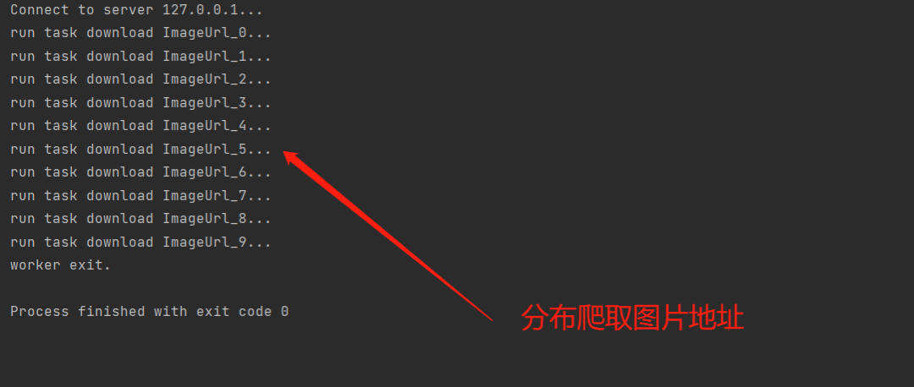

Python 爬虫 分布式
<a name="fkriw"></a>
## 一、前言
在`Thread`和`Process`中，应当优选`Process`，因为`Process`更稳定，而且，`Process`可以分布到多台机器上，而`Thread`最多只能分布到同一台机器的多个CPU上。<br />Python的`multiprocessing`模块不但支持多进程，其中`managers`子模块还支持把多进程分布到多台机器上。可以写一个服务进程作为调度者，将任务分布到其他多个进程中，依靠网络通信进行管理。
<a name="ifvnp"></a>
## 二、案例分析
在做爬虫程序时，抓取某个网站的所有图片，如果使用多进程的话，一般是一个进程负责抓取图片的链接地址，将链接地址放到`queue`中，另外的进程负责 从`queue`中取链接地址进行下载和存储到本地。<br />怎么用分布式进程实现？<br />一台机器上的进程负责抓取链接地址，其他机器上的进程负责系在存储。那么遇到的主要问题是将`queue`暴露到网络中，让其他机器进程都可以访问，分布式进程就是将这个过程进行了封装，可以将这个过程称为本地队列的网络化。<br />例：<br />1.py
```python
from multiprocessing.managers import BaseManager
from multiprocessing import freeze_support, Queue
# 任务个数
task_number = 10

# 收发队列
task_quue = Queue(task_number)
result_queue = Queue(task_number)

def get_task():
    return task_quue

def get_result():
    return result_queue
# 创建类似的queueManager
class QueueManager(BaseManager):
    pass

def win_run():
    # 注册在网络上，callable 关联了Queue 对象
    # 将Queue对象在网络中暴露
    # window下绑定调用接口不能直接使用lambda，所以只能先定义函数再绑定
    QueueManager.register('get_task_queue', callable=get_task)
    QueueManager.register('get_result_queue', callable=get_result)
    # 绑定端口和设置验证口令
    manager = QueueManager(address=('127.0.0.1', 8001), authkey='qiye'.encode())
    # 启动管理，监听信息通道
    manager.start()

    try:
        # 通过网络获取任务队列和结果队列
        task = manager.get_task_queue()
        result = manager.get_result_queue()

        # 添加任务
        for url in ["ImageUrl_" + str(i) for i in range(10)]:
            print('url is %s' % url)
            task.put(url)
            
        print('try get result')
        for i in range(10):
            print('result is %s' % result.get(timeout=10))

    except:
        print('Manager error')
    finally:
        manager.shutdown()

if __name__ == '__main__':
    freeze_support()
    win_run()
```
连接服务器，端口和验证口令注意保持与服务器进程中完全一致从网络获取`Queue`，进行本地化，从`task`队列获取任务，并且把结果写入`result`队列<br />2.py
```python

#coding:utf-8
import time
from multiprocessing.managers import BaseManager
# 创建类似的Manager:
class Manager(BaseManager):
    pass
#使用QueueManager注册获取Queue的方法名称
Manager.register('get_task_queue')
Manager.register('get_result_queue')
#连接到服务器:
server_addr = '127.0.0.1'
print('Connect to server %s...' % server_addr)
# 端口和验证口令注意保持与服务进程设置的完全一致:
m = Manager(address=(server_addr, 8001), authkey='qiye')
# 从网络连接:
m.connect()
#获取Queue的对象:
task = m.get_task_queue()
result = m.get_result_queue()
#从task队列取任务,并把结果写入result队列:
while(not task.empty()):
        image_url = task.get(True,timeout=5)
        print('run task download %s...' % image_url)
        time.sleep(1)
        result.put('%s--->success'%image_url)
#结束:
print('worker exit.')
```
任务进程要通过网络连接到服务进程，所以要指定服务进程的IP。<br />运行结果如下：<br />获取图片地址,将地址传到2.py。<br /><br />接收1.py传递的地址，进行图片的下载，控制台显示爬取结果。<br />
<a name="MPLUH"></a>
## 三、总结
Python的分布式进程接口简单，封装良好，适合需要把繁重任务分布到多台机器的环境下。通过Queue的作用是用来传递任务和接收结果。
