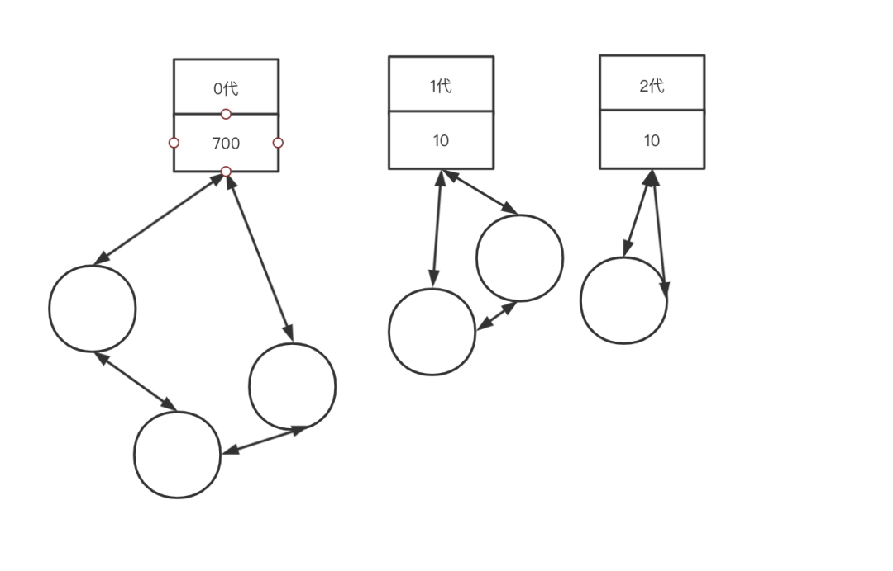

Python 垃圾回收机制<br />在 Python 中，大多数对象的生命周期都是通过对象的引用计数来管理的。这是最直观也是最简单的垃圾回收机制。但是他有执行效率的问题和一个致命的弱点循环引用。<br /><br />很显然，像 PyIntObject、PyStringObject 这些对象是绝不可能产生循环引用的，因为它们内部不可能持有对其他对象的引用。Python 中的循环引用总是发生在 container 对象之间（dict、list、class、interface 等）。那么就需要引入标记—清除这样的垃圾回收机制来辅助解决循环引用的问题。<br />标记—清除这样的垃圾收集所带来的额外操作实际上与系统中总的内存块的数量是相关的，当需要回收的内存块越多时，垃圾检测带来的额外操作就越多，而垃圾回收带来的额外操作就越少；反之，当需回收的内存块越少时，垃圾检测就将比垃圾回收带来更少的额外操作。可以看到，当系统中使用的内存越少时，整个垃圾收集所带来的额外操作也就越少。为了使垃圾收集的效率提高，基于研究人员所发现的统计规律，就可以采用一种以空间换时间的策略。这种以空间换时间的分代收集的技术正是当前支撑着 Java 的关键技术。<br />这种以空间换时间的总体思想是：将系统中的所有内存块根据其存活时间划分为不同的集合，每一个集合就称为一个“代”，垃圾收集的频率随着“代”的存活时间的增大而减小，也就是说，活得越长的对象，就越可能不是垃圾，就应该越少去收集。<br />所以 Python 的 GC 有 3 个策略组成：引用计数器、标记-清除机制、分代垃圾收集<br />以上是对Python各个垃圾回收策略的简介来源与目的，如果从未接触过GC算法可能看起来比较晦涩，下面会先介绍这3种算法具体的作用，功能与优缺点。<br />最后会谈谈这几种策略在Python的中的应用
<a name="zJV8c"></a>
# 引用计数策略
引用计数法中引入一个计数器的概念。通过增减计数器的值来进行内存管理。多一个对象引用那么就对引用计数++操作，少一个对象引用那么就对引用计数--操作。等计数器归 0 的时候意味着每一变量使用此对象就应该回收。当新建一个对象的时候引用计数为1。<br />引用计数算法的主要2个函数是

- mutator 在生成新对象的时候会调用 `new_obj()` 函数
- mutator 在更新指针的时候会调用 `update_ptr()` 函数

mutator（改变某物的意思，改变的是GC对象间的引用关系）它的实体就是"应用程序"，主要的2个操作 生成对象 更新指针
<a name="H8dEz"></a>
## 引用计算策略概述
<a name="H99t9"></a>
### new_obj
用Python实现的主要逻辑
```python
def new_obj(size):
    # pickip_chunk函数从堆中取可用的块
    obj = pickip_chunk(size,free_list)
    
    if obj == None:
        raise RuntimeError("分配失败")
    else:
        # 成功分配到了内存，那么引用计数记为1，并返回对象
        obj.ref_cnt = 1
        return obj
```
<a name="ZGYMf"></a>
### update_ptr
用Python实现 `update_ptr()` 函数用于更新指针 ptr，使其指向对象 obj ，同时进行计数器值的增减。
```python
# 新引用的对象计数++，旧引用对象计数--，修改指针
# ptr是指向老对象的指针，obj是新对象，用Python实现可能不是很明显
def update_prt(ptr, obj):
    inc_ref_cnt(obj)
    dec_ref_cnt(ptr)
    ptr = obj


def inc_ref_cnt(obj):
    obj.rec_cnt += 1

# --操作要注意引用计数为0的情况，如果为0要递归调用函数是否连孩子都要删除
def dec_ref_cnt(obj):
    obj.rec_cnt -= 1
    if obj.ref_cnt == 0:
        # children函数是找到所有孩子，返回一个可迭代对象
        for child in chilren(obj):
            dec_ref_cnt(child)
        del obj
```
<br />更新指针<br />注意点1：`update_ptr` 函数一定是先加后减，否则可能有重大BUG出现。如当 prt 与 obj 是同一个对象的时候且引用计数==1 的时候，先--会触发GC进行垃圾回收，也是就是上图中会先放到垃圾回收的空闲链表中，实际此对象还被其他引用着。<br />注意点2：修改的是自己引用对象的计数，而不是自己的引用计数<br />注意点3：引用计数策略为了提高效率，不会立即清理，而是放到`free_list`空闲链表，等下次需要使用块的时候在开始清除该链表
<a name="WhOz2"></a>
## 优点
1、判断机制简单且"时效性强"<br />每个对象都维护一个引用数字段，当引用数值为 0 时，对象就会马上把自己作为该回收对象连接到空闲链表上。其他 GC 算法中，即使对象变成了垃圾，程序也无法立刻判别。虽然说即刻回收有点过分（因为是先放到链表中），但是当需要的时候是`free_list`链表是直接可以再次利用的，他不会被垃圾占用<br />2、最大暂停时间短<br />引用计数算法中，他是引用计数==0 的时候就会触发垃圾回收，意味着每次通过执行 mutator 生成垃圾时这部分垃圾会被回收，因而大幅度削减了 mutator 的最大暂停时间。<br />3、无需遍历<br />由于是引用计数为 0 的时候直接触发 GC 放入空闲链表中，不需要从根出发沿指针查找。适用于要减少沿指针查找次数的情况（分布式环境）。
<a name="GlhUS"></a>
## 缺点
计数器值的增减处理繁重（内存执行效率低）<br />虽然依据执行的 mutator 的动作不同而略有差距，不能一概而论，不过在大多数情况下指针都会频繁地更新。特别是有根的指针，会以近乎令人目眩的势头飞速地进行更新。这是因为根可以通过 mutator 直接被引用。在引用计数法中，每当指针更新时，计数器的值都会随之更新，因此值的增减处理必然会变得繁重。<br />计数器需要占用很多位（内存使用率低）<br />根据内存的寻址能力，比如 32/64 那么每一个对象就是要表示所有都引用的个数，那么所有对象就需要有相应的位数分配给标记位。当对象的域比较少的话，这个标记为占的比重就比较大，所以会降低内存使用效率<br />实现繁琐复杂<br />进行指针更新操作的 update_ptr() 函数是在 mutator 这边调用的。打个比方，需要把以往写成 *ptr=obj 的地方都重写成 update_ptr(ptr,obj)。因为调用 update_ptr() 函数的地方非常多，所以重写过程中很容易出现遗漏。如果漏掉了某处，内存管理就无法正确进行，就会产生 BUG。<br />循环引用无法回收<br />Python 使用标记——清除和分代收集两种技术来填补其内存管理机制中最后的也是最致命的漏洞，下面会有介绍到
<a name="DAAez"></a>
## 引用计数的改善
对引用技术算法的改善还有好多的如延迟引用计数法、Sticky引用计算法、位引用计数法、部分标记-清除算法等。这里就不行就展开了，有兴趣的朋友自己查阅资料
<a name="Ua5aS"></a>
# 清除-标记策略
<a name="rxcFy"></a>
## 清除-标记策略概述
垃圾检测是从所有的已分配的内存中区别出可以回收的内存和不可回收的内存。<br />垃圾回收则是使系统重新掌握在垃圾检测阶段所标识出来的可回收内存块。<br />通过这两个阶段，就可以令不能利用的内存空间重新得到利用。
```c
mark_sweep(){
 mark_phase()    // 标记函数
 sweep_phase()   // 清除函数
}
```
标记阶段<br />首先标记所有的根直接引用的对象，然后通过递归标记间接引用的对象，这样就可以把所有活动对象都标记上
```python
# 先把与root object直接相连的所有对象打上标记
def mark_phase():
    for r in roots:
        mark(r)

# 然后递归调用此函数，让直接与root object的孩子对象都打上标记
def mark(obj):
    if obj.mark == False:
        obj.mark = True
        for child in children(obj):
            mark(child)
```
<br />标记<br />清除阶段<br />collector 会遍历整个堆（注意这里是整个堆不是root集合），回收没有打上标记的对象（即垃圾），使其能再次得到利用。这里会分成2个链表，一个root object的链表，一个是`unreachable`链表，最后回收`unreachable`链表即可。
```python
# heap_start堆开始地址
# heap_end堆结束地址
def sweep_phase():
    sweeping = heap_start
    # 遍历整个堆
    while sweeping < heap_end:
        # 对活动对象取消标记位，准备下一次GC，因为下一次GC又会标记
        if sweeping.mark == True:
            sweeping.mark = False
        # 对非活动对象加入free_list空闲链表等待回收
        else:
            sweeping.next = free_list
            free_list = sweeping
        # 每个对象的偏移量
        sweeping += sweeping.size
```
<br />清除<br />分配

- First - fit
   - 遍历链表的时候，最初发现大于等于size 的分块时就会立即返回该分块。
- Best - fit（Python内存管理里面提到，就是用此策略）
   - 遍历链表的时候，返回大于等于 size 的最小分块
- Worst - fit
   - 遍历链表的时候，找出空闲链表中最大的分块，将其分割成 mutator 申请的大小和分割后剩余的大小，目的是将分割后剩余的分块最大化（这样会产生大量的小块，最不推荐的方法）

在上面一篇Python内存管理，直接分配使用内存块是使用pymalloc，或者是C的malloc。这里的分配是指使用空闲链表的已经使用的块，Python的分配策略是best-fit，之前也有提到。
```python
def new_object(size):
    # 此pickup_chunk函数遍历空闲链表找合适的块有以上3种策略，Python是使用的是best-fit策略
    chunk = pickup_chunk(size,free_list)
    if chunk != None:
        return chunk
    else:
        raise RuntimeError("分配失败")
```
<a name="jg3ro"></a>
### 合并
无论是使用哪种分配策略都会产生大量的小分块，如果是2个块连续的非活动对象块将其合并，这个合并操作是在清除阶段进行的。
```python
def sweep_phase():
    sweeping = head_start
    # 遍历整个堆
    while sweeping < head_end:
        if sweeping.mark == True:
            sweeping = False
        # 对于非活动对象
        else:
            # 如果此非活动对象与上一次在free_list中的块是连续的，那么合并
            if sweeping == free_list + free_list.size:
                free_list.size += sweeping.size
            else:
                # 加入free_list操作
                sweeping.next = free_list
                free_list = sweeping
        # 对象的偏移量
        sweeping += sweeping.size
```
<a name="h5BWH"></a>
## 优点

- 算法简单，比较容易实现，比较容易与其他算法的组合
- 与保守式GC算法兼容。保守式 GC 算法中，对象是不能被移动的。因此保守式 GC 算法跟把对象从现在的场所复制到其他场所的 GC 复制算法与标记 - 压缩算法不兼容。而 GC 标记 - 清除算法因为不会移动对象，所以非常适合搭配保守式 GC 算法。事实上，在很多采用保守式 GC 算法的处理程序中也用到了 GC 标记 - 清除算法。
<a name="xOEED"></a>
## 缺点
<a name="jti0L"></a>
### 碎片化
由于分配的时候都是会分配>=size的块，所以以上3种分配策略都是会有剩下一小块可能，随着分配的多了，这些无法满足申请内存大小块的碎片会越来越多。如果碎片都非常靠前，那么遍历一趟是非常耗时的
<a name="mCUDi"></a>
### 分配速度
因为分块不是连续的，因此每次分配都必须遍历空闲链表，找到足够大的分块需要时间复杂度O（N）
<a name="wwGEy"></a>
### 与写时复制不兼容
写时复制就是各个进程访问的时候共享数据，当某一进程开始写入时，不能直接写入共享内存。会首先fork出一个空间，对这个自己fork的私有空间进行重写。复制后也只会访问这个空间，不再访问共享内存。<br />GC的标记-清除算法，GC会设置所有活动对象的标志位，如果使用写时复制的话，就好频繁发生不应该发生的复制，从而压迫内存。后面用位图标记法来改善。
<a name="KEiQa"></a>
## 清除-标记的改善
对清除-标记策略的改善还有好多的如多个空闲链表、BiBOP法、位图标记、延迟清除法，有兴趣的朋友自己查阅资料
<a name="OczJ3"></a>
# 分代垃圾回收
分代垃圾回收就是在对象中导入了"年龄"的概念，通过优先回收容易成为垃圾的对象，提高垃圾回收的效率。<br />根据经验所得，大部分的对象在生成后马上就变成了垃圾，很少有对象可以活的很久。那么就意味着新生代是"虚弱的",老年代反而是"强壮的"<br />把每经历一次GC当做1岁的话，把刚生成的对象称为新生代对象，到达一定年龄的对象则称为老年代对象<br />分代垃圾不是一个独立的垃圾回收，他是对某一种GC算法的优化或者改进是配合如引用计数、标记-清除算法来使用的
<a name="hdukh"></a>
## 新生代对象和老年代对象
minor GC：新生代 GC 的前提是大部分新生代对象都没存活下来，GC 在短时间内就结束了。（minor这里是小规模的意思）。针对新生代的GC<br />promotion：经过几次GC洗礼留下来的新生代，晋升为老年代<br />major GC：由于老年代是不容易成为垃圾，所以对老年代对象减少执行GC的频率。针对老年代的GC
<a name="bsria"></a>
## Ungar的分代垃圾回收
<a name="L4vgi"></a>
### 堆结构
一个堆结构如图由4个空间，其中生成代空间（140KB）与2个幸存空间（28K*2）组成一个新生代空间和老年代（940KB）<br /><br />堆结构
<a name="srn1C"></a>
### 生成空间与幸存空间
生成空间就是生成对象的空间，也就是进行分配的空间，当生成空间满的时候，会触发minor GC。<br />将生成空间中的所有活动对象复制（能活下来是少量），到其中一个幸存空间去。把正在使用的幸存空间叫做From空间，没有使用的幸存空间叫To空间。之后就是每次生成空间和From空间一起复制到To空间（之后From和To交替命名），经过几代minor GC之后有些新生代就变成了老年代。<br />当老年代也满的时候才会触发major GC，他采用就是清除-标记算法<br /><br />新生代GC的复制过程
<a name="oo3ZZ"></a>
### 记录集

- 记录集是一个固定大小的数组
- 记录集是用来记录从老年代对象到新生代对象的引用（出发点）。
- 在新生代GC时会把记录集看成根一样的东西，并进行搜索，以发现指向新生代空间的指针

通过以上的复制，引用除了新生代之间，新生代与根之间，还有一种是老年代与新生代之间。之前提到使用分代的前提是把重点放在新生代对象身上，以此来缩减 GC 所需要的时间。所以如果要遇到老年代与新生代之间的这种情况，那么遍历整个堆也是得不偿失的。所以需要一个记录集来记录所有从老年代到新生代的引用，把遍历的O(N)降低到O(1)。（与root object类似的功能）<br /><br />老年代引用新生代
<a name="JNZuC"></a>
### 写入屏障
将老年代对象有到新声代对象的引用记录到记录集里，利用写入屏障（write barrier）<br />`write_barrier()`函数
```python
def write_barrier(obj, new_object):
    # 发出引用的对象是不是老年代对象
    # 指针更新后的引用的目标对象是不是新生代对象
    # 发出引用的对象是否还没有被记录到记录集中
    if obj >= old_start and new_object < old_start and obj.remembered == False:
        rs[rs_index] = obj
        rs_index += 1
        obj.remembered = True
    # 更新指针
    field = new_object
```
<a name="PD0JO"></a>
### 对象的结构
在 Ungar 的分代垃圾回收中，对象的头部中除了包含对象的种类和大小之外，还有以下这 3 条信息。

- 对象的年龄（age，经历的GC次数，如果超过AGE_MAX就要晋升）
- 已经复制完毕的标志（forwarded，防止重复复制相同对象的标志）
- 已经向记录集记录完毕的标志（remembered，是用来防止向记录集中重复记录的标志）

<br />分代使用的头结构
<a name="jGmsB"></a>
### 分配
分配是在生成空间进行的
```c
def new_obj(size):
    # 如果生成空间满了，触发新生代GC
    if new_free + size >= survivor1_start:
        minor_gc()
        # 如果新生代GC后还没有空闲的块，那么就分配失败
        if new_free + size >= survivor1_start:
            raise RuntimeError("分配失败")
    # 生成空间直接够用或者GC后够用就分配并初始化
    obj = new_free
    new_free += size
    obj.age = 0
    obj.forwarded = False
    obj.rememvered = False
    obj.size = size
    return obj
```
<a name="stLmD"></a>
### 新生代GC
生成空间被对象占满后，新生代 GC 就会启动，执行这项操作的是 `minor_gc()` 函数。`minor_gc()` 函数负责把新生代空间中的活动对象复制到 To 幸存空间和老年代空间。先来讲解一下在 `minor_gc()` 函数中执行复制操作的 `copy()` 函数。
<a name="alhQm"></a>
#### `copy()`
是生成区和使用的幸存区，复制到未使用的幸存区
```c
def copy(obj):
    if obj.forwarded == False:
        if obj.age < AGE_MAX:
            # 如果还没复制，且没有到达晋升的年龄
            # 那么就复制生成区和使用的幸存区到未使用的幸存区
            copy_data(obj, to_survivor_free)
            # forwarded是标志，forwarding是指针
            obj.forwarded = True
            obj.forwarding = to_survivor_free
            to_survivor_free.age += 1
            to_survivor_free += obj.size
            # 自己的直接或者间接引用都复制好
            for child in children(obj):
                child = copy(child)
        else:
            # 年龄到了，对象需要晋升到老年代
            promote(obj)
    return obj.forwarding
```
<a name="tm1zl"></a>
#### `promote()`
是新生代复制到老年代的晋升操作，如果有引用是指向新生代的需要加入记录集
```c
def promote(obj):
    new_obj = allocate_in_old(obj)
    if new_obj == None:
        # 如果老年代用完了，就要触发老年代GC
        major_gc()
        new_obj = allocate_in_old(obj)
        if new_obj == None:
            raise RuntimeError("内存已经用完")
        # 晋升是复制到老年代
        obj.forwarding = new_obj
        obj.forwarded = True

        # 检查还有引用在新生代的话需要，放到记录集里
        for child in children(new_obj):
            if child < old_start:
                rs[rs_index] = new_obj
                rs_index += 1
                new_obj.remembered = True
                return 
```
<a name="dmXJA"></a>
#### `minor_gc()`
```c
def minor_gc(): 
  # 分配to幸存空间的分块 
    to_survivor_free = to_survivor_start
    # 复制所有直接引用，其中copy会递归复制间接引用
    for r in root_object:
        if r < old_start:
            r = copy(r)
    # 遍历记录集
    i = 0
    while i < rs_index:
        has_new_obj = False
        # 判断复制的对象还在新生代还是去老年代了
        for child in children(rs[i]):
            if child < old_start:
                child = copy(child)
                if child < old_start:
                    has_new_obj = True
        # False表示复制的对象去老年代了，需要从记录集里删除
        if has_new_obj == False:
            rs[i].remembered = False
            rs_index -= 1
            swap(rs[i],rs[rs_index])
        else:
            i+=1
    # From幸存空间和To幸存空间互换
    swap(from_survivor_start,to_survivor_start)
```
<br />幸存空间满了的情况<br />一般情况就是2个幸存空间相互交替使用，不过to空间是要收纳from空间+生成空间的活动对象，所以有可能超了。<br />当发生这种情况的时候，稳妥起见只能把老年代作为复制的目标空间。如果这样的事情常常发生，那么分代垃圾回收也会逐渐失去优势，所以是适合活下来的对象比较少，才使用此算法，当然在代码中也没有体现。
<a name="jXkND"></a>
### 老年代GC
Ungar的论文汇总老年代是使用标记-清除算法。<br />是针对那些进入老年代且不太容易称为垃圾的对象做GC，一般时间比新生代要久，但是在老年代没有满之前是不会执行的。也就是major GC的频率会远低于minor GC
<a name="fzsMs"></a>
### 优点
吞吐量得到改善<br />根据大量实验得到”很多对象年纪轻轻就死了“的结论。把GC主要放在刚刚生成的对象上，也就是minor GC，这样可以一趟遍历通过复制来确定对象的去向，如果去到了老年代则加入记录集中，最后做major GC，<br />“据实验表明，分代垃圾回收花费的时间是 GC 复制算法的 1/4
<a name="rf8if"></a>
### 缺点
虽然大量实验是有”很多对象年纪轻轻就死了“的结论，但是也是有局限性，面对有些大量活动对象可以活很久的情况的场景的话。使用分代垃圾回收就会产生以下2个问题

- 新生代GC所花费的时间增多
- 老年代GC频繁运行

而且记录集使用的写入屏障导致的额外负担降低了吞吐量，只有当新生代GC带来的速度提升效果大于写入屏障对速度造成的影响时，分代垃圾回收才能更好的发挥作用。
<a name="wmRFN"></a>
## 分代垃圾回收策略的改善
对分代垃圾回收策略的改善还有好多的如记录各代之间的引用方法、多代垃圾回收、列车垃圾回收等。
<a name="kiA0L"></a>
# Python 中的引用计数器
现在来展开讲一下引用计数器在Python中的实现。<br />在 Python 中，大多数对象的生命周期都是通过对象的引用计数来管理的。它是一种最直观，最简单的垃圾收集技术。<br />其意义也非常的简单当一个对象的引用被创建或复制时，对象的引用计数加 1；当一个对象的引用被销毁时，对象的引用计数减 1。<br />如果对象的引用计数减少为 0，那么意味着对象已经不会被任何人使用，可以将其所占用的内存释放。
<a name="rLN2R"></a>
## 增量操作—Py_INCREF
```c
//Include/object.h

/* 宏名称中的字母X是“eXtend”（扩展）的缩写，用来检查NULL     */
static inline void _Py_XINCREF(PyObject *op)
{
    if (op != NULL) {
        Py_INCREF(op);
    }
}


static inline void _Py_INCREF(PyObject *op)
{
#if defined(Py_REF_DEBUG) && defined(Py_LIMITED_API) && Py_LIMITED_API+0 >= 0x030A0000
    // Python3.10调试版本
    _Py_IncRef(op);
#else
  // Python3.9及以前，直接使用ob_refcnt
#ifdef Py_REF_DEBUG
    _Py_RefTotal++;
#endif
    op->ob_refcnt++;
#endif
}
```
用 Python 来写主要逻辑
```python
if op == None:
  # 执行为NULL的宏操作
  _Py_XINCREF(op)
else:
  _Py_INCREF(op)

def _Py_INCREF(op):
 op.ob_refcnt+=1
```
<a name="NTNbG"></a>
## 减量操作—Py_DECREF
```c
// Objects/object.c源码
static inline void _Py_DECREF(
#if defined(Py_REF_DEBUG) && !(defined(Py_LIMITED_API) && Py_LIMITED_API+0 >= 0x030A0000)
    const char *filename, int lineno,
#endif
    PyObject *op)
{
#if defined(Py_REF_DEBUG) && defined(Py_LIMITED_API) && Py_LIMITED_API+0 >= 0x030A0000
    // Python3.10调试版
    _Py_DecRef(op);
#else
  // 3.9已经老版本，直接使用ob_refcnt
#ifdef Py_REF_DEBUG
    _Py_RefTotal--;
#endif
    if (--op->ob_refcnt != 0) {
#ifdef Py_REF_DEBUG
        if (op->ob_refcnt < 0) {
            _Py_NegativeRefcount(filename, lineno, op);
        }
#endif
    }
    else {
        _Py_Dealloc(op);
    }
#endif
}

// 同理，用来检查NULL的宏
static inline void _Py_XDECREF(PyObject *op)
{
    if (op != NULL) {
        Py_DECREF(op);
    }
}

// 如果计数器为 0，那么就调用宏 _Py_Dealloc()。
void
_Py_Dealloc(PyObject *op)
{
    destructor dealloc = Py_TYPE(op)->tp_dealloc;
#ifdef Py_TRACE_REFS
    _Py_ForgetReference(op);
#endif
    (*dealloc)(op);
}
```
<a name="Ca1G9"></a>
### 用 Python 来写主要逻辑
```python
#  函数会把变为负数的对象信息当成错误信息输出。
def _Py_NegativeRefcount():pass
# 引用计数为0的时候调用
def _Py_Dealloc():pass

# 入口函数
def _Py_DECREF(op):
  op.ob_refcnt -= 1
  if op.ob_refcnt != 0:
    if op.ob_refcnt<0:
      _Py_NegativeRefcount()
  else:
    # 会调用tp_delloc，相应类的析构函数
    _Py_Dealloc
```
<a name="t35O9"></a>
### dict 的一次减量操作的流程
这个插槽式的类型对象非常重要，对每个插槽类的函数都有每个类型自己的函数，对外的统一接口都是可以用tp_族
```c
PyTypeObject PyDict_Type = {
    PyVarObject_HEAD_INIT(&PyType_Type, 0)
    "dict",
    sizeof(PyDictObject),
    0,
    (destructor)dict_dealloc,                   /* tp_dealloc */
  ....
    PyType_GenericAlloc,                        /* tp_alloc */
    dict_new,                                   /* tp_new */
    PyObject_GC_Del,                            /* tp_free */    // tp_free对应的是PyObject_GC_Del函数

};
```
以字典为例来看一看
```c
// Objects/dictobject.c
static void
dict_dealloc(PyDictObject *mp)
{
    PyObject **values = mp->ma_values;
    PyDictKeysObject *keys = mp->ma_keys;
    Py_ssize_t i, n;

    // 取消跟踪
    PyObject_GC_UnTrack(mp);
    Py_TRASHCAN_BEGIN(mp, dict_dealloc)
    if (values != NULL) {
        if (values != empty_values) {
           // 释放所有的键值对,引用计数--
            for (i = 0, n = mp->ma_keys->dk_nentries; i < n; i++) {
                Py_XDECREF(values[i]);
            }
            free_values(values);
        }
        dictkeys_decref(keys);
    }
    else if (keys != NULL) {
        dictkeys_decref(keys);
    }
    struct _Py_dict_state *state = get_dict_state();

   // 放入缓存池
    if (state->numfree < PyDict_MAXFREELIST && Py_IS_TYPE(mp, &PyDict_Type)) {
        state->free_list[state->numfree++] = mp;
    }
    else {
       // 每个类型都有自己的tp_free指针来释放对象
        Py_TYPE(mp)->tp_free((PyObject *)mp);
    }
    Py_TRASHCAN_END
}

// Modules/gcmodule.c
void
PyObject_GC_Del(void *op)
{
    PyGC_Head *g = AS_GC(op);
    if (_PyObject_GC_IS_TRACKED(op)) {
        gc_list_remove(g);
    }
    GCState *gcstate = get_gc_state();
   // 这里可以看出是用分代技术的，后面详细展开来讲
    if (gcstate->generations[0].count > 0) {
        gcstate->generations[0].count--;
    }
   // 这里是使用的上一篇的Python内存管理的释放阶段
    PyObject_Free(g);
}
```
<br />执行流程
<a name="Aodrw"></a>
### `__del__`魔术方法
终结器指的是与对象的释放处理挂钩，进行某些处理的功能。一般用于自定义类
<a name="omIQI"></a>
#### 终结器对应的魔术方法
```c
class A:
  def __del__(self):
    print("123")      # 这时候内存释放这个实例的时候会输出"123"

// Objects/typeobject.c

// 对应的是slot_tp_finalize函数，做释放和释放前的执行__del__处理
static slotdef slotdefs[] = {
   ...
    TPSLOT("__del__", tp_finalize, slot_tp_finalize, (wrapperfunc)wrap_del, ""),};

// Objects/typeobject.c

static void
slot_tp_finalize(PyObject *self)
{
    _Py_IDENTIFIER(__del__);
    int unbound;
    PyObject *del, *res;
    PyObject *error_type, *error_value, *error_traceback;

    /* 如果有异常保存 */
    PyErr_Fetch(&error_type, &error_value, &error_traceback);

    // lookup_maybe_method会取出__del__方法，然后用call_unbound_noarg执行
    del = lookup_maybe_method(self, &PyId___del__, &unbound);
    if (del != NULL) {
        res = call_unbound_noarg(unbound, del, self);
        if (res == NULL)
            PyErr_WriteUnraisable(del);
        else
           // 计数器--
            Py_DECREF(res);
        Py_DECREF(del);
    }

    /* 如果有异常再次保存 */
    PyErr_Restore(error_type, error_value, error_traceback);
}
```
<a name="FuWgr"></a>
## 优点
虽然引用计数必须在每次分配和释放内存的时候加入管理引用计数的动作，然而与其他主流的垃圾收集技术相比，引用计数方法有一个最大的优点，即实时性，任何内存，一旦没有指向它的引用，就会立即被回收。<br />而其他的垃圾收集技术必须在某种特殊条件下（比如内存分配失败）才能进行无效内存的回收。（延迟策略）
<a name="yj34R"></a>
## 缺点
<a name="Cq8jA"></a>
### 执行效率问题
引用计数机制所带来的维护引用计数的额外操作与 Python 运行中所进行的内存分配和释放，引用赋值的次数是成正比的。<br />主流的垃圾回收技术所带来的额外操作基本上只与待回收的内存数量有关。
<a name="Fv2ys"></a>
#### Python 对其的优化改进
引用计数是否为 0 就意味着开辟一个空间或者释放一个空间，GC 的工作是会非常频繁的，所以 Python 使用了大量的内存池机制，让开辟与释放做到不彻底（复用），那么开销就会大大减少。如 PyIntObject、PyStringObject、PyDictObject、PyListObject 等等都有与各种对象相关的内存池机制。这些大量使用的面向特定对象的对象内存池机制正是为了竭力弥补引用计数机制的软肋。
<a name="BBFqs"></a>
### 致命弱点循环引用
循环引用可以使一组对象的引用计数都不为 0，然而这些对象实际上并没有被任何外部变量引用，它们之间只是互相引用。<br />这意味着不会再有人使用这组对象，应该回收这些对象所占用的内存，然而由于互相引用的存在，每一个对象的引用计数都不为 0，因此这些对象所占用的内存永远不会被回收。
```c
# 这与内存泄漏没有区别
l1,l2 = [],[]
l1.append(l2)
l2.append(l1)
print(l1)
print(l2)

# 输出
[[[...]]]
[[[...]]]
```
Python 中引入了主流垃圾收集技术中的标记——清除和分代收集两种技术来填补其这个致命的弱点
<a name="I5HWk"></a>
# Python 怎么解决循环引用问题?

- 由于分代机制一种辅助提升 GC 执行效率的策略需要依附于某个垃圾回收算法上，所以在 Python 中是使用清除—标记和分代垃圾回收来解决循环引用问题。、
- 循环引用只可能发生在容器类的对象身上，所以只有容器对象会被追踪，追踪的概念后面代码中会体现
<a name="tfRzb"></a>
## 循环引用处理的大致流程图
<a name="Gm1Q4"></a>
#### 对象之间的引用关系
<br />从pyobject头复制到GC_head中通过`update_refs`函数，此函数后面会展示，现在了解功能即可<br /><br />遍历整个堆用一条双向链表把他们串联起来，并使用复制过来的GC_head.ref--操作来找到循环引用。像root出发的引用是遍历不到的，所以不对其进行减量处理的，所以剩下的对象都是root object，这就是`subtract_refs`函数的功能。<br />那么通过`subtract_refs`函数与`update_refs`函数就可以找到root object<br /><br />找到root之后，可以从直接引用出发，把链表分为2条

- 可能到达对象的链表（活动对象）
- 不可能到达对象的链表（非活动对象）

<br />最终所有循环引用的垃圾对象群都被连接到了“不可能到达对象的链表”，这就意味着能够发现全部有着循环引用的垃圾对象群了。
<a name="Ph4zO"></a>
## 只有容器对象才可能发生循环依赖

- 容器对象：能保留其他对象引用的对象，（tracked object）
   - Class,method,function objects
   - Cell objects
   - Byte arrays,byte,Unicode strings
   - Dictionaries
   - Descriptor object,used in attributes
   - Enumeration objects
   - Exceptions
   - Frame objects
   - Lists,tuples,named tuples,sets
   - Memory objects
   - Modules and namespaces
   - Type and weak reference objects
   - Iterators and generators
   - Pickle buffers
- 非容器对象：不能保留指向其他对象的引用 (untracked oject)
   - floats
   - integers
   - booleans
   - NoneType
<a name="VfffB"></a>
## 容器对象的头结构
以下是加入策略后头，其实对可变对象没有描述，主要是体现头的功能<br /><br />上面的大致流程中可以看到需要

- 需要连接双向链表的指针
- 一个复制引用计数器的区域
<a name="QKKXq"></a>
### PyGC_Head-双向链表
```c
// Include/internal/pycore_gc.h
typedef struct {
    uintptr_t _gc_next;
    uintptr_t _gc_prev;
} PyGC_Head;
```
<a name="fIAmk"></a>
### gc_refs-复制的引用计数
通过 update_refs 函数负责把引用计数器的值复制到容器对象链表内对象的所有 gc_refs 成员里，用于后面的减量来分类链表
```c
// Include/internal/pycore_gc.h
static void
update_refs(PyGC_Head *containers)
{
    PyGC_Head *gc = GC_NEXT(containers);
   // 如果是容器，复制引用数到gc_refs中，并设置标志位
    for (; gc != containers; gc = GC_NEXT(gc)) {
        gc_reset_refs(gc, Py_REFCNT(FROM_GC(gc)));
        _PyObject_ASSERT(FROM_GC(gc), gc_get_refs(gc) != 0);
    }
}

static inline void
gc_reset_refs(PyGC_Head *g, Py_ssize_t refs)
{
    g->_gc_prev = (g->_gc_prev & _PyGC_PREV_MASK_FINALIZED)
        | PREV_MASK_COLLECTING
        | ((uintptr_t)(refs) << _PyGC_PREV_SHIFT);
}
```
<a name="YEPux"></a>
#### 2 个地址切换的宏
当垃圾收集机制运行期间，需要在一个可收集的 container 对象的 PyGC_Head 部分和 PyObject_HEAD 部分来回转换
```c
//Modules/gcmodule.c

// 根据PyObject_HEAD得到PyGC_Head
#define AS_GC(o) ((PyGC_Head *)(o)-1)

// 根据PyGC_Head得到PyObject_HEAD
#define FROM_GC(g) ((PyObject *)(((PyGC_Head *)g)+1))
```
<a name="oxJP8"></a>
#### 总结出来上面的头
```c
typedef union _gc_head {
    struct {
        union _gc_head *gc_next;   // 这是维护GC的双向链表
        union _gc_head *gc_prev;
        Py_ssize_t gc_refs;        // 这个通过update_refs复制拿到的引用计算
    } gc;
    double dummy;  // 用来大小对齐的，让每个头大小一致
} PyGC_Head;
```


<a name="RcjcX"></a>
## 生成/释放容器对象
首先来看所有类型的初始化
```c
// Objects/object.c

#define INIT_TYPE(TYPE)
 ...
  /* 会有Base types的初始化,其他所有类的初始化，其中以下就是其中之一*/
  INIT_TYPE(PyDict_Type);
  return _PyStatus_OK();
#undef INIT_TYPE
}
```
还是以字典来举例子 PyDict_Type
```c
// Objects/cellobject.c
PyTypeObject PyDict_Type = {
    PyVarObject_HEAD_INIT(&PyType_Type, 0)
    /* 省去了与本章无关的字段 */
    "dict",
    sizeof(PyDictObject),
    0,
    (destructor)dict_dealloc,                   /* tp_dealloc */  // 析构函数
    Py_TPFLAGS_DEFAULT | Py_TPFLAGS_HAVE_GC |
        Py_TPFLAGS_BASETYPE | Py_TPFLAGS_DICT_SUBCLASS |
        _Py_TPFLAGS_MATCH_SELF,                /* tp_flags */    // 标记
    dict_traverse,                              /* tp_traverse */   // 遍历函数
    dict_tp_clear,                              /* tp_clear */   // 清除函数
    dict_init,                                  /* tp_init */    // __init__
    PyType_GenericAlloc,                        /* tp_alloc */   // 分配内存
    dict_new,                                   /* tp_new */    // __new__,创建实例对象
    PyObject_GC_Del,                            /* tp_free */    // 释放内存
    .tp_vectorcall = dict_vectorcall,
};
```
PyType_GenericAlloc<br />
```c
// Objects/typeobject.c
PyObject *
PyType_GenericAlloc(PyTypeObject *type, Py_ssize_t nitems)
{
    PyObject *obj;
    const size_t size = _PyObject_VAR_SIZE(type, nitems+1);

   // 容器对象的分配器
    if (_PyType_IS_GC(type)) {
        obj = _PyObject_GC_Malloc(size);
    }
   // 非容器对象分配器
    else {
        obj = (PyObject *)PyObject_Malloc(size);
    }
  // 初始化不可变对象类型头
    if (type->tp_itemsize == 0) {
        _PyObject_Init(obj, type);
    }
   // 初始化可变对象类型头
    else {
        _PyObject_InitVar((PyVarObject *)obj, type, nitems);
    }
    if (_PyType_IS_GC(type)) {
       // 如果是标记跟踪
        _PyObject_GC_TRACK(obj);
    }
    return obj;
}
```
`_PyObject_GC_Malloc->_PyObject_GC_Alloc`
```c
// Modules/gcmodule.c
static PyObject *
_PyObject_GC_Alloc(int use_calloc, size_t basicsize)
{
   // 带上了GC_head+PyObject+数据一起申请
    size_t size = sizeof(PyGC_Head) + basicsize;

    PyGC_Head *g;
    if (use_calloc) {
       // 按元素个数分配
        g = (PyGC_Head *)PyObject_Calloc(1, size);
    }
    else {
       // 按字节个数分配
        g = (PyGC_Head *)PyObject_Malloc(size);
    }
    if (g == NULL) {
        return _PyErr_NoMemory(tstate);
    }

   // g必须4字节对齐
   assert(((uintptr_t)g & 3) == 0);

    g->_gc_next = 0;
    g->_gc_prev = 0;

   /* 这是分代相关，可以暂时先不关注，后面会提到 */


    PyObject *op = FROM_GC(g);
    return op;
}
```
在上面的分配好内存的基础上用 dict_new 创建了实例对象<br />dict_init->dict_update_common 实例化
```c
// Objects/dictobject.c
// 创建出字典对象的实例
static PyObject *
dict_new(PyTypeObject *type, PyObject *args, PyObject *kwds)
{
    PyObject *self;
    PyDictObject *d;

    assert(type != NULL && type->tp_alloc != NULL);
    self = type->tp_alloc(type, 0);
    if (self == NULL)
        return NULL;
    d = (PyDictObject *)self;

    /* The object has been implicitly tracked by tp_alloc */
    if (type == &PyDict_Type) {
        _PyObject_GC_UNTRACK(d);
    }

    d->ma_used = 0;
    d->ma_version_tag = DICT_NEXT_VERSION();
    dictkeys_incref(Py_EMPTY_KEYS);
    d->ma_keys = Py_EMPTY_KEYS;
    d->ma_values = empty_values;
    ASSERT_CONSISTENT(d);
    return self;
}

// 在实例中添加初始化的内容，dict_init跳入进来
static int
dict_update_common(PyObject *self, PyObject *args, PyObject *kwds,
                   const char *methname)
{
    PyObject *arg = NULL;
    int result = 0;
   // 提取参数的函数
    if (!PyArg_UnpackTuple(args, methname, 0, 1, &arg)) {
        result = -1;
    }
   // 加key
    else if (arg != NULL) {
        result = dict_update_arg(self, arg);
    }

   // 加键值对
    if (result == 0 && kwds != NULL) {
        if (PyArg_ValidateKeywordArguments(kwds))
            result = PyDict_Merge(self, kwds, 1);
        else
            result = -1;
    }
    return result;
}
```
<a name="FSRfv"></a>
### 追踪容器对象
在上面字典对象生成的`PyType_GenericAlloc`函数中，如果他是 tracked object 那么需要被追踪，执行`_PyObject_GC_TRACK`函数
```c
// Include/internal/pycore_object.h
static inline void _PyObject_GC_TRACK(PyObject *op)
{
   // 使用宏，把对象的头偏移到GC_head上
    PyGC_Head *gc = _Py_AS_GC(op);

   // 拿到解释器的状态
    PyInterpreterState *interp = _PyInterpreterState_GET();
    PyGC_Head *generation0 = interp->gc.generation0;
   // 插入新生代的双向链表中
    PyGC_Head *last = (PyGC_Head*)(generation0->_gc_prev);
    _PyGCHead_SET_NEXT(last, gc);
    _PyGCHead_SET_PREV(gc, last);
    _PyGCHead_SET_NEXT(gc, generation0);
    generation0->_gc_prev = (uintptr_t)gc;
}
```
<a name="IrPqk"></a>
### 结束追踪容器对象
还是跳到上面的`PyDict_Type`入手，走析构函数`dict_dealloc`
```c
static void
dict_dealloc(PyDictObject *mp)
{
    PyObject **values = mp->ma_values;
    PyDictKeysObject *keys = mp->ma_keys;
    Py_ssize_t i, n;

    /* 取消跟踪 */
    PyObject_GC_UnTrack(mp);
    Py_TRASHCAN_BEGIN(mp, dict_dealloc)
    if (values != NULL) {
        if (values != empty_values) {
           // 所有entry引用计数--，释放value，释放key
            for (i = 0, n = mp->ma_keys->dk_nentries; i < n; i++) {
                Py_XDECREF(values[i]);
            }
            free_values(values);
        }
        dictkeys_decref(keys);
    }
    else if (keys != NULL) {
        assert(keys->dk_refcnt == 1);
        dictkeys_decref(keys);
    }
    struct _Py_dict_state *state = get_dict_state();
  // 缓存池没有满，放入缓存池
    if (state->numfree < PyDict_MAXFREELIST && Py_IS_TYPE(mp, &PyDict_Type)) {
        state->free_list[state->numfree++] = mp;
    }
    else {
       // 释放内存，还是要看PyDict_Type字典走PyObject_GC_Del
        Py_TYPE(mp)->tp_free((PyObject *)mp);
    }
    Py_TRASHCAN_END
}
```
_PyObject_GC_UNTRACK
```c
static inline void _PyObject_GC_UNTRACK(PyObject *op)
{
   // 用宏拿到头
   PyGC_Head *gc = _Py_AS_GC(op);
   // 从标记的双向链表中删除
    PyGC_Head *prev = _PyGCHead_PREV(gc);
    PyGC_Head *next = _PyGCHead_NEXT(gc);
    _PyGCHead_SET_NEXT(prev, next);
    _PyGCHead_SET_PREV(next, prev);
    gc->_gc_next = 0;
    gc->_gc_prev &= _PyGC_PREV_MASK_FINALIZED;
}
```
PyObject_GC_Del
```c
void
PyObject_GC_Del(void *op)
{
   // 找到GC_head地址
    PyGC_Head *g = AS_GC(op);
   // 如果还有标记，从双向链表中删除
    if (_PyObject_GC_IS_TRACKED(op)) {
        gc_list_remove(g);
    }
    GCState *gcstate = get_gc_state();
   // 新生代个数--
    if (gcstate->generations[0].count > 0) {
        gcstate->generations[0].count--;
    }
   // 最后是真正的的释放，延续上一章讲的
    PyObject_Free(g);
}
```
<a name="GQJFU"></a>
## 加入分代策略的容器对象链表
```c
// Include/internal/pycore_gc.h

// Python中有3个gc_generation
#define NUM_GENERATIONS 3

struct gc_generation {
    PyGC_Head head;
    int threshold; // 当前链表最多可容纳多少个可收集对象，开始GC的阈值
    int count; 
};
```
现在就要加入分代的概念了，Python 把这些容器对象链表分别称为“0 代”“1 代”“2 代”。这样做是把一整条链表，划分成了 3 条链表维护。<br />一开始所有的容器对象都连接着 0 代的对象。此外，从新生代到老年代，只有经过循环引用垃圾回收活下来的容器对象才能够晋升。也就是说，1 代的容器对象链表里装的是活过了 1 次循环引用垃圾回收的对象，2 代的容器对象链表里装的是活过了 2 次循环引用垃圾回收的对象。<br />count则有两种表示：

- 在新生代中表示分配的container对象数量；
- 中年代和老年代中表示前一代垃圾回收的次数。
<a name="RbSEQ"></a>
### 各代链表的初始化
```c
//Modules/gcmodule.c

void
_PyGC_InitState(GCState *gcstate)
{
    gcstate->enabled = 1; /* automatic collection enabled? */

    // 0代是到达700才会触发垃圾回收
    #define _GEN_HEAD(n) GEN_HEAD(gcstate, n)
    struct gc_generation generations[NUM_GENERATIONS] = {
        /* PyGC_Head,                                    threshold,    count */
        {{(uintptr_t)_GEN_HEAD(0), (uintptr_t)_GEN_HEAD(0)},   700,        0},
        {{(uintptr_t)_GEN_HEAD(1), (uintptr_t)_GEN_HEAD(1)},   10,         0},
        {{(uintptr_t)_GEN_HEAD(2), (uintptr_t)_GEN_HEAD(2)},   10,         0},
    };
    for (int i = 0; i < NUM_GENERATIONS; i++) {
        gcstate->generations[i] = generations[i];
    };
    gcstate->generation0 = GEN_HEAD(gcstate, 0);
    struct gc_generation permanent_generation = {
        {(uintptr_t)&gcstate->permanent_generation.head,
         (uintptr_t)&gcstate->permanent_generation.head}, 0, 0
        };
    gcstate->permanent_generation = permanent_generation;
}
```
<a name="IJX5f"></a>
### `_PyObject_GC_Alloc` 函数中分代相关省略部分
```c
// Objects/typeobject.c
gcstate->generations[0].count++;
// 检查是否能执行循环引用垃圾回收
// enabled刚上面的初始化是1,只有非容器类设置为0，所以不想运行循环引用垃圾回收
// !gcstate->collecting 确认GC不在执行的时候（在运行GC的时候collecting=1，表示正在执行），会调用collect_generations()
// !_PyErr_Occurred(tstate)，需要没有异常
if (gcstate->generations[0].count > gcstate->generations[0].threshold &&
    gcstate->enabled &&
    gcstate->generations[0].threshold &&
    !gcstate->collecting &&
    !_PyErr_Occurred(tstate))
{
    gcstate->collecting = 1;
    gc_collect_generations(tstate);
    gcstate->collecting = 0;
}
```
<a name="JGatA"></a>
### gc_collect_generations
```c
// Modules/gcmodule.c
static Py_ssize_t
gc_collect_generations(PyThreadState *tstate)
{
    GCState *gcstate = &tstate->interp->gc;
    Py_ssize_t n = 0;
   // 寻找满足count值越界条件的最“老”的那一“代”
   // 然后回收这“代”对应的内存和所有比它年轻的“代”对应的内存
    for (int i = NUM_GENERATIONS-1; i >= 0; i--) {
        if (gcstate->generations[i].count > gcstate->generations[i].threshold) {
      // 对于最老一代，必须满足long_lived_pending / long_lived_total超过25%的比例才进行完全垃圾回收
            if (i == NUM_GENERATIONS - 1
                && gcstate->long_lived_pending < gcstate->long_lived_total / 4)
                continue;
           // 来到gc_collect_main垃圾回收主入口
            n = gc_collect_with_callback(tstate, i);
            break;  // 这里为什么可以直接用break，在ge_list_merge中有解释
        }
    }
    return n;
}
```
一般都是 0 代超过 700 会触发垃圾回收机制，但是 Python 会借此时机，对所有“代”内存链表都进行垃圾收集，当然，这只能在与某“代”对应的链表的 count 值越界的条件满足时才进行。<br />
<a name="no5Bk"></a>
### GC运行时状态参数含义
Python中不是单独回收其中一代的垃圾对象，而是将需要回收的代以及年轻代合并一起回收，从gc_collect_generations函数可以看出

- 完全回收（full collection）：回收全部代的垃圾对象；
- 不完全回收（non-full collection）：回收除最老代以外的其他代，只回收第0代或者第0代和第1代一起回收。
```c
struct _gc_runtime_state {
  // 是否开启GC
    int enabled;
    int debug;
    /* linked lists of container objects */
    struct gc_generation generations[NUM_GENERATIONS];
    PyGC_Head *generation0;
  ...
    // 标记是否在运行
    int collecting;
    // 不可到达的对象列表
    PyObject *garbage;
   // 收集开始的时候可以执行自定义的函数，放入到callbacks列表中
    PyObject *callbacks;
  // 上一次完全回收中幸存的对象
    Py_ssize_t long_lived_total;
    // 非完全回收幸存的对象，等待一次完全回收通过上面初始化的
    Py_ssize_t long_lived_pending;
};
```
garbage 和 callbacks 使用的是 Python 的 list是提供Python API使用的
```c
PyStatus
_PyGC_Init(PyInterpreterState *interp)
{
    GCState *gcstate = &interp->gc;

    gcstate->garbage = PyList_New(0);
    if (gcstate->garbage == NULL) {
        return _PyStatus_NO_MEMORY();
    }

    gcstate->callbacks = PyList_New(0);
    if (gcstate->callbacks == NULL) {
        return _PyStatus_NO_MEMORY();
    }

    return _PyStatus_OK();
}
```
<a name="jVJCh"></a>
## gc_collect_main
循环引用垃圾回收入口函数，Python的垃圾回收机制核心就是收集循环引用对象。其他都是通过引用计数来做回收工作的。

- 首先对一个老年代的计数器执行增量操作，将所指定的代的计数器值设为 0
- 将所指定的代及其以下代的链表合并到自己所属的代中（链表连接）
- update_refs 复制引用计数，subtract_refs 遍历做--，找到 root object
- GC 中幸存下来的对象连同链表一起合并到下一代，让代晋升
- move_unreachable 把链表分为 2 条链表，把引用计数为 0 的放入不可达到链表中
- 程序无法释放有终结器的循环引用的垃圾对象，所以要将其移出
- 最后只要将不可能到达对象的链表里的对象全部释放，就完全释放了循环引用的对象群
```c
// Modules/gcmodule.c
static Py_ssize_t
gc_collect_main(PyThreadState *tstate, int generation,
                Py_ssize_t *n_collected, Py_ssize_t *n_uncollectable,
                int nofail)
{
    int i;
    Py_ssize_t m = 0; /* # objects collected */
    Py_ssize_t n = 0; /* # unreachable objects that couldn't be collected */
    PyGC_Head *young; /* the generation we are examining */
    PyGC_Head *old; /* next older generation */
    PyGC_Head unreachable; /* non-problematic unreachable trash */
    PyGC_Head finalizers;  /* objects with, & reachable from, __del__ */
    PyGC_Head *gc;
    _PyTime_t t1 = 0;   /* initialize to prevent a compiler warning */
    GCState *gcstate = &tstate->interp->gc;


    /* 【1】非0代的count是上一代经历GC的次数，*/
    if (generation+1 < NUM_GENERATIONS)
        gcstate->generations[generation+1].count += 1;
    // 将所指定的代以及更年轻的代的计数器值设为 0
    // 因为GC触发重新计算，【2】中说明了年轻代会放入当前代
    for (i = 0; i <= generation; i++)
        gcstate->generations[i].count = 0;

    /* 【2】将比当前处理的“代”更年轻的“代”的链表合并到当前“代”中 */
    for (i = 0; i < generation; i++) {
        gc_list_merge(GEN_HEAD(gcstate, i), GEN_HEAD(gcstate, generation));
    }

    /* 指针移动，往后指一代 */
    young = GEN_HEAD(gcstate, generation);
    if (generation < NUM_GENERATIONS-1)
        old = GEN_HEAD(gcstate, generation+1);
    else
        old = young;

    validate_list(old, collecting_clear_unreachable_clear);

    // 【3】在待处理链表上进行打破循环的模拟，寻找root object
    // 【4】垃圾标记
    deduce_unreachable(young, &unreachable);

    untrack_tuples(young);

    // 如果可能，将当前“代”中的reachable object合并到更老的“代”中
    if (young != old) {
        if (generation == NUM_GENERATIONS - 2) {
            gcstate->long_lived_pending += gc_list_size(young);
        }
        gc_list_merge(young, old);
    }
    else {
        /* We only un-track dicts in full collections, to avoid quadratic
           dict build-up. See issue #14775. */
        untrack_dicts(young);
        gcstate->long_lived_pending = 0;
        gcstate->long_lived_total = gc_list_size(young);
    }

    // 【5】【6】移出不可能到达对象的链表内有终结器(__del__)的对象,需要将这些对象收集到finalizers链表中
    gc_list_init(&finalizers);
    move_legacy_finalizers(&unreachable, &finalizers);
    move_legacy_finalizer_reachable(&finalizers);

    validate_list(&finalizers, collecting_clear_unreachable_clear);
    validate_list(&unreachable, collecting_set_unreachable_clear);

    /* Print debugging information. */
    if (gcstate->debug & DEBUG_COLLECTABLE) {
        for (gc = GC_NEXT(&unreachable); gc != &unreachable; gc = GC_NEXT(gc)) {
            debug_cycle("collectable", FROM_GC(gc));
        }
    }

    // weakref能够注册callback操作，所以这个行为有点类似带有__del__的实例对象
    m += handle_weakrefs(&unreachable, old);

    validate_list(old, collecting_clear_unreachable_clear);
    validate_list(&unreachable, collecting_set_unreachable_clear);

    /* Call tp_finalize on objects which have one. */
    finalize_garbage(tstate, &unreachable);

    /* Handle any objects that may have resurrected after the call
     * to 'finalize_garbage' and continue the collection with the
     * objects that are still unreachable */
    PyGC_Head final_unreachable;
    handle_resurrected_objects(&unreachable, &final_unreachable, old);

    /* Call tp_clear on objects in the final_unreachable set.  This will cause
    * the reference cycles to be broken.  It may also cause some objects
    * in finalizers to be freed.
    */
    m += gc_list_size(&final_unreachable);

    // 【7】对unreachable链表上的对象进行垃圾回收操作
    delete_garbage(tstate, gcstate, &final_unreachable, old);

    /* Collect statistics on uncollectable objects found and print
     * debugging information. */
    for (gc = GC_NEXT(&finalizers); gc != &finalizers; gc = GC_NEXT(gc)) {
        n++;
        if (gcstate->debug & DEBUG_UNCOLLECTABLE)
            debug_cycle("uncollectable", FROM_GC(gc));
    }
    if (gcstate->debug & DEBUG_STATS) {
        double d = _PyTime_AsSecondsDouble(_PyTime_GetMonotonicClock() - t1);
        PySys_WriteStderr(
            "gc: done, %zd unreachable, %zd uncollectable, %.4fs elapsed\n",
            n+m, n, d);
    }

    // 【8】将含有__del__操作的实例对象收集到Python内部维护的名为garbage的链表中
    // 同时将finalizers链表中所有对象加入old链表中
    handle_legacy_finalizers(tstate, gcstate, &finalizers, old);
    validate_list(old, collecting_clear_unreachable_clear);

    /* Clear free list only during the collection of the highest
     * generation */
    if (generation == NUM_GENERATIONS-1) {
        clear_freelists(tstate->interp);
    }

    if (_PyErr_Occurred(tstate)) {
        if (nofail) {
            _PyErr_Clear(tstate);
        }
        else {
            _PyErr_WriteUnraisableMsg("in garbage collection", NULL);
        }
    }

    /* Update stats */
    if (n_collected) {
        *n_collected = m;
    }
    if (n_uncollectable) {
        *n_uncollectable = n;
    }

    struct gc_generation_stats *stats = &gcstate->generation_stats[generation];
    stats->collections++;
    stats->collected += m;
    stats->uncollectable += n;

    if (PyDTrace_GC_DONE_ENABLED()) {
        PyDTrace_GC_DONE(n + m);
    }

    assert(!_PyErr_Occurred(tstate));
    return n + m;
}
```
<a name="UvKJl"></a>
### 【1】计数器设置
首先对一个老年代的计数器执行增量操作，将所指定的代的计数器值设为 0
<a name="sZwli"></a>
### 【2】gc_list_merge
gc_collect_generations 函数之所以在最大代走完就可以使用 break，因为做了如下链接操作<br />如果当前收集的是第 1 代，那么在开始垃圾收集之前，Python 会将比其“年轻”的所有代的内存链表（当然，在这里只有第 0 代）整个地链接到第 1 代内存链表之后，这个操作是通过 gc_list_merge 实现的。
```c
// Modules/gcmodule.c
// from就是n-1代，to就是n代
// 就是双向链表连接操作
static void
gc_list_merge(PyGC_Head *from, PyGC_Head *to)
{
    assert(from != to);
    if (!gc_list_is_empty(from)) {
        PyGC_Head *to_tail = GC_PREV(to);
        PyGC_Head *from_head = GC_NEXT(from);
        PyGC_Head *from_tail = GC_PREV(from);
        assert(from_head != from);
        assert(from_tail != from);

        _PyGCHead_SET_NEXT(to_tail, from_head);
        _PyGCHead_SET_PREV(from_head, to_tail);

        _PyGCHead_SET_NEXT(from_tail, to);
        _PyGCHead_SET_PREV(to, from_tail);
    }
    gc_list_init(from);
}
```
<a name="aY5EE"></a>
### 【3】寻找 root_object 集合
所谓的 root object 即是一些全局引用和函数栈中的引用。这些引用所用的对象是不可被删除的。而这个 root object 集合也是垃圾检测动作的起点<br />通过前面大致流程图可以知道，主要是执行 `update_refs()`和 `subtract_refs()`函数，update_refs 在前面讲头的时候已经说了使用来复制引用计数的。`subtract_refs()`函数是用来对非root引用做--的
```c
// Modules/gcmodule.c
static inline void
deduce_unreachable(PyGC_Head *base, PyGC_Head *unreachable) {
    validate_list(base, collecting_clear_unreachable_clear);

   // 复制引用计数到GC头部
    update_refs(base);
   // 遍历做--，找出root object
    subtract_refs(base);


  // 【4】垃圾标记
   // 将待处理链表中的unreachable object转移到unreachable链表中
    // 处理完成后，当前“代”中只剩下reachable object了
    gc_list_init(unreachable);
    move_unreachable(base, unreachable);
    validate_list(base, collecting_clear_unreachable_clear);
    validate_list(unreachable, collecting_set_unreachable_set);
}
```
<a name="lcEJ4"></a>
#### update_refs
见上
<a name="W0VCQ"></a>
#### subtract_refs
这个函数负责查找所有容器对象链表的引用，减去找到的容器对象的成员 gc_refs 的计数器值。
```c
// Modules/gcmodule.c
static void
subtract_refs(PyGC_Head *containers)
{
   // traverse的动作都是遍历container对象中的每一个引用，然后对引用进行某种动作
   // 而这个动作在subtract_refs中就是visit_decref，它以一个回调函数的形式传递到traverse操作中
    traverseproc traverse;
    PyGC_Head *gc = GC_NEXT(containers);
    for (; gc != containers; gc = GC_NEXT(gc)) {
        PyObject *op = FROM_GC(gc);
        traverse = Py_TYPE(op)->tp_traverse;
        (void) traverse(FROM_GC(gc),
                       (visitproc)visit_decref,
                       op);
    }
}
```
现在又要去看 PyDict_Type 中的(traverseproc)dict_traverse 字段了<br />使用了访问者模式，当要访问的函数和被访问的函数都作为组件并需要替换时，可以采用访问者模式。在这种情况下，被访问的函数是遍历函数
```c
// Objects/dictobject.c
static int
dict_traverse(PyObject *op, visitproc visit, void *arg)
{
    PyDictObject *mp = (PyDictObject *)op;
    PyDictKeysObject *keys = mp->ma_keys;
    PyDictKeyEntry *entries = DK_ENTRIES(keys);
    Py_ssize_t i, n = keys->dk_nentries;

    if (keys->dk_lookup == lookdict) {
        for (i = 0; i < n; i++) {
            if (entries[i].me_value != NULL) {
               // 回调
                Py_VISIT(entries[i].me_value);
                Py_VISIT(entries[i].me_key);
            }
        }
    }
    else {
        if (mp->ma_values != NULL) {
            for (i = 0; i < n; i++) {
               // 回调
                Py_VISIT(mp->ma_values[i]);
            }
        }
        else {
            for (i = 0; i < n; i++) {
               // 回调
                Py_VISIT(entries[i].me_value);
            }
        }
    }
    return 0;
}

// 在宏Py_VISIT()中，对参数 op 调用 visit。
// 这个visit 是作为参数传递给dict_traverse()函数的。
// 此外，在这里把arg也一起作为visit的参数传递给dict_traverse()函数。
#define Py_VISIT(op)                                                    \
    do {                                                                \
        if (op) {                                                       \
            int vret = visit(_PyObject_CAST(op), arg);                  \
            if (vret)                                                   \
                return vret;                                            \
        }                                                               \
    } while (0)
```
这样一来，遍历函数就能对所有保留其型的对象调用指定的函数。在这种情况下，这就意味着调用 visit_decref() 函数。<br />visit_decref<br />对于 dict 中的所有键和所有值都回调用回调函数，即 subtract_refs 中传递进来的 visit_decref
```c
// Modules/gcmodule.c

static int
visit_decref(PyObject *op, void *parent)
{
  // PyObject_IS_GC判断op指向的对象是不是被垃圾收集监控的
    // 通常在container对象的type对象中有Py_TPFLAGS_HAVE_GC符号
    // 标识container对象是被垃圾收集监控的
    if (_PyObject_IS_GC(op)) {
        PyGC_Head *gc = AS_GC(op);
        if (gc_is_collecting(gc)) {
           // 核心是做--操作
            gc_decref(gc);
        }
    }
    return 0;
}
```
<a name="cjfqr"></a>
### 【4】垃圾标记
找到 root object 集合之后，就开始从 root object 出发沿着引用链，一个个标记是否可以被回收。由于 root object 集合中的对象是不能回收的，所以他的直接或者间接引用都是不能被回收的。这里使用了 2 条链表来维护<br />reachable 链表：这是用来维护 root object 集合，是不可回收的，包括之后直接或者间接引用<br />unreachable 链表：日后需要回收的，日后只需要回收此条链表上的所有节点
<a name="LNXkU"></a>
#### `move_unreachable`
这个函数主要是遍历可收集对象链表而不是从 root object 集合出发遍历引用链，所以当检查到一个 gc_ref 为 0 的对象时，并不能立即断定这个对象就是垃圾对象。因为这个对象之后的对象链表上，也许还会遇到一个 root object，而这个 root object 将引用该对象。所以，这个对象只是一个可能的垃圾对象<br />所以使用`NEXT_MASK_UNREACHABLE`标志，但不管是不是垃圾都会先放到 unreachable 对象链表中，如果不是在拿出来。<br />这个函数负责把循环引用的对象群移动到不可能到达对象的链表。
```c
//Modules/gcmodule.c

static void
move_unreachable(PyGC_Head *young, PyGC_Head *unreachable)
{
    PyGC_Head *prev = young;
    PyGC_Head *gc = GC_NEXT(young);

    // 遍历可收集对象链表
    while (gc != young) {
        // gc_refs!=0,gc_refs 设置标志GC_REACHABLE，它的意思是“活动对象”
        if (gc_get_refs(gc)) {
            PyObject *op = FROM_GC(gc);
            traverseproc traverse = Py_TYPE(op)->tp_traverse;
            _PyObject_ASSERT_WITH_MSG(op, gc_get_refs(gc) > 0,
                                      "refcount is too small");
            (void) traverse(op,
                    (visitproc)visit_reachable,
                    (void *)young);
            // relink gc_prev to prev element.
            _PyGCHead_SET_PREV(gc, prev);
            // gc is not COLLECTING state after here.
            gc_clear_collecting(gc);
            prev = gc;
        }
        // gc_refs==0 设置标志 GC_TENTATIVELY_UNREACHABLE,有可能是垃圾
        else {
            prev->_gc_next = gc->_gc_next;
            PyGC_Head *last = GC_PREV(unreachable);
            last->_gc_next = (NEXT_MASK_UNREACHABLE | (uintptr_t)gc);
            _PyGCHead_SET_PREV(gc, last);
            gc->_gc_next = (NEXT_MASK_UNREACHABLE | (uintptr_t)unreachable);
            unreachable->_gc_prev = (uintptr_t)gc;
        }
        gc = (PyGC_Head*)prev->_gc_next;
    }
    // young->_gc_prev must be last element remained in the list.
    young->_gc_prev = (uintptr_t)prev;
    // don't let the pollution of the list head's next pointer leak
    unreachable->_gc_next &= ~NEXT_MASK_UNREACHABLE;
}
```
visit_reachable
```c
//Modules/gcmodule.c

/* A traversal callback for move_unreachable. */
static int
visit_reachable(PyObject *op, PyGC_Head *reachable)
{
    if (!_PyObject_IS_GC(op)) {
        return 0;
    }

    PyGC_Head *gc = AS_GC(op);
    const Py_ssize_t gc_refs = gc_get_refs(gc);

    // Ignore objects in other generation.
    // This also skips objects "to the left" of the current position in
    // move_unreachable's scan of the 'young' list - they've already been
    // traversed, and no longer have the PREV_MASK_COLLECTING flag.
    if (! gc_is_collecting(gc)) {
        return 0;
    }
    // It would be a logic error elsewhere if the collecting flag were set on
    // an untracked object.
    assert(gc->_gc_next != 0);

    // 对于已经被挪到unreachable链表中的对象，将其再次挪到原来的链表
    if (gc->_gc_next & NEXT_MASK_UNREACHABLE) {
        PyGC_Head *prev = GC_PREV(gc);
        PyGC_Head *next = (PyGC_Head*)(gc->_gc_next & ~NEXT_MASK_UNREACHABLE);
        _PyObject_ASSERT(FROM_GC(prev),
                         prev->_gc_next & NEXT_MASK_UNREACHABLE);
        _PyObject_ASSERT(FROM_GC(next),
                         next->_gc_next & NEXT_MASK_UNREACHABLE);
        prev->_gc_next = gc->_gc_next;  // copy NEXT_MASK_UNREACHABLE
        _PyGCHead_SET_PREV(next, prev);

        gc_list_append(gc, reachable);
        gc_set_refs(gc, 1);
    }
    // 对于还没有处理的对象，恢复其gc_refs
    else if (gc_refs == 0) {
        // 等价于gc->gc.gc_refs=1
        gc_set_refs(gc, 1);
    }
    /* Else there's nothing to do.
     * If gc_refs > 0, it must be in move_unreachable's 'young'
     * list, and move_unreachable will eventually get to it.
     */
    else {
        _PyObject_ASSERT_WITH_MSG(op, gc_refs > 0, "refcount is too small");
    }
    return 0;
}
```
<a name="LV1Ov"></a>
### 【5】把带有终结器的对象移动到 finalizers 链表
循环引用垃圾回收把带有终结器的对象排除在处理范围之外,因为想要释放循环引用的有终结器的对象是非常麻烦的<br />举个例子，假设两个对象是互相引用（循环引用）的关系，如果它们分别持有自己的终结器，那么先调用哪个才好呢？
```c
/* Move the objects in unreachable with tp_del slots into `finalizers`.
 *
 * This function also removes NEXT_MASK_UNREACHABLE flag
 * from _gc_next in unreachable.
 */
static void
move_legacy_finalizers(PyGC_Head *unreachable, PyGC_Head *finalizers)
{
    PyGC_Head *gc, *next;
    assert((unreachable->_gc_next & NEXT_MASK_UNREACHABLE) == 0);

  // 对unreachable链表的遍历操作
    for (gc = GC_NEXT(unreachable); gc != unreachable; gc = next) {
        PyObject *op = FROM_GC(gc);

        _PyObject_ASSERT(op, gc->_gc_next & NEXT_MASK_UNREACHABLE);
        gc->_gc_next &= ~NEXT_MASK_UNREACHABLE;
        next = (PyGC_Head*)gc->_gc_next;

        if (has_legacy_finalizer(op)) {
            gc_clear_collecting(gc);
            gc_list_move(gc, finalizers);
        }
    }
}
```
<a name="B7Y0i"></a>
### 【6】遍历 finalizers 链表移出引用对象
这里仍然还是使用了访问者模式
```c
/* Move objects that are reachable from finalizers, from the unreachable set
 * into finalizers set.
 */
static void
move_legacy_finalizer_reachable(PyGC_Head *finalizers)
{
    traverseproc traverse;
    PyGC_Head *gc = GC_NEXT(finalizers);
    for (; gc != finalizers; gc = GC_NEXT(gc)) {
        /* Note that the finalizers list may grow during this. */
        traverse = Py_TYPE(FROM_GC(gc))->tp_traverse;
        (void) traverse(FROM_GC(gc),
                        (visitproc)visit_move,
                        (void *)finalizers);
    }
}

/* A traversal callback for move_legacy_finalizer_reachable. */
static int
visit_move(PyObject *op, PyGC_Head *tolist)
{
    if (_PyObject_IS_GC(op)) {
        PyGC_Head *gc = AS_GC(op);
        if (gc_is_collecting(gc)) {
            gc_list_move(gc, tolist);
            gc_clear_collecting(gc);
        }
    }
    return 0;
}
```
<a name="pJ4hw"></a>
### 【7】垃圾回收
最后只要将不可能到达对象的链表里的对象全部释放，就完全释放了循环引用的对象群
```c
static void
delete_garbage(PyThreadState *tstate, GCState *gcstate,
               PyGC_Head *collectable, PyGC_Head *old)
{
    assert(!_PyErr_Occurred(tstate));

    while (!gc_list_is_empty(collectable)) {
        PyGC_Head *gc = GC_NEXT(collectable);
        PyObject *op = FROM_GC(gc);

        _PyObject_ASSERT_WITH_MSG(op, Py_REFCNT(op) > 0,
                                  "refcount is too small");

        if (gcstate->debug & DEBUG_SAVEALL) {
            assert(gcstate->garbage != NULL);
            if (PyList_Append(gcstate->garbage, op) < 0) {
                _PyErr_Clear(tstate);
            }
        }
        else {
            inquiry clear;
           // 获得各个类型的clear函数，clear() 函数是清除对象内容的函数
            if ((clear = Py_TYPE(op)->tp_clear) != NULL) {
               // 因为--是减引用对象的计数器，所以为了避免对循环引用的连锁反应就先++，清理完再--
                Py_INCREF(op);
                (void) clear(op);
                Py_DECREF(op);
            }
        }
       // 也有可能因为某种原因导致对象无法得到释放（大多数情况下是出现了忘记执行减量操作等 BUG）。
       // 如果用减量操作释放了对象，那么GC_NEXT(collectable)所指向的对象应该与之前不同
        if (GC_NEXT(collectable) == gc) {
            gc_clear_collecting(gc);
            gc_list_move(gc, old);
        }
    }
}
```
<a name="Bv4KU"></a>
### 【8】handle_legacy_finalizers
在这个函数中对全局变量 garbage 注册之前保存的 finalizers 链表<br />gc.garbage 使用的是 Python 级别列表，因为是准备了 gc 模块方便开发者调用,只要一调用 gc.garbage，就能访问用这个 `handle_legacy_finalizers()` 函数注册的对象(在前面GC运行时状态参数含义也提到，各个参数的含义)
```c
/* Handle uncollectable garbage (cycles with tp_del slots, and stuff reachable
 * only from such cycles).
 * If DEBUG_SAVEALL, all objects in finalizers are appended to the module
 * garbage list (a Python list), else only the objects in finalizers with
 * __del__ methods are appended to garbage.  All objects in finalizers are
 * merged into the old list regardless.
 */
static void
handle_legacy_finalizers(PyThreadState *tstate,
                         GCState *gcstate,
                         PyGC_Head *finalizers, PyGC_Head *old)
{
    assert(!_PyErr_Occurred(tstate));
    assert(gcstate->garbage != NULL);

    PyGC_Head *gc = GC_NEXT(finalizers);
    for (; gc != finalizers; gc = GC_NEXT(gc)) {
        PyObject *op = FROM_GC(gc);

        if ((gcstate->debug & DEBUG_SAVEALL) || has_legacy_finalizer(op)) {
            if (PyList_Append(gcstate->garbage, op) < 0) {
                _PyErr_Clear(tstate);
                break;
            }
        }
    }

    gc_list_merge(finalizers, old);
}
```
