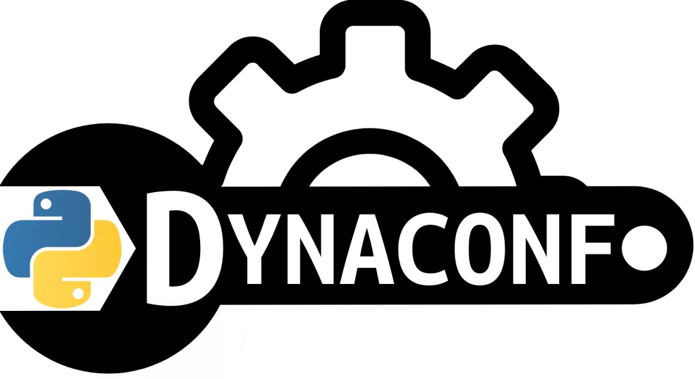

Python <br />Dynaconf 是一个Python的第三方模块，旨在成为在 Python 中管理配置的最佳选择。<br />它可以从各种来源读取设置，包括环境变量、文件、服务器配置等。<br />它适用于任何类型的 Python 程序，包括 Flask 和 Django 扩展。<br />
<a name="MqvRW"></a>
## 1、准备
请选择以下任一种方式输入命令安装依赖：

1. Windows 环境 打开 Cmd (开始-运行-CMD)。
2. MacOS 环境 打开 Terminal (command+空格输入Terminal)。
3. 如果用的是 VSCode编辑器 或 Pycharm，可以直接使用界面下方的Terminal。
```bash
pip install dynaconf
```
<a name="ry0p1"></a>
## 2、初步使用DynaConf
在项目的根目录中运行  `dynaconf init`  命令。
```bash
cd path/to/your/project/
dynaconf init -f toml
```
会有类似如下的输出，说明初始化完成：
```bash
⚙️ Configuring your Dynaconf environment
------------------------------------------
🐍 The file `config.py` was generated.

🎛️ settings.toml created to hold your settings.

🔑 .secrets.toml created to hold your secrets.

🙈 the .secrets.* is also included in `.gitignore`
beware to not push your secrets to a public repo.

🎉 Dynaconf is configured! read more on https://dynaconf.com
```
刚刚初始化的时候选择了 toml 格式。实际上还可以选择  toml|yaml|json|ini|py ，不过 `toml` 是默认的，也是最推荐的配置格式。<br />初始化完成后会创建以下文件：
```bash
.
├── config.py # 需要被导入的配置脚本
├── .secrets.toml # 像密码等敏感信息配置
└── settings.toml # 应用配置
```
初始化完成后就可以编写配置，编辑settings.toml：
```toml
key = "value"
a_boolean = false
number = 1234
a_float = 56.8
a_list = [1, 2, 3, 4]
a_dict = {hello="world"}

[a_dict.nested]
other_level = "nested value"
```
然后就可以在代码中导入并使用这些配置：
```python
from config import settings

assert settings.key == "value"
assert settings.number == 789
assert settings.a_dict.nested.other_level == "nested value"
assert settings['a_boolean'] is False
assert settings.get("DONTEXIST", default=1) == 1
```
如果是密码等敏感信息，可以配置在 .secrets.toml 中:
```toml
password = "s3cr3t"
token = "dfgrfg5d4g56ds4gsdf5g74984we5345-"
message = "This file doesn't go to your pub repo"
```
.secrets.toml 文件会被自动加入到 .gitignore 文件中，这些信息不会被上传到Git仓库上。<br />同时，DYNACONF还支持带前缀的环境变量：
```bash
export DYNACONF_NUMBER=789
export DYNACONF_FOO=false
export DYNACONF_DATA__CAN__BE__NESTED=value
export DYNACONF_FORMATTED_KEY="@format {this.FOO}/BAR"
export DYNACONF_TEMPLATED_KEY="@jinja {{ env['HOME'] | abspath }}"
```
<a name="biKkc"></a>
## 3、高级使用
还可以在Flask或Django中使用DynaConf，以Django为例，第一步要先确保已经设置 `DJANGO_SETTINGS_MODULE` 环境变量：
```bash
export DJANGO_SETTINGS_MODULE=yourproject.settings
```
然后在 manage.py 相同文件夹下运行初始化命令：
```bash
dynaconf init -f yaml
```
然后按照终端上的说明进行操作:
```bash
Django app detected
⚙️ Configuring your Dynaconf environment
------------------------------------------
🎛️ settings.yaml created to hold your settings.

🔑 .secrets.yaml created to hold your secrets.

🙈 the .secrets.yaml is also included in `.gitignore`
beware to not push your secrets to a public repo
or use dynaconf builtin support for Vault Servers.

⁉ path/to/yourproject/settings.py is found do you want to add dynaconf? [y/N]:
```
回答 y:
```python
🎠 Now your Django settings are managed by Dynaconf
🎉 Dynaconf is configured! read more on https://dynaconf.com
```
在 Django 上，推荐的文件格式是yaml，因为它可以更轻松地保存复杂的数据结构，但是依然可以选择使用 toml、json、ini 甚至将配置保存为 .py 格式。<br />初始化 dynaconf 后，在现有的settings.py底部包含以下内容:
```python
# HERE STARTS DYNACONF EXTENSION LOAD
import dynaconf # noqa
settings = dynaconf.DjangoDynaconf(__name__) # noqa
# HERE ENDS DYNACONF EXTENSION LOAD (No more code below this line)
```
现在，在 Django 视图、模型和所有其他地方，现在可以正常使用 `django.conf.settings`，因为它已被 Dynaconf 设置对象替换。
```python
from django.conf import settings

def index(request):
    assert settings.DEBUG is True
    assert settings.NAME == "Bruno"
    assert settings.DATABASES.default.name == "db"
    assert settings.get("NONEXISTENT", 2) == 2
```
现在，通过修改 manage.py 相同文件夹下的配置文件，就能让配置全局生效了。
