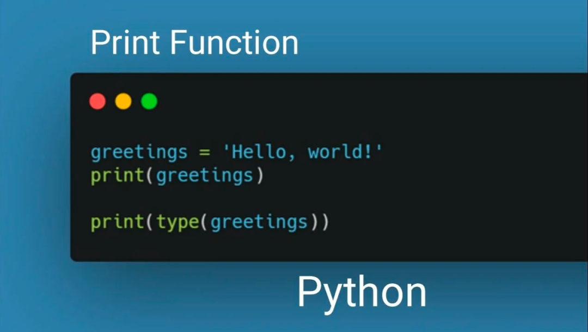
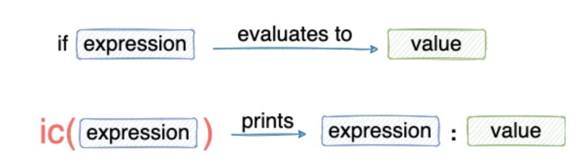
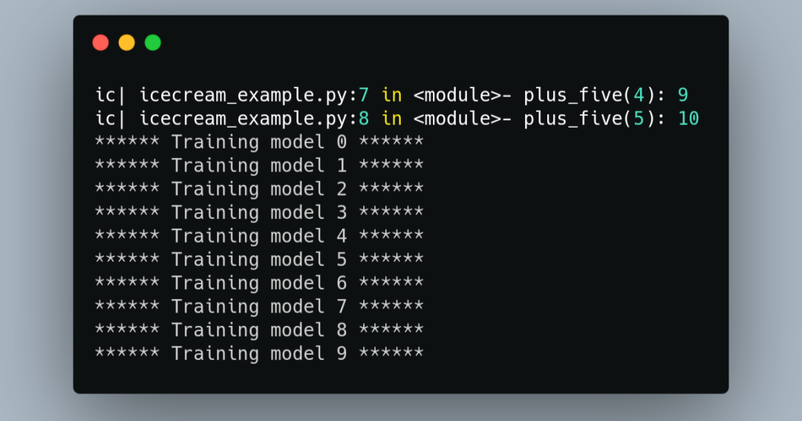

Python
<a name="EA5kP"></a>
## 前言
在编程过程中，Bug几乎是不可避免的。其实大部分程序员花了大量的时间进行Debug(调试)，以使他们的代码没有Bug。<br /><br />在调试时，最常用的方法无疑是选择使用`print()`语句来了解 pipeline 流程以及发现bug。<br />然而，使用`print()`有许多注意事项，例如:

- 打印语句通常是为了向用户显示一个输出。如果程序员使用`print()`进行调试，在调试结束后，程序员应该谨慎地只删除那些特定的`print()`语句，这些语句是用来调试的。
- 通常，在调试期间，可能会一个接一个地打印多个变量。在这种情况下，程序员必须手动格式化输出以增强其可读性。
```python
var_1 = 1
var_2 = 2
print(var_1)
print(var_2)
```
```
1
2
```
上面，打印了两个变量。虽然在这里知道第一个变量是var_1，第二个是var_2，但随着变量数量的增加，可能需要在代码和输出之间来回寻找，以找出哪个输出对应于哪个变量。<br />当然，可以打印更多的细节，像下面这样，但这只是增加了工作，如果一直在做像这样的工作，不就需要996了。
```python
var_1 = 1
var_2 = 2
print("var_1 =", var_1)
print("var_2 =", var_2)
```
```
var_1 = 1
var_2 = 2
```

- 有时，程序员可能还需要对打印行号、函数名称及其输入等，这增加了编写又长、又多的`print()`语句的复杂性。
- 在大多数情况下，代码库不只限于一个文件。相反，有多个文件组成管道。在这种情况下，人们可能有兴趣在调试时也显示文件的名称，而用`print()`会很麻烦。

上述原因使得`print()`成为最糟糕的调试选项。<br />值得庆幸的是，在Python中有一个很好的替代方案 —— [**IceCream**](https://github.com/gruns/icecream)🍦!
<a name="cgwCO"></a>
## IceCream
**IceCream**是一个Python库，它使Debug不费吹灰之力，并能用最少的代码查看调试结果。<br />它常用的功能包括打印**表达式、变量名、函数名、行号、文件**名等等。
<a name="MzhzL"></a>
### 安装 IceCream
可以使用 pip来安装 icecream库。
```bash
pip install icecream
```
<a name="cjTVZ"></a>
### 导入IceCream
使用这个库的标准惯例是导入ic模块，如下所示。
```python
from icecream import ic
```
<a name="fOC7B"></a>
### 开始使用IceCream
使用 **IceCream **库就像 print 语句一样简单。需要把 `print()` 替换为 `ic()`。就是这样。
```python
ic(var_1)
ic(var_2)
```
```
ic| var_1: 1
ic| var_2: 2
```
注意区别！`ic()`不仅打印**值**，而且还打印所传递的**变量的名称**。<br />**IceCream** 不仅仅局限于一个变量。相反，可以在函数、类等方面使用它。
```python
def func(num):
    return num * 2
```
```python
ic(func(3))
ic| func(3): 6
```
超酷！它打印了方法的名称（func），传递的参数（3）和输出（6）。<br />每一个进入`ic()`方法的表达式都会被打印出来，同时还有表达式的数值，如下图所示。<br /><br />用 **IceCream Debug **也可以应用于普通的 Python 数据结构。下面是一个Python字典的例子。
```python
sample_dict = {1:"A", 2:"B", 3:"C"}
ic(sample_dict[1])
```
```python
ic| sample_dict[1]: 'A'
```
<a name="lMUmR"></a>
## 检查执行情况
很多时候，程序员使用`print()`来显示有意义的（有时是随机的）语句来确定程序的流程。
```python
def func(input_num):
    if input_num == 1:
        print("If Executed!")
        ...
    else:
        print("Else Executed!")
        ...
```
**IceCream**也可以避免那些奇怪的声明。
```python
## icecream_demo.py
from icecream import ic
def func(input_num):
    if input_num == 1:
        ic()
        ...
    else:
        ic()
        ...
func(2)
```
只要调用`ic()`就可以了。它将打印文件名、行号和其他细节（如函数名，如果有的话）以及时间。这样看，是不是非常简单。
<a name="CdpgN"></a>
## 使用IceCream项目范围
接下来，可能会想，`print()` 函数是Python 的内置库，使用方便，不需每次都`import`。而**IceCream** 是否需要在每个Python文件中都导入这个库？**当然不是!**<br />为了使方法在所有项目文件中可用，在根文件中导入icecream的install模块，如下所示。
```python
## main_file.py
from icecream import install
install()
from help_file import func
func(2)

## help_file.py
def func(num):
    ic(num)
    return 2*num
```
通过`install`，`ic()`可以在整个项目中使用。
<a name="jxORK"></a>
## 添加一个自定义前缀
如果注意到上面，`ic()`语句的输出以"ic|"开始。那是**IceCream**提供的默认前缀。<br />然而，如果由于某种原因，希望用一个自定义的前缀来代替它，可以通过在 `ic.configureOutput()` 方法中指定 prefix 参数来实现的，如下所示。
```python
from icecream import ic
ic.configureOutput(prefix='ic debug| -> ')
ic("A custom prefix")
```
<a name="ynzMc"></a>
## 调试后删除IceCream语句
一旦代码调试结束，可能想删除所有不必要的调试语句。<br />由于`ic()`语句在语法上与`print()`不同，可以在编辑器中搜索"ic("模式并删除这些语句，如下所示。<br />语句")<br />另外，可以使用`ic.disable()`来停止`ic()`的打印。如果想再次使用它们，请使用`ic.enable()`。
<a name="TsNp2"></a>
## 最后
用`print()`语句进行调试是一种混乱的、不优雅的方法。将输出映射到其相应的调试语句是很混乱的。此外，它需要额外的手动格式化来理解输出。<br />如上所述，**Python** 中的 **IceCream** 库是一个很好的替代品。它使调试不费吹灰之力，可读性强，代码最少。<br />
<a name="p1Bgv"></a>
## 参考资料
IceCream: [_https://github.com/gruns/icecream_](https://github.com/gruns/icecream)
