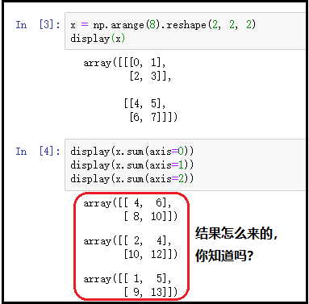
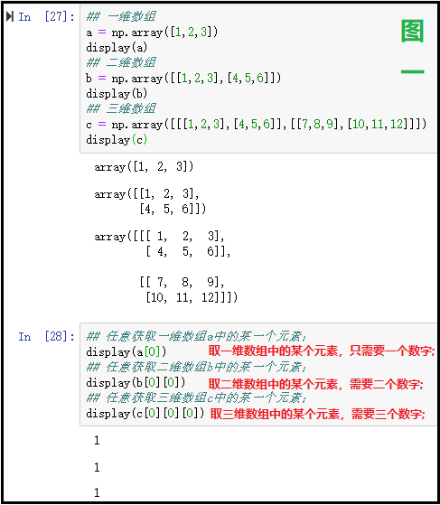
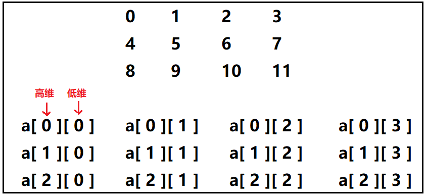
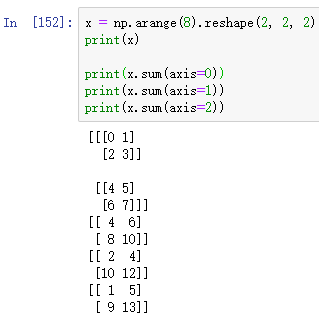
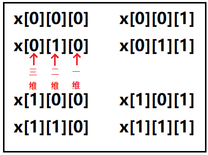

Python Numpy Pandas
<a name="BXNj4"></a>
## 1、关于axis轴的说明
在numpy高维数组(包括二维)中，在`pandas`的`DataFrame`中，经常会针对某一个方向上的数据，做一些函数运算。<br />由于二维数组，`DataFrame`数据框才是最常用，并且经常使用的数据结构，因此就利用这种具有行、列的二维结构，来讲述`axis=0`和`axis=1`的区别。<br />比如说，求某一行数据的总和；比如说，求某一列的最大值；<br />这个时候就需要知道，`axis`等于多少是按行求和，`axis`等于多少是按列求最大值？<br />因此，千万不要死记硬背，说什么`axis=0`代表按照列求函数运算，`axis=1`代表按照行求函数运算，学会原理，不管是任何高维数组，都有解题思路。<br />思考： 给一个三维数组，如何设置axis轴的值吗？这个案例将会在最后进行讲解。<br />
<a name="UCUOw"></a>
## 2、什么是维度？
"用一个比喻进行说明："<br />    1、一条线：一维，一维就是由很多个点组成。<br />    2、一个平面：二维，由很多很多根线组成。<br />    3、一个立体空间，三维，由很多个平面组成。<br />"在任何的维度空间中，要确定一个点，必须要指定对应维度的坐标信息："<br />    1、一条线：只需要一个数字x，就可以确定该点的位置。<br />    2、一个面：需要两个数字(x,y)，才可以确定该点的位置。<br />    3、一个立体空间：需要三个数字(x,y,z)，才可以确定该点的位置。<br />举例说明：<br />
<a name="S538h"></a>
## 3、什么是高维，什么是低维？
这里仍然使用上面的"图一"来说明这个知识点。<br />上图创建了不同维度的三个数组：a、b、c，主要关注下面In[28]那里的取数。<br />对于一维数组a，数组a中每一个元素，肯定都是单个元素，因此这只有一个维度。<br />对于二维数组b，数组b中每一个元素相当于是一个一维数组，每个一维数组中才是单个元素，因而b[0]取到的是里面的一维数组，因此这个离着b最近的[0]就算是"高维"，`b[0][0]`取到的是最内层一维数组中的每一个元素，因此，第二个`[0]`就是"低维"。
<a name="s2105"></a>
## 4、二维结构数据的坐标展示

<a name="OQ5fV"></a>
## 5、`axis=0` 与 `axis=1`的含义
`axis`指的就是"轴"，轴的取值一般是0，1，2...其中0表示最高维，1表示次高维，依次推算下去。<br />仍然利用上面的二维结构的数据为基准，来进行说明。在二维结构中axis要么为0，要么为1。<br />当axis=0的时候，由于0代表最高维度，因此数据中高维发生变化，而低维没有变化(但是低维相同)的数据，会自动成为一组，即a[0][0]，a[1][0]，a[2][0]当然a[0][1]，a[1][1]，a[2][1]也自然是一组。因此，可以看出，当指定了axis=0的时候，就是相当于沿着列的方向，进行函数运算。<br />当axis=1的是时候，由于1代表次高维，因此数据中低维发生变化，而高维没有变化(但是高维相同)的数据，会自动成为一组，即a[0][0]、a[0][1]、a[0][2]、a[0][3]，当然a[1][0]、a[1][1]、a[1][2]、a[1][3]也自然是一组。因此，可以看出，当指定了axis=1的时候，就是相当于沿着行的方向，进行函数运算。
<a name="mwjIi"></a>
## 6、关于三维数组axis设置
```python
x = np.arange(8).reshape(2, 2, 2)
print(x)

print(x.sum(axis=0))
print(x.sum(axis=1))
print(x.sum(axis=2))
```
结果如下：<br /><br />数组x的坐标展示：<br /><br />通过前面的叙述，已经知道axis=0表示最高维，axis=1表示次高维，依次下去。因此，对于三维数组来说，axis=0指的就是三维，axis=1指的就是二维，那么axis=2指的就是一维。

- 当axis=0的时候，指的就是，最高维三维变化，其他维度不变化的数据会成为一组，因此x[0][0][0]、x[1][0][0];x[0][1][0]、x[1][1][0];x[0][0][1]、x[1][0][1];x[0][1][1]、x[1][1][1]各自成为一组，把这组内对应元素相加就是`x.sum(axis=0)`的答案了。
- 当axis=1的时候，就是次高维二维变化，其他维度不变化，因此x[0][0][0]、x[0][1][0];x[0][0]1]、x[0][1][1];x[1][0][0]、x[1][1][0];x[1][0][1]、x[1][1][1];各自成为一组，把这组内对应元素相加就是x.sum(axis=1)的答案了。
- 当axis=3的时候，最低维一维变化，其他维度不变化，因次x[0][0][0]、x[0][0][1];x[0][1][0]、x[0][1][1];x[1][0][0]、x[1][0][1];x[1][1][0]、x[1][1][1];各自成为一组，把这组内对应元素相加就是`x.sum(axis=2)`的答案了。
