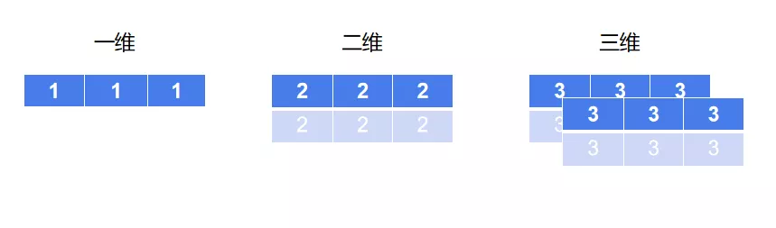

Python Numpy ndarray<br />numpy(Numerical Python)是一个开源的Python数据科学计算库，支持对N维数组和矩阵的操作，用于快速处理任意维度的数组。<br />numpy库的功能非常聚焦，专注于做好“一件事”。numpy主要使用ndarray来处理N维数组，numpy中的大部分属性和方法都是为ndarray服务的。所以，掌握了ndarray的用法，基本就掌握了numpy的用法。<br />ndarray是一个N维数组类型的对象，与python的基本数据类型列表相比，同一个ndarray中所有元素的数据类型都相同，而列表中可以存储不同类型的数据。ndarray在存储的数据类型上做限制，换取了运算效率的提升和数据处理的便捷，在数据分析中非常实用。
<a name="pfTjM"></a>
## 一、ndarray的属性
```python
# coding=utf-8
import numpy as np


array_a = np.array([[1, 2, 3], [4, 5, 6]])
print(array_a)
print('ndarray的维度: ', array_a.ndim)
print('ndarray的形状: ', array_a.shape)
print('ndarray的元素数量: ', array_a.size)
print('ndarray中的数据类型: ', array_a.dtype)
print(type(array_a))
```
```python
[[1 2 3]
 [4 5 6]]
ndarray的维度:  2
ndarray的形状:  (2, 3)
ndarray的元素数量:  6
ndarray中的数据类型:  int32
<class 'numpy.ndarray'>
```
ndarray有很多属性和方法，可以用`dir()`内置方法将他们打印出来。先从属性开始介绍。<br />shape属性表示ndarray的形状，是一个元组，表示数组有几维，每个维度有多少个数据。ndim属性表示数组的维度。size属性表示数组中的元素个数，size可以通过shape中的值相乘得到。dtype属性表示数组中保存的数据类型。从Python解释器的角度看，ndarray属于`numpy.ndarray`对象。
<a name="kkPTR"></a>
## 二、ndarray的维度和形状
为了更好地理解ndarray，可以先看它的维度和形状。
```python
array_b = np.array([1, 1, 1])
array_c = np.array([[2, 2, 2], [2, 2, 2]])
array_d = np.array([[[3, 3, 3], [3, 3, 3]], [[3, 3, 3], [3, 3, 3]]])
print(array_b, '\n{}'.format(array_c), '\n{}'.format(array_d))
print(array_b.shape, array_c.shape, array_d.shape)
```
```python
[1 1 1] 
[[2 2 2]
 [2 2 2]] 
[[[3 3 3]
  [3 3 3]]
 [[3 3 3]
  [3 3 3]]]
(3,) (2, 3) (2, 2, 3)
```
array_b是一个一维数组，数组中有三个数据。array_c是一个二维数组，数组中有2*3个数据。array_d是一个三维数组，数组中有2*2*3个数据。所以它们的形状分别是(3,) 、(2, 3)和 (2, 2, 3)。用图形表示如下：

<br />从一维到三维的变化，可以帮助理解ndarray的维度和形状变化。ndarray的维度可以是N维，从4维开始，不方便用图形来展示，会稍微抽象一点。<br />从Python中的数据表示方式来看，N维数组的显示结果与列表相同，每多嵌套一层，就代表多一个维度。根据上面例子中的数据，依次类推，可以表示出更多维度的ndarray数据。
<a name="QmadH"></a>
## 三、ndarray中的数据类型
在一个ndarray对象中，存储的是同一类型的数据，ndarray中常见的数据类型有下表这些。

| 名称 | 描述 | 简写 |
| --- | --- | --- |
| np.bool | 用一个字节存储的布尔类型(True或False)，在数据分析中很常用。 | 'b' |
| np.int8 | 一个字节大小，-128至127，不常用。 | 'i' |
| np.int16 | 整数，-32768至32767，不常用。 | 'i2' |
| np.int32 | 整数，-2^31至2^32-1，常用。 | 'i4' |
| np.int64 | 整数，-2^63至2^63-1，常用，一般整数默认为np.int64或np.int32。 | 'i8' |
| np.uint8 | 无符号整数，0至255，不常用。 | 'u' |
| np.uint16 | 无符号整数，0至65535，不常用。 | 'u2' |
| np.uint32 | 无符号整数，0至2^32-1，常用。 | 'u4' |
| np.uint64 | 无符号整数，0至2^64-1，常用。 | 'u8' |
| np.float16 | 16位半精度浮点数，正负号1位，指数5位，精度10位，不常用。 | 'f2' |
| np.float32 | 32位单精度浮点数，正负号1位，指数8位，精度23位，不常用。 | 'f4' |
| np.float64 | 64位双精度浮点数，正负号1位，指数11位，精度52位，常用。 | 'f8' |
| np.complex64 | 复数，分别用两个32位浮点数表示实部和虚部，基本不会用。 | 'c8' |
| np.complex128 | 复数，分别用两个64位浮点数表示实部和虚部，基本不会用。 | 'c16' |
| np.object_ | python对象，常用。 | 'O' |
| np.string_ | 字符串，常用。 | 'S' |
| np.unicode_ | unicode类型，不常用。 | 'U' |

<a name="pHJtA"></a>
## 四、修改ndarray的形状和数据类型
<a name="d9y7j"></a>
### 1. 修改ndarray的形状
```python
array_e = np.array([[1, 2, 3], [4, 5, 6]])
print(array_e, array_e.shape)
array_e1 = array_e.reshape((3, 2))
print(array_e1, array_e1.shape)
array_e2 = array_e.T
print(array_e2, array_e2.shape)
```
```python
[[1 2 3]
 [4 5 6]] (2, 3)
[[1 2]
 [3 4]
 [5 6]] (3, 2)
[[1 4]
 [2 5]
 [3 6]] (3, 2)
```
`reshape(shape[, order])`: 修改ndarray的形状。修改数组的形状时，不能改变数组中的元素个数，如上面的数组形状是(2, 3)，可以修改成(3, 2)或(1, 6)、(6, 1)，修改形状后仍然是6个元素。<br />`ndarray.T`: 将ndarray转置(行和列交换，行变成列，列变成行)。 对比上面的两次修改，`reshape()`和`.T`转换后数组的形状都是(3, 2)，但数据的排列方式不一样，`reshape()`修改的结果没有改变数据的先后顺序，`.T`的结果是将行变成列，列变成行。
<a name="IPNyC"></a>
### 2. 修改ndarray的数据类型
```python
array_f = np.array([[1, 2, 3], [4, 5, 6]])
print(array_f, array_f.dtype)
array_f1 = array_f.astype(np.int64)
print(array_f1, array_f1.dtype)
```
```python
[[1 2 3]
 [4 5 6]] int32
[[1 2 3]
 [4 5 6]] int64
```
`astype(dtype[, order, casting, subok, copy])`: 修改ndarray中的数据类型。传入需要修改的数据类型，其他关键字参数可以不关注。
<a name="5n3J9"></a>
## 五、ndarray的多种生成和创建方法
<a name="481d2071"></a>
### 1. 生成全为0或全为1的ndarray
```python
array_g = np.ones((2, 3), order='F')
print(array_g, array_g.dtype)
array_h = np.zeros((3, 3), dtype='int64')
print(array_h, array_h.dtype)
array_i = np.ones_like([[1, 2, 3], [4, 5, 6]])
print(array_i, array_i.dtype)
array_j = np.zeros_like([[1, 2, 3], [4, 5, 6]])
print(array_j, array_j.dtype)
```
```python
[[1. 1. 1.]
 [1. 1. 1.]] float64
[[0 0 0]
 [0 0 0]
 [0 0 0]] int64
[[1 1 1]
 [1 1 1]] int32
[[0 0 0]
 [0 0 0]] int32
```
`ones(shape[, dtype, order])`: 生成全为1的ndarray。shape为必传参数，表示生成的数组的形状。dtype表示数组中存储的数据类型，默认为float64，可以指定数据类型。order表示数组的秩序，表示存储的数据是以行为主还是以列为主(两种风格)，通常不关注此参数。<br />`zeros(shape[, dtype, order])`: 生成全为0的ndarray。参数同`ones()`。<br />`ones_like(a[, dtype, order, subok])`: 生成全为1的ndarray，形状与已知数组相同。a为必传参数，传入一个形似array的数据(array_like，通常是嵌套列表或数组)。dtype表示数组中存储的数据类型，默认与传入的数组相同。另外两个参数通常不关注。<br />`zeros_like(a[, dtype, order, subok])`: 生成全为0的ndarray，形状与已知数组相同。参数同`ones_like()`。
<a name="e5df6550"></a>
### 2. 生成全为指定值或全为空的ndarray
```python
array_k = np.full((2, 3), 2)
print(array_k, array_k.dtype)
array_l = np.full_like([[1, 2, 3], [4, 5, 6]], 3)
print(array_l, array_l.dtype)
array_m = np.empty((2, 3))
print(array_m, array_m.dtype)
array_n = np.empty((2, 4))
print(array_n, array_n.dtype)
```
```python
[[2 2 2]
 [2 2 2]] int32
[[3 3 3]
 [3 3 3]] int32
[[1. 1. 1.]
 [1. 1. 1.]] float64
[[6.23042070e-307 4.67296746e-307 1.69121096e-306 1.33511562e-306]
 [1.37962660e-306 8.34441742e-308 1.42420481e-306 1.24612013e-306]] float64
```
`full(shape, fill_value[, dtype, order])`: 生成全为指定值的ndarray。shape为必传参数，表示生成的数组的形状。fill_value为必传参数，表示指定的填充值。<br />`full_like(a, fill_value[, dtype, order, subok])`: 生成全为指定值的ndarray，形状与已知数组相同。a为必传参数，传入一个形似array的数据。fill_value为必传参数，表示指定的填充值。<br />`empty(shape[, dtype, order])`: 生成全为空值的ndarray。如果内存空间中存在一个数组，与生成的空数组形状和数据类型都相同，则生成的空数组会直接指向存在的数组。如果要生成一个完全为空的数组，需要先将内存中形状和数据类型都相同的数组清除，或使空数组的形状或数据类型与已存在的数组不同，这样才能新开辟内存空间，生成真正的空数组，打印空数组的结果是内存编码。与前面的函数相似，也有对应的`empty_like(a[, dtype, order, subok])`函数。
<a name="Ycf7L"></a>
### 3. 生成指定范围值的ndarray
```python
array_o = np.arange(1, 10, 2)
array_p = np.linspace(0, 20, 5, retstep=True)
array_q = np.linspace(array_o, 5, 3)
array_r = np.logspace(0, 100, 6)
print(array_o, '\n{}'.format(array_p), '\n{}'.format(array_q), '\n{}'.format(array_r))
```
```python
[1 3 5 7 9] 
(array([ 0.,  5., 10., 15., 20.]), 5.0) 
[[1. 3. 5. 7. 9.]
 [3. 4. 5. 6. 7.]
 [5. 5. 5. 5. 5.]] 
[1.e+000 1.e+020 1.e+040 1.e+060 1.e+080 1.e+100]
```
`arange(start, stop, step[, dtype])`: 给定起始值、结束值(不包含结束值)和步长，生成指定范围的一维数组，效果相当于Python内置函数`range()`。<br />`linspace(start, stop[, num, endpoint, retstep, dtype, axis])`: 给定起始值、结束值，生成等间隔的一维数组。start表示数组的起始值。stop表示数组的终止值。num表示生成数组中的数据个数，默认为50。endpoint表示数组中是否包含stop值，默认为Ture。retstep表示是否返回数组的步长，默认为False。dtype表示ndarray中的数据类型。<br />`linspace()`中的start或stop也可以传入形似array的数据，此时可生成二维数组。axis参数此时可以派上用场，表示将array_like的数据作为行还是作为列来生成二维数组，默认为0时作为行，如果为-1则作为列。<br />`logspace(start, stop[, num, endpoint, base, dtype, axis])`: 给定起始值、结束值，生成等间隔的一维数组，数据为对数函数log的值。base表示log函数的底数，默认为10。其他参数同`linspace()`。
<a name="4cf86eae"></a>
### 4. 生成随机值的ndarray
```python
array_s = np.random.randint(1, 10, 5)
array_t = np.random.rand(5)
array_u = np.random.uniform(size=5)
array_v = np.random.randn(5)
array_w = np.random.normal(10, 1, 5)
print(array_s, '\n{}'.format(array_t), '\n{}'.format(array_u), '\n{}'.format(array_v), '\n{}'.format(array_w))
```
```python
[1 7 4 2 8] 
[0.68173299 0.92899918 0.01771993 0.03010565 0.74799694] 
[0.97895281 0.67811682 0.15493234 0.04435618 0.15152692] 
[ 1.24094827  1.27898853 -1.42507622  1.97560767 -0.43269307] 
[11.24927114 10.07827993  9.83908081 10.94827526 10.14160875]
```
`np.random.randint(low, high=None, size=None, dtype=None)`: 给定起始值、结束值(不包含结束值)和数据个数，从指定范围内生成指定个数(每次生成一个，共size次)的整数，组成一个一维数组。<br />`np.random.rand()`: 生成一个0到1(不包含1)之间的随机数，如果传入生成的数据个数，则生成一维数组，数组中的每个值都是0到1之间的随机数。<br />`np.random.uniform(low=0.0, high=1.0, size=None)`: 给定起始值、结束值(不包含结束值)和数据个数，从指定范围内生成指定个数的小数，组成一维数组。默认同`rand()`。<br />这三个函数在生成随机数组时，数据范围内的每个数概率相等，数据是均匀分布的。<br />`np.random.randn()`: 按标准正太分布(均值为0，标准差为1)生成一个随机数。如果传入生成的数据个数，则生成一维数组。<br />`np.random.normal(loc=0.0, scale=1.0, size=None)`: 给定均值、标准差和数据个数，按正太分布的概率生成指定个数的数，组成一个一维数组。<br />`randn()`和`normal()`函数生成的随机数组中，数据是正太分布的。
<a name="rgwWd"></a>
### 5. ndarray的浅拷贝和深拷贝
除了直接创建新的数组，也可以复制已有的数组。
```python
array_x = np.array([(5, 5, 5), [5, 5, 5]])
array_y = np.asarray(array_x)
array_z = np.copy(array_x)
print(array_x, '\n{}'.format(array_y), '\n{}'.format(array_z))
```
```python
[[5 5 5]
 [5 5 5]] 
[[5 5 5]
 [5 5 5]] 
[[5 5 5]
 [5 5 5]]
```
`array(object[, dtype, copy, order, subok, ndmin])`: 创建一个数组，传入一个形似array的数据。在最开始介绍ndarray属性时，就是用`array()`创建数组。<br />`asarray(a[, dtype, order])`: 将输入的数据转换为一个数组，输入一个嵌套列表或数组，可以用此函数来实现拷贝数组。`asarray()`还有几个延伸的函数`asanyarray(a[, dtype, order])，ascontiguousarray(a[, dtype])`和`asmatrix(data[, dtype])`。<br />`copy(a[, order])`: 拷贝数组。`copy()`函数是深拷贝，`asarray()`函数是浅拷贝，下面验证一下。
```python
array_x[0][1] = 6
print(array_x, '\n{}'.format(array_y), '\n{}'.format(array_z))
```
```python
[[5 6 5]
 [5 5 5]] 
[[5 6 5]
 [5 5 5]] 
[[5 5 5]
 [5 5 5]]
```
被拷贝的数组中所有数据都是5，用`asarray()`和`copy()`函数拷贝的数组也一样。修改被拷贝数组中第一维第二个数据为6后，`asarray()`函数拷贝的数组中也变成了6，`copy()`函数拷贝的数组中还是5，说明`asarray()`函数是浅拷贝，`copy()`函数是深拷贝。
<a name="b46cb8d1"></a>
## 六、ndarray的索引、切片和去重 
<a name="pqfaF"></a>
### 1. ndarray的索引和切片
```python
array1 = np.array([[[1, 2, 3, 4], [3, 4, 5, 6]], [[7, 8, 9, 10], [9, 10, 11, 12]]])
print(array1, array1.shape)
print(array1[1])
print(array1[1][0])
print(array1[1, 0])
print(array1[0, :1, 1:3])
```
```python
[[[ 1  2  3  4]
  [ 3  4  5  6]]
 [[ 7  8  9 10]
  [ 9 10 11 12]]] (2, 2, 4)
[[ 7  8  9 10]
 [ 9 10 11 12]]
[ 7  8  9 10]
[ 7  8  9 10]
[[2 3]]
```
ndarray的索引和切片与Python列表的方式相同，可以直接用列表的语法对ndarray进行索引和切片操作。另外，numpy中还有特殊的索引和切片语法，如`array[1, 0]`与`array[1][0]`的结果一样。
<a name="5ohIB"></a>
### 2. ndarray的去重
```python
array2 = np.unique(array1)
print(array2)
```
```python
[ 1  2  3  4  5  6  7  8  9 10 11 12]
```
`unique(ar, [return_index, return_inverse, return_counts, axis])`: 对ndarray去重。默认是对整个数组去重，返回一个一维数组。也可以使用axis参数指定按行还是按列去重。
<a name="ZkeK3"></a>
## 七、ndarray的运算 
<a name="rAAsq"></a>
### 1. 逻辑运算
```python
array3 = np.array([[1, 2, 3], [4, 5, 6]])
print(np.all(array3 > 1))
print(np.any(array3 > 1))
```
```python
False
True
```
ndarray可以直接与整数进行比较，判断大小，返回布尔值。<br />`all(a[, axis, out, keepdims])`: 当ndarray中的所有元素都满足逻辑判断时，返回真，否则返回假。如数组`[[1, 2, 3], [4, 5, 6]] > 1`当且仅当所有数都大于1时，才为真。<br />`any(a[, axis, out, keepdims])`: 只要ndarray中有一个元素满足逻辑判断，返回真，全都不满足时返回假。如数组`[[1, 2, 3], [4, 5, 6]] > 1`只要有一个数大于1，就为真。
<a name="i0aof"></a>
### 2. 三目运算
```python
array4 = np.where(array3 > 3, 1, 0)
print(array4)
array5 = np.where(np.logical_and(array3 > 2, array3 < 5), 1, 0)
print(array5)
array6 = np.where(np.logical_or(array3 < 2, array3 > 5), 1, 0)
print(array6)
```
```python
[[0 0 0]
 [1 1 1]]
[[0 0 1]
 [1 0 0]]
[[1 0 0]
 [0 0 1]]
```
`where(condition, x=None, y=None)`: 对ndarray中的所有数据进行逻辑运算，逻辑为真的位置赋值为x，逻辑为假的位置赋值为y，实现三目运算。如果需要进行复合逻辑运算，可以使用`np.logical_and()`、`np.logical_not()`、`np.logical_or()`或`np.logical_xor()`来连接，分别表示逻辑与、逻辑非、逻辑或和逻辑异或(同真同假为假，一真一假为真)。
<a name="KTdBl"></a>
### 3. 统计运算
```python
array7 = np.array([[1, 3, 5], [7, 9, 11]])
print('最小值：', np.min(array7), np.min(array7, axis=0))
print('最大值：', np.max(array7), np.max(array7, axis=1))
print('中位数：', np.median(array7))
print('平均值：', np.mean(array7))
print('标准差：', np.std(array7))
print('方差：', np.var(array7))
print('最小值的索引：', np.argmin(array7))
print('最大值的索引：', np.argmax(array7))
```
```python
最小值：1 [1 3 5]
最大值：11 [ 5 11]
中位数：6.0
平均值：6.0
标准差：3.415650255319866
方差：11.666666666666666
最小值的索引：0
最大值的索引：5
```
`min(a[, axis, out, keepdims, initial, where])`: 返回ndarray中的最小值。实际调用的是`amin()`函数。如果设置axis为0，则计算每一列的最小值，axis为1，则计算每一行的最小值。<br />`max(a[, axis, out, keepdims, initial, where])`: 返回ndarray中的最大值。实际调用的是`amax()`函数。<br />`median(a[, axis, out, overwrite_input, keepdims])`: 返回ndarray中的中位数。<br />`mean(a[, axis, dtype, out, keepdims])`: 返回ndarray的平均值。<br />`std(a[, axis, dtype, out, ddof, keepdims])`: 返回ndarray的标准差。<br />`var(a[, axis, dtype, out, ddof, keepdims])`: 返回ndarray的方差。<br />`argmin(a[, axis, out])`: 返回ndarray中最小值的索引。<br />`argmax(a[, axis, out])`: 返回ndarray中最大值的索引。<br />上面的所有函数中，axis参数的用法都相同。
<a name="0d34d96a"></a>
## 八、ndarray之间的运算 
<a name="4FStl"></a>
### 1. ndarray与数字和ndarray之间的运算
```python
array8 = np.array([[1, 2, 3], [4, 5, 6]])
print(array8 + 2)
array9 = np.array([[2, 2, 2], [2, 2, 2]])
print(array8 * array9)
```
```python
[[3 4 5]
 [6 7 8]]
[[ 2  4  6]
 [ 8 10 12]]
```
ndarray可以直接与数字进行算术运算，注意乘法运算与列表的乘法运算不同，列表与数字相乘是拼接，而ndarray与数字相乘是数组中的每一个数据与数字相乘生成一个新数组。<br />两个形状相同的数组之间也可以直接进行算术运算，运算的结果是将两个数组索引相同的数据进行算术运行，生成一个新数组。
<a name="XRpPk"></a>
### 2. ndarray的广播机制
```python
array10 = np.array([[[1, 1, 1], [1, 1, 1]], [[1, 1, 1], [1, 1, 1]]])
print(array8 * array10)
```
```python
[[[1 2 3]
  [4 5 6]]
 [[1 2 3]
  [4 5 6]]]
```
当两个数组的形状不相同时，要将他们进行运算，numpy会尝试进行广播。广播是将两个数组的形状元组值从后往前逐个进行比较，如果元组中的值相等、其中一个为1或其中一个不存在，则两个数组可以进行运算，生成一个兼容两个数组的新数组。如上面的array8形状是(2, 3)， array10的形状是(2, 2, 3)，从末尾依次比较，3等于3，2等于2，最前面有一个值为空，满足广播的机制，相乘后得到一个形状为(2, 2, 3)的新数组。下面看一个不能广播的例子。
```python
array11 = np.array([[1, 1, 1, 1], [1, 1, 1, 1]])
print(array8 * array11)
```
```python
ValueError: operands could not be broadcast together with shapes (2,3) (2,4)
```
上面的array8形状是(2, 3)， array11的形状是(2, 4)，从末尾开始比较，一个为3，一个为4，不满足广播的三种条件，所以不能广播，执行运算会报错。
<a name="e84c1b66"></a>
### 3. 矩阵相乘
```python
array12 = np.array([[1, 10]])
array13 = np.array([[1, 2, 3], [4, 5, 6]])
print(array12.shape, array13.shape)
print(np.mat(array12) * np.mat(array13))
print(np.matmul(array12, array13))
print(np.dot(array12, array13))
```
```python
(1, 2) (2, 3)
[[41 52 63]]
[[41 52 63]]
[[41 52 63]]
```
与ndarray相比，矩阵一定是二维的。矩阵相乘的条件是第一个矩阵的列与第二个矩阵的行相等，(M行 * N列) * (N行 * L列) = (M行 * L列)。<br />`mat()`: 将二维的数组转换成矩阵。将两个数组转换成矩阵后，如果满足矩阵的相乘条件，即可将它们相乘。<br />`matmul(x1, x2)`: 矩阵相乘，传入两个满足相乘条件的矩阵，也可以是二维数组或列表，会自动转换成矩阵。<br />`dot(a, b[, out])`: 矩阵相乘，传入两个满足相乘条件的矩阵，也可以是二维数组或列表，会自动转换成矩阵。
<a name="mI1C8"></a>
## 九、ndarray的合并和分割  
<a name="326ec236"></a>
### 1. ndarray的合并
```python
array14 = np.array([[1, 2, 3], [4, 5, 6]])
array15 = np.array([[1, 1, 1], [2, 2, 2]])
print(np.concatenate([array14, array15], axis=1))
print(np.concatenate([array14, array15], axis=0))
print(np.hstack([array14, array15]))
print(np.vstack([array14, array15]))
```
```python
[[1 2 3 1 1 1]
 [4 5 6 2 2 2]]
[[1 2 3]
 [4 5 6]
 [1 1 1]
 [2 2 2]]
[[1 2 3 1 1 1]
 [4 5 6 2 2 2]]
[[1 2 3]
 [4 5 6]
 [1 1 1]
 [2 2 2]]
```
`concatenate(arrays[, axis, out])`: 合并两个数组，将需要合并的数组放到一个可迭代对象(列表或元组)中。axis为1表示水平合并，axis为0表示垂直合并，默认为0。<br />`hstack(tup)`: 水平合并两个数组，h是horizontally的缩写。<br />`vstack(tup)`: 垂直合并两个数组，v是vertically的缩写。
<a name="wqL7Y"></a>
### 2. ndarray的分割
```python
array16 = np.array([1, 2, 3, 4, 5, 6])
print(np.split(array16, 2))
print(np.split(array16, [2, 3, 5]))
```
```python
[array([1, 2, 3]), array([4, 5, 6])]
[array([1, 2]), array([3]), array([4, 5]), array([6])]
```
`split(ary[, indices_or_sections, axis])`: 分割数组。split函数会把数组当成一维数组来分割，即使传入的是多维数组。第二个参数如果传入一个整数，则会进行等分，无法等分时报错。第二个参数如果传入由指定分割点组成的可迭代对象，则按指定的分割点进行分割，分割点如果超出被分割数组的数据范围，超出部分返回空数组。
<a name="2pUud"></a>
## 十、ndarray读写文件 
提前准备一个叫array.csv的文件，数据如下。
```python
data1,data2,data3,data4
1,2,3,4
5,6,,7
8,,9,10
```

```python
array17 = np.genfromtxt('array.csv', delimiter=',', skip_header=1)
print(array17)
np.savetxt('save.csv', array17, fmt='%.0f', delimiter=',')
```

```python
[[ 1.  2.  3.  4.]
 [ 5.  6. nan  7.]
 [ 8. nan  9. 10.]]
```
`genfromtxt(fname[, delimiter, skip_header, skip_footer, ...])`: 从txt文件或csv文件中读取数据，生成一个数组。fname为必传参数，表示读取的文件名，要根据情况带上相对路径。delimiter表示读取数据时的分割点，默认为None，csv文件通常是以逗号分割的，txt文件则可能以空格或逗号分割。skip_header表示跳过数据的前几行，默认为0，通常用来跳过表头。这个函数的参数特别多，其他的根据需要点进源码查看即可。<br />读取的数据中很可能有缺失值，也就是空值，读取后，ndarray中将空值显示为nan。在数据分析过程中，要对缺失值做处理，一般情况，如果缺失值不多，可以直接删除有缺失的行，也可以用缺失值所在列的平均值进行填充。根据业务的不同，还有其他合理的填充方式进行处理。<br />`savetxt(fname, X[, fmt, delimiter])`: 将数据保存到txt文件中。fname参数表示保存的文件名。X传入一维或二维的形似array的数据，表示要保存到文件中的数据。delimiter参数同`genfromtxt()`，还有几个参数按需查看。将上面读出来的数据保存到新文件save.csv中，结果如下。
```python
1,2,3,4
5,6,nan,7
8,nan,9,10
```
<a name="FzF6v"></a>
## 总结 
numpy库主要用于处理ndarray，也就是多维数组。实际应用中需要的各种功能基本上都有，使用时只需要调对应的函数或方法就行了。
