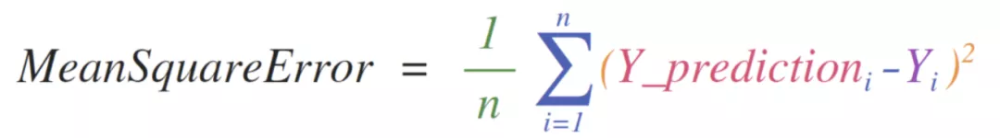
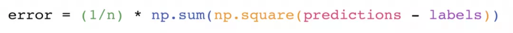
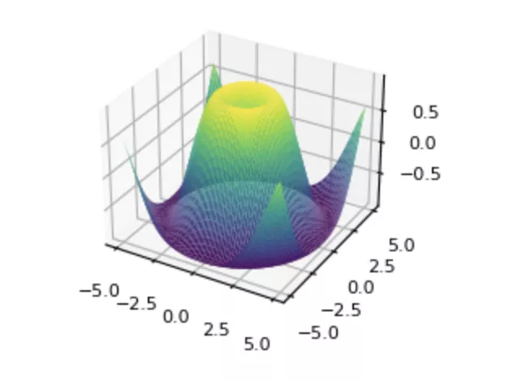
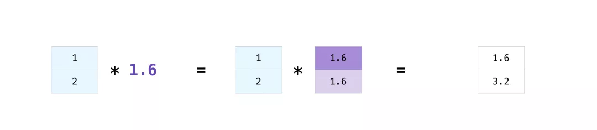

Python Numpy<br />NumPy是 Python 科学计算的基本包，几乎所有用 Python 工作的科学家都利用了NumPy的强大功能。此外，它也广泛应用在开源的项目中，如：Pandas、Seaborn、Matplotlib、scikit-learn等。<br /><br />举个栗子，直观感下NumPy的强大。<br /><br />上图是计算均方差的公式，其中Y_prediction和Y是数组。<br />下面是用NumPy代码，一行便可完成。<br /><br />NumPy结合可视化库，可以用几行代码，绘制出下面的数学函数图<br /><br />学高中学数学时，画函数图都要自己在本上描点，而现在用NumPy，几行代码就搞定，既快又准确。<br />简单认识NumPy后，下面进入详解
<a name="iZsr6"></a>
### 1、与list的区别
NumPy和list都是数组结构，那它们之间有什么区别呢？

1. NumPy数组中所有元素的数据类型是相同的。
2. NumPy底层经过充分优化的 C 语言代码，计算性能比list高。
3. NumPy提供了全面的数学函数可以直接应用在NumPy数组上。
<a name="sELfx"></a>
### 2、创建数组
NumPy中定义的数组叫ndarray，n-dimensions-array 即：**n维数组**。<br />用`np.array()`函数可以创建NumPy数组
```python
>>> import numpy as np
>>> a = np.array([1, 2, 3]) #创建ndarray数组
>>> a
array([1, 2, 3])
>>> type(a)
<class 'numpy.ndarray'>
```
`a`就是NumPy数组，也是`numpy.ndarray`类对象，该类定义了几个常用的属性

- `ndarray.ndim`：维度的数量，二位数组`ndim`是 2
- `ndarray.shape`：元组，每位代表该维度上元素个数，元组长度等于`ndim`
- `ndarray.size`：数组中元素总数
- `ndarray.dtype`：数组中元素的数据类型
- `ndarray.itemsize`：数组中元素存储大小（以字节为单位）
```python
>>> a = np.array([[1,2,3], [4,5,6]])
>>> a
array([[1, 2, 3],
       [4, 5, 6]])
>>> a.ndim
2
>>> a.shape
(2, 3)
>>> a.size
6
>>> a.dtype
dtype('int64')
>>> a.itemsize
8
```
除了`np.array()`创建数组外，还有下面的方式创建数组
```python
>>> np.zeros((2,3)) # 以0填充的二维数组
array([[0., 0., 0.],
       [0., 0., 0.]])
>>> np.ones((2,3)) # 以1填充的二维数组
array([[1., 1., 1.],
       [1., 1., 1.]])
>>> np.empty((2,3)) # 空的二维数组，内容为当时内存中的值
array([[1., 1., 1.],
       [1., 1., 1.]])
>>> np.arange(6) # 用法跟range函数一样
array([0, 1, 2, 3, 4, 5])
>>> np.linspace(0, 10, num=5) # 以指定的线性间隔为初值，创建数组
array([ 0. ,  2.5,  5. ,  7.5, 10. ])
>>> rng = np.random.default_rng(0) # 以随机数创建二维数组
>>> rng.random((2,3))
array([[0.63696169, 0.26978671, 0.04097352],
       [0.01652764, 0.81327024, 0.91275558]])
```
<a name="Q1Z0c"></a>
### 3、访问数组
支持**索引**和**切片**。格式为：
> arr[i, j, k, ...]，i, j, k分别代表数组第0维、第1维、第2维

其中，i, j, k的格式为：<br />s1:s2:s3，分别代表开始下标，结束下标和步长<br />步长s3不填时，第二个冒号可省略，步长为1。<br />以一个3维数组为例
```python
>>> # 创建 5*4 二维数组(5行4列)
>>> c = np.array([[ 0,  1,  2,  3], [10, 11, 12, 13], [20, 21, 22, 23], [30, 31, 32, 33], [40, 41, 42, 43]])
>>> c
array([[ 0,  1,  2,  3],
       [10, 11, 12, 13],
       [20, 21, 22, 23],
       [30, 31, 32, 33],
       [40, 41, 42, 43]])
>>> c.shape
(5, 4)
>>> # 按照索引取 第1行，第2列的元素
>>> c[1, 2]
12
>>> # 切片，取 1~2 行，第2列的元素（数组）
>>> c[1:3, 2]
array([12, 22])
>>> # 切片，取 1~2 行，第2~3列元素（数组）
>>> c[1:3, 2:4]
array([[12, 13],
       [22, 23]])
>>> # 步长=2，取到第 1, 3 行，第2~3列元素
>>> c[1:6:2, 2:4]
array([[12, 13],
       [32, 33]])
```
如果取最后一维，下标为2的元素，可以按照下面方式取
```python
>>> c[:,2]
array([ 2, 12, 22, 32, 42])
```
如果维度比较多，需要写很多`:`，NumPy提供`...`可以代表之前或之后的任意维度
```python
>>> c[...,2]
array([ 2, 12, 22, 32, 42])
```
取第0维的写法也是一样的。
<a name="kGNjR"></a>
### 4、运算（四则运算和函数）
NumPy数组支持四则运算，它会将两个数组相同位置的数值进行加减乘除，生成新的数组。
```python
>>> data = np.array([1, 2])
>>> ones = np.ones(2, dtype=int)
>>> data + ones
array([2, 3])
```
<br />除了基本的四则运算符，还支持`+=`、`-=`、`*=`和`/=`增量赋值运算符，可修改原数组的值。<br />除了运算符NumPy中还提供了一些函数用于快速计算数组中的值。如`sum`、`min`、`max`和`mean`等。
```python
>>> a = np.array([[1,2,3],[4,5,6]])
>>> np.sum(a)
21
```
上面例子中`np.sum()`函数对二维数组中所有元素求和。<br />这类函数不光可以对所有元素做计算，还支持按照指定维度计算。如：
```python
>>> # 按照第0维相加（行相加）
>>> a.sum(axis=0)
array([5, 7, 9])
>>> # 按照第1维相加（列相加）
>>> a.sum(axis=1)
array([ 6, 15])
```
参数`axis`指定对第几维做计算，在NumPy经常会用到这个参数。<br />很多教程，包括官网文档，直接告诉读者`axis=0`代表按行计算，`axis=1`代表按列计算。<br />这样说有局限性，一来容易记混，二来如果是三维或者更高维谁是行，谁又是列呢。<br />干脆不要记行、列，只要记住`axis`的取值就是第几维就好了。<br />比如，在三维数组的各维度运用`np.sum()`
```python
>>> a = np.array([[[1,2,3],[4,5,6]],[[7,8,9],[10,11,12]]])
>>> a
array([[[ 1,  2,  3],
        [ 4,  5,  6]],

       [[ 7,  8,  9],
        [10, 11, 12]]])
>>> a.shape
(2, 2, 3)
```
**按第0维相加**
```python
>>> a.sum(axis=0)
array([[ 8, 10, 12],
       [14, 16, 18]])
```
第0维里面有两个元素，每个元素都是二维数组，按照第0维相加就是将这俩二维数组相加，即：`[[ 1, 2, 3],[ 4, 5, 6]] + [ 7, 8, 9],[10, 11, 12]]`。上面说了，NumPy数组相加，相同位置的数值直接相加即可，得到就是上面的结果。<br />**按第1维相加**
```python
>>> a.sum(axis=1)
array([[ 5,  7,  9],
       [17, 19, 21]])
```
第1维共有4个一维数组，但由于处在两个第0维元素中，所以要分别计算，即：`[ 1, 2, 3] + [ 4, 5, 6]` 和 `[ 7, 8, 9] + [10, 11, 12]`，最终返回两个一维数组。<br />**按第2维相加**
```python
>>> a.sum(axis=2)
array([[ 6, 15],
       [24, 33]])
```
第2维是最内层的数字，直接将数字相加即可。得到 4 个数字。<br />按照这种方式去推导每一维的计算逻辑才是最容易理解的，而不是教条的去记是行或者列。
<a name="PHr8z"></a>
### 5、广播
上面的运算中，运算符两边的数组都是相同维度的。<br />而实际中，可能会有不同维度的数组相加减，这时候NumPy会自动将两边的数组维度调整相同后，再做计算，这个过程就叫**广播**。
```python
>>> data = np.array([1.0, 2.0])
>>> data * 1.6
array([1.6, 3.2])
```
<br />在此，NumPy将数字1.6广播成与`data`维度相同的一维数组，并用1.6填充，这样就变成了两个一维数组相乘。<br />当然，并不是任何情况都能广播成功，规则是：从两个数组最右侧维度开始，依次向左判断是否满足以下两个条件：

- 它们是相等的
- 其中一个为1

满足一个条件即可，如果都不满足，则抛ValueError: operands could not be broadcast together错误。<br />举个栗子：
```python
A      (4维数组):  8 x 1 x 6 x 1
B      (3维数组):      7 x 1 x 5
广播后  (4维数组):  8 x 7 x 6 x 5
```
从右往左，要么A维度是1，要么B维度是1，满足规则，可以广播。<br />如果改成
```python
A      (4维数组):  8 x 1 x 6 x 2
B      (3维数组):      7 x 1 x 5
```
就会报错，最右边两个维度，既不相等，也不是1。<br />再看一个计算的例子：
```python
x = np.array([[1],[2],[3],[4]])
y = np.array([1,2,3,4])
>>> x + y
array([[2, 3, 4, 5],
       [3, 4, 5, 6],
       [4, 5, 6, 7],
       [5, 6, 7, 8]])
```
`x`会被广播成`4*4`的数组
```python
[[1, 1, 1, 1],
 [2, 2, 2, 2],
 [3, 3, 3, 4],
 [4, 4, 4, 4]]
```
`y`也会被广播成`4*4`的数组
```python
[[1, 2, 3, 4],
 [1, 2, 3, 4],
 [1, 2, 3, 4],
 [1, 2, 3, 4]]
```
二者按照数组规则直接相加即可。
<a name="DSUwT"></a>
### 6、重塑数组
NumPy提供了很多函数可以更改数组的形状（维度）。
<a name="uATuX"></a>
#### reshape函数
```python
>>> a = np.arange(10)
>>> a.reshape(5,2)
array([[0, 1],
       [2, 3],
       [4, 5],
       [6, 7],
       [8, 9]])
```
`reshape()`函数可以修改数组的维度，本例中将一个一维数组修改成5行2列的二维数组。
<a name="pNmCA"></a>
#### transpose函数
```python
>>> a = np.array([[1,2],[3,4], [5,6]])
>>> a.transpose()
array([[1, 3, 5],
       [2, 4, 6]])
```
`transpose()`函数可以**转置**数组，实现线性代数里**矩阵转置**的效果。<br /><br />该函数也可以用`a.T`来代替。
<a name="popzA"></a>
#### 反转数组
`np.flip()`函数可以反转数组。
```python
>>> a = np.array([[1, 2, 3, 4], [5, 6, 7, 8], [9, 10, 11, 12]])
>>> a
array([[ 1,  2,  3,  4],
       [ 5,  6,  7,  8],
       [ 9, 10, 11, 12]])
>>> np.flip(a)
array([[12, 11, 10,  9],
       [ 8,  7,  6,  5],
       [ 4,  3,  2,  1]])
```
`np.flip`函数默认将所有元素从左至右、从上至下全部反转。当然，也可以按照某维反转
```python
>>> # 按行反转
>>> np.flip(a, axis=0)
array([[ 9, 10, 11, 12],
       [ 5,  6,  7,  8],
       [ 1,  2,  3,  4]])
>>> # 按列反转
>>> np.flip(a, axis=1)
array([[ 4,  3,  2,  1],
       [ 8,  7,  6,  5],
       [12, 11, 10,  9]])
```
<a name="KaWxC"></a>
#### 扁平化数组
`flatten()`和`ravel()`函数可以将多维数组拉平成一维数组，区别在于前者会返回新的数组，而后者只是创建了原数组的**视图**。
```python
>>> a = np.array([[1 , 2, 3, 4], [5, 6, 7, 8]])
>>> a
array([[1, 2, 3, 4],
       [5, 6, 7, 8]]) 
>>> b = a.flatten()
>>> b
array([1, 2, 3, 4, 5, 6, 7, 8])
>>> b[0] = 10
>>> b
array([10,  2,  3,  4,  5,  6,  7,  8])
>>> a
array([[1, 2, 3, 4],
       [5, 6, 7, 8]])
```
`a`是二维数组，经过`flatten`函数拉平后变成一维数组`b`，修改`b`数组的值，不会影响数组`a`。
```python
>>> a = np.array([[1 , 2, 3, 4], [5, 6, 7, 8]])
>>> b = a.ravel()
>>> b
array([1, 2, 3, 4, 5, 6, 7, 8])
>>> b[0] = 10
>>> a
array([[10,  2,  3,  4],
       [ 5,  6,  7,  8]])
```
数组`a`经过`ravel`函数拉平成一维数组`b`，修改`b`中值会影响数组`a`。<br />这里会发现一个现象，数组`a`的仍然是二维数组，说明`raval`只是建立了`a`的**视图**，并没有改变`a`本身的存储结构。<br />如果想修改`b`而不影响`a`，可以调用`copy()`函数
```python
>>> c = b.copy()
>>> c
array([10,  2,  3,  4,  5,  6,  7,  8])
>>> c[0]=100
>>> a
array([[10,  2,  3,  4],
       [ 5,  6,  7,  8]])
```
`copy()`函数会创建一个新数组，并用原数组的值填充，因此修改新数组不会影响原数组。这个过程也叫做**深拷贝**。<br />重塑数组的函数还有很多，如：

- `np.sort()`：排序
- `np.hstack()`：横向合并数组
- `np.vstack()`：纵向和并数组
- `np.concatenate()`：按维合并数组

等等等等。<br />用法上并不复杂，大家可以参考官方文档学习一下。
<a name="CXFAD"></a>
### 7、高级访问
<a name="eAYWh"></a>
#### 7.1 索引数组
第3小节讲解访问数组时，都是通过数字来访问。NumPy支持按照数组格式访问数组。
```python
>>> a = np.arange(12)
>>> i = np.array([1, 1, 3, 8, 5])
>>> a[i] 
array([1, 1, 3, 8, 5])
```
数组`i`是一个**索引数组**，它里面的值都可以当做`a`的下标来访问。<br />也可以通过同样的方式访问多维数组。
```python
>>> a = np.array([[0, 0, 0], [255, 0, 0], [0, 255, 0], [0, 0, 255], [255, 255, 255]])
>>> a
array([[  0,   0,   0],
       [255,   0,   0],
       [  0, 255,   0],
       [  0,   0, 255],
       [255, 255, 255]])
>>> i = np.array([[0, 1, 2, 0], [0, 3, 4, 0]])
>>> a[i]
array([[[  0,   0,   0],
        [255,   0,   0],
        [  0, 255,   0],
        [  0,   0,   0]],

       [[  0,   0,   0],
        [  0,   0, 255],
        [255, 255, 255],
        [  0,   0,   0]]])
```
访问多维数组，**索引数组**`i`中的数值，都将作为数组`a`中的第0维的下标。<br />当然索引数组并非只能访问第0维，也能支持多个**索引数组**访问同一个数组多个维度。
```python
>>> a = np.arange(12).reshape(3, 4)
>>> a
array([[ 0,  1,  2,  3],
       [ 4,  5,  6,  7],
       [ 8,  9, 10, 11]])
>>> i = np.array([[0, 1], [1, 2]])
>>> j = np.array([[2, 1], [3, 3]])
>>> a[i, j]
array([[ 2,  5],
       [ 7, 11]])
```
索引数组的维度必须相同，排在第一位的索引数组`i`访问第0维，排在第二位的索引数组`j`访问第1维，以此类推。`i`和`j`相同位置的数字正好对应数组`a`中的某行某列的元素。
<a name="pM0Zy"></a>
#### 7.2 布尔数组
索引数组可以是个布尔类型的数组，`True`代表保留元素，`False`代表删除元素。
```python
>>> a = np.arange(12).reshape(3, 4)
>>> b = a > 4
>>> a[b]
array([ 5,  6,  7,  8,  9, 10, 11])
>>> a[a > 4]
array([ 5,  6,  7,  8,  9, 10, 11])
```
因为`a`和`b`形状一样，所以返回的结果是一维数组。<br />当然也可以指定维度来筛选
```python
>>> a = np.arange(12).reshape(3, 4)
>>> b1 = np.array([False, True, True])
>>> b2 = np.array([True, False, True, False])
>>> a[b1, :]
array([[ 4,  5,  6,  7],
       [ 8,  9, 10, 11]])
>>> a[:, b2]
array([[ 0,  2],
       [ 4,  6],
       [ 8, 10]])
>>> a[b1, b2]
array([ 4, 10])
```
到这里，就把NumPy结构、访问和操作都讲解完了，涵盖了NumPy大部分常用的功能。
