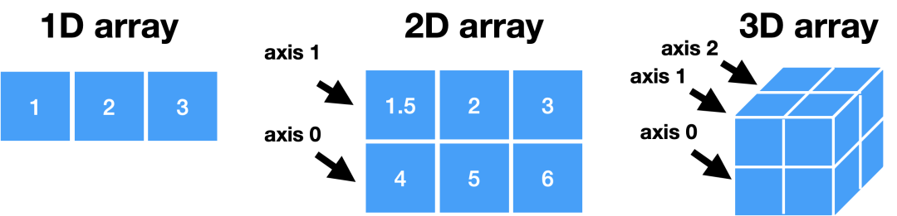

Python Numpy
<a name="kprF7"></a>
## NumPy
NumPy库是Python中用于科学计算的核心库。它提供了一个高性能的多维数组对象，以及用于处理这些数组的工具。<br />
<a name="HgYfi"></a>
### 导入Numpy
```python
import numpy as np
```
<a name="zKwCo"></a>
### 创建 Arrays
```python
>>> a = np.array([1,2,3])
>>> b = np.array([(1.5,2,3), (4,5,6)], dtype = float)
>>> c = np.array([[(1.5,2,3), (4,5,6)], [(3,2,1), (4,5,6)]],dtype = float)
# 创建一个由0组成的数组
>>> np.zeros((3,4)) 
# 创建一个1的数组
>>> np.ones((2,3,4),dtype=np.int16) 
# 创建一个等距值数组(步长值)
>>> d = np.arange(10,25,5) 
# 创建一个等距值数组(样本数)
>>> np.linspace(0,2,9) 
# 创建一个常量数组
>>> e = np.full((2,2),7) 
# 创建一个2X2单位矩阵
>>> f = np.eye(2) 
# 创建一个随机值的数组
>>> np.random.random((2,2)) 
# 创建一个空数组
>>> np.empty((3,2)) 
```
<a name="UC2b3"></a>
### 输入与输出
<a name="eYgyn"></a>
#### 从磁盘上导入与存储
```python
>>> np.save('my_array', a)
>>> np.savez('array.npz', a, b)
>>> np.load('my_array.npy')
```
<a name="flQX7"></a>
#### 导入与存储文本文件
```python
>>> np.loadtxt("myfile.txt")
>>> np.genfromtxt("my_file.csv", delimiter=',')
>>> np.savetxt("myarray.txt", a, delimiter=" ")
```
<a name="jLbNQ"></a>
### 数据类型
```python
>>> np.int64   # 有符号64位整数类型
>>> np.float32 # 标准双精度浮点数
>>> np.complex # 由128个浮点数表示的复数
>>> np.bool    # 布尔类型，存储TRUE和FALSE值
>>> np.object  # Python对象类型
>>> np.string_ # 固定长度的字符串类型
>>> np.unicode_# 固定长度的unicode类型
```
<a name="m3diK"></a>
### 查看数组
```python
>>> a.shape    # 阵列尺寸
>>> len(a)     # 数组的长度
>>> b.ndim     # 阵列维数
>>> e.size     # 数组元素数
>>> b.dtype    # 数组元素的数据类型
>>> b.dtype.name  # 数据类型名称
>>> b.astype(int) # 将数组转换为不同类型
```
<a name="SDs7T"></a>
### 获取帮助
```python
>>> np.info(np.ndarray.dtype)
```
<a name="rYk5M"></a>
### Array 算术运算
```python
>>> g = a - b        # 减法
array([[-0.5, 0. , 0. ],
    [-3. , -3. , -3. ]]) 
>>> np.subtract(a,b) # 减法
>>> b + a            # 加法
array([[ 2.5, 4. , 6. ],
    [ 5. , 7. , 9. ]]) 
>>> np.add(b,a)      # 加法
>>> a / b            # 除法
array([[ 0.66666667, 1. ,  1. ],
        0.25       , 0.4,  0.5])
>>> a * b            # 乘法
array([[ 1.5, 4.  , 9.  ],
    [ 4. , 10. , 18. ]]) 
>>> np.multiply(a,b) # 乘法
>>> np.divide(a,b)   # 除法
>>> np.exp(b)  # 求幂
>>> np.sqrt(b) # 平方根
>>> np.sin(a)  # 输出一个数组的正弦值
>>> np.cos(b)  # 输出一个数组的余弦值
>>> np.log(a)  # 输出一个数组的自然对数
>>> e.dot(f)   # 点积
array([[ 7., 7.], [ 7., 7.]])
```
<a name="O6Lkx"></a>
### 比较大小
```python
>>> a == b  # 数组元素比较
array([[False, True, True],
    [False, False, False]], dtype=bool) 
>>> a < 2   # 数组元素比较
array([True, False, False], dtype=bool) 
>>> np.array_equal(a, b) # 数组比较
```
<a name="DTkpv"></a>
### 统计函数
```python
>>> a.sum()    # 数组求和
>>> a.min()    # 数组最小值
>>> b.max(axis=0)    # 数组行最大值
>>> b.cumsum(axis=1) # 元素均值的累积和
>>> a.mean()     # 中位数
>>> b.median()   # 相关系数
>>> a.corrcoef() # 相关系数
>>> np.std(b)    # 标准偏差
```
<a name="Y7ZaC"></a>
### 数组拷贝
```python
>>> h = a.view() # 使用相同的数据创建数组的视图
>>> np.copy(a)   # 创建数组的副本
>>> h = a.copy() # 创建数组的深层副本
```
<a name="I3QPe"></a>
### 数组排序
```python
>>> a.sort()       # 排序数组
>>> c.sort(axis=0) # 对数组横轴的元素进行排序
```
<a name="ZwuEU"></a>
### 切片与索引
<a name="LtiZH"></a>
#### 获取单个元素
```python
>>> a[2]   # 选择第二个索引处的元素
3
>>> b[1,2] # 选择第1行第2列的元素(相当于b[1][2])
1.5 2 3 6.0 456
```
<a name="iiJjz"></a>
#### 获取子集
```python
>>> a[0:2]  # 选择索引0和1的项
array([1, 2]) 
>>> b[0:2,1] # 选择第1列中第0行和第1行中的项目
array([ 2., 5.])
>>> b[:1]  # 选择第0行中的所有项目，等价于b[0:1，:]
array([[1.5, 2., 3.]])
>>> c[1,...]  # 与[1,:,:]一样
array([[[3., 2., 1.],
    [4., 5., 6.]]])
>>> a[ : :-1]  # 逆转了数组
array([3, 2, 1])
```
<a name="pb4oq"></a>
#### 布尔索引
```python
>>> a[a<2]  # 从小于2的a中选择元素
array([1])
```
<a name="Iqrmv"></a>
#### 花俏的索引
```python
>>> b[[1, 0, 1, 0],[0, 1, 2, 0]] # 选择元素(1,0),(0,1),(1,2) 和 (0,0)
array([4.,2.,6.,1.5])
>>> b[[1, 0, 1, 0]][:,[0,1,2,0]] # 选择矩阵的行和列的子集
array([[4.,5.,6.,4.], 
       [1.5,2.,3.,1.5], 
       [4.,5.,6.,4.],
       [1.5,2.,3.,1.5]])
```
<a name="bcuOb"></a>
### 数组操作
<a name="Z8rq0"></a>
#### 转置数组
```python
>>> i = np.transpose(b) # 交换数组维度
>>> i.T
```
<a name="BA5HG"></a>
#### 改变数组形状
```python
>>> b.ravel()       # 将数组压平
>>> g.reshape(3,-2) # 不会改变数据
```
<a name="Ff7Ry"></a>
#### 添加和删除数组元素
```python
>>> h.resize((2,6))    # 返回一个具有形状(2,6)的新数组
>>> np.append(h,g)     # 向数组添加项
>>> np.insert(a, 1, 5) # 在数组中插入项
>>> np.delete(a,[1])   # 从数组中删除项
```
<a name="VOXES"></a>
#### 合并数组
```python
>>> np.concatenate((a,d),axis=0)# 连接数组
array([ 1, 2, 3, 10, 15, 20])
>>> np.vstack((a,b))      # 垂直(行)堆叠阵列
array([[ 1. , 2. , 3. ], 
       [ 1.5, 2. , 3. ],
       [ 4. , 5. , 6. ]]) 
>>> np.r_[e,f]            # 垂直(行)堆叠阵列
>>> np.hstack((e,f))      # 水平(列)堆叠阵列
array([[ 7., 7., 1., 0.],
       [ 7., 7., 0., 1.]]) 
>>> np.column_stack((a,d))# 创建堆叠的列阵列
array([[ 1, 10], 
       [ 2, 15],
       [ 3, 20]])
>>> np.c_[a,d]           # 创建堆叠的列阵列
```
<a name="jUxPz"></a>
#### 分割数组
```python
>>> np.hsplit(a,3)  # 在第3个索引处水平分割数组
[array([1]),array([2]),array([3])]
>>> np.vsplit(c,2)  # 在第二个索引处垂直分割数组
[array([[[ 1.5, 2. , 1. ],
         [ 4. , 5. , 6. ]]]), 
 array([[[ 3., 2., 3.],
         [ 4., 5., 6.]]])]
```
