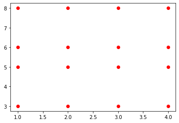
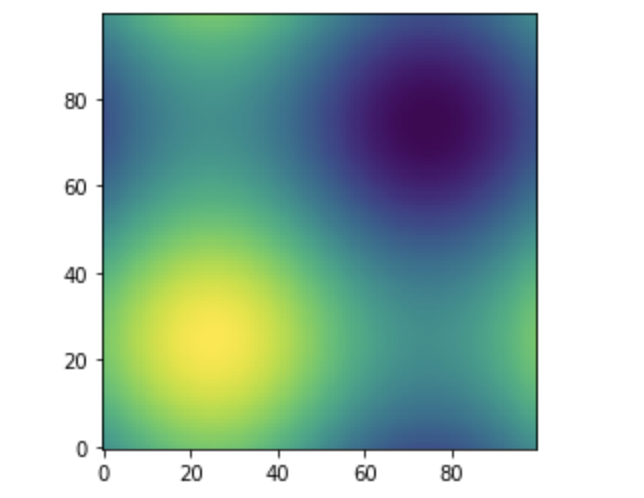
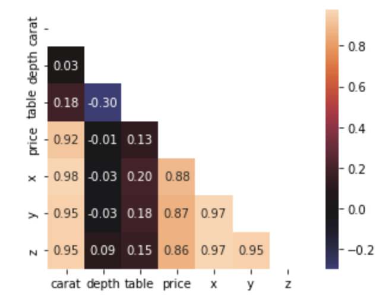
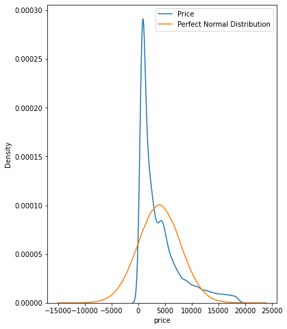

PyhtonNumpy<br />Numpy是每个数据科学家都应该掌握的Python包，它提供了许多创建和操作数字数组的方法。它构成了许多与数据科学相关的广泛使用的Python库的基础，比如panda和Matplotlib。<br />以下这些函数并不常见，甚至可能都没听说过，但是在有些时候它们真的很有用。
<a name="dAfXK"></a>
## `np.full_like`
肯定使用过像`ones_like` 或 `zeros_like` 这样的常见 NumPy 函数。full_like 和这两个完全一样，除了可以创建一个与另一个矩阵具有相同形状的矩阵但是这些矩阵是使用自定义值填充的。
```python
array = np.array([[1, 4, 6, 8], [9, 4, 4, 4], [2, 7, 2, 3]]) 
 
array_w_inf = np.full_like(array, fill_value=np.pi, dtype=np.float32)

array_w_inf 

array([[3.1415927, 3.1415927, 3.1415927, 3.1415927], 
       [3.1415927, 3.1415927, 3.1415927, 3.1415927], 
       [3.1415927, 3.1415927, 3.1415927, 3.1415927]], dtype=float32)
```
在这里，正在创建一个数组值都是pi 矩阵。
<a name="HyF54"></a>
## `np.logspace`
它可以在一个区间内创建自定义的线性间隔数据点数量。它的同类logspace在这方面做得更深入一些。它可以在对数尺度上生成均匀间隔的自定义点数。可以选择任何一个数作为基数，只要它是非零的:
```python
log_array = np.logspace(start=1, stop=100, num=15, base=np.e) 
log_array 

array([2.71828183e+00, 3.20167238e+03, 3.77102401e+06, 4.44162312e+09, 
       5.23147450e+12, 6.16178472e+15, 7.25753148e+18, 8.54813429e+21, 
       1.00682443e+25, 1.18586746e+28, 1.39674961e+31, 1.64513282e+34, 
       1.93768588e+37, 2.28226349e+40, 2.68811714e+43])
```
<a name="F37VX"></a>
## `np.meshgrid`
这是只有在文档中才能看到的函数之一。因为大部分人难理解它。可以使用`meshgrid`从给定的X和Y数组创建每个可能的坐标对。这里有一个简单的例子:
```python
x = [1, 2, 3, 4] 
y = [3, 5, 6, 8] 
 
xx, yy = np.meshgrid(x, y) 
xx 

array([[1, 2, 3, 4], 
       [1, 2, 3, 4], 
       [1, 2, 3, 4], 
       [1, 2, 3, 4]])

yy

array([[3, 3, 3, 3], 
       [5, 5, 5, 5], 
       [6, 6, 6, 6], 
       [8, 8, 8, 8]])
```
得到 16 个唯一坐标对，结果数组中的每个索引到索引元素对对应一个。可视化一下就很好理解了
```python
plt.plot(xx, yy, linestyle="none", 
         marker="o", color="red");
```
<br />`meshgrid`通常用于使用循环需要很长时间的复杂任务。如绘制三维正弦函数等高线图就是一个例子:
```python
def sinus2d(x, y): 
    return np.sin(x) + np.sin(y) 
 
xx, yy = np.meshgrid(np.linspace(0, 2 * np.pi, 100), np.linspace(0, 2 * np.pi, 100)) 
z = sinus2d(xx, yy)  # Create the image on this grid 
 
import matplotlib.pyplot as plt 
 
plt.imshow(z, origin="lower", 
           interpolation="none") 
plt.show()
```

<a name="lqU3o"></a>
## `np.triu` / `np.tril`
与`ones_like`或`zeros_like`类似，这两个函数在矩阵的某个对角线上方或下方返回0。例如，可以使用`triu`函数在主对角线上创建一个值为True的布尔掩码，并在绘制相关热图时使用这个掩码。
```python
import seaborn as sns

diamonds = sns.load_dataset("diamonds")

matrix = diamonds.corr()
mask = np.triu(np.ones_like(matrix, dtype=bool))

sns.heatmap(matrix, square=True, 
            mask=mask, annot=True, 
            fmt=".2f", center=0);
```
<br />用`triu`创建的掩码可以用在相关矩阵上，去掉不必要的上三角形和对角线。这使得热图更加紧凑，可读性更强。
<a name="cinGA"></a>
## `np.ravel` / `np.flatten`
NumPy是关于高维矩阵和`ndarrays`的。但是有时候只是想把这些数组压缩成一维。这就是使用`ravel`或`flatten`的地方:
```python
array = np.random.randint(0, 10, size=(4, 5)) 
array 

array([[6, 4, 8, 9, 6], 
       [5, 0, 4, 8, 5], 
       [1, 3, 1, 0, 3], 
       [2, 3, 3, 6, 5]])

array.ravel() 

array([6, 4, 8, 9, 6, 5, 0, 4, 8, 5,  
       1, 3, 1, 0, 3, 2, 3, 3, 6, 5])

array.flatten() 

array([6, 4, 8, 9, 6, 5, 0, 4, 8, 5, 
       1, 3, 1, 0, 3, 2, 3, 3, 6, 5])
```
它们看起来一样吗?不完全是。flatten总是返回一个1D副本，而ravel则试图生成原始数组的1D视图。也就是说如果修改从ravel返回的数组可能会改变原来的数组。
<a name="z9yGK"></a>
## `np.vstack` / `np.hstack`
在Kaggle上这两个函数经常被使用。通常人们从不同的模型对测试集有多个预测，他们希望以某种方式集成这些预测。为了使它们易于处理，必须将它们组合成一个矩阵。
```python
array1 = np.arange(1, 11).reshape(-1, 1)
array2 = np.random.randint(1, 10, size=10).reshape(-1, 1)
hstacked = np.hstack((array1, array2))
hstacked

array([[ 1,  2],
       [ 2,  6],
       [ 3,  6],
       [ 4,  7],
       [ 5,  4],
       [ 6,  6],
       [ 7,  6],
       [ 8,  8],
       [ 9,  2],
       [10,  8]])
array1 = np.arange(20, 31).reshape(1, -1)
array2 = np.random.randint(20, 31, size=11).reshape(1, -1)
vstacked = np.vstack((array1, array2))
vstacked

array([[20, 21, 22, 23, 24, 25, 26, 27, 28, 29, 30],
       [21, 23, 23, 26, 29, 26, 27, 27, 28, 25, 25]])
```
在将每个数组与这些数组堆叠之前，要对数组进行重塑，因为默认情况下它们需要2D数组。这就是使用重塑函数的原因。这里，`reshape(-1,1)`表示将数组转换为具有尽可能多行的单列。<br />类似地，`reshape(1，-1)`将数组转换为具有尽可能多列的单行向量。
<a name="dduxc"></a>
## `np.r_` / `np.c_`
如果不想对所有数组调用重塑，那么有一个更优雅的解决方案。`np.r_` / `np.c_`操作符(不是函数!)允许将数组分别堆叠为行和列。<br />下面模拟一个有100个可能性的预测数组。为了将它们堆叠在一起，调用`np.r_`用括号表示(如`pandas.DataFrame.loc`)。
```python
preds1 = np.random.rand(100)
preds2 = np.random.rand(100)

as_rows = np.r_[preds1, preds2]
as_cols = np.c_[preds1, preds2]

 as_rows.shape

(200,)
as_cols.shape

(100, 2)
```
类似地，np.c_将数组堆叠在一起创建一个矩阵。其实它们的功能并不局限于简单的水平和垂直堆栈。要了解更多的功能，建议阅读文档。[http://np.info](http://np.info)<br />NumPy的函数非常的多。可能没有时间和耐心学习每个函数和类。如果面对一个未知的函数呢?不用去看文档了因为有更好的选择。<br />`info`函数可以打印NumPy API中任何名称的`docstring`。这里是info使用的信息:
```python
np.info(np.info) 

info(object=None, maxwidth=76, 
      output=<ipykernel.iostream.OutStream object at 0x0000021B875A8820>, 
      toplevel='numpy') 
 
Get help information for a function, class, or module. 
 
Parameters 
---------- 
object : object or str, optional 
    Input object or name to get information about. If `object` is a 
    numpy object, its docstring is given. If it is a string, available 
    modules are searched for matching objects.  If None, information 
    about `info` itself is returned. 
maxwidth : int, optional 
    Printing width.
```
这就是lint要求强制编写docstring的原因了。
<a name="d89GX"></a>
## `np.where`
顾名思义，这个函数返回一个条件为True的数组的所有下标:
```python
probs = np.random.rand(100) 
idx = np.where(probs > 0.8) 
 probs[idx] 

array([0.80444302, 0.80623093, 0.98833642, 0.96856382, 0.89329919, 
       0.88664223, 0.90515148, 0.96363973, 0.81847588, 0.88250337, 
       0.98737432, 0.92104315])
```
它在搜索稀疏数组中的非零元素时特别有用，甚至可以在Pandas DataFrames上使用它来基于条件进行更快的索引检索。
<a name="GnlFL"></a>
## `np.all` / `np.any`
当与assert语句一起使用时，这两个函数将在数据清理期间非常方便。np.all仅当数组中的所有元素都符合特定条件时返回True:
```python
array1 = np.random.rand(100)
array2 = np.random.rand(100)

>>> np.all(array1 == array2)
False
```
因为创建了两个随机数的数组，所以不可能每个元素都相等。然而，如果这些数字是整数，那么它们中至少有两个相等的可能性要大得多:
```python
a1 = np.random.randint(1, 100, size=100)
a2 = np.random.randint(1, 100, size=100)

>>> np.any(a1 == a2)
True
```
any返回True是因为数组中至少有一个元素满足特定条件，
<a name="EgLBH"></a>
## `np.allclose`
如果想要检查两个长度相等的数组是否互为副本，简单的==操作符不会将其截断。但是可能想要比较浮点数数组，但是它们的小数点长度使得比较困难。在这种情况下可以使用allclose，如果一个数组的所有元素彼此之间距离很近，给定一定的容忍度，它将返回True。
```python
a1 = np.arange(1, 10, step=0.5) 
a2 = np.arange(0.8, 9.8, step=0.5) 
 
np.all(a1 == a2) 

False

a1 

array([1. , 1.5, 2. , 2.5, 3. , 3.5, 4. , 4.5, 5. , 
       5.5, 6. , 6.5, 7. , 7.5, 8. , 8.5, 9. , 9.5])

a2 

array([0.8, 1.3, 1.8, 2.3, 2.8, 3.3, 3.8, 4.3, 4.8, 
       5.3, 5.8, 6.3, 6.8, 7.3, 7.8, 8.3, 8.8, 9.3])

np.allclose(a1, a2, rtol=0.2) 

False

np.allclose(a1, a2, rtol=0.3)

True
```
只有当差异(<)小于rtol时，函数才返回True，而不是<=!
<a name="KjJz3"></a>
## `np.argsort`
`np.sort`返回一个已排序的数组副本。有时需要对数组进行排序的索引，以便为不同的目的多次使用相同的索引。这就是 argsort 派上用场的地方：
```python
random_ints = np.random.randint(1, 100, size=20) 
idx = np.argsort(random_ints) 
 
random_ints[idx] 

array([ 6, 19, 22, 23, 35, 36, 37, 45, 46, 57,
       61, 62, 64, 66, 66, 68, 72, 74, 87, 89])
```
它来自以 arg 开头的一系列函数，这些函数总是从某个函数的结果返回一个或多个索引。例如，argmax 查找数组中的最大值并返回其索引（分类的TOP N就可以用这种方法）。
<a name="DxKe9"></a>
## `np.isneginf` / `np.isposinf`
这两个布尔函数检查数组中的元素是负无穷大还是正无穷大。但是计算机和 NumPy 不理解无穷大的概念。它们只能将无穷大表示为一个非常大或非常小的数字，这样才可以放入一个变量中。<br />这就是为什么当打印 `np.inf` 的类型时，它返回浮点数：
```python
type(np.inf)  # type of the infinity

float

type(-np.inf) 

float
```
这意味着无穷大值可以很容易地被当作数组的正常值。所以需要一个特殊的功能来找到这些异常的值：
```python
a = np.array([-9999, 99999, 97897, -79897, -np.inf]) 
 
np.all(a.dtype == "float64") 

True

np.any(np.isneginf(a)) 

True
```
<a name="mqCiq"></a>
## `np.polyfit`
如果要执行传统的线性回归，则不一定需要 Sklearn。NumPy 也可以的：
```python
X = diamonds["carat"].values.flatten() 
y = diamonds["price"].values.flatten() 
 
slope, intercept = np.polyfit(X, y, deg=1) 
slope, intercept 

(7756.425617968436, -2256.3605800454034)
```
polyfit 获取两个向量，对它们应用线性回归并返回斜率和截距。只需要使用 deg 指定次数，因为此函数可用于逼近任何次数多项式的根。<br />检查发现用 polyfit 找到的斜率和截距与 Sklearn 的 LinearRegression 模型相同：
```python
from sklearn.linear_model import LinearRegression 
 
lr = LinearRegression().fit(X.reshape(-1, 1), y) 
lr.coef_, lr.intercept_ 

(array([7756.42561797]), -2256.360580045441)
```
<a name="cAtG2"></a>
## 概率分布
NumPy 的 random 模块有多种伪随机数生成器可供选择。除了最喜欢的样本和选择之外，还有模拟伪完美概率分布的函数。<br />例如，二项式、伽马、正态和 tweedie 函数从它们各自的分布中绘制自定义数量的数据点。<br />当必须近似数据中特征的分布时，可能会发现它们非常有用。例如，下面检查钻石价格是否服从正态分布。
```python
fig, ax = plt.subplots(figsize=(6, 8)) 
 
price_mean = diamonds["price"].mean() 
price_std = diamonds["price"].std() 
 
# Draw from a perfect normal distribution 
perfect_norm = np.random.normal(price_mean, price_std, size=1000000) 
 
sns.kdeplot(diamonds["price"], ax=ax) 
sns.kdeplot(perfect_norm, ax=ax) 
 
plt.legend(["Price", "Perfect Normal Distribution"]);
```
<br />这可以通过在完美正态分布之上绘制钻石价格的 KDE 来实现，以使差异可见。
<a name="nknHK"></a>
## `np.rint`
如果想将数组的每个元素四舍五入到最接近的整数， rint 是一个漂亮的小函数。将类概率转换为二进制分类中的类标签时，可以不必调用模型的 `predict` 方法改成直接使用它：
```python
preds = np.random.rand(100) 
np.rint(preds[:50]) 

array([1., 1., 0., 1., 0., 1., 1., 0., 0., 0., 0., 1., 0., 1., 0., 1., 0., 
       1., 0., 1., 1., 1., 1., 1., 0., 0., 1., 0., 0., 0., 0., 1., 0., 0., 
       0., 0., 0., 0., 0., 0., 1., 0., 1., 0., 1., 1., 0., 0., 1., 0.])
```
<a name="C6D6u"></a>
## `np.nanmean` / `np.nan*`
是否知道如果至少有一个元素是 NaN，则纯 NumPy 数组上的算术运算会失败？
```python
a = np.array([12, 45, np.nan, 9, np.nan, 22]) 
np.mean(a) 

nan
```
要在不修改原始数组的情况下解决此问题，可以使用一系列 nan 函数：
```python
np.nanmean(a) 

22.0
```
以上是忽略缺失值的算术平均函数的示例。许多其他函数以同样的方式工作：
```python
[func for func in dir(np) if func.startswith("nan")] 

['nan', 
 'nan_to_num', 
 'nanargmax', 
 'nanargmin', 
 'nancumprod', 
 'nancumsum', 
 'nanmax', 
 'nanmean', 
 'nanmedian', 
 'nanmin', 
 'nanpercentile', 
 'nanprod', 
 'nanquantile', 
 'nanstd', 
 'nansum', 
 'nanvar']
```
但是，如果只使用 Pandas DataFrames 或 Series，可能会有些不同，因为它们默认会忽略 NaN。
<a name="wCHzB"></a>
## `np.clip`
当想对数组的值施加严格限制时，clip 很有用。下面，将裁剪任何超出 10 和 70 硬限制的值：
```python
ages = np.random.randint(1, 110, size=100) 
limited_ages = np.clip(ages, 10, 70) 
limited_ages 

array([13, 70, 10, 70, 70, 10, 63, 70, 70, 69, 45, 70, 70, 56, 60, 70, 70, 
       10, 52, 70, 32, 62, 21, 70, 13, 13, 10, 50, 38, 32, 70, 20, 27, 64, 
       34, 10, 70, 70, 53, 70, 53, 54, 26, 70, 57, 70, 46, 70, 17, 48, 70, 
       15, 49, 70, 10, 70, 19, 23, 70, 70, 70, 45, 47, 70, 70, 34, 25, 70, 
       10, 70, 42, 62, 70, 10, 70, 23, 25, 49, 70, 70, 62, 70, 70, 11, 10, 
       70, 30, 44, 70, 49, 10, 35, 52, 21, 70, 70, 25, 10, 55, 59])
```
<a name="otjIQ"></a>
## `np.count_nonzero`
使用稀疏数组是很常见的。通常，它们是对具有高基数(High-Cardinality)或只有许多二进制列的分类特征进行独热编码的结果。<br />可以使用`count_nonzero`来检查任意数组中非零元素的数量:
```python
a = np.random.randint(-50, 50, size=100000) 
np.count_nonzero(a) 

98993
```
100k 随机整数中，~1000个为零。
<a name="a2N6y"></a>
## `np.array_split`
它可以用来将 ndarray 或 dataframe 分成 N 个 bucket。此外，当想要将数组分割成大小不相等的块(如 `vsplit` )时，它不会引发错误:
```python
import datatable as dt 
df = dt.fread("data/train.csv").to_pandas() 
splitted_dfs = np.array_split(df, 100) 
len(splitted_dfs)
```
