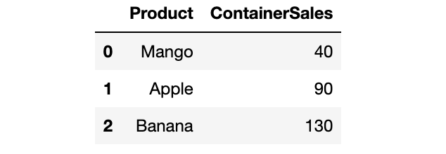
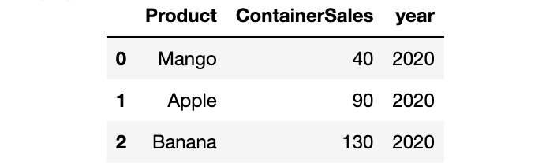

PythonNumpy<br />Numpy是python中最有用的工具之一。它可以有效地处理大容量数据。使用NumPy的最大原因之一是它有很多处理数组的函数。这里介绍NumPy在数据科学中最重要和最有用的一些函数。
<a name="BfoNS"></a>
## 创建数组
<a name="j0Qpm"></a>
### 1、Array
它用于创建一维或多维数组
```python
numpy.array(object, dtype=None, *,
            copy=True, order='K', subok=False, ndmin=0, like=None)
```
`Dtype`：生成数组所需的数据类型。<br />`ndim`：指定生成数组的最小维度数。
```python
import numpy as np
np.array([1,2,3,4,5])
----------------
array([1, 2, 3, 4, 5, 6])
```
还可以使用此函数将pandas的df和series转为NumPy数组。
```python
sex = pd.Series(['Male','Male','Female'])
np.array(sex)
------------------------
array(['Male', 'Male', 'Female'], dtype=object)
```
<a name="qKm5E"></a>
### 2、`Linspace`
创建一个具有指定间隔的浮点数的数组。
```python
numpy.linspace(start, stop, num=50, endpoint=True,
               retstep=False, dtype=None, axis=0)[source]
```
`start`：起始数字 <br />`end`：结束 <br />`Num`：要生成的样本数，默认为50。
```python
np.linspace(10,100,10)
--------------------------------
array([ 10., 20., 30., 40., 50., 60., 70., 80., 90., 100.])
```
<a name="twtdW"></a>
### 3、`Arange`
在给定的间隔内返回具有一定步长的整数。
```python
numpy.arange([start, ]stop, [step, ]dtype=None, *, like=None)
```
`step`：数值步长。
```python
np.arange(5,10,2)
-----------------------
array([5, 7, 9])
```
<a name="e0fcd"></a>
### 4、`Uniform`
在上下限之间的均匀分布中生成随机样本。
```python
numpy.random.uniform(low=0.0, high=1.0, size=None)
np.random.uniform(5,10,size = 4)
------------
array([6.47445571, 5.60725873, 8.82192327, 7.47674099])

np.random.uniform(size = 5)
------------
array([0.83358092, 0.41776134, 0.72349553])

np.random.uniform(size = (2,3))
------------
array([[0.7032511 , 0.63212039, 0.6779683 ],
      [0.81150812, 0.26845613, 0.99535264]])
```
<a name="E7you"></a>
### 5、`Random.randint`
在一个范围内生成n个随机整数样本。
```python
numpy.random.randint(low, high=None, size=None, dtype=int)
np.random.randint(5,10,10)
------------------------------
array([6, 8, 9, 9, 7, 6, 9, 8, 5, 9])
```
<a name="mxc7h"></a>
### 6、`Random.random`
生成n个随机浮点数样本。
```python
numpy.random.random(size=None)
np.random.random(3)
---------------------------
array([0.87656396, 0.24706716, 0.98950278])
```
<a name="V08uV"></a>
### 7、`Logspace`
在对数尺度上生成间隔均匀的数字。
```python
numpy.logspace(start, stop, num=50, endpoint=True,
               base=10.0, dtype=None, axis=0)
```
`Start`：序列的起始值。<br />`End`：序列的最后一个值。<br />`endpoint`：如果为True，最后一个样本将包含在序列中。<br />`base`：底数。默认是10。
```python
np.logspace(0,10,5,base=2)
------------------
array([1.00000000e+00, 5.65685425e+00, 
       3.20000000e+01, 1.81019336e+02,1.02400000e+03])
```
<a name="Uk8bL"></a>
### 8、`zeroes`
`np.zeroes`会创建一个全部为0的数组。
```python
numpy.zeros(shape, dtype=float, order='C', *, like=None)
```
`shape`：阵列的形状。<br />`Dtype`：生成数组所需的数据类型。' int '或默认' float '
```python
np.zeros((2,3),dtype='int')
---------------
array([[0, 0, 0],
      [0, 0, 0]])

np.zeros(5)
-----------------
array([0., 0., 0., 0., 0.])
```
<a name="AVZQK"></a>
### 9、`ones`
`np.ones`函数创建一个全部为1的数组。
```python
numpy.ones(shape, dtype=None, order='C', *, like=None)
np.ones((3,4))
------------------
array([[1., 1., 1., 1.],
      [1., 1., 1., 1.],
      [1., 1., 1., 1.]])
```
<a name="gqfsL"></a>
### 10、`full`
创建一个单独值的n维数组。
```python
numpy.full(shape, fill_value, dtype=None, order='C', *, like=None)
```
`fill_value`：填充值。
```python
np.full((2,4),fill_value=2)
--------------
array([[2, 2, 2, 2],
      [2, 2, 2, 2]])(2,4) : ꜱʜᴀᴘᴇ
```
<a name="DEf3B"></a>
### 11、Identity
创建具有指定维度的单位矩阵。
```python
numpy.identity(n, dtype=None, *, like=None)
np.identity(4)
----------
array([[1., 0., 0., 0.],
      [0., 1., 0., 0.],
      [0., 0., 1., 0.],
      [0., 0., 0., 1.]])#ᴅᴇꜰᴀᴜʟᴛ ᴅᴀᴛᴀ ᴛʏᴘᴇ ɪꜱ `ꜰʟᴏᴀᴛ`
```
<a name="mZmik"></a>
## 数组操作
<a name="QNHG8"></a>
### 12、`min`
返回数组中的最小值。
```python
np.min(a, axis=None, out=None, keepdims=<no value>,
       initial=<no value>, where=<no value>)
```
`axis`：用于操作的轴。<br />`out`：用于存储输出的数组。
```python
arr = np.array([1,1,2,3,3,4,5,6,6,2])
np.min(arr)
----------------
1
```
<a name="HteaS"></a>
### 13、`max`
返回数组中的最大值。
```python
np.max(a, axis=None,out=None)
np.max(arr)
------------------
6
```
<a name="nWRnn"></a>
### 14、`unique`
返回一个所有唯一元素排序的数组。
```python
numpy.unique(ar, return_index=False, return_inverse=False, return_counts=False, axis=None, *, equal_nan=True)
```
`return_index`：如果为True，返回数组的索引。<br />`return_inverse`：如果为True，返回唯一数组的下标。<br />`return_counts`：如果为True，返回数组中每个唯一元素出现的次数。<br />`axis`：要操作的轴。默认情况下，数组被认为是扁平的。
```python
np.unique(arr,return_counts=True)
---------------------
(
array([1, 2, 3, 4, 5, 6]),             ## Unique elements
array([2, 2, 2, 1, 1, 2], dtype=int64) ## Count
)
```
<a name="uhmcA"></a>
### 15、`mean`
返回数组的平均数
```python
numpy.mean(a, axis=None, dtype=None, out=None)
np.mean(arr,dtype='int')
-------------------------------
3
```
<a name="O2QHH"></a>
### 16、`medain`
返回数组的中位数。
```python
numpy.medain(a, axis=None, out=None)
arr = np.array([[1,2,3],[5,8,4]])
np.median(arr)
-----------------------------
3.5
```
<a name="kUhJW"></a>
### 17、`digitize`
返回输入数组中每个值所属的容器的索引。
```python
numpy.digitize(x, bins, right=False)[source]
```
`bin`：容器的数组。<br />`right`：表示该间隔是否包括右边或左边的bin。
```python
a = np.array([-0.9, 0.5, 0.9, 1, 1.2, 1.4, 3.6, 4.7, 5.3])
bins = np.array([0,1,2,3])
np.digitize(a,bins)
-------------------------------
array([0, 1, 1, 2, 2, 2, 4, 4, 4], dtype=int64)
Exp       Value
x < 0     :   0
0 <= x <1 :   1
1 <= x <2 :   2
2 <= x <3 :   3
3 <=x     :   4
Compares -0.9 to 0, here x < 0 so Put 0 in resulting array.
Compares 0.5 to 0, here 0 <= x <1 so Put 1.
Compares 5.4 to 4, here 3<=x so Put 4
```
<a name="J1pI6"></a>
### 18、`reshape`
它是NumPy中最常用的函数之一。它返回一个数组，其中包含具有新形状的相同数据。
```python
numpy.reshape(shap)
A = np.random.randint(15,size=(4,3))
A
----------------------
array([[ 8, 14, 1],
      [ 8, 11, 4],
      [ 9, 4, 1],
      [13, 13, 11]])

A.reshape(3,4)
-----------------
array([[ 8, 14, 1, 8],
      [11, 4, 9, 4],
      [ 1, 13, 13, 11]])

A.reshape(-1)  
-------------------
array([ 8, 14, 1, 8, 11, 4, 9, 4, 1, 13, 13, 11])
```
<a name="oXGmL"></a>
### 19、`expand_dims`
它用于扩展数组的维度。
```python
numpy.expand_dims(a, axis)
arr = np.array([ 8, 14, 1, 8, 11, 4, 9, 4, 1, 13, 13, 11])
np.expand_dims(A,axis=0)
-------------------------
array([[ 8, 14, 1, 8, 11, 4, 9, 4, 1, 13, 13, 11]])

np.expand_dims(A,axis=1)
---------------------------
array([[ 8],
      [14],
      [ 1],
      [ 8],
      [11],
      [ 4],
      [ 9],
      [ 4],
      [ 1],
      [13],
      [13],
      [11]])
```
<a name="YhlV8"></a>
### 20、`squeeze`
通过移除一个单一维度来降低数组的维度。
```python
np.squeeze(a, axis=None)
arr = np.array([[ 8],[14],[ 1],[ 8],[11],[ 4],[ 9],[ 4],[ 1],[13],[13],[11]])
np.squeeze(arr)
---------------------------
array([ 8, 14, 1, 8, 11, 4, 9, 4, 1, 13, 13, 11])
```
<a name="GhCHG"></a>
### 21、`count_nonzero`
计算所有非零元素并返回它们的计数。
```python
numpy.count_nonzero(a, axis=None, *, keepdims=False)
a = np.array([0,0,1,1,1,0])
np.count_nonzero(a)
--------------------------
3
```
<a name="jBlhx"></a>
### 22、`argwhere`
查找并返回非零元素的所有下标。
```python
numpy.argwhere(a)
a = np.array([0,0,1,1,1,0])
np.argwhere(a)
---------------------
array([[2],[3],[4]], dtype=int64)
```
<a name="dk3Zo"></a>
### 23、`argmax` & `argmin`
`argmax`返回数组中Max元素的索引。它可以用于多类图像分类问题中获得高概率预测标签的指标。
```python
numpy.argmax(a, axis=None, out=None, *, keepdims=<no value>)
arr = np.array([[0.12,0.64,0.19,0.05]])
np.argmax(arr)
---------
1
```
`argmin`将返回数组中min元素的索引。
```python
numpy.argmin(a, axis=None, out=None, *, keepdims=<no value>)
np.argmin(min)
------
3
```
<a name="AWtIG"></a>
### 24、`sort`
对数组排序。
```python
numpy.sort(a, axis=- 1, kind=None, order=None)
```
`kind`：要使用的排序算法。`{'quicksort', 'mergesort', 'heapsort', 'stable'}`
```python
arr = np.array([2,3,1,7,4,5])
np.sort(arr)
----------------
array([1, 2, 3, 4, 5, 7])
```
<a name="BvuKn"></a>
### 25、`abs`
```python
numpy.absolute(x, /, out=None, *, 
               where=True, casting='same_kind', 
               order='K', dtype=None, 
               subok=True[, signature, extobj]) = <ufunc 'absolute'>
```
返回数组中元素的绝对值。当数组中包含负数时，它很有用。
```python
A = np.array([[1,-3,4],[-2,-4,3]])np.abs(A)
---------------
array([[1, 3, 4],
      [2, 4, 3]])
```
<a name="ir8cD"></a>
### 26、`round`
将浮点值四舍五入到指定数目的小数点。
```python
numpy.around(a, decimals=0, out=None)
```
`decimals`：要保留的小数点的个数。
```python
a = np.random.random(size=(3,4))
a
-----
array([[0.81695699, 0.42564822, 0.65951417, 0.2731807 ],
      [0.7017702 , 0.12535894, 0.06747666, 0.55733467],
      [0.91464488, 0.26259026, 0.88966237, 0.59253923]])
     

np.round(a,decimals=0)
------------
array([[1., 0., 1., 1.],
      [1., 1., 1., 1.],
      [0., 1., 0., 1.]])

np.round(a,decimals=1)
-------------
array([[0.8, 0. , 0.6, 0.6],
      [0.5, 0.7, 0.7, 0.8],
      [0.3, 0.9, 0.5, 0.7]])
```
<a name="pEPHj"></a>
### 27、`clip`
```python
numpy.clip(a, a_min, a_max, out=None, **kwargs)
```
它可以将数组的裁剪值保持在一个范围内。
```python
arr = np.array([0,1,-3,-4,5,6,7,2,3])
arr.clip(0,5)
-----------------
array([0, 1, 0, 0, 5, 5, 5, 2, 3])

arr.clip(0,3)
------------------
array([0, 1, 0, 0, 3, 3, 3, 2, 3])

arr.clip(3,5)
------------------
array([3, 3, 3, 3, 5, 5, 5, 3, 3])
```
绝对值。当数组中包含负数时，它很有用。
```python
A = np.array([[1,-3,4],[-2,-4,3]])np.abs(A)
---------------
array([[1, 3, 4],
      [2, 4, 3]])
```
<a name="lAnmq"></a>
### **26、**`**round**`
将浮点值四舍五入到指定数目的小数点。
```python
numpy.around(a, decimals=0, out=None)
```
`decimals`:要保留的小数点的个数。
```python
a = np.random.random(size=(3,4))
a
-----
array([[0.81695699, 0.42564822, 0.65951417, 0.2731807 ],
      [0.7017702 , 0.12535894, 0.06747666, 0.55733467],
      [0.91464488, 0.26259026, 0.88966237, 0.59253923]])
     

np.round(a,decimals=0)
------------
array([[1., 0., 1., 1.],
      [1., 1., 1., 1.],
      [0., 1., 0., 1.]])

np.round(a,decimals=1)
-------------
array([[0.8, 0. , 0.6, 0.6],
      [0.5, 0.7, 0.7, 0.8],
      [0.3, 0.9, 0.5, 0.7]])
```
<a name="XSTv5"></a>
### **27、**`**clip**`
```python
numpy.clip(a, a_min, a_max, out=None, **kwargs)
```
它可以将数组的裁剪值保持在一个范围内。
```python
arr = np.array([0,1,-3,-4,5,6,7,2,3])
arr.clip(0,5)
-----------------
array([0, 1, 0, 0, 5, 5, 5, 2, 3])

arr.clip(0,3)
------------------
array([0, 1, 0, 0, 3, 3, 3, 2, 3])

arr.clip(3,5)
------------------
array([3, 3, 3, 3, 5, 5, 5, 3, 3])
```
<a name="LydPc"></a>
## 替换数组中的值
<a name="WcAeq"></a>
### **28、**`**where**`
返回满足条件的数组元素。
```python
numpy.where(condition, [x, y, ]/)
```
`condition`：匹配的条件。如果true则返回x，否则y。
```python
a = np.arange(12).reshape(4,3)
a
-------
array([[ 0, 1, 2],
      [ 3, 4, 5],
      [ 6, 7, 8],
      [ 9, 10, 11]])
     
np.where(a>5)     ## Get The Index
--------------------
(array([2, 2, 2, 3, 3, 3], dtype=int64),
array([0, 1, 2, 0, 1, 2], dtype=int64))

a[np.where(a>5)] ## Get Values
--------------------------
array([ 6, 7, 8, 9, 10, 11])
```
它还可以用来替换pandas df中的元素。
```python
np.where(data[feature].isnull(), 1, 0)
```
<a name="UjYW0"></a>
### **29、**`**put**`
用给定的值替换数组中指定的元素。
```python
numpy.put(a, ind, v)
```
`a`：数组<br />`Ind`：需要替换的索引<br />`V`：替换值
```python
arr = np.array([1,2,3,4,5,6])
arr
--------
array([1, 2, 3, 4, 5, 6])

np.put(arr,[1,2],[6,7])
arr
--------
array([1, 6, 7, 4, 5, 6])
```
<a name="XLbmn"></a>
### **30、**`**copyto**`
将一个数组的内容复制到另一个数组中。
```python
numpy.copyto(dst, src, casting='same_kind', where=True)
```
`dst`：目标<br />`src`：来源
```python
arr1 = np.array([1,2,3])
arr2 = np.array([4,5,6])
print("Before arr1",arr1)
print("Before arr2",arr1)
np.copyto(arr1,arr2)
print("After arr1",arr1)
print("After arr2",arr2)
---------------------------
Before arr1 [1 2 3]
Before arr2 [4 5 6]

After arr1 [4 5 6]
After arr2 [4 5 6]
```
<a name="X4p3m"></a>
## 集合操作
<a name="OK27O"></a>
### **31、查找公共元素**
intersect1d函数以排序的方式返回两个数组中所有唯一的值。
```python
numpy.intersect1d(ar1, ar2, assume_unique=False, return_indices=False)
```
`Assume_unique`：如果为真值，则假设输入数组都是唯一的。<br />`Return_indices`：如果为真，则返回公共元素的索引。
```python
ar1 = np.array([1,2,3,4,5,6])
ar2 = np.array([3,4,5,8,9,1])
np.intersect1d(ar1,ar2)
---------------
array([1, 3, 4, 5])

np.intersect1d(ar1,ar2,return_indices=True)
---------------
(array([1, 3, 4, 5]),                 ## Common Elements
array([0, 2, 3, 4], dtype=int64),    
array([5, 0, 1, 2], dtype=int64))
```
<a name="xA40a"></a>
### **32、查找不同元素**
```python
numpy.setdiff1d(ar1, ar2, assume_unique=False)
```
`np.setdiff1d`函数返回arr1中在arr2中不存在的所有唯一元素。
```python
a = np.array([1, 7, 3, 2, 4, 1])
b = np.array([9, 2, 5, 6, 7, 8])
np.setdiff1d(a, b)
---------------------
array([1, 3, 4])
```
<a name="UIe4u"></a>
### **33、从两个数组中提取唯一元素**
```python
numpy.setxor1d(ar1, ar2, assume_unique=False)
```
Setxor1d 将按顺序返回两个数组中所有唯一的值。
```python
a = np.array([1, 2, 3, 4, 6])
b = np.array([1, 4, 9, 4, 36])
np.setxor1d(a,b)
--------------------
array([ 2, 3, 6, 9, 36])
```
<a name="R8hQC"></a>
### **34、合并**
```python
numpy.union1d(ar1, ar2)
```
Union1d函数将两个数组合并为一个。
```python
a = np.array([1, 2, 3, 4, 5])
b = np.array([1, 3, 5, 4, 36])
np.union1d(a,b)
-------------------
array([ 1, 2, 3, 4, 5, 36])
```
<a name="ztCJ0"></a>
## 数组分割
<a name="o3bzV"></a>
### **35、水平分割**
```python
numpy.hsplit(ary, indices_or_sections)
```
Hsplit函数将数据水平分割为n个相等的部分。
```python
A = np.array([[3,4,5,2],[6,7,2,6]])
np.hsplit(A,2)   ## splits the data into two equal parts
---------------
[ array([[3, 4],[6, 7]]), array([[5, 2],[2, 6]]) ]

np.hsplit(A,4)   ## splits the data into four equal parts
-----------------
[ array([[3],[6]]), array([[4],[7]]),
  array([[5],[2]]), array([[2],[6]]) ]
```
<a name="z4aDO"></a>
### **36、垂直分割**
```python
numpy.vsplit(ary, indices_or_sections)
```
Vsplit将数据垂直分割为n个相等的部分。
```python
A = np.array([[3,4,5,2],[6,7,2,6]])
np.vsplit(A,2)
----------------
[ array([[3, 4, 5, 2]]), array([[6, 7, 2, 6]]) ]
```
<a name="WnXct"></a>
## 数组叠加
<a name="c6UxF"></a>
### **37、水平叠加**
```python
numpy.hstack(tup)
```
hstack 将在另一个数组的末尾追加一个数组。
```python
a = np.array([1,2,3,4,5])
b = np.array([1,4,9,16,25])

np.hstack((a,b))
---------------------
array([ 1, 2, 3, 4, 5, 1, 4, 9, 16, 25])
```
<a name="gjwk3"></a>
### **38、垂直叠加**
```python
numpy.vstack(tup)
```
vstack将一个数组堆叠在另一个数组上。
```python
np.vstack((a,b))
----------------------
array([[ 1, 2, 3, 4, 5],
      [ 1, 4, 9, 16, 25]])
```
<a name="nysWb"></a>
## 数组比较
<a name="J7i5s"></a>
### **39、allclose**
```python
numpy.allclose(a, b, rtol=1e-05, atol=1e-08, equal_nan=False)
```
如果两个数组的形状相同，则Allclose函数根据公差值查找两个数组是否相等或近似相等。
```python
a = np.array([0.25,0.4,0.6,0.32])
b = np.array([0.26,0.3,0.7,0.32])

tolerance = 0.1           ## Total Difference
np.allclose(a,b,tolerance)
---------
False

tolerance = 0.5
np.allclose(a,b,tolerance)
----------
True
```
<a name="sK40b"></a>
### **40、equal**
```python
numpy.equal(x1, x2, /, out=None, *, 
            where=True, casting='same_kind', 
            order='K', dtype=None, subok=True[, signature, extobj]
           ) = <ufunc 'equal'>
```
它比较两个数组的每个元素，如果元素匹配就返回True。
```python
np.equal(arr1,arr2)
-------------
array([ True, True, True, False, True, True])
```
<a name="r8Lqv"></a>
## 重复的数组元素
<a name="fJkwn"></a>
### **41、**`**repeat**`
它用于重复数组中的元素n次。
```python
numpy.repeat(a, repeats, axis=None)
```
A：重复的元素<br />Repeats：重复的次数。
```python
np.repeat('2017',3)
---------------------
array(['2017', '2017', '2017'], dtype='<U4')
```
来看一个更实际的示例，我们有一个包含按年数量销售的数据集。
```python
fruits = pd.DataFrame([
  ['Mango',40],
  ['Apple',90],
  ['Banana',130]
],columns=['Product','ContainerSales'])
fruits
```
<br />在数据集中，缺少年份列。尝试使用numpy添加它。
```python
fruits['year'] = np.repeat(2020,fruits.shape[0])
fruits
```

<a name="cnXlg"></a>
### **42、**`**tile**`
通过重复A，rep次来构造一个数组。
```python
numpy.title(A, reps)

np.tile("Ram",5)
-------
array(['Ram', 'Ram', 'Ram', 'Ram', 'Ram'], dtype='<U3')

np.tile(3,(2,3))
-------
array([[3, 3, 3],
      [3, 3, 3]])
```
<a name="Qhbcn"></a>
## 爱因斯坦求和
<a name="oYjIX"></a>
### **43、**`**einsum**`
```python
umpy.einsum(subscripts, *operands, out=None, 
            dtype=None, order='K', 
            casting='safe', optimize=False)
```
此函数用于计算数组上的多维和线性代数运算。
```python
a = np.arange(1,10).reshape(3,3)
b = np.arange(21,30).reshape(3,3)

np.einsum('ii->i',a)
------------
array([1, 5, 9])

np.einsum('ji',a)
------------
array([[1, 4, 7],
      [2, 5, 8],
      [3, 6, 9]])
     
np.einsum('ij,jk',a,b)
------------
array([[150, 156, 162],
      [366, 381, 396],
      [582, 606, 630]])
     
p.einsum('ii',a)
----------
15
```
<a name="LHOqE"></a>
## 统计分析
<a name="C9m3Z"></a>
### **44、直方图**
```python
numpy.histogram(a, bins=10, range=None, 
                normed=None, weights=None, density=None)
```
这是Numpy的重要统计分析函数，可计算一组数据的直方图值。
```python
A = np.array([[3, 4, 5, 2],
            [6, 7, 2, 6]])
np.histogram(A)
-------------------
(array([2, 0, 1, 0, 1, 0, 1, 0, 2, 1], dtype=int64),
array([2. , 2.5, 3. , 3.5, 4. , 4.5, 5. , 5.5, 6. , 6.5, 7. ]))
```
<a name="CVj2r"></a>
### **45、百分位数**
沿指定轴计算数据的Q-T-T百分位数。
```python
numpy.percentile(a, q, axis=None, out=None, 
                 overwrite_input=False, method='linear', 
                 keepdims=False, *, 
                 interpolation=None)[source]
```
a:输入。<br />q:要计算的百分位。<br />`overwrite_input`:如果为true，则允许输入数组修改中间计算以节省内存。
```python
a = np.array([[2, 4, 6], [4, 8, 12]])

np.percentile(a, 50)
-----------
5.0

np.percentile(a, 10)
------------
3.0

arr = np.array([2,3,4,1,6,7])
np.percentile(a,5)
------------
2.5
```
<a name="nzt8m"></a>
### **46、标准偏差**
```python
numpy.std(a, axis=None, dtype=None, out=None, 
          ddof=0, keepdims=<no value>, *, 
          where=<no value>)
```
std用于计算沿轴的标准偏差。
```python
a = np.array([[2, 4, 6], [4, 8, 12]])
np.std(a,axis=1)
--------
array([1.63299316, 3.26598632])

np.std(a,axis=0)   ## Column Wise
--------
array([1., 2., 3.])
```
<a name="Jajsh"></a>
### **47、方差**
```python
numpy.var(a, axis=None, dtype=None, out=None, 
          ddof=0, keepdims=<no value>, *, 
          where=<no value>)
```
var用于计算沿轴的方差。
```python
a = np.array([[2, 4, 6], [4, 8, 12]])
np.var(a,axis=1)
-------------------
array([ 2.66666667, 10.66666667])

np.var(a,axis=0)
-------------------
array([1., 4., 9.])
```
<a name="WGq1u"></a>
## 数组打印
<a name="aosoY"></a>
### **48、显示带有两个十进制值的浮点数**
```python
numpy.set_printoptions(precision=None, threshold=None, edgeitems=None, 
                       linewidth=None, suppress=None, nanstr=None, infstr=None, 
                       formatter=None, sign=None, floatmode=None, *,
                       legacy=None)

np.set_printoptions(precision=2)

a = np.array([12.23456, 32.34535])
print(a)
------------
array([12.23,32.34])
```
设置打印数组最大值
```python
np.set_printoptions(threshold=np.inf)
```
增加一行中元素的数量
```python
np.set_printoptions(linewidth=100) ## 默认是 75
```
<a name="PmXHX"></a>
## 保存和加载数据
<a name="IBArQ"></a>
### **49、保存**
```python
numpy.savetxt(fname, X, fmt='%.18e', delimiter=' ', 
              newline='\n', header='', footer='', 
              comments='# ', encoding=None)
```
`savetxt`用于在文本文件中保存数组的内容。
```python
arr = np.linspace(10,100,500).reshape(25,20)
np.savetxt('array.txt',arr)
```
<a name="cpTz4"></a>
### **50、加载**
```python
numpy.loadtxt(fname, dtype=<class 'float'>, comments='#', delimiter=None,
              converters=None, skiprows=0, usecols=None, unpack=False, 
              ndmin=0, encoding='bytes', max_rows=None, *, 
              quotechar=None, like=None)
```
用于从文本文件加载数组，它以文件名作为参数。
```python
np.loadtxt('array.txt')
```
以上就是50个numpy常用的函数。
